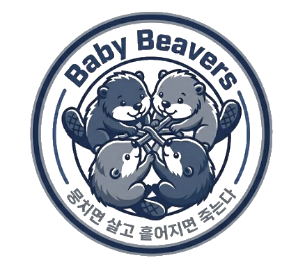

# secure-cloud-architecture-docs

---

## About this Repository

이 레포지토리는 **[Baby Beavers](https://baby.beaver-dam.net/kr)** 클라우드 보안 **뭉살흩죽** 팀의 프로젝트 문서화 공간입니다.

AWS 침해사고 분석, 실제 인프라 아키텍처 분석, 기업 규모별 보안 아키텍처 설계 결과물을 **MkDocs**로 문서화하여 GitHub Pages를 통해 공개합니다.

---

## 문서 구조

| 섹션 | 설명 |
| :--- | :--- |
| **침해사고 분석** | 실제 발생한 AWS 클라우드 보안 사고의 공격 기법, 침투 경로, 대응 방안 분석 |
| **인프라 분석** | 현업에서 사용되는 클라우드 인프라를 보안 관점에서 분석 |
| **아키텍처 설계** | 기업 규모(바이브코딩 → 소규모 → 중규모 → 중대규모 → 대규모)별 보안 아키텍처 설계 |

---

## 바로가기

**[문서 보러가기 →](https://unitelivedispersedie.github.io/secure-cloud-architecture-docs/)**

---

## 👥 Team

|  |  |  |  |
| :---: | :---: | :---: | :---: |
| [hvvup](https://github.com/hvvup) | [jihyangleee](https://github.com/jihyangleee) | [lhywk](https://github.com/lhywk) | [Minsu00326](https://github.com/Minsu00326) |

