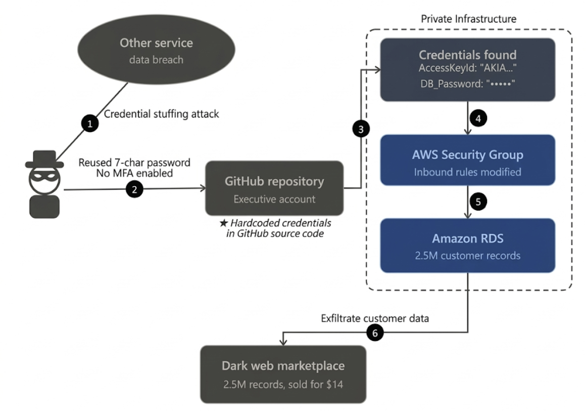

# Drizly (2020) 사고 사례 분석

## 1. 개요
2020년 7월, 미국 최대의 주류 배달 플랫폼인 Drizly에서 약 250만 명의 고객 정보가 유출되는 대규모 보안 사고가 발생했습니다. 이 사건은 단순한 데이터 유출을 넘어, 2018년 해커톤을 위해 임시로 부여했던 권한이 2년 동안 회수되지 않고 방치되는 등 클라우드 환경에서 관리적 보안의 부재가 기업에 어떤 치명적인 영향을 미치는지 보여주는 대표적인 사례입니다.

발생 시점: 2020년 6월 (공개 및 인지 시점은 7월)
피해 규모: 약 250만 명의 고객 레코드 (이름, 이메일, 주소, 주문 내역 등)
주요 원인: 임원 계정의 크리덴셜 스터핑 탈취 및 이를 통한 AWS 자격 증명 유출
사고의 결과: 2021년 Uber에 인수되었으나, 지속적인 법적 리스크와 브랜드 신뢰도 하락으로 2024년 3월 서비스 공식 종료

## 2. 공격 분석

**초기 침투**

공격의 시작은 기술적인 해킹이 아닌 크리덴셜 스터핑(Credential Stuffing)이었습니다.

공격 지점: Drizly 임원의 개인 GitHub 계정.
취약점: 타 사이트 유출 정보를 재사용했으며, 패스워드는 특수문자조차 없는 단 7자리였습니다. 가장 결정적으로 MFA(2단계 인증)를 활성화하지 않아 아이디와 비번만으로 즉시 탈취당했습니다.

**권한 악용 및 탐색**

계정을 장악한 공격자는 해당 계정이 가진 권한을 탐색하기 시작했습니다.

2018년 4월, 단 하루의 해커톤 참가를 위해 일시적으로 부여했던 저장소 접근 권한이 해커톤 종료 후에도 회수되지 않고 2년 뒤인 2020년까지 유지되고 있었습니다.
공격자는 Drizly의 소스 코드 저장소 중 하나를 복제했고, 그 안에서 AWS 인프라에 접근할 수 있는 자격 증명을 찾아냈습니다.

**인프라 장악 및 유출**

공격자는 획득한 AWS 키를 이용해 고객 데이터가 포함된 AWS RDS 데이터베이스에 접근하도록 보안 그룹을 수정했습니다. 이는 외부 IP에서 내부 DB로 직접 접속할 수 있도록 방화벽을 뚫은 것과 같습니다.
이를 통해 고객 정보가 담긴 AWS RDS에 접속하여 약 250만 명의 사용자 레코드를 자신의 서버로 전송하며 공격을 마무리했습니다.

## 3. 대응 방안
**불필요한 권한 방치 및 과잉 권한**

IAM Access Analyzer & IAM Identity Center
IAM Access Analyzer: 사용되지 않는 IAM 역할이나 외부 공유 리소스를 자동으로 식별합니다. "최근 90일간 사용되지 않은 권한" 등을 필터링하여 불필요한 권한을 주기적으로 자동 회수할 수 있습니다.
IAM Identity Center: 중앙 집중식으로 권한을 관리하며, 기간 한정 권한 부여나 직무 기반 접근 제어를 적용합니다.

**인증 보안 실패 (MFA 미사용)**

IAM Policy (MFA Condition)
AWS IAM 정책에 aws:MultiFactorAuthPresent: "false" 조건이 포함된 'Deny All' 규칙을 추가합니다. 이렇게 하면 사용자가 로그인하더라도 MFA 인증을 완료하기 전까지는 모든 API 호출과 리소스 접근을 시스템적으로 차단할 수 있습니다.

**소스 코드 내 자격 증명(Access Key) 유출**

AWS Secrets Manager & IAM Roles
AWS Secrets Manager: 소스 코드에 키를 적는 대신 코드에서는 API를 통해 Secrets Manager에서 키를 호출하도록 합니다. 특히 자동 로테이션 기능을 사용하면 키가 유출되더라도 주기적으로 바뀌기 때문에 피해를 최소화할 수 있습니다.
IAM Roles for EC2/Lambda: 가능하면 Access Key 자체를 생성하지 않는 것이 최선입니다. 애플리케이션에 IAM 역할을 직접 부여하여 임시 자격 증명을 사용하게 함으로써 코드 저장소에 유출될 키 자체가 존재하지 않게 만듭니다.

**실시간 이상 행위 탐지 및 대응 실패**

Amazon GuardDuty & AWS Config & AWS CloudTrail
Amazon GuardDuty: 머신러닝 기반으로 계정 내 이상 징후를 탐지합니다. 평소와 다른 IP에서의 접근이나 DB 무차별 대입 공격 등을 자동으로 감지합니다.
AWS Config: 리소스의 설정 변경을 실시간으로 감시합니다. 예를 들어, 보안 그룹이 0.0.0.0/0으로 변경되는 즉시 이를 감지하고 알림을 보내거나 심지어 이전 설정으로 자동 복구 하도록 설정할 수 있습니다.
CloudTrail: 모든 API 호출을 로깅하여 사고 후 포렌식뿐만 아니라 특정 위험 행위 발생 시 CloudWatch Logs와 연동해 실시간 경고를 생성합니다.

## 참고 자료

- [Drizly (2020) - 퍼블릭 클라우드 보안 침해](https://www.breaches.cloud/incidents/drizly/)