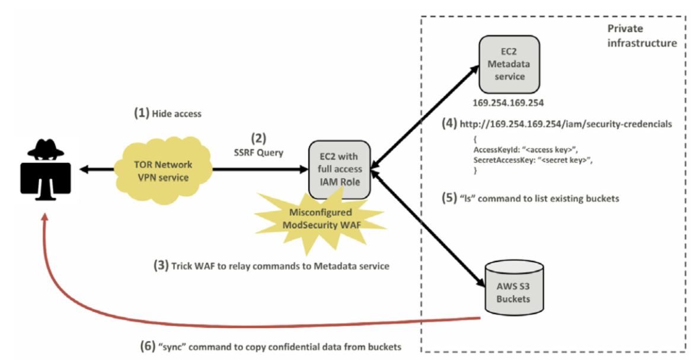

# Capital One (2019) 사고 사례 분석

## 1. 개요
미국의 5대 소비자 은행 중 하나인 캐피털 원(Capital One)은 "우리는 뱅킹을 하는 기술 회사를 만들고 있다"고 공표할 만큼 클라우드 도입과 디지털 전환에 적극적인 기업이었습니다. 하지만 2019년 클라우드 보안 역사에 기록될 대규모 데이터 유출 사고를 겪으며 큰 타격을 입었습니다.

 

**주요 타임라인 및 발견 경위**

- 사고 발생: 실제 무단 침입과 데이터 접근은 **2019년 3월 22일과 23일** 양일간 발생했습니다.
- 사고 발견: 침입 후 약 4개월이 지난 **2019년 July 17일**, 한 외부인이 캐피털 원의 데이터가 GitHub(Gist)에 노출되어 있다는 사실을 보안 제보 이메일로 알리면서 인지하게 되었습니다.
- 공식 발표: 캐피털 원은 내부 조사를 거쳐 **7월 19일**에 외부인이 권한 없이 서버에 접근하여 정보를 탈취했음을 공식적으로 확정했습니다.

**피해 규모 및 유출 정보**

- 피해 대상: 미국 내 고객 약 1억 명, 캐나다 고객 약 600만 명을 포함하여 총 1억 600만 명에 달하는 방대한 인원이 영향을 받았습니다.
- 유출 항목: 신용카드 신청 시 수집되는 이름, 주소, 우편번호, 전화번호, 이메일, 생년월일 및 자가 보고된 소득 정보 등이 포함되었습니다.
- 공격자: 전직 아마존(AWS) 기술 직원이자 시애틀 출신의 여성인 Paige A. Thompson으로 밝혀졌으며, FBI 수사 결과 그녀는 캐피털 원 외에도 30여 개 이상의 기업 및 기관의 데이터를 탈취한 혐의를 받았습니다.

**이 사건은 클라우드 서비스 제공업체(AWS)의 결함이 아니라, 사용자의 설정 오류(Misconfiguration)가 대규모 사고로 이어질 수 있음을 보여준 대표적인 사례가 되었습니다.**

## 2. 공격 분석

### 1. Hide Access (접근 은닉)
공격자는 자신의 실제 IP 주소를 숨기고 수사 기관의 추적을 피하기 위해 **TOR 네트워크**와 VPN 서비스인 **IPredator**를 사용하여 공격을 시도했습니다.

* **TOR (The Onion Router):** 여러 단계의 암호화 거점(Node)을 거쳐 데이터를 전송하는 익명 네트워크입니다. 최종 목적지 서버에서는 데이터의 최초 출발지를 알 수 없게 되어 사용자의 실제 IP 주소를 숨깁니다.
* **IPredator:** 스웨덴 기반의 익명 VPN 서비스로, 사용자 로그(접속 기록)를 남기지 않는 정책을 가집니다.
* **복합 사용:** TOR 네트워크와 VPN을 병행 사용하여 공격자 위치 파악을 이중으로 차단했습니다.

### 2. SSRF Query (SSRF 공격)
공격자는 서버가 권한이 없는 내부 리소스에 요청을 보내도록 만드는 **SSRF(Server-Side Request Forgery)** 공격을 수행했습니다.

* **취약점 활용:** 이 취약점을 이용하면 서버를 Proxy로 삼아 외부에서 직접 접근할 수 없는 내부 백엔드 리소스에 악성 요청을 보낼 수 있습니다.
* **핵심:** 공격자가 취약한 서버를 조작하여 내부 네트워크나 의도하지 않은 위치로 요청을 보내게 하는 웹 보안 취약점입니다.

### 3. Trick WAF to relay commands to Metadata service (WAF 설정 오류 악용)
캐피털 원은 오픈소스 WAF인 **ModSecurity**를 사용하고 있었으나, 설정 오류로 인해 외부의 악성 명령이 필터링되지 않고 백엔드로 전달되는 허점이 있었습니다.

* **공격 경로:** 공격자는 WAF를 통과한 명령이 AWS의 핵심 내부 서비스인 **메타데이터 서비스(Metadata Service)**에 도달하게 유도했습니다.

### 4. Obtain Credentials (자격 증명 탈취)
공격자는 SSRF를 통해 AWS 메타데이터 서비스(IMDS) URL에 접근하여 임시 자격 증명을 획득했습니다.
`http://169.254.169.254/latest/meta-data/iam/security-credentials/`

* **IMDS (Instance Metadata Service):** EC2 인스턴스의 설정 정보 및 해당 인스턴스에 부여된 **IAM 역할(Role)**의 임시 자격 증명을 제공하는 서비스입니다.
* **탈취 결과:** 공격자는 WAF에 할당된 IAM 역할인 `*****-WAF-Role`의 임시 보안 자격 증명을 탈취하는 데 성공했습니다.

### 5. "ls" command to list existing buckets (데이터 탐색)
탈취한 자격 증명을 자신의 로컬 환경에 설정한 후, AWS CLI를 통해 계정 내 자원을 탐색했습니다.

* **명령행:** `aws s3 ls`
* **결과:** 캐피털 원 클라우드 계정에 존재하는 모든 **AWS S3 버킷의 목록**을 확보하고 유출 대상을 식별했습니다.

### 6. "sync" command to copy confidential data from buckets (데이터 유출)
마지막으로 AWS의 `sync` 명령을 사용하여 대량의 데이터를 외부로 복사했습니다.

* **피해 규모:** **700개 이상의 S3 버킷**에 담긴 데이터를 복사하였으며, 약 **30GB**에 달하는 고객 데이터가 최종 유출되었습니다.

## 3. 대응 방안
당시 캐피털 원이 사용한 **IMDSv1**은 별도의 인증 토큰 없이 HTTP GET 요청만으로 자격 증명을 반환하는 구조였기 때문에 SSRF 공격에 매우 취약했습니다. 현재 AWS는 이러한 사고를 방지하기 위해 세션 기반의 토큰 인증이 추가된 **IMDSv2** 사용을 강력히 권장하고 있습니다.

 

**최소 권한 원칙(Least Privilege)의 부재:** 탈취된 WAF 전용 IAM 역할(*****-WAF-Role)이 방화벽 운영과 무관한 S3 버킷 내 데이터 접근 및 복사 권한을 과도하게 가지고 있었습니다. 만약 권한이 최소화되었다면 자격 증명이 유출되었더라도 대규모 데이터 유출로 이어지지 않았을 것입니다.

**실시간 탐지 및 대응 체계 실패:** 캐피털 원은 사고 발생 당시 모든 공격 로그를 보유하고 있었음에도 불구하 이를 실시간으로 분석하고 차단하지 못했습니다. 결국 사고 인지는 자체 보안 관제가 아닌 외부 제보를 통해 4개월 만에 이루어졌습니다.

## 참고 자료

- [https://web.mit.edu/smadnick/www/wp/2020-16.pdf](https://web.mit.edu/smadnick/www/wp/2020-16.pdf)