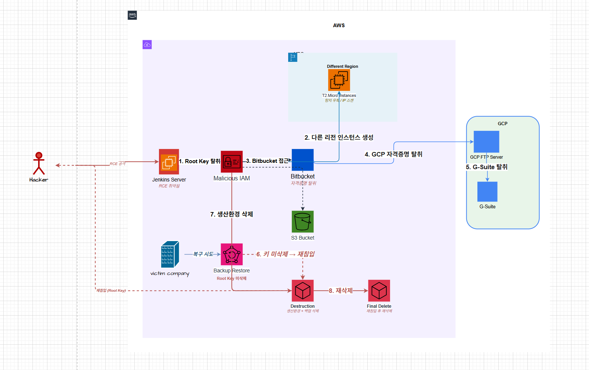

# AWS 보안 침해 사고 사례 분석 - DarkLab case study

---

## 개요

DarkLAB에서 남아시아 지역의 미디어 고객사를 도와 멀티 클라우드 침해 사고를 해결한 사례를 Case Study로 작성했습니다.

실제 이 사고는 루트 액세스 키를 바꾸지 않는 치명적 실수를 범해 발생한 것으로 이로 인해 기업 전체 서비스 중단이라는 막대한 피해로 이어졌습니다.

---

## 공격 분석

### [공격 과정]

**초기 침투** : 오픈 소스 자동화 서버인 Jenkins 인스턴스의 알려진 RCE취약점을 이용해 해당 서버에 하드코딩되어 있는 루트 액세스 키를 탈취했습니다.

**잠복 및 권한 확장** : 해커는 4개월동안 해당 사이트 운영자로부터 감지되지 않은 채 활동했습니다. CloudTrail 로그 보존 설정이 미비하여 추적이 어려웠으나 공격자가 IAM 계정을 설정하고 S3 버킷 내의 데이터에 접근한 것이 확인되었습니다.

**Lateral Movement** : 공격자는 감지를 피하기 위해 사용되지 않은 AWS 리전에 t2.micro 인스턴스를 생성하여 외부 IP를 스캔하고 또 다른 취약한 Jenkins 서버를 찾는 다리로 활용했습니다.

#### 부가 설명

보통 기업에서는 자신이 서비스를 운영하는 특정 리전만 집중적으로 모니터링합니다. 그렇기에 탐지가 잘 되지 않는 다른 리전에 t2.micro를 생성한 것입니다. 여기서 성능이 좋은 대형 인스턴스를 만들면 비용 이상 탐지에 걸릴 수 있기에 저렴한 인스턴스 여러 개를 만들었습니다. 해커는 자신의 IP를 이용한 것이 아니라 여기서 만든 서버의 IP를 이용해 다른 공격을 이어나갔습니다.

**멀티 클라우드 침해** : BitBucket 저장소에서 발견한 하드코딩된 자격증명을 이용해 병렬로 운영되던 GCP 환경의 FTP 서버와 G-Suite 계정까지 탈취했습니다.

**파괴 및 재공격** : 공격자는 증거 인멸을 위해 AWS의 생산 환경과 백업본을 모두 삭제했습니다. 해당 피해를 입은 기업이 백업본을 복구하는 과정에서 루트 액세스 키를 삭제하지 않는 실수를 하자 공격자는 며칠 뒤 재침입하여 생산환경을 재차 삭제했습니다.

### [보안 사고 분석]

해커가 공격한 과정을 보면 해당 기업의 미흡한 보안 설정에서 공격이 시작되었음을 알 수 있습니다.

Jenkins 서버에 RCE가 가능했다는 말은 서버가 Public에 있었으며 Security Group 설정이 미흡했다는 것을 의미합니다. 또한 소프트웨어 자체에도 RCE 취약점이 존재했습니다. 이런 경우 자동화 봇이 열린 IP를 스캔하여 공격하기 쉽습니다. 실제 위의 사건에서 해커가 Shodan 과 같은 도구로 스캔했습니다.

---

이렇게 탈취한 서버에 루트 액세스키가 하드 코딩되어 있었는데 이는 모든 사람들에게 접근 권한을 허용한 것입니다.

또한 CloudTrail 내에 로그 설정이 미흡한 경우 공격자가 접근하여 이상 행위를 하더라도 탐지하기 어렵습니다.

(평소 사용하지 않는 리전에서 인스턴스가 생성되었지만 이상 징후를 가지하지 못했습니다.)

루트 액세스키를 해커가 탈취한 경우이기에 t2.micro 인스턴스를 생성할 수 있었는데 이 또한 해당 user에게 지나친 권한을 준 것입니다. **-> 최소권한원칙 위배**

---

AWS Cloud 환경으로만 구성된 것이 아닌 GCP 와도 연동되어 Multi Cloud로 운영되고 있었습니다. 이러한 환경에서의 미흡한 보안 설정은 매우 위험한 것입니다. AWS 뿐만 아니라 GCP 인프라 침해까지 연결되기 때문입니다. GCP FTP 서버와 G-Suite 계정 탈취는 AWS 보안 사고에서 퍼져나간 것입니다.

---

해커는 공격에서 끝난 것이 아닌 자신들의 행위에 대한 흔적을 남기지 않으려 했고 해당 서비스 자체를 모두 삭제했습니다. 해커가 백업본까지 삭제할 수 있었다는 것은 백업 계정과 운영 계정이 충분히 격리되지 않았음을 의미합니다.

피해를 입은 기업은 백업본을 살리는 과정에서도 탈취된 루트 액세스 키를 사용했고 기존 것을 삭제하지 않아 다시 해커가 들어와 생산 환경을 삭제하는 사고가 발생했습니다.

이는 처음에 일어났던 사고 대응 프로세스에 결함이 있었음을 말해줍니다.

---

## 대응 방안

### [권장 조치]

**1. 자격 증명 순환** : 주기적으로 패스워드와 액세스 키를 변경합니다. 특히 사고가 발생한다면 모든 키를 재발급 받아야 합니다.

- Secrets Manager를 통해 자격증명을 자동 교체하고 애플리케이션상의 소스코드에는 키 값 대신 Secret ID만 남겨두어 코드 유출 시에도 피해를 최소화합니다.

**2. 최소 권한 원칙** : 하드코딩된 루트 키 대신 IAM Role 을 사용합니다. 필요한 최소한의 권한만 부여해야 합니다.

- Jenkins에서 루트 액세스 키를 얻어 권한을 탈취한 것이 사고의 시작이므로 이러한 키를 없애고 Jenkins 서버에 IAM Instance Profile을 부여하여 해커가 서버에 침입하더라도 텍스트 형태의 키가 없게끔 합니다.

**3. 모니터링 강화** : 여러 지역에서의 비정상적 로그인을 감지합니다.

예를 들어 사용되지 않는 리전에서의 인스턴스 생성을 감지하는 것 혹은 과도한 권한을 가진 IAM 정책 생성을 모니터링 하는 것을 말합니다.

- CloudTrail 설정을 잘해야 하는데 먼저 다중 리전 설정에서 '모든 리전'을 적용하여 평소 잘 사용하지 않는 리전에서의 활동도 기록하게끔 합니다. 저장된 로그의 무결성도 보존해야 합니다. 해커가 이를 삭제하여 증거를 인멸하면 해킹을 당했는지조차 알 수 없고 대응하기도 어렵기 때문입니다. 또한 알람을 연동합니다. CloudWatch Logs 와 연동하여 '루트 계정 로그인'이나 '인스턴스 생성' 발생 시 즉시 알람이 가도록 합니다.

**4. 신속한 패치** : Jenkins와 같이 노출된 자산의 취약점을 즉시 패치하여 해커가 다시 침투하는 것을 막아야 합니다.

- 이번 사고에서는 먼저 루트 액세스 키를 즉시 비활성화 혹은 삭제해야 합니다. 또한 Jenkins 서버에서 RCE가 이뤄진 것이므로 보안 패치 및 업데이트를 수행하여 재침투 경로를 차단해야 합니다.

\*\* 기본적인 보안 수칙인 패치, 키 관리, 로깅을 꼭 해야 합니다.

[참고자료]

https://talk3130.tistory.com/entry/AWS-%EB%B3%B4%EC%95%88-%EC%B9%A8%ED%95%B4-%EC%82%AC%EA%B3%A0-%EC%82%AC%EB%A1%80-%EB%B6%84%EC%84%9D-DarkLab-case-study