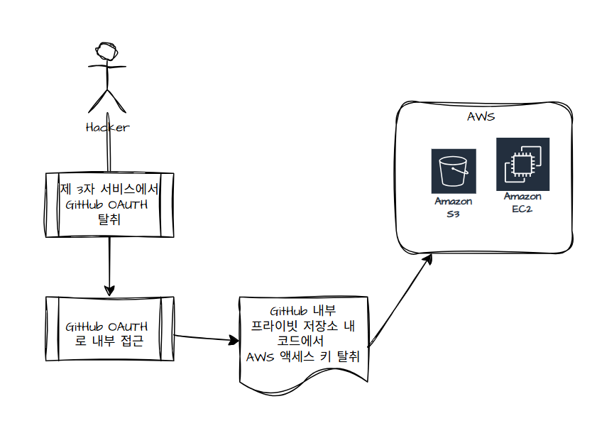

# AWS 보안 침해 사고 사례 분석 - npm

---

## 개요

### npm 이란 무엇일까?

npm(node package manager)은 자바스크립트 패키지 관리자입니다. Node.js에서 사용 가능한 모듈들을 패키지화하여 저장소 역할을 하며, 패키지 설치 및 관리를 위한 CLI를 제공합니다.

Node.js 프로젝트에서는 많은 패키지를 사용하고 버전도 자주 업데이트되므로, npm이 `package.json`을 통해 일괄 관리합니다.

### 자주 사용하는 npm 명령어

```
npm init / npm init -y
npm install <package-name> / npm install -g <package-name>
npm install / npm i
npm uninstall <package-name>
npm update <package-name>
npm list / npm ls
npm view <package-name> / npm info <package-name>
npm install express@<버전> / npm install express@latest
npm -v / npm outdated
npm publish
npm search <검색어>
npm login / npm whoami / npm logout
npm help <command>
```

---

## 공격 분석

해커는 npm의 주요 패키지를 탈취하여 약 10만 명의 사용자 데이터를 탈취했습니다.



### 1. GitHub OAuth 토큰 탈취

공격자가 GitHub과 연동된 제 3자 서비스에서 GitHub OAuth 토큰을 탈취했고, 이를 이용해 npm의 비공개 저장소에 접근했습니다.

### 2. 저장소 내의 보안 비밀 발견

비공개 저장소의 소스 코드 내에 AWS 액세스 키가 텍스트 형태로 보관되어 있었으므로, 공격자가 AWS 인프라 침입이 가능했습니다.

### 3. AWS 인프라 침입

AWS 액세스 키를 이용해 클라우드 인프라에 접속한 후, 데이터베이스 백업 파일(사용자 정보, 패키지 메타데이터)을 유출했습니다.

### 추가 사고: eslint-config-prettier NPM 패키지 해킹

해커가 피싱 공격으로 npm 관리자 계정을 탈취한 뒤 악성코드를 유포하여 대규모 공급망 공격을 진행했습니다.

---

## 사고가 일어난 주요 원인

### 1. 제 3자 서비스의 보안 취약성

OAuth는 제한된 행위만 할 수 있도록 일회용 토큰을 발행하는 방식입니다. 그러나 제 3자 서비스 서버가 탈취되면, 저장된 많은 OAuth 토큰이 유출될 수 있어 개발자의 GitHub 저장소에 무단 침입이 가능합니다.

### 2. 소스 코드 내 보안 비밀 노출

"Defense in Depth" 보안원칙에 따르면, 개발자의 GitHub에 침입하더라도 내부 주요 정보를 접근 불가능하게 해야 합니다. 하지만 AWS 액세스 키가 코드에 포함되어 있어 바로 인프라 접근이 가능했습니다.

### 3. 토큰의 과도한 권한

탈취된 OAuth 토큰에 과도한 권한이 있어 공격자가 소스 코드 전체를 내려받을 수 있었습니다.

---

## 대응 방안

### 1. 보안 비밀 스캐닝

코드에 AWS 키, API 토큰이 포함되어 있는지 자동으로 검사하고, 발견 시 commit을 자동으로 차단합니다. (현재 GitHub에서 기본 제공)

### 2. 최소 권한 원칙

OAuth로 서비스를 연결할 때 모든 저장소 접근 대신 특정 저장소의 읽기 권한만 부여합니다.

### 3. 토큰 순환 및 만료

OAuth 토큰의 유효기간을 짧게 설정하여 주기적으로 갱신함으로써 유출되어도 사용 불가능하게 만듭니다.

### 4. 중앙 집중식 비밀 관리

코드에 키를 하드코딩하지 말고, AWS Secrets Manager나 HashiCorp Vault 같은 전문 도구를 사용해 런타임에 키를 불러옵니다.

### 5. AWS 내의 S3 보호

- S3 직접 접근 대신 IAM Role을 사용합니다.
- S3 버킷 암호화로 파일 유출 시에도 알 수 없게 처리합니다.
- S3 Bucket Policy 설정으로 무단 접근을 방지합니다.

---

## 결론

OAuth 토큰이 많은 기업에서 사용되므로 철저히 관리해야 하며, 토큰 탈취 시에도 공격자가 과도한 권한을 행사하지 못하도록 최소 권한 원칙을 적용해야 합니다.

---

[참고자료]

https://talk3130.tistory.com/entry/AWS-%EB%B3%B4%EC%95%88-%EC%B9%A8%ED%95%B4-%EC%82%AC%EA%B3%A0-%EC%82%AC%EB%A1%80-%EB%B6%84%EC%84%9D-npm
