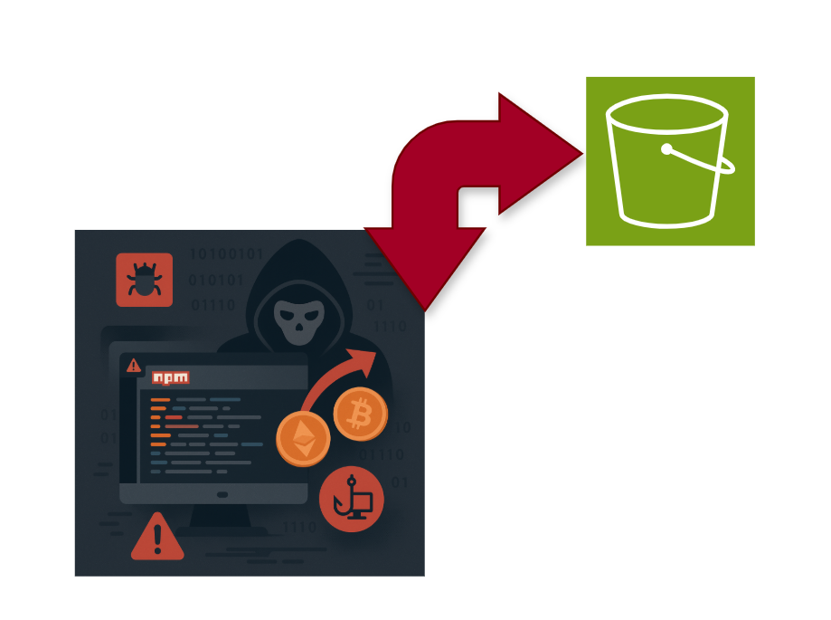

# AWS 보안 침해 사고 사례 분석 - Bignum NPM 패키지 악성코드 주입

---

## 개요

Node.js용 NPM 패키지인 bignum의 특정 버전(v.0.12.2~0.13.0)에서 악성코드가 발견되었습니다. 공격자는 더 이상 사용하지 않던 AWS S3 버킷의 이름을 재사용하는 취약점을 악용했습니다.

bignum 패키지 관리자는 오래된 바이너리를 호스팅하던 S3 버킷을 삭제했습니다. AWS S3 버킷 이름은 전 세계적으로 고유하지만, 누군가가 사용하던 버킷을 삭제하면 동일한 이름으로 누구나 새로운 버킷을 생성할 수 있습니다. 공격자는 이를 악용해 같은 이름의 S3 버킷을 생성했고, bignum 패키지 내에 하드코딩된 S3 URL을 통해 악성코드를 주입했습니다.

---

## 공격 분석

### 악성 바이너리의 동작

정상적인 바이너리 대신 가짜 바이너리가 악성 행위를 수행했습니다.

- 사용자 ID, 비밀번호, 로컬 머신의 환경 변수, 호스트 이름 등을 수집합니다.
- 탈취한 정보를 HTTP GET 요청의 User-Agent 헤더에 숨겨 공격자의 S3 버킷으로 전송합니다.

---

## 시사점

공격자는 NPM 패키지의 코드를 수정하지 않았습니다. 외부 리소스를 호스팅하는 인프라의 허점을 이용한 것입니다. 개발자가 직접 작성한 코드 및 의존성 패키지가 가져오는 바이너리와 리소스도 공격의 대상이 될 수 있습니다. 오랫동안 업데이트되지 않은 패키지도 여전히 사용 중이라면 이런 방식의 공격 대상이 될 수 있습니다.

---

## 보안사고가 일어난 이유

1. 패키지 관리자가 사용하지 않을 S3 버킷만 삭제하고 이를 참조하는 패키지 내 코드는 삭제하지 않았습니다.
2. S3 버킷 이름의 전 세계 고유성 때문에 삭제된 버킷 이름을 다시 사용할 수 있습니다.
3. 기존에 참조했던 S3 버킷 파일의 내용이 변경되었는지 확인하는 절차가 없었습니다.

---

## 대응 방안

### 1. 리소스 소유권 관리

리소스를 호스팅할 때 해당 서비스의 소유권 유지를 철저하게 관리하고, 사용을 중단할 경우 코드 내의 참조도 함께 제거해야 합니다.

### 2. 무결성 검사

다운로드하는 바이너리의 해시값을 체크하여 파일 변조 여부를 확인하는 로직을 추가합니다.

- SRI(Subresource Integrity) 및 코드 서명을 적용하여 외부 리소스의 파일 해시값을 브라우저나 런타임이 확인하도록 강제합니다.

### 3. 최신 버전 유지

보안 패치가 적용된 최신 버전의 패키지를 이용하고 오래된 의존성을 주기적으로 정리해야 합니다.

### 4. S3 버킷 삭제 보호

- AWS의 Termination Protection이나 IAM 정책을 통해 삭제 권한을 엄격히 제한합니다.
- 또는 빈 버킷을 유지하는 전략을 사용합니다(내부 파일만 지우고 버킷은 유지).

### 5. 아웃바운드 트래픽 모니터링

악성코드가 정보를 탈취하더라도 공격자에게 전달되는 통로를 차단합니다. Egress 보안 정책을 이용합니다.

### 6. SBOM(Software Bill of Materials) 도입

소프트웨어가 어떤 외부 리소스를 사용하는지 지도로 만듭니다. 프로젝트가 참조하는 모든 외부 URL과 바이너리 목록을 SBOM으로 관리하면 정기 점검 시 발견하기 쉽습니다.

### 7. VPC Endpoint 이용(회사 내)

- **화이트리스트 기반의 버킷 통제**: 정책에 "우리 회사가 허용한 S3 버킷 이름만 접속 가능"하도록 설정합니다.
- **계정 ID 검증**: s3:ResourceAccount 조건을 추가하여 오직 회사의 AWS 계정 ID에 속한 버킷만 허용합니다. 공격자가 이름이 같은 버킷을 만들어도 계정 주인이 달라서 통신할 수 없습니다.
- **인터넷 게이트웨이 차단**: 오직 VPC Endpoint만 이용하여 S3에 접근하게 합니다.

#### 실무 적용 시 고려할 점

오픈 소스 업데이트 문제: 정책을 너무 타이트하게 잡으면 오픈 소스 패키지를 업데이트할 때 Public S3에 접근하지 못할 수 있습니다.

규모가 있는 회사들은 JFrog Artifactory나 AWS CodeArtifact와 같은 사내 저장소를 이용합니다. 보안 팀이 외부 오픈소스를 검증하여 사내 저장소에 올려 개발자들이 외부 S3 주소가 아닌 사내 저장소 주소를 통해서만 파일을 받게끔 합니다.

[참고자료]

https://talk3130.tistory.com/entry/AWS-%EB%B3%B4%EC%95%88-%EC%B9%A8%ED%95%B4-%EC%82%AC%EA%B3%A0-%EC%82%AC%EB%A1%80-%EB%B6%84%EC%84%9D-Bignum-NPM-%ED%8C%A8%ED%82%A4%EC%A7%80-%EC%95%85%EC%84%B1%EC%BD%94%EB%93%9C-%EC%A3%BC%EC%9E%85

https://checkmarx.com/blog/hijacking-s3-buckets-new-attack-technique-exploited-in-the-wild-by-supply-chain-attackers/
