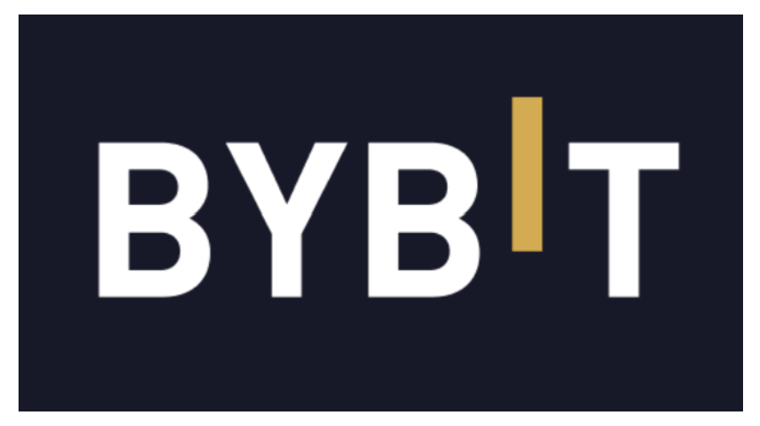

# Bybit / Safe{Wallet} AWS 침해사고 분석

## 1. 개요



### 사건 배경

2025년 2월 21일, 세계 최대 규모의 암호화폐 거래소 중 하나인 Bybit에서 역대 최대 규모의 암호화폐 해킹 사건이 발생하였습니다. 이 사건으로 약 401,000 ETH, 미화 약 15억 달러(한화 약 2조 원) 상당의 자산이 탈취되었으며, Web3 역사상 단일 사건으로는 전례 없는 피해 규모를 기록하였습니다.

Bybit의 콜드 월렛은 멀티시그 방식의 스마트 컨트랙트 지갑 플랫폼인 **Safe{Wallet}**(구 Gnosis Safe)으로 보호되고 있었습니다. 멀티시그 방식은 복수의 승인자가 트랜잭션에 서명해야만 실행되는 구조로, 이론적으로는 매우 견고한 보안 체계입니다. 그러나 공격자는 스마트 컨트랙트 자체를 공격하지 않고, **Safe{Wallet}의 프론트엔드 인터페이스를 공급망 공격** 방식으로 침해함으로써 이 보안 체계를 우회하였습니다.

### 공격 주체

미국 연방수사국(FBI)은 이 공격의 배후로 **북한 국가 지원 해킹 그룹 TraderTraitor**를 공식 지목하였습니다. TraderTraitor는 Jade Sleet, PUKCHONG, UNC4899, Slow Pisces 등의 별칭으로도 알려져 있으며, 광범위한 Lazarus Group의 하위 조직으로 분류됩니다. Mandiant(Google Cloud 소속)도 독자적인 포렌식 조사를 통해 동일 결론에 도달하였습니다.

### 피해 현황 요약

| 항목 | 내용 |
|------|------|
| 피해 발생일 | 2025년 2월 21일 |
| 피해 금액 | 약 15억 달러 (401,000 ETH) |
| 공격 벡터 | Safe{Wallet} AWS S3 버킷 내 악성 JavaScript 삽입 |
| 공격 주체 | TraderTraitor (Lazarus Group 하위 조직, 북한 국가 지원) |
| 피해 대상 | Bybit ETH 콜드 월렛 |
| 조사 기관 | Sygnia, Google Cloud Mandiant, FBI |

---

## 2. 공격 분석

### 2.1 공격 타임라인

이 사건은 단순한 즉흥적 해킹이 아닌, 약 **19일에 걸친 치밀하게 계획된 다단계 공격**이었습니다.

```
2025-02-04  Safe{Wallet} 개발자(Developer1) macOS 노트북 최초 침해
2025-02-05  탈취한 AWS 세션 토큰으로 Safe{Wallet} AWS 인프라 최초 접근
2025-02-05 ~ 02-17  AWS 인프라 내부 정찰 및 횡적 이동
2025-02-19  Safe{Wallet} AWS S3 버킷 내 JavaScript 악성 코드 삽입 (15:29:25 UTC)
2025-02-21  Bybit ETH 콜드 월렛 → 웜 월렛 트랜잭션 실행 시도
            악성 코드 활성화 및 트랜잭션 조작 (14:13:35 UTC)
            공격자, 콜드 월렛 스마트 컨트랙트 소유권 탈취 및 전액 인출
            악성 코드 제거 및 정상 JavaScript 재업로드 (~14:15 UTC)
2025-02-25  Sygnia의 중간 조사 보고서 Bybit에 전달
2025-03-06  Safe{Wallet}, Mandiant 조사 결과 공개 및 TraderTraitor 공식 귀속
```

---

### 2.2 초기 침투: 소셜 엔지니어링을 통한 개발자 노트북 감염

공격의 출발점은 Safe{Wallet}의 내부 개발자 한 명이었습니다. Safe{Wallet} 조사 결과에 따르면, **2025년 2월 4일**, 해당 개발자(이하 Developer1)는 Apple macOS 노트북에서 **`MC-Based-Stock-Invest-Simulator-main`** 이라는 이름의 Docker 프로젝트를 다운로드하였습니다.

이 Docker 프로젝트는 소셜 엔지니어링 공격의 일환으로 배포된 악성 패키지로, 실행 시 `getstockprice[.]com` 이라는 도메인과 통신하였습니다. 해당 도메인은 프로젝트 다운로드 이틀 전에 Namecheap을 통해 등록된 신규 도메인이었습니다. Mandiant는 TraderTraitor가 과거에도 주식 시뮬레이터 테마의 Docker 프로젝트를 유사한 공격에 활용한 선례가 있다고 확인하였습니다.

Developer1은 Safe{Wallet} 내에서 AWS 인프라에 대한 높은 수준의 접근 권한을 보유한 소수의 인원 중 한 명이었으며, 이것이 공격자가 이 개발자를 표적으로 삼은 핵심 이유였습니다.

---

### 2.3 AWS 세션 토큰 탈취 및 MFA 우회

노트북 감염에 성공한 공격자는 다음 단계로 **AWS 인프라 침투**를 시도하였습니다.

공격자는 가장 먼저 자신들의 MFA 기기를 Developer1의 AWS 계정에 등록하려 시도하였으나 이는 실패하였습니다. 이에 따라 더 정교한 방법으로 전환하여, **감염된 노트북에서 Developer1의 활성 AWS 세션 토큰을 직접 탈취**하는 방식을 택하였습니다. 이를 통해 MFA 인증 체계 자체를 우회하는 데 성공하였습니다.

공격자의 AWS 접근 행위는 **ExpressVPN IP 주소**를 통해 이루어졌으며, User-Agent 문자열에 `distrib#kali.2024`가 포함되어 있어 Kali Linux 기반 공격 환경이 사용되었음을 나타냈습니다. 또한 공격자는 **Developer1의 실제 근무 시간대에 맞추어 활동**하여 정상적인 접근처럼 보이도록 위장하였습니다.

이후 2월 5일부터 2월 17일까지 약 2주 동안 공격자는 Safe{Wallet}의 AWS 환경 내부에서 광범위한 **정찰**을 수행하였으며, IAM 역할 및 클라우드 자산 구성을 파악하였습니다. 조사를 마친 후 공격자는 자신이 설치한 악성 코드를 삭제하고 Bash 히스토리를 지워 흔적을 은폐하였습니다.

---

### 2.4 공급망 공격: AWS S3 버킷 내 악성 JavaScript 삽입

2025년 2월 19일 15:29:25 UTC, 공격자는 Safe{Wallet}의 웹 프론트엔드를 제공하는 **AWS S3 버킷에 악성 JavaScript 코드를 삽입**하였습니다. 독립 보안 분석 기관인 Verichains는 공개 웹 아카이브 스냅샷을 통해 이 삽입 시각을 정확히 특정하였습니다.

악성 코드의 핵심 특징은 다음과 같습니다.

- **표적 선별적 활성화:** 악성 코드는 Bybit의 콜드 월렛 컨트랙트 주소를 명시적으로 감지하도록 설계되어, **오직 Bybit의 트랜잭션이 시도될 때만 동작**하였습니다. 다른 Safe{Wallet} 이용자들은 정상적인 인터페이스를 경험하였습니다.
- **UI 위조:** 악성 JavaScript는 서명자에게 보여지는 트랜잭션 세부 정보를 실시간으로 조작하였습니다. 서명자들의 화면에는 정상적인 트랜잭션처럼 보였지만, 실제로 블록체인에 전송되는 데이터는 공격자가 조작한 것이었습니다.
- **흔적 은폐:** Bybit의 악성 트랜잭션이 실행된 직후 약 2분 이내에, 공격자는 S3 버킷에 정상 JavaScript를 재업로드하여 악성 코드를 즉시 제거하였습니다.

---

### 2.5 트랜잭션 조작 및 스마트 컨트랙트 탈취

2025년 2월 21일, Bybit의 서명자들은 콜드 월렛에서 웜 월렛으로의 **일상적인 내부 이체** 트랜잭션을 실행하려 하였습니다. Bybit CEO Ben Zhou를 포함한 서명자들은 Safe{Wallet} 웹 인터페이스에서 정상적인 트랜잭션을 확인하고 서명을 진행하였습니다.

그러나 공격자가 삽입한 악성 JavaScript는 서명자들이 인지하지 못한 채로 트랜잭션의 실제 내용을 다음과 같이 바꿔치기하였습니다.

- **정상 트랜잭션:** 콜드 월렛 → 웜 월렛 ETH 이체
- **조작된 트랜잭션:** Bybit 콜드 월렛 스마트 컨트랙트의 **구현체를 공격자가 미리 배포한 악성 컨트랙트로 교체**

이 조작의 핵심은 이더리움 스마트 컨트랙트의 **`delegatecall`** 기능을 악용한 것이었습니다. `delegatecall`은 한 컨트랙트가 다른 컨트랙트의 코드를 자신의 스토리지 컨텍스트에서 실행할 수 있게 해주는 기능입니다. 공격자는 서명자들이 자신도 모르게 월렛의 컨트랙트 로직 자체를 악성 버전으로 교체하도록 유도하였으며, 이를 통해 멀티시그 승인 없이도 임의의 금액을 인출할 수 있는 `sweepETH()`, `sweepERC20()` 함수가 포함된 악성 컨트랙트가 Bybit 콜드 월렛을 완전히 장악하게 되었습니다.

또한 Safe{Wallet}은 당시 **SRI** 해시 검증을 구현하지 않았고, 별도의 실시간 프론트엔드 변조 탐지 메커니즘도 부재하였습니다. EIP-712 서명 표준 역시 중첩된 스마트 컨트랙트 연산을 사람이 읽을 수 있는 형태로 표시하는 데 한계가 있어, 서명자들이 자신이 무엇에 서명하는지 실질적으로 검증하기 어려운 구조였습니다.

---

### 2.6 자금 세탁 및 추적

탈취된 ETH는 이후 고도로 조직화된 방식으로 세탁되었습니다.

- 탈취 직후 다수의 중간 지갑으로 분산
- THORChain 등 탈중앙화 크로스체인 브릿지를 통해 BTC 및 기타 암호화폐로 전환
- 6,954개 이상의 지갑으로 분산 보관
- ZachXBT의 온체인 분석을 통해 Lazarus Group과의 연관성이 최종 확인

조사 기관들의 추적에 따르면 약 77%의 자금은 일정 기간 추적이 가능하였으며, 20%는 추적이 불가능한 상태로 전환되었고, 3%는 동결 조치되었습니다.

---

## 3. 대응 방안

이번 사건은 크게 세 가지 지점에서 보안 실패가 발생하였습니다. **1. 개발자 엔드포인트 침해 → 2. AWS 세션 토큰 탈취 → 3. S3 프론트엔드 변조.** 각 단계에서 실질적으로 적용 가능한 대응 방안을 아래에 정리하였습니다.

---

### 3.1 높은 권한을 가진 개발자 계정의 엔드포인트 보호

이번 공격은 AWS 고권한 개발자의 맥북 한 대를 장악하는 것에서 시작되었습니다. Developer1이 미확인 Docker 프로젝트를 실행한 것이 전체 침해의 출발점이었습니다.

- **외부 소프트웨어 실행 통제:** AWS 등 인프라에 접근 권한을 가진 개발자는 미검증 오픈소스 프로젝트, 특히 Docker 이미지나 Python 스크립트를 업무 환경에서 직접 실행하는 것을 사내 정책으로 금지하여야 합니다. TraderTraitor는 이 수법을 Bybit 이전에도 반복적으로 사용하였습니다.
- **FIDO2 기반 MFA 적용:** 이번 사건에서 공격자는 세션 토큰을 탈취하여 기존 MFA를 완전히 우회하였습니다. TOTP(시간 기반 OTP) 방식은 세션 탈취에 무력하므로, 하드웨어 키 기반의 FIDO2 인증으로 전환하여야 합니다.

---

### 3.2 AWS 세션 토큰 탈취 대응

공격자는 감염된 맥북에서 활성 AWS 세션 토큰을 추출하여 MFA 없이 Safe{Wallet}의 AWS 환경에 접근하였습니다. ExpressVPN을 통해 접속하면서 개발자의 근무 시간대에 맞춰 활동하였기 때문에 상당 기간 탐지를 피하였습니다.

- **세션 토큰 수명 단축:** AWS IAM에서 임시 자격증명(STS)의 세션 지속 시간을 업무상 필요한 최소값으로 설정하여야 합니다. 세션이 짧을수록 탈취된 토큰의 유효 기간도 줄어듭니다.
- **비정상 접근 실시간 탐지:** AWS CloudTrail과 GuardDuty를 연동하여 기존과 다른 IP 대역, 알려진 VPN/프록시 IP, 비정상적인 시간대의 API 호출에 대한 실시간 알림을 설정하여야 합니다. 이번 사건에서 공격자가 사용한 ExpressVPN IP와 Kali Linux User-Agent는 충분히 탐지 가능한 이상 징후였습니다.
- **최소 권한 원칙 적용:** S3 버킷에 대한 쓰기 권한은 배포 파이프라인 전용 서비스 계정으로만 제한하고, 개발자 개인 계정에는 읽기 권한만 부여하여야 합니다. Developer1의 계정이 S3 오브젝트를 직접 수정할 수 있었던 것이 피해를 가능하게 한 직접적인 원인이었습니다.

---

### 3.3 S3 프론트엔드 코드 변조 탐지 및 차단

Safe{Wallet}은 JavaScript 파일이 S3에 무단으로 수정되었음을 실시간으로 탐지하는 체계가 없었습니다. 악성 코드는 이틀간 서빙되었고, 아무도 눈치채지 못하였습니다.

- **SRI 해시 적용:** 프론트엔드 HTML에서 로드하는 JavaScript 파일에 `integrity` 해시를 명시하면, 파일 내용이 변조되었을 때 브라우저가 자동으로 실행을 차단합니다. 이번 사건에서 SRI가 적용되어 있었다면 악성 JavaScript는 브라우저 수준에서 차단되었을 것입니다.
- **S3 객체 변경 알림 구성:** S3 버킷 이벤트 알림 또는 CloudTrail + EventBridge를 통해 프론트엔드 파일이 변경될 때마다 즉각적인 알림이 발송되도록 구성하여야 합니다. 배포 파이프라인 외의 경로로 S3 객체가 수정되는 것은 명백한 이상 징후입니다.

## 참고 자료

- [The Hacker News - Safe{Wallet} Confirms North Korean TraderTraitor Hackers](https://thehackernews.com/2025/03/safewallet-confirms-north-korean.html)
- [The Hacker News - Bybit Hack Traced to Safe{Wallet} Supply Chain Attack](https://thehackernews.com/2025/02/bybit-hack-traced-to-safewallet-supply.html)
- [NCC Group - In-Depth Technical Analysis of the Bybit Hack](https://www.nccgroup.com/research/in-depth-technical-analysis-of-the-bybit-hack/)
- [PANews - Safe{Wallet} Forensic Investigation Report](https://www.panewslab.com/en/articles/nqhu2v42)
- [Cryptopolitan - Safe Wallet Update on Bybit Hack](https://www.cryptopolitan.com/safe-wallet-releases-update-on-bybit-hack/)

