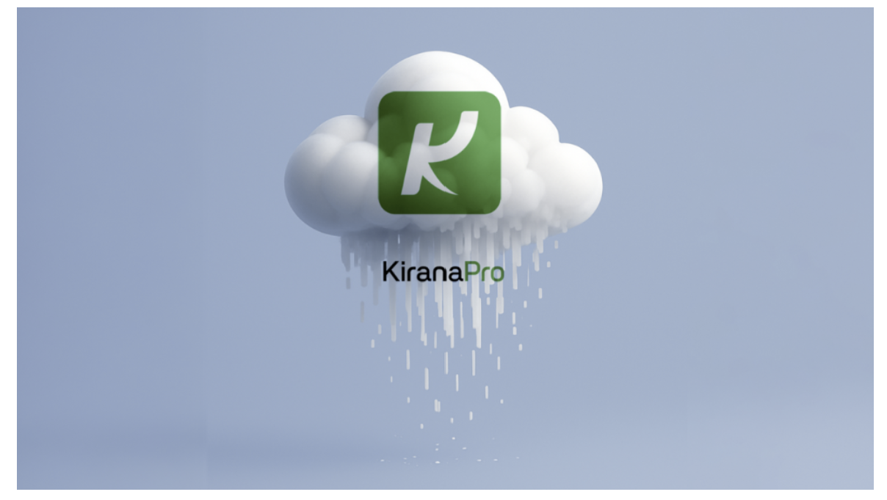
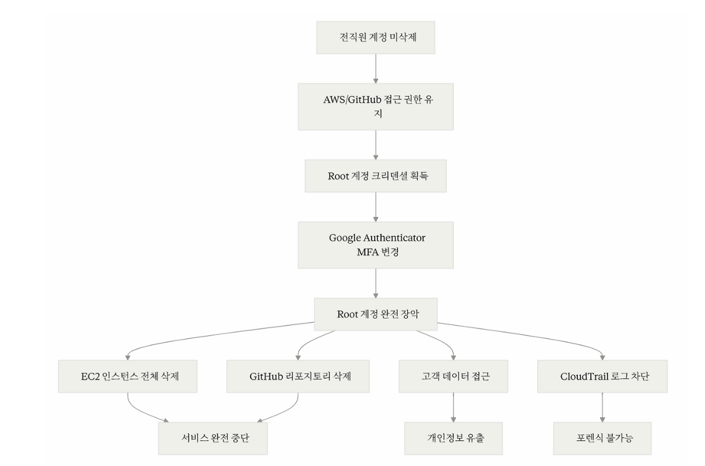

# KiranaPro 사고 사례 분석

## 1. 개요

### 1.1 사고 배경

**KiranaPro**는 2024년 12월 출시된 인도의 식료품 배송 스타트업으로 인도 정부의 **Open Network for Digital Commerce (ONDC)** 플랫폼을 기반으로 운영되었습니다. 음성 기반 주문 인터페이스를 제공하며 힌디어, 타밀어, 말라얌어 등 현지 언어를 지원했습니다.

**서비스 규모**

- 55,000명 고객 (30,000~35,000명 활성 사용자)
- 50개 도시에서 일 2,000건 주문 처리
- 100,000+ AI 쇼핑 쿼리 처리
- 15명 규모의 기술팀 (벵갈루루 & 케랄라)

**이 침해 사고는 전직원의 계정을 이용한 내부자 위협 사례입니다. KiranaPro가 기본적인 보안 설정과 운영 절차를 지키지 않은 것이 근본 원인이었습니다.**

### 1.2 사고 요약

2025년 5월 24~25일 KiranaPro의 **AWS Root 계정**과 **GitHub 조직 계정**이 침해당하여 전체 인프라가 파괴되었습니다. 공격자는 회사의 모든 EC2 인스턴스를 삭제하고 GitHub 리포지토리를 완전히 제거했으며 고객 개인정보를 포함한 데이터에 접근했습니다.

### 1.3 피해 규모

**기술적 피해**

- 모든 EC2 인스턴스 삭제 (애플리케이션 서버 전멸)
- GitHub 전체 소스코드 삭제
- 고객 데이터베이스 접근 및 노출 (이름, 주소, 결제정보)
- AWS Root 계정 MFA 변경으로 복구 불가
- CloudTrail 로그 접근 불가 (포렌식 불가능)

**비즈니스 피해**

- 서비스 완전 중단 (앱은 작동하나 주문 처리 불가)
- 일 2,000건 주문 손실 (매출 중단)
- 100개 도시 확장 계획 무산
- 고객 및 투자자 신뢰 붕괴
- 법적 책임 및 GDPR/개인정보보호법 위반 위험

---

## 2. 공격 분석

### 2.1 공격 흐름 (Attack Flow)

이 공격이 성공한 이유는 세 가지 보안 계층이 모두 무너졌기 때문입니다.

**1. 퇴사자의 AWS와 GitHub 계정을 삭제하지 않아 공격자가 정상적인 경로로 침투했습니다.**

**2. Root 계정을 일상 업무에 사용하고 단일 MFA 디바이스만 등록하여 쉽게 탈취당했습니다.**

**3. CloudTrail 로그를 별도 계정에 백업하지 않아 Root 계정 접근 불가 시 포렌식이 불가능해졌습니다.**

위의 세 가지 문제 때문에 전체 인프라 파괴라는 결과를 초래했습니다.

### 2.2 단계별 공격 프로세스

#### Step 1. 초기 침투

공격자는 퇴사한 직원의 AWS IAM 계정과 GitHub 조직 계정을 통해 정상적인 인증 절차를 거쳐 시스템에 접근했습니다. 이는 KiranaPro가 직원 퇴사 시 계정을 삭제하지 않은 치명적인 실수로 인해 발생했습니다.

정상적인 Offboarding 절차에서는 퇴사 당일 즉시 IAM 사용자 비활성화, Access Key 삭제, MFA 디바이스 제거, 모든 그룹 멤버십 제거, GitHub 조직 제거, VPN 접근 차단, 활성 세션 무효화가 이루어져야 합니다. 그러나 KiranaPro는 15명 규모의 작은 팀에서 수동으로 계정을 관리하다 보니 이러한 절차가 누락되었고 자동화된 워크플로우나 주기적인 접근 권한 리뷰도 존재하지 않았습니다.

#### Step 2. 권한 상승

전직원의 일반 계정으로 접근한 공격자는 AWS Root 계정을 획득했습니다.

Root 계정이 어떻게 탈취되었는지는 정확히 공개되지 않았습니다. 다만 공개된 정보와 유사 사례를 바탕으로 다음과 같은 경로가 가능했을 것으로 추정됩니다.

만약 Root 계정 비밀번호를 팀 내부에서 공유하고 전직원이 재직 중에 이 정보를 알고 있었다면 Root 이메일에 접근하여 비밀번호를 재설정하고 MFA를 자신의 디바이스로 재등록할 수 있었을 것입니다. 또는 전직원의 IAM 계정에 강력한 권한이 부여되어 있었다면 AdministratorAccess 정책을 자신에게 부여하여 Root에 준하는 권한을 얻은 후 Root 크리덴셜에 접근했을 가능성도 있습니다.

#### Step 3. 인프라 전체 파괴

Root 계정을 완전히 장악한 공격자는 KiranaPro의 전체 인프라를 파괴했습니다.

공격자는 AWS CLI를 사용하여 모든 리전의 EC2 인스턴스를 종료하고 삭제했습니다. EBS 볼륨과 스냅샷도 삭제하여 데이터 복구를 불가능하게 만들었고 RDS 데이터베이스는 최종 백업 없이 즉시 삭제되었습니다. S3 버킷의 모든 객체와 버킷 자체도 제거되었습니다. GitHub Organization의 모든 레포지토리도 삭제되었습니다.

#### Step 4. 포렌식 불가능

가장 큰 문제는 Root 계정 잠김으로 인한 포렌식 불가능 상태였습니다.

공격자가 Root 계정의 MFA를 변경한 후 KiranaPro 팀은 IAM 계정으로만 로그인할 수 있게 되었습니다. IAM 계정으로도 EC2 인스턴스가 삭제된 것을 확인할 수는 있었지만 CloudTrail의 세부 로그나 일부 관리 기능에 접근하려면 Root 권한이 필요했습니다. CTO는 "IAM 계정으로 로그인해서 EC2 인스턴스가 더 이상 존재하지 않는 것은 볼 수 있지만 Root 계정이 없어서 로그나 다른 정보는 얻을 수 없다"라고 증언했습니다.

---

## 3. 대응 방안

### 3.1 즉각 대응 절차

KiranaPro는 5월 26일 AWS 로그인을 시도하다가 침해 사실을 알게 되었습니다. 이런 상황에서는 먼저 IAM 계정으로 피해 범위를 파악해야 합니다. 어떤 리소스가 삭제되었는지, 누가 언제 무엇을 했는지 CloudTrail 로그를 확인하고 현재 활성화된 세션을 점검합니다.

추가 피해를 막기 위해 모든 Access Key를 즉시 비활성화하고 의심되는 리소스는 네트워크를 격리합니다. 현재 상태를 JSON으로 저장하고 남아있는 로그를 안전한 곳에 백업하여 증거를 보존합니다.

Root 계정에 접근할 수 없다면 AWS Support에 지원을 요청할 수 있습니다. Critical 케이스를 오픈하고 MFA 변경, EC2 삭제, CloudTrail 접근 불가 상황을 상세히 설명하며 Root 계정 복구를 요청합니다.

### 3.2 사후 조치 및 재발 방지

**Root 계정 보호**

Root 계정은 일상 업무에 절대 사용하지 말고 IAM Identity Center로 필요한 권한만 부여해야 합니다. Root에는 MFA를 등록하고 안전하게 보관합니다. Root 로그인 시 즉시 알림이 발송되도록 설정합니다.

**퇴사자 계정 즉시 비활성화**

KiranaPro의 가장 큰 실수는 퇴사자 계정을 삭제하지 않은 것입니다. 퇴사 당일에 AWS, GitHub, SSO, VPN 등 모든 계정을 비활성화해야 합니다. Lambda 함수를 구축하여 자동으로 이루어지게 할 수도 있습니다.

**로그 보호 및 모니터링**

CloudTrail 로그는 별도 AWS 계정의 S3에 저장하고 Object Lock으로 삭제를 불가능하게 만들어야 합니다. Root 로그인, EC2 대량 삭제, CloudTrail 비활성화 같은 위험 활동은 CloudWatch Alarm으로 즉시 이메일/Slack 알림을 받도록 설정합니다.

**SCP로 파괴적 작업 제한**

AWS Organizations의 SCP로 EC2 종료, RDS 삭제, S3 버킷 삭제 등을 일반 사용자는 수행할 수 없도록 제한합니다.

**자동 백업 및 복제**

AWS Backup으로 EC2, RDS를 자동 백업하고 S3 Cross-Region 복제로 다른 리전에 복사본을 만듭니다.

---

**참고 자료**

- [TechCrunch: Indian grocery startup KiranaPro was hacked](https://techcrunch.com/2025/06/03/indian-grocery-startup-kiranapro-was-hacked-and-its-servers-deleted-ceo-confirms/)
- [The Register: 'Deliberate attack' deletes shopping app's cloudy resources](https://www.theregister.com/2025/06/04/kiranapro_cyberattack_deletes_cloud_resources/)
- [CyberNX: KiranaPro Cyberattack Analysis](https://www.cybernx.com/kiranapro-cyberattack/)
