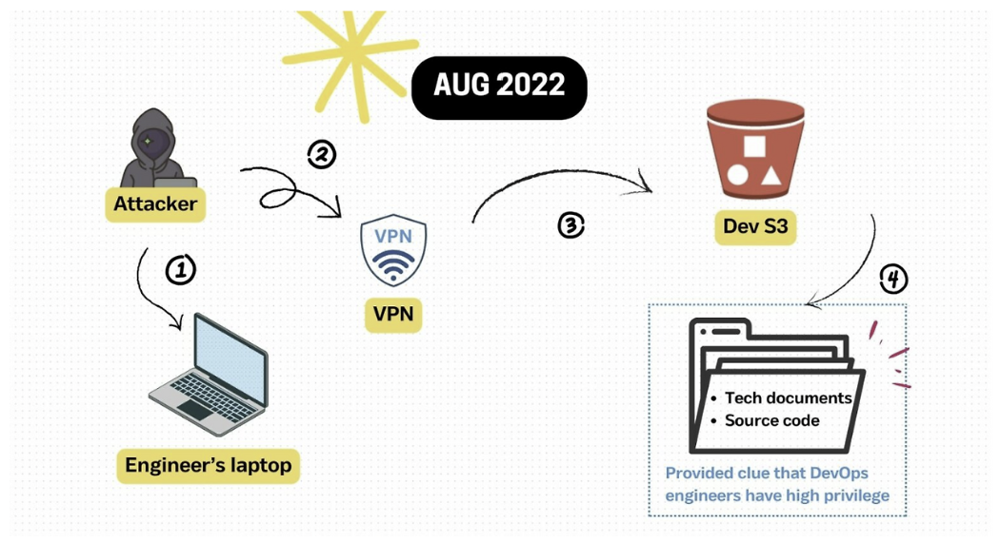
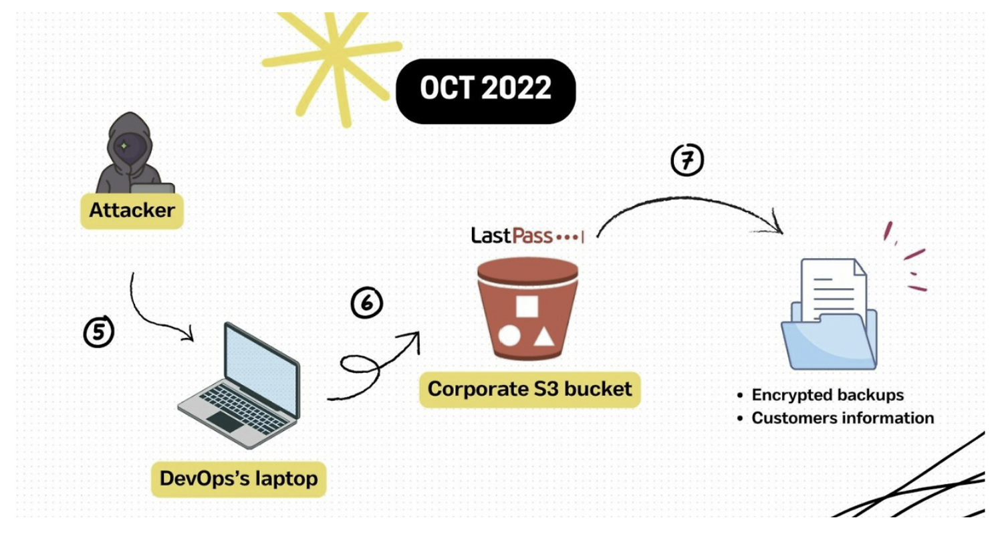

# LastPass 사고 사례 분석

## 1. 개요

2022년에 발생한 라스트패스(LastPass) 데이터 유출 사고는 세계에서 가장 인기 있는 비밀번호 관리 서비스 중 하나가 공격을 받아 고객의 민감 정보가 대규모로 노출된 보안 사고입니다.

- **사건 발생 시기**: 2022년 8월 개발 환경에서 의심스러운 활동이 처음 발견되었으며 이후 2022년 10월까지 두 번째 침해 사고가 이어졌습니다.
- **공격 대상**: 라스트패스의 클라우드 기반 개발 환경과 백업 데이터베이스를 관리하던 **선임 DevSecOps 엔지니어** 중 한 명의 개인용 컴퓨터가 최초 진입점이 되었습니다.
- **유출된 주요 데이터:**
    - **고객 정보**: 암호화된 패스워드 볼트(Vault), 사용자 이름, 이메일 주소, 청구 주소, 전화번호 등.
    - **내부 자산**: 14개의 소스 코드 저장소, 내부 API 키, 개발 및 백업 환경용 디지털 인증서 및 자격 증명.
- **피해 규모**: 3,000만 명 이상의 개인 고객과 10만 개 이상의 기업 고객이 영향을 받았으며 일부 사용자는 볼트에 저장된 개인 키 유출로 인해 총 **3,500만 달러** 이상의 가상화폐를 도난당했습니다.
- **조사 및 대응**: 사고 발생 후 보안 전문 업체인 Mandiant가 투입되어 사고 조사 및 복구를 지원했으며 라스트패스 CEO는 2023년 3월 공식적으로 사고에 대한 책임을 인정했습니다.

---

## 2. 공격 분석

### 2.1 정찰 및 대상 선정

- 공격자는 라스트패스의 인프라를 정밀하게 스캔하고 열거 과정을 거쳤습니다.
- 복잡한 권한 상승 과정을 피하기 위해 시스템에 즉시 접근 가능한 권한을 가진 **4명의 선임 DevSecOps 엔지니어 중 한 명의 홈 컴퓨터**를 최종 진입점으로 선정했습니다.

### 2.2 초기 침투 및 자격 증명 탈취

- **2022년 8월 8일**, 엔지니어의 홈 컴퓨터에서 실행 중이던 타사 미디어 소프트웨어(Plex)의 보안 취약점을 이용해 **원격 코드 실행(RCE)** 공격을 수행했습니다.
- 공격자는 이 권한을 이용해 해당 기기에 키로거를 설치했습니다.
- 이를 통해 엔지니어가 MFA 후 입력한 **마스터 비밀번호**를 실시간으로 훔쳐 자격 증명을 확보했습니다.
- 공격자는 **타사 VPN 서비스**를 사용하여 자신의 위치를 숨기고 엔지니어로 위장해 개발 환경에서 Lastpass의 S3 버킷에 접속하였습니다.
- 이 과정에서 **14개의 소스 코드 저장소와 기술 문서를** 유출했으며 이 소스 코드 안에는 암호화되지 않은 자격 증명, 디지털 인증서, 클라우드 백업 접근용 키 등이 포함되어 있었습니다.
- **공격자는 DevOps 엔지니어들이 매우 높은 권한을 가지고 있으며** 이들을 통해 고객 데이터베이스 백업본으로 접근할 수 있다는 것을 알게 됩니다.

### 2.3 클라우드 스토리지 접근 및 최종 데이터 유출

- **2022년 8월 12일부터 10월 26일까지** 이어진 두 번째 사고에서 공격자는 이전 단계에서 확보한 자격 증명을 활용해 **AWS S3 공유 클라우드 저장소 환경**에 침입했습니다.
- 공격자는 5개의 바이너리 대형 객체(blob) 데이터베이스 샤드를 포함하여 **고객 데이터베이스 백업본**을 복제하기 시작했습니다.
- 최종적으로 암호화된 고객 패스워드 볼트와 사용자 이름, 이메일, 청구 주소 등 민감한 **고객 데이터가 클라우드에서 유출**되었습니다.

---

## 3. 대응 방안

### 3.1 사고 발생 주요 원인

- 해당 엔지니어는 2020년에 이미 패치된 취약점(CVE-2020-5741)이 있는 구버전 'Plex Media Server'를 사용하고 있었습니다.
- **과도한 접근 권한 부여**: 특정 엔지니어 한 명의 계정이 탈취되었음에도 불구하고, 공격자가 클라우드 백업 및 개발 환경의 핵심 데이터에 즉시 접근할 수 있을 만큼 권한 관리가 엄격하지 않았습니다.
- **모니터링 부재**: 공격자가 S3에서 데이터를 유출하는 동안 내부적으로 이를 즉시 탐지하지 못했으며 AWS GuardDuty의 경고를 받고서야 침해 사실을 인지했습니다.
- 백업 플랫폼 등에서 영구적인 액세스 키를 사용함으로써 한 번 유출된 자격 증명이 장기간 공격에 악용될 수 있는 환경을 제공했습니다.

### 3.2 대책 방법

- **최소 권한 원칙 적용**: 사용자별 권한을 지속적으로 모니터링하고 불필요하거나 과도한 접근 권한은 즉시 삭제해야 합니다.
- 조직 내에서 사용되는 모든 소프트웨어를 최신 상태로 유지하고 알려진 취약점을 상시 파악해야 합니다.
- **IAM 운영 강화**: 교차 계정 접근 권한에 대한 정책을 철저히 추적하고 24시간마다 KMS 접근 보고서를 생성하여 이상 징후를 탐지해야 합니다.

---

> 참고 논문: [https://arxiv.org/pdf/2502.04287](https://arxiv.org/pdf/2502.04287)
