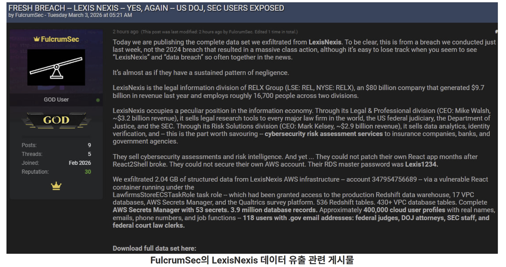

# LexisNexis 사고 사례 분석

---

## 1. 개요

2026년 2월 24일 글로벌 법률 데이터 기업인 **LexisNexis Legal & Professional**의 AWS 클라우드 인프라가 **FulcrumSec**이라는 위협 행위자에 의해 침해되었습니다. 이 사고는 2026년 3월 3일 FulcrumSec이 약 **2.04GB 분량의 데이터를 언더그라운드 포럼에 공개 유출**하면서 세상에 알려졌으며, LexisNexis는 이튿날인 3월 4일 침해 사실을 공식 확인하였습니다.

LexisNexis는 법률, 규제, 비즈니스 정보를 전 세계 150개국 이상에서 제공하는 글로벌 데이터 기업으로, Fortune 100 기업의 91%, Fortune 500 기업의 85%를 고객으로 두고 있습니다. 이번 사고는 단순한 데이터 유출을 넘어, **미패치 취약점 방치, 과도한 클라우드 권한, 평문 자격증명 저장**이라는 클라우드 보안의 고질적인 문제가 복합적으로 작용한 사례입니다.

### 사고 요약

| **항목** | **내용** |
|---------|---------|
| **공격 행위자** | FulcrumSec |
| **최초 침투 일시** | 2026년 2월 24일 |
| **공개 유출 일시** | 2026년 3월 3일 (BreachForums) |
| **공식 확인 일시** | 2026년 3월 4일 |
| **초기 침투 경로** | React2Shell 취약점 (미패치 React 프론트엔드 앱) |
| **유출 데이터 규모** | 약 2.04GB, 390만 건 레코드 |
| **영향받은 계정** | 약 400,000개 사용자 프로필, 21,042개 기업 고객 계정 |
| **주요 피해** | Redshift DB, VPC 인프라 맵, AWS Secrets Manager 평문 자격증명 등 |

---

## 2. 공격 분석

### 2.1 초기 접근: React2Shell 취약점 익스플로잇

공격자 FulcrumSec은 LexisNexis의 AWS 환경에서 운영 중이던 **미패치 React 프론트엔드 애플리케이션**을 타깃으로 삼았습니다. 이 앱에는 **React2Shell**이라는 알려진 보안 취약점이 존재하고 있었으며, 공격자는 이를 익스플로잇하여 AWS 인프라에 대한 비인가 접근 권한을 최초로 획득하였습니다.

React2Shell은 특정 미패치 React 프론트엔드 애플리케이션에 존재하는 보안 결함으로, 이미 공개된 익스플로잇 코드가 존재함에도 불구하고 수개월간 패치가 이루어지지 않은 상태로 방치되어 있었습니다.

### 2.2 권한 남용: 과도한 ECS 태스크 역할

초기 접근에 성공한 공격자는 해당 컨테이너에 연결된 **ECS 태스크 역할**을 발견하였습니다. 문제는 이 단일 태스크 역할이 AWS 계정 내 **모든 Secrets Manager 시크릿에 대한 읽기 권한**을 보유하고 있었다는 점입니다.

이는 최소 권한 원칙이 전혀 적용되지 않은 상태로, 공격자는 단 하나의 컨테이너를 침해하는 것만으로 프로덕션 데이터베이스 자격증명을 포함한 핵심 비밀 정보 전체에 접근할 수 있었습니다.

공격자가 탈취한 주요 정보는 다음과 같습니다.

- **AWS Secrets Manager**: 53개의 평문 시크릿 (프로덕션 Redshift 마스터 자격증명, Salesforce·Oracle·분석 플랫폼용 API 키 포함)
- **Redshift**: 536개 테이블
- **VPC 데이터베이스**: 430개 이상의 테이블
- **VPC 인프라 맵**: 내부 네트워크 구성 전체

### 2.3 데이터 유출: 390만 건 레코드 탈취

공격자는 2026년 2월 24일부터 3월 초 사이에 총 **2.04GB 규모의 구조화된 데이터**를 유출하였습니다. 유출된 데이터의 세부 내역은 다음과 같습니다.

| **유출 데이터** | **규모/내용** |
|--------------|-------------|
| **전체 DB 레코드** | 약 390만 건 |
| **기업 고객 계정** | 21,042개 (로펌, 법원, 규제기관, 연방 정부 기관 등) |
| **클라우드 사용자 프로필** | 약 400,000개 (이름, 이메일, 전화번호, 직무 포함) |
| **정부 이메일(.gov) 프로필** | 118개 (연방 판사, DOJ 검사, SEC 직원 등) |
| **변호사 설문 응답자** | 5,582명 |
| **직원 패스워드 해시** | 45개 |
| **AWS Secrets Manager 시크릿** | 53개 (평문) |

LexisNexis 측은 침해된 데이터가 **2020년 이전의 레거시, 비활성화 서버**에 있던 정보임을 확인하였으며, 주민등록번호, 운전면허번호, 금융 데이터, 활성 패스워드, 고객 검색 질의 등 민감한 PII는 포함되지 않았다고 밝혔습니다.

### 2.4 공격 기법 분류 (MITRE ATT&CK)

이번 공격에서 사용된 기법은 MITRE ATT&CK 프레임워크 기준으로 다음과 같이 분류됩니다.

| **MITRE ATT&CK ID** | **기법** | **이번 사고 적용** |
|--------------------|---------|-----------------|
| **T1190** | Exploit Public-Facing Application | React2Shell 취약점 익스플로잇 |
| **T1078** | Valid Accounts | ECS 태스크 역할 자격증명 남용 |
| **T1552.001** | Unsecured Credentials: Credentials in Files | AWS Secrets Manager 평문 시크릿 탈취 |
| **T1530** | Data from Cloud Storage Object | Redshift 및 VPC DB 데이터 유출 |
| **T1041** | Exfiltration Over C2 Channel | AWS 환경에서 데이터 외부 반출 |

### 2.5 공격 타임라인

| **날짜** | **주요 이벤트** |
|---------|--------------|
| **2026년 2월 24일** | FulcrumSec, React2Shell 취약점으로 AWS 환경 최초 침투 |
| **2026년 2월 24일 ~ 3월 초** | Redshift, VPC DB, Secrets Manager 데이터 유출 (2.04GB) |
| **2026년 3월 3일** | FulcrumSec, BreachForums에 매니페스토 및 유출 데이터 공개 |
| **2026년 3월 3일** | LexisNexis, BleepingComputer에 침해 사실 확인 |
| **2026년 3월 4일** | LexisNexis, 공식 성명 발표 - 사고 봉쇄 완료, 서비스 영향 없음 확인 |

---

## 3. 대응 방안

### 3.1 인터넷 노출 애플리케이션 즉시 패치

이번 사고의 출발점은 **알려진 취약점(React2Shell)이 오랜 기간 패치되지 않은 것**이었습니다. 공개 취약점 데이터베이스(NVD, CVE)와 벤더 보안 공지를 지속적으로 모니터링하고, 인터넷에 노출된 모든 애플리케이션에 대해 신속한 패치를 적용해야 합니다. 특히 컨테이너 기반 환경에서는 베이스 이미지와 애플리케이션 의존성 모두에 대한 취약점 스캔을 자동화하는 것이 중요합니다.

### 3.2 ECS 태스크 역할 최소 권한 원칙 적용

이번 사고에서 **단일 ECS 태스크 역할이 AWS 계정 전체 시크릿에 대한 읽기 권한**을 보유하고 있었다는 점은 설계 오류입니다. 각 ECS 태스크에는 해당 태스크가 실제로 필요로 하는 시크릿에만 접근을 허용하는 별도의 역할을 부여해야 하며, IAM 정책의 리소스(Resource) 필드를 `*` 대신 특정 ARN으로 제한해야 합니다.

### 3.3 AWS Secrets Manager 자격증명 교체 및 접근 감사

탈취된 53개의 시크릿이 **평문으로 저장**되어 있었다는 점은 자격증명 관리 체계의 부재를 보여줍니다.

- **자동 교체 활성화**: AWS Secrets Manager의 자동 교체 기능을 사용하면 키가 유출되더라도 짧은 유효 기간 내에 무력화됩니다.
- **시크릿 접근 감사**: CloudTrail과 연동하여 모든 `GetSecretValue` 호출을 로깅하고, 이상 행위 발생 시 즉시 알림을 받도록 설정합니다.

---

## 참고 자료

1. **The Register** - LexisNexis Legal & Professional confirms data breach  
   https://www.theregister.com/2026/03/04/lexisnexis_legal_professional_confirms_data/

2. **BleepingComputer** - LexisNexis confirms data breach as hackers leak stolen files  
   https://www.bleepingcomputer.com/news/security/lexisnexis-confirms-data-breach-as-hackers-leak-stolen-files/

3. **Rescana** - LexisNexis AWS Data Breach 2026: React2Shell Exploit Exposes Legacy Data in Cloud Hack  
   https://www.rescana.com/post/lexisnexis-aws-data-breach-2026-react2shell-exploit-exposes-legacy-data-in-cloud-hack

4. **Cybernews** - Hackers claim LexisNexis breach exposing 400K users, including federal judges  
   https://cybernews.com/security/lexisnexis-breach-400k-users-gov-accounts-aws/
