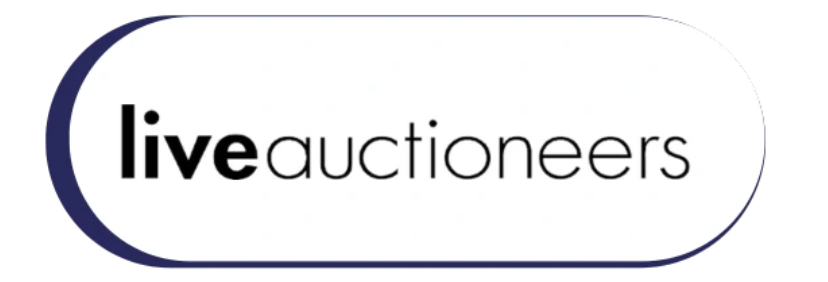
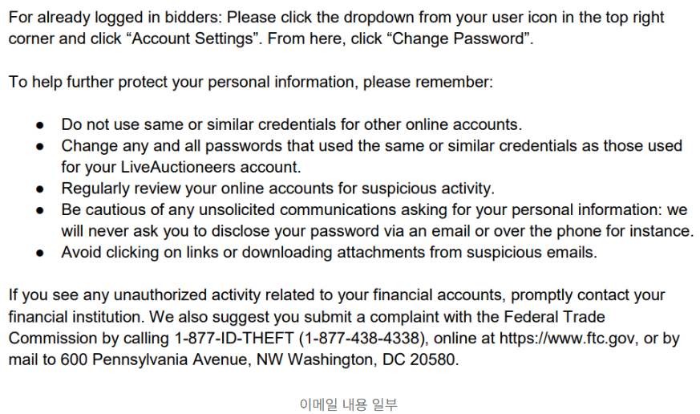

# 침해 사고 분석 - LiveAuctioneers (2020)

## 1. 개요

### 1.1 사고 배경

LiveAuctioneers는 미국 뉴욕에 본사를 둔 온라인 경매 마켓플레이스로 예술품, 골동품, 보석, 수집품 등을 실시간 인터넷 경매로 거래하는 플랫폼입니다. AWS를 클라우드 인프라로 사용하며 다수의 외부 IT 공급업체를 활용합니다.

당시 보안 체계에는 네트워크 세분화, AWS 보안 그룹 방화벽, 웹 애플리케이션 방화벽(WAF), MD5 기반 비밀번호 해싱이 적용되어 있었습니다. 다만 외부 IT 공급업체에 대한 접근 권한 관리 및 소스 컨트롤 환경의 자격증명 보호가 미흡했습니다.

### 1.2 사고 요약

| 항목 | 내용 |
|------|------|
| 사고 발생일 | 2020.06.19 |
| 사고 인지일 | 2020.07.11 |
| 피해 규모 | 워싱턴주 주민 38,523명 포함 다수의 사용자 |
| 공격 유형 | 공급망 공격 |
| 공격 경로 | 외부 IT 공급업체 침해 → 소스 컨트롤 키 탈취 → 클라우드 스토리지 및 운영 DB 접근 |
| 유출 정보 | 이름, 이메일, 우편주소, 전화번호, IP 주소, MD5 해시 비밀번호 |
| 2차 피해 | 복호화된 비밀번호 및 사용자명이 다크웹에서 판매됨 |

---

## 2. 공격 분석

### 2.1 단계별 공격 프로세스

**1단계: IT 공급업체 침해**

외부 IT 공급업체 시스템이 침해되었으며, 해당 업체를 이용하던 다수 파트너사도 동시에 피해를 입었습니다.

**2단계: 소스 컨트롤 키 탈취**

IT 공급업체 시스템 익스플로잇을 통해 source control key를 획득하고, 이를 이용해 소스 컨트롤 저장소에 접근했습니다.

**3단계: 클라우드 환경 및 DB 접근**

내부 사용자 credentials(코드 또는 설정 파일에 존재)를 이용해 클라우드 기반 스토리지 환경에 접근한 후 스토리지 내에 저장된 DB 자격증명을 발견했습니다.

**4단계: 사용자 DB 다운로드**

사용자명, MD5 해시 비밀번호, 연락처, IP 주소 등이 포함된 사용자 DB 전체를 다운로드했습니다.

**5단계: 비밀번호 복호화 및 다크웹 판매**

탈취한 MD5 해시 비밀번호를 브루트포스로 복호화하여 사용자명 + 복호화된 비밀번호를 다크웹에 판매했습니다.

---

## 3. 대응 방안

### 3.1 사고 대응 타임라인

| 날짜 | 내용 |
|------|------|
| 2020.06.19 | 해커가 제3자 소프트웨어 솔루션을 침해하여 소스 컨트롤 키를 획득 |
| 2020.07.02 | 침해된 제3자 소프트웨어 공급업체로부터 자사 시스템이 해킹되었다는 최초 통보를 받음 |
| 2020.07.10 | 주 단위로 암호화되던 비밀번호가 복호화된 후 온라인에 판매 게시됨 |
| 2020.07.11 | 모든 사용자 계정 비밀번호를 만료 조치하고 최근 1년 내 활성 사용자에게 이메일 통지 |
| 2020.07.15 | FBI에 사고 신고 및 수사 협조 |
| 2020.08.03 | 나머지 전체 사용자에게 추가 통지 |

### 3.2 사후 조치 및 재발 방지

1. 모든 사용자 계정 비밀번호를 즉시 만료하고 무단 접근을 차단합니다.

2. 비밀번호 암호화 방식을 PBKDF2+SHA512로 강화합니다.

3. 비밀번호 대신 토큰만 저장하는 "salt and hash" 방식을 도입합니다.

4. 전체 시스템의 보안 토큰 및 액세스 키를 만료하고 교체합니다.

5. 모든 시스템 접근을 토큰화하여 애플리케이션 코드 내 자격증명을 완전히 제거합니다.
   - 기존: AWS ACCESSKEY + SECRET KEY를 통해 EC2에 접속
   - 사후: EC2에 IAM Role 부여 → AWS STS가 자동으로 임시 토큰 발급 → 해당 토큰으로 S3, RDS 접근 → 토큰은 일정 시간 후 만료

6. 모든 AWS 및 내부 시스템에 2FA(2단계 인증)를 적용합니다.

7. 소스코드 취약점 분석 및 모니터링을 강화합니다.

8. 네트워크 인프라를 개선합니다.
   - VPC 플로우 로그를 구현하여 모든 IP 트래픽 정보를 기록합니다.
   - 보안 그룹 접근을 제한합니다.
   - GuardDuty IDS를 도입합니다.
   - DB에 대한 모든 외부 접근을 차단합니다.
   - 새 WAF를 도입합니다.

9. Secrets Manager를 사용하여 DB 접속 정보(host, user, password)를 관리하고 소스 코드에 하드코딩하지 않습니다.

10. GitLeaks(git-secrets, AWS CodeGuru)를 사용합니다.
    - 커밋 전 자동 스캔: `gitleaks protect --staged`
    - CI/CD 파이프라인 연동
    - 기존 저장소 전체 스캔: `gitleaks detect --source .`

11. Third Party 보안 수준을 검증합니다.
    - 서드파티 보안 정책 정기 검사
    - 취약점 스캐닝 결과 공유 요구
    - 침투 테스트 결과 확인
