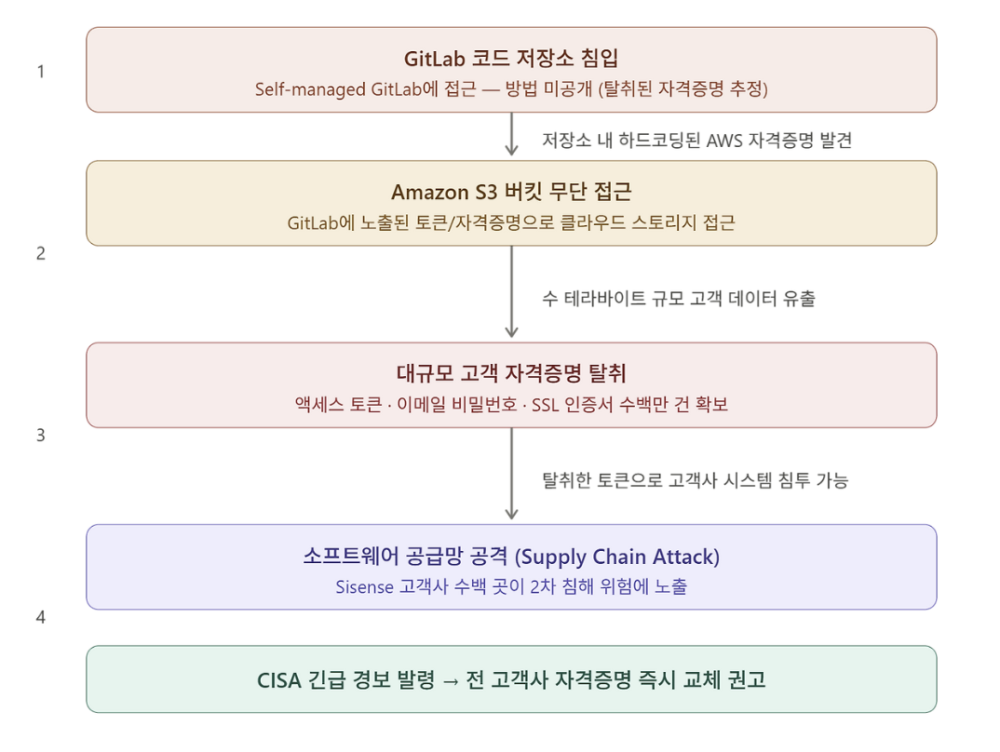

# Sisense 사고 사례 분석

## 1. 개요

### Sisense

Sisense는 2004년 이스라엘 텔아비브에서 설립된 비즈니스 인텔리전스(BI) 및 데이터 분석 플랫폼 기업입니다. 기업 고객들이 여러 외부 서비스(데이터베이스, SaaS 툴, API 등)를 하나의 대시보드에 연결하고 데이터를 시각화, 분석할 수 있도록 지원하는 솔루션을 제공합니다. 본사는 미국 뉴욕에 위치하며 전 세계 2,000개 이상의 기업 고객을 보유하고 있습니다.

Sisense의 핵심 특성은 **고객사의 민감한 데이터 소스에 직접 연결된다**는 점입니다. 고객들은 Sisense에 자사 데이터베이스, 클라우드 서비스, 내부 시스템의 접근 자격증명(토큰, API 키, 비밀번호 등)을 위탁하는 구조로 서비스를 이용합니다. 이 구조적 특성이 이번 침해사고를 단순한 기업 해킹이 아닌 **공급망 공격**으로 만든 핵심 요인입니다.

### 피해 규모 및 주요 고객사

이번 침해로 유출된 데이터는 수 테라바이트 규모로 구체적으로는 수백만 건의 액세스 토큰, 이메일 계정 비밀번호, SSL 인증서가 포함된 것으로 알려졌습니다. 보안 인텔리전스 기업 Censys의 분석에 따르면 피해가 확인되거나 의심되는 Sisense 배포 인스턴스는 최소 120개에 달했으며 영향받은 산업군은 금융, 통신, 헬스케어, 물류, 에너지, IT 등 전방위에 걸쳐 있었습니다.

Sisense의 주요 고객사로는 다음과 같은 기업들이 알려져 있습니다.

| **기업** | **산업군** |
|---|---|
| **Nasdaq** | 금융 |
| **Verizon** | 통신 |
| **Philips Healthcare** | 헬스케어 |
| **Air Canada** | 항공 |

단 Sisense 측은 이후 공식 입장을 통해 실제 피해 범위는 Sisense Fusion Managed Cloud 제품의 일부 고객에 대한 증분 구성 백업에 국한된다고 밝혔습니다. 정확한 피해 고객사의 전체 목록은 현재까지 공개되지 않았습니다.

### 사건 타임라인

| **날짜** | **내용** |
|---|---|
| **2024년 4월 10일** | 독립 보안 연구자들이 침해 사실 최초 발견. Sisense CISO Sangram Dash가 고객들에게 첫 번째 이메일 공지 발송 — "제한된 서버에 일부 회사 정보가 노출되었을 수 있다"는 내용 |
| **2024년 4월 11일** | 미국 사이버보안·인프라보안국(CISA)이 공식 경보 발령. 보안 전문 매체 Krebs on Security가 내부 소식통을 인용해 GitLab→S3 공격 경로 최초 보도 |
| **2024년 4월 11일 (저녁)** | Sisense CISO가 고객에게 2차 공지 발송 — Active Directory, GIT 자격증명, SSO 토큰, SSL 인증서 등 구체적인 교체 항목 목록 포함 |
| **이후** | CISA 주도로 민간 보안 기업들과 공동 조사 진행. Sisense는 포렌식 전문가를 투입해 내부 조사 착수 |

### CISA 개입 배경

CISA(Cybersecurity and Infrastructure Security Agency)는 미국 국토안보부 산하의 연방 사이버보안 기관으로 일반적인 기업 해킹 사고에는 직접 개입하지 않습니다. 그럼에도 이번 사건에 CISA가 직접 경보를 발령하고 조사에 나선 이유는 두 가지입니다.

첫째, Sisense의 고객사 중 금융, 헬스케어, 에너지 등 **미국의 핵심 인프라**에 해당하는 기업들이 다수 포함되어 있었습니다. CISA는 이들 고객사가 보유한 시스템이 2차로 침해될 가능성을 우선적으로 차단해야 했습니다.

둘째, 탈취된 자격증명의 성격 때문입니다. 액세스 토큰은 유효기간이 없거나 매우 긴 경우가 많고 공격자가 이를 재사용하면 피해 기업이 인지하지 못한 채로 내부 시스템에 지속적으로 접근할 수 있습니다. CISA는 이를 최악의 시나리오로 판단하고 신속한 자격증명 교체를 전 고객사에 권고했습니다.

---

## 2. 공격 분석

### 2.1 GitLab 코드 저장소 침입

공격자는 가장 먼저 Sisense가 내부적으로 운영하던 **Self-managed GitLab 인스턴스**에 접근하는 데 성공했습니다. GitLab은 코드를 작성하고 버전을 관리하는 플랫폼으로 쉽게 말해 개발팀의 모든 소스코드와 설정 파일이 모여 있는 곳입니다.

Sisense는 GitLab.com의 클라우드 서비스가 아닌 자체 서버에 직접 설치해 운영하는 방식(Self-managed)을 사용하고 있었습니다. 이 방식은 외부 서비스에 의존하지 않는다는 장점이 있지만 반대로 보안 패치 적용이나 접근 제어를 전적으로 운영팀이 직접 책임져야 한다는 부담이 따릅니다.

공격자가 GitLab에 어떻게 최초 접근했는지는 현재까지 공식적으로 확인되지 않았습니다. 탈취된 개발자 자격증명, 미패치 취약점, 또는 내부자 개입 등 여러 가능성이 거론되고 있습니다.

> **Self-managed vs Cloud-hosted**: GitLab을 클라우드(GitLab.com)에서 사용하면 GitLab 측이 보안을 관리하지만 Self-managed 방식은 서버 설정부터 접근 제어까지 모두 운영 조직이 직접 책임집니다. 잘못 설정된 Self-managed 인스턴스는 외부에서 접근 가능한 상태로 방치될 위험이 있습니다.

### 2.2 하드코딩된 AWS 자격증명 발견

GitLab 저장소에 접근한 공격자는 코드베이스를 탐색하던 중 단서를 발견했습니다. 소스코드 또는 설정 파일에 **AWS 접근 자격증명(Access Key)이 평문으로 하드코딩**되어 있었던 것입니다.

### 2.3 Amazon S3 버킷 접근 및 대규모 데이터 탈취

AWS 자격증명을 얻은 공격자는 이를 이용해 Sisense가 사용하던 **Amazon S3 버킷**에 정상적인 사용자인 것처럼 접근했습니다. S3는 AWS의 클라우드 오브젝트 스토리지 서비스로 Sisense는 이곳에 고객 관련 데이터를 저장하고 있었습니다.

탈취된 데이터의 규모와 내용은 다음과 같습니다.

| **유출 데이터 종류** | **설명** |
|---|---|
| **액세스 토큰 (수백만 건)** | 고객사가 외부 서비스에 접근하기 위해 Sisense에 위탁한 인증 토큰 |
| **이메일 계정 비밀번호** | 고객사 계정과 연동된 이메일 자격증명 |
| **SSL 인증서** | 서버 간 암호화 통신에 사용되는 인증서 및 개인 키 |

이 단계에서 추가적인 보안 문제가 제기되었습니다. S3에 저장된 데이터가 저장 시 암호화되어 있었는지 여부입니다. 그러나 보안 전문가들은 설령 S3 서버사이드 암호화가 적용되어 있었더라도 큰 의미가 없었을 것이라고 지적합니다. 공격자가 S3 접근 권한을 가진 IAM 자격증명 자체를 탈취했다면 AWS는 이를 정상적인 접근으로 판단하기 때문에 암호화 해제도 함께 허용했을 것이기 때문입니다.

> **IAM 자격증명 탈취의 위험성:** AWS에서 IAM 자격증명은 사람이 아닌 코드나 서비스가 AWS 리소스에 접근할 때 사용하는 일종의 키입니다. 이 키를 탈취당하면 공격자는 해당 권한 범위 안에서 AWS를 마음대로 사용할 수 있습니다. 피해자 입장에서는 정상 트래픽과 구분하기도 어렵습니다.

### 2.4 공급망 공격으로의 확산

이 사건이 단순한 기업 해킹으로 끝나지 않은 이유는 탈취된 데이터의 성격에 있습니다. Sisense는 수천 개 기업 고객의 외부 서비스 자격증명을 대신 보관하고 있었습니다. 즉 공격자는 Sisense 하나를 뚫음으로써 그 뒤에 연결된 수백 개 고객사의 내부 시스템으로 이동할 수 있는 발판을 확보한 것입니다.

Sisense에서 탈취한 토큰 하나로 고객사 A의 데이터베이스에, 또 다른 토큰으로 고객사 B의 클라우드 서비스에 접근하는 식으로 피해가 수평적으로 확산될 수 있는 구조였습니다. Sisense가 사실상 수백 개 기업 시스템의 공통문 역할을 하고 있었던 셈입니다.

액세스 토큰은 비밀번호와 달리 재입력 없이 재사용이 가능하고 유효기간이 없거나 매우 긴 경우가 많습니다. 따라서 공격자가 이 토큰들을 활용한다면 피해 고객사가 인지하지 못하는 상태에서 지속적인 접근이 가능합니다. 보안 연구자 Marc Rogers는 이를 두고 고객사 입장에서는 최악의 시나리오라고 표현했으며 탈취된 자격증명이 사실상 고객사 시스템 전체의 열쇠나 다름없다고 경고했습니다.

---

## 3. 대응 방안

### 3.1 즉각적 대응 — 자격증명 전면 교체

침해사고가 발생했을 때 가장 먼저 해야 할 일은 공격자가 탈취한 자격증명을 무력화하는 것입니다. Sisense CISO는 고객사들에게 아래 항목들을 즉시 교체하도록 공식 권고했습니다.

| **교체 대상** | **설명** |
|---|---|
| **Sisense 계정 비밀번호** | my.sisense.com에서 즉시 변경 |
| **SSO JWT 공유 시크릿** | SSO 핸들러 측과 동기화하여 새 값으로 교체 |
| **SAML x.509 인증서** | SSO SAML ID 공급자의 인증서 교체 |
| **OpenID 클라이언트 시크릿** | OpenID 연동 사용 시 즉시 로테이션 |
| **Active Directory / LDAP 비밀번호** | AD 동기화에 사용된 계정 비밀번호 변경 |
| **GIT 자격증명** | 모든 GIT 프로젝트의 HTTP 인증 자격증명 교체 |
| **웹 액세스 토큰** | 전체 토큰 로테이션 |
| **데이터베이스 연결 자격증명** | 데이터 모델에 사용된 DB 접속 정보 전면 교체 |
| **커스텀 코드 내 시크릿** | Notebook 등 커스텀 코드에 포함된 모든 시크릿 재설정 |

자격증명 교체는 단순히 비밀번호를 바꾸는 것에서 끝나지 않습니다. 교체 이후에는 기존 세션을 전부 강제 로그아웃 처리해야 하며 교체 전 기간 동안 해당 자격증명을 통해 이루어진 접근 로그를 전수 검토해 이상 징후가 없는지 확인하는 과정이 반드시 있어야 합니다.

### 3.2 Secrets 관리

이번 사고의 직접적인 원인 중 하나는 AWS 자격증명이 GitLab 저장소에 하드코딩되어 있었다는 점입니다. 이는 개발 과정에서 매우 흔하게 발생하는 실수이지만 파급 효과는 큽니다. 이를 방지하기 위한 방법은 크게 세 가지입니다.

1. AWS 환경이라면 AWS Secrets Manager나 AWS Parameter Store를 활용해 자격증명을 코드 외부에서 관리하고 애플리케이션이 실행 시점에 동적으로 불러오도록 구성해야 합니다. 클라우드에 종속되지 않는 방식을 원한다면 HashiCorp Vault가 널리 사용됩니다.

2. GitGuardian, GitHub Advanced Security, truffleHog 같은 도구는 코드가 저장소에 푸시되기 전 또는 직후에 자격증명 패턴을 자동으로 스캔해 알림을 보내줍니다. CI/CD 파이프라인에 이 단계를 포함시키면 실수로 인한 노출을 상당 부분 사전에 차단할 수 있습니다.

3. Git 히스토리에서 민감한 정보를 삭제하는 것은 기술적으로 가능하지만 복잡하고 불완전합니다. 저장소를 클론한 사람이 이미 해당 정보를 가지고 있을 수 있기 때문입니다. 노출이 확인된 자격증명은 삭제 시도보다 즉각적인 무효화 및 교체를 우선으로 해야 합니다.

### 3.3 IAM 권한 최소화

이번 사고에서 피해가 커진 또 다른 이유는 GitLab에 노출된 AWS 자격증명 하나가 S3 전체에 대한 접근 권한을 가지고 있었다는 점입니다. 이는 **최소 권한 원칙**이 지켜지지 않은 사례입니다.

최소 권한 원칙이란 특정 작업에 필요한 최소한의 권한만 부여하고 그 외의 접근은 기본적으로 차단하는 보안 설계 원칙입니다. 이를 실제로 적용하는 방법은 다음과 같습니다.

서비스별로 별도의 IAM role을 생성하고 각 역할이 접근할 수 있는 S3 버킷과 작업을 명시적으로 제한해야 합니다. 예를 들어 특정 애플리케이션이 특정 버킷에 파일을 업로드하는 용도라면 해당 버킷의 쓰기 권한만 부여하고 다른 버킷이나 삭제 권한은 부여하지 않는 식입니다. 또한 IAM 자격증명은 액세스 키 방식보다 임시 자격증명을 발급하는 IAM role 방식을 사용하는 것이 권장됩니다. 임시 자격증명은 일정 시간이 지나면 자동으로 만료되기 때문에 탈취되더라도 공격자가 사용할 수 있는 시간이 제한됩니다.

정기적인 IAM 권한 감사도 중요합니다. 시간이 지나면서 더 이상 사용되지 않는 자격증명이나 과도한 권한이 누적되는 경우가 많습니다. AWS Access Analyzer나 IAM Access Advisor 같은 도구를 활용하면 실제로 사용되지 않는 권한을 식별하고 정리하는 데 도움이 됩니다.

---

**참고 자료**

- [Krebs on Security — Why CISA is Warning CISOs About a Breach at Sisense](https://krebsonsecurity.com/2024/04/why-cisa-is-warning-cisos-about-a-breach-at-sisense/)
