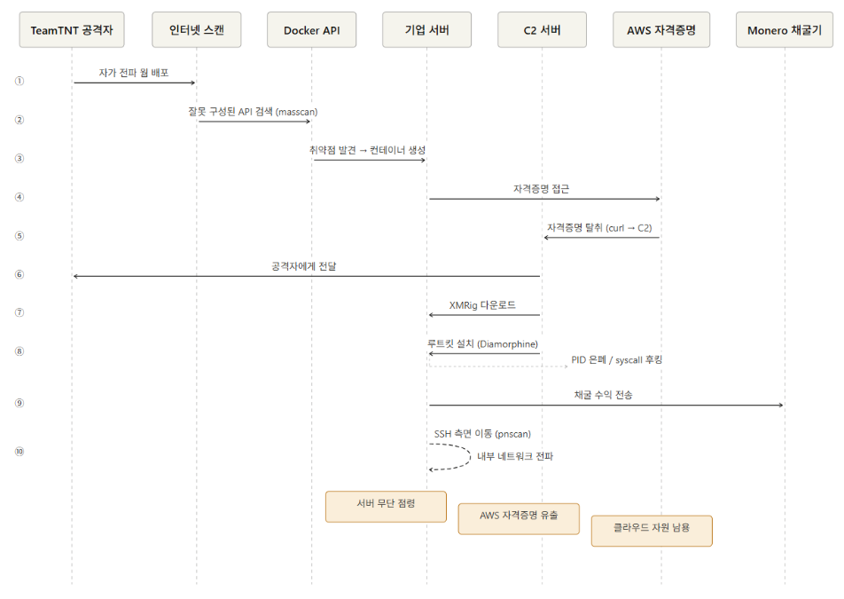

# 침해 사고 사례 분석 - TeamTNT (암호화폐 채굴)

## 개요

### 사고 배경

TeamTNT는 독일어권으로 추정되는 금전적 동기 공격 그룹으로 Docker, Kubernetes, AWS를 집중 타깃으로 삼습니다. 2019년부터 활동을 시작했으며 2020년 AWS 자격증명 탈취 기능 추가 이후 대규모 캠페인으로 발전했습니다.

기존 Cryptojacking 그룹과는 다르게 클라우드 환경과 컨테이너 오케스트레이션 플랫폼을 전문적으로 공략합니다.

AWS 자격증명을 탈취하는 최초의 Cryptojacking 웜으로 기록됩니다.

### 사고 요약

TeamTNT는 잘못 구성된 Docker API를 찾고 서버 내에서 AWS 자격증명을 얻습니다. 이후 Monero 암호화폐를 채굴합니다.

자가 전파 웜 형태로 인터넷 전체를 스캔하여 컨테이너를 생성합니다. 자격증명을 탈취한 후 채굴기를 설치합니다.

그 결과 기업 서버를 무단으로 점령하고 AWS 자격증명이 유출되며 추가적으로 클라우드 자원이 남용될 가능성이 있습니다.

연구진은 "이러한 공격이 특별히 정교하지는 않지만 Cryptojacking 웜을 배포하는 수많은 그룹들이 대규모 기업 시스템 감염에 성공하고 있다"고 밝혔습니다.

---

## 공격 분석
### 공격 흐름


### 단계별 공격 프로세스

**1단계: 인터넷 전체 스캔으로 취약한 타겟 탐색**

TeamTNT 웜은 이미 감염된 서버를 활용하여 오픈소스 IP 포트 스캐너인 masscan으로 인터넷 전체에서 노출된 Docker API와 Kubernetes 시스템을 스캔합니다.

**2단계: 노출된 Docker API로 악성 컨테이너 생성**

인증 없이 노출된 Docker API를 발견하면 웜은 Docker 이미지를 생성하여 새 컨테이너에 자신을 설치합니다. 이후 추가로 Kubernetes 시스템도 탐색합니다.

**3단계: AWS 자격증명 탈취 (3가지 방법)**

1. `~/.aws/credentials` 파일 및 `/home/` 디렉토리에서 AWS 키를 직접 탈취합니다.
2. 실행 중인 Docker 컨테이너 내부에서 AWS 키를 탐색합니다.
3. EC2 인스턴스 메타데이터 서비스 `http://169.254.169.254/latest/meta-data/` 에 접근하여 IAM 역할에 연결된 `aws_access_key_id`, `aws_secret_access_key`, `aws_session_token`을 탈취합니다.

**시나리오 A**
- AWS 외부 서버
- Docker API 포트 노출
- 서버 내 `~/.aws/credentials` 파일 존재 (개발자가 AWS CLI 사용을 위해 저장해 둔 키)

**시나리오 B**
- AWS 내 EC2 인스턴스
- Docker API 포트 노출
- EC2 메타데이터 서비스(169.254.169.254) 접근 가능 → IAM 역할 자격증명을 탈취하여 해당 AWS 계정의 모든 자원에 접근이 가능합니다.

**4단계: XMRig 암호화폐 채굴기 설치 및 지속성 확보**

초기 접근부터 채굴기 실행까지 수 분 내에 자동으로 완료됩니다. XMRig는 재부팅 후에도 유지되도록 systemd 서비스로 등록됩니다.

또한 SSH `authorized_keys`에 자신의 키를 추가하여 지속적인 접근 경로를 마련합니다.

**5단계: 루트킷으로 활동 은폐**

Diamorphine 루트킷을 설치해 프로세스 ID를 숨기고 syscall 테이블 후킹 및 루트 권한을 획득하여 악성 활동을 탐지하기 어렵게 만듭니다.

**6단계: 내부 네트워크 측면 이동**

`ip route` 명령어로 접근 가능한 네트워크를 파악한 뒤 pnscan 도구로 내부 네트워크의 SSH 서비스를 탐색한 뒤 이미 수집한 SSH 키를 사용해 인증을 시도합니다. 공개 인터넷으로의 공격뿐만 아니라 내부 네트워크로의 측면 이동도 가능합니다.

### 사용된 기법 및 도구

| 도구/기법 | 용도 |
|----------|------|
| masscan | 인터넷 전체 Docker API 포트 스캔 |
| zgrab | 서비스 식별을 위한 배너 그래빙 |
| pnscan | 내부 네트워크 SSH 서비스 탐색 |
| XMRig | Monero 암호화폐 채굴기 |
| Diamorphine rootkit | PID 숨김, syscall 후킹, 루트 권한 획득 |
| Tsunami IRC bot | C2 통신 및 DDoS 백도어 |
| curl | AWS 자격증명을 C2 서버(공격자 제어 서버)로 업로드 |

---

## 대응 방안

### 즉각 대응 절차

1. Docker API 포트 2375를 즉시 방화벽으로 차단합니다.
2. 실행 중인 컨테이너 전수 확인을 통해 불명 컨테이너를 격리 및 중지합니다.
3. `~/.aws/credentials` 파일 존재 여부를 확인하고 해당 AWS 키를 즉시 비활성화합니다.
4. AWS CloudTrail 로그에서 비정상 API 호출을 확인합니다.
5. SSH `authorized_keys` 파일에서 미인가 키를 제거합니다.
6. CPU 사용률 급증 프로세스를 확인합니다.

### 사후 조치 및 재발 방지

1. AWS 자격증명을 전면 교체하고 IAM 최소 권한 원칙을 적용합니다.

2. Docker API TLS 인증을 설정합니다. (`--tlsverify` 옵션을 적용합니다.)

3. IMDSv2를 강제로 적용하여 메타데이터 서비스 SSRF를 방어합니다.

4. AWS GuardDuty를 활성화하여 비정상 API 호출을 자동 탐지합니다.

   **GuardDuty 수집 항목:**
   - AWS CloudTrail 이벤트: API 호출에 사용된 소스 IP 주소와 사용자 및 계정을 식별할 수 있습니다.
   - VPC Flow Logs: VPC ENI에서 송수신되는 트래픽에 대한 정보를 수집할 수 있습니다. (수상한 외부 트래픽이나 IP 주소를 식별합니다.)
   - DNS Logs: EC2 내에서 AWS DNS Resolver를 사용하면 GuardDuty는 내부 DNS Resolver를 통해 쿼리 로그를 분석합니다.

5. Falco 등 컨테이너 런타임 보안 도구를 도입합니다.

   **Falco 탐지 기능:**

   Falco는 Linux 커널 시스템 콜을 실시간으로 모니터링하여 컨테이너 내 비정상 행위를 탐지하는 오픈소스 도구입니다.

   아래와 같은 행위를 실시간으로 탐지할 수 있습니다:
   - `~/.aws/credentials` 등 민감 파일에 대한 무단 접근
   - `--privileged` 플래그가 적용된 특권 컨테이너 생성
   - 컨테이너 내부에서 curl, masscan 등 도구 실행
   - 루트킷의 커널 모듈 삽입
   - 암호화폐 채굴 프로세스 실행
   - SSH `authorized_keys` 파일 무단 수정

   AWS GuardDuty는 AWS 계정 레벨의 이상 탐지를 담당하며, Falco는 컨테이너/호스트 레벨의 행위 탐지를 담당합니다. 두 도구를 함께 사용하면 좋습니다.

6. 운영 서버에 개발용 자격증명 파일이 남아있는지 정기적으로 점검합니다.

7. 컨테이너 이미지에 `--privileged` 플래그 사용을 금지하는 정책을 수립합니다.

   **`--privileged` 플래그의 위험성:**

   Docker 컨테이너는 기본적으로 호스트 시스템과 격리되어 실행됩니다. 컨테이너 안에서 할 수 있는 일이 제한되어 있습니다.

   그러나 `--privileged` 플래그를 붙이면 해당 격리가 사라집니다:
   - 해당 플래그가 없는 경우 Docker API 노출: 컨테이너 생성은 가능하나 호스트 파일 접근은 불가
   - 해당 플래그가 있고 Docker API 노출: 호스트 전체를 장악하고 AWS 키를 탈취, 루트킷 설치 가능

   **`--privileged`가 있는 경우 공격 과정:**

   ```bash
   docker run --privileged \
       -v /:/host \
       alpine sh
   ```

   위의 공격 명령을 통해 `/host/root/.aws/credentials`에 접근할 수 있습니다.
