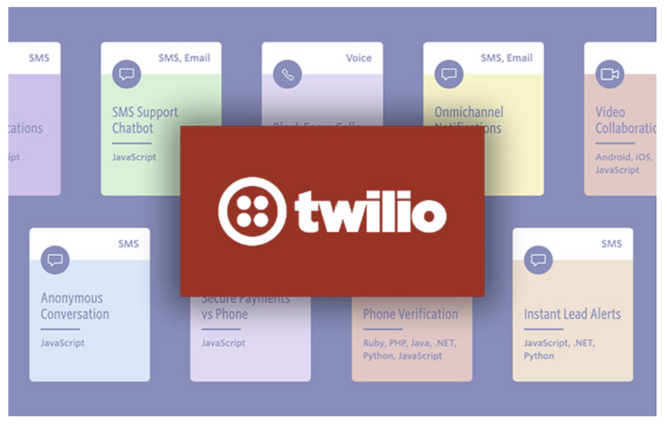
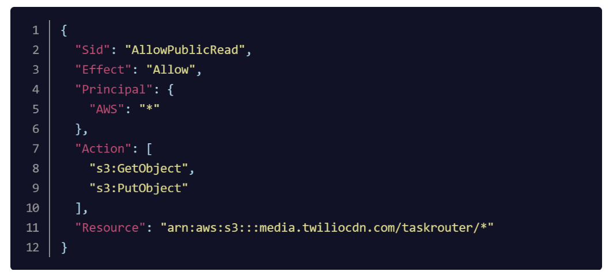
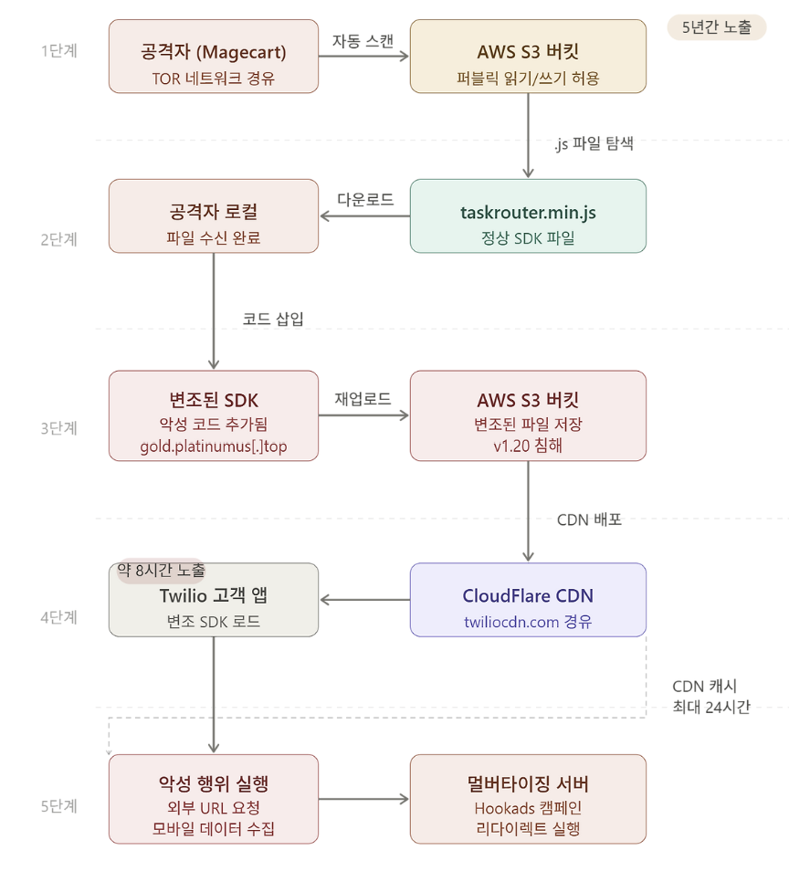

# Twilio TaskRouter JS SDK 사고 사례 분석



## 1. 개요

### 1.1 사고 배경

Twilio는 개발자들이 음성, 영상, 메시지, 인증 기능을 애플리케이션에 손쉽게 통합할 수 있도록 지원하는 클라우드 커뮤니케이션 플랫폼(CPaaS) 기업입니다. Twitter, Netflix, Uber, Airbnb, Spotify, Shopify 등 전 세계 40,000개 이상의 기업이 Twilio의 API를 사용하고 있으며 5백만 명 이상의 개발자가 플랫폼을 활용하고 있습니다.

2020년 7월 19일 Twilio의 **TaskRouter JS SDK**가 공격자에 의해 악성 코드로 변조되는 사건이 발생했습니다.

**TaskRouter JS SDK**란 Twilio가 제공하는 JavaScript 라이브러리로 한 마디로 **"콜센터 자동 배분 시스템을 웹에서 쉽게 구현할 수 있게 해주는 도구"**입니다. 예를 들어 고객이 쇼핑몰에 문의 전화를 했을 때 단순 문의는 신입 상담원에게, 환불 문제는 숙련 상담원에게, VIP 고객은 전담팀으로 자동 연결하는 로직을 개발자가 손쉽게 구현할 수 있도록 지원합니다. 구체적으로는 고객 요청의 자동 배정, 상담원 상태 관리, 속성 기반 라우팅 규칙 설정, 실시간 대기열 모니터링 등의 기능을 제공합니다.

이 라이브러리는 웹 페이지에 `<script>` 태그로 직접 로드하는 방식으로 사용되기 때문에 S3 버킷에 저장된 파일이 변조되면 해당 라이브러리를 사용하는 모든 고객 웹 앱에 악성 코드가 그대로 실행되는 구조였습니다. 이것이 이번 사고가 공급망 공격으로 분류되는 핵심 이유입니다.

### 1.2 사고 타임라인

| **시각** | **사건** |
|---|---|
| **2015년** | 해당 S3 버킷 경로 추가. 초기에는 퍼블릭 쓰기 권한 없음 |
| **2015년 (5개월 후)** | 빌드 시스템 문제 해결을 위해 퍼블릭 쓰기 권한 설정. 이후 초기화 누락 |
| **2020년 7월 19일 13:12** | 공격자가 TOR 네트워크를 통해 변조된 taskrouter.min.js 업로드 |
| **2020년 7월 19일 21:20** | Twilio 보안팀에 변조 알림 접수 |
| **2020년 7월 19일 22:30** | 악성 SDK 제거 및 정상 버전으로 교체, S3 버킷 잠금 조치 |
| **2020년 7월 20일 22:30** | CDN 캐시 만료 완료 (최대 24시간) |
| **2020년 7월 22일** | Twilio, 공식 인시던트 리포트 공개 |

### 1.3 영향 범위

- **직접 영향**: TaskRouter JS SDK **v1.20** 단일 버전
- **노출 시간**: 약 8~10시간 (CDN 캐시 포함 시 최대 24시간)
- **영향 제외**: Twilio Flex 고객 (별도 SDK 사용, 공개 사이트에서 로드하지 않음)
- **고객 데이터 접근**: 증거 없음
- **내부 시스템 침해**: 없음

---

## 2. 공격 분석

### 2.1 초기 침투: AWS S3 버킷 Misconfigured Access Policy

이 사고의 근본 원인은 **AWS S3 버킷의 Misconfigured Access Policy**입니다.

Twilio는 twiliocdn.com 도메인을 통해 퍼블릭 콘텐츠를 제공하기 위한 S3 버킷을 운영하고 있었습니다. 이 버킷에는 Programmable Chat, Programmable Video, Twilio Client, Twilio TaskRouter 등의 클라이언트 측 JavaScript SDK가 저장되어 있었습니다. 해당 파일들은 CloudFlare CDN을 통해 사용자에게 제공되지만 S3 버킷에 직접 접근하는 것도 가능한 구조였습니다.

잘못된 설정이 만들어진 경위는 다음과 같습니다.

1. 2015년 TaskRouter SDK 경로가 S3 버킷에 추가될 당시에는 퍼블릭 쓰기 권한이 부여되지 않았습니다.
2. 5개월 후 빌드 시스템 트러블슈팅 과정에서 해당 경로의 퍼블릭 쓰기 권한이 활성화되었습니다.
3. 문제 해결 후 쓰기 권한을 원래 상태로 되돌리지 않아 약 **5년간** 인터넷상 누구든지 해당 경로에 읽기/쓰기가 가능한 상태가 지속되었습니다.



버킷 정책에서 Principal이 모든 사용자로 설정되어 있으며 `s3:GetObject`뿐 아니라 `s3:PutObject`까지 허용되어 있었습니다.

이 설정 오류는 당시 Twilio 내부 보안 감사에서도 발견되지 않았으며 사고 이후 전체 S3 버킷 감사를 통해 유사한 잘못된 쓰기 권한 설정을 가진 버킷이 추가로 발견되기도 했습니다.

### 2.2 공격: Magecart 그룹의 자동화된 S3 스캐닝



이번 공격은 **Magecart**로 알려진 공격 그룹의 전형적인 수법과 일치합니다. Magecart는 전자상거래 사이트에서 신용카드 정보 등 민감한 금융 데이터를 탈취하기 위해 웹 스키밍(Web Skimming) 기법을 사용하는 여러 해킹 그룹을 포괄하는 용어입니다.

**웹 스키밍**은 전자상거래 사이트의 결제 페이지에 악성 스크립트를 주입해 사용자의 신용카드 정보와 개인정보를 실시간으로 탈취하는 사이버 범죄입니다.

공격 단계는 다음과 같습니다.

**1. 자동화 스캐닝**: 공격자는 인터넷상에 노출된 잘못 설정된 S3 버킷을 자동으로 스캔합니다. AWS S3 버킷은 기본적으로 보안이 설정되어 있지만 관리자가 퍼블릭 쓰기 권한을 허용하면 누구나 파일을 덮어쓸 수 있게 됩니다.

**2. JavaScript 파일 탐색**: 잘못 설정된 버킷을 발견하면 공격자는 해당 버킷 내의 모든 .js 파일을 탐색합니다.

**3. 악성 코드 삽입**: JavaScript 파일을 다운로드한 후 파일 끝에 악성 코드를 추가하고 버킷에 재업로드합니다.

이번 사고에서 주입된 코드는 다음과 같이 동작했습니다.

```
악성 코드 → hxxps://gold.platinumus[.]top/track/awswrite?q=dmn 로 HTTP GET 요청
         → 반환된 URL로 리다이렉트
         → 브라우저 뒤로 가기 버튼 차단
         → 모바일 기기 관련 데이터 수집 시도
```

공격자는 TOR 익명화 네트워크를 통해 접속하여 추적을 어렵게 했습니다. RiskIQ의 연구에 따르면 jqueryapi1oad라고도 불리는 이 악성 리다이렉터는 Hookads 멀버타이징 캠페인과 연관되어 있습니다.

멀버타이징이란 Malicious(악성)와 Advertising(광고)의 합성어로 사용자 몰래 광고를 강제로 띄우거나 광고 수익을 가로채는 행위를 말합니다. Hookads 캠페인은 2019년 4월부터 활동해 온 광고 사기 네트워크입니다.

### 2.3 공급망 공격으로서의 의미

이번 사고는 단순한 단일 기업 해킹을 넘어 **소프트웨어 공급망 공격**의 특성을 지닙니다.

현대 웹 애플리케이션은 서드파티 스크립트와 오픈소스 라이브러리를 광범위하게 활용합니다. Twilio처럼 수만 개의 기업이 사용하는 SDK가 침해될 경우 공격자는 단 하나의 공급자를 공략함으로써 그 공급자에 의존하는 수많은 하위 기업과 사용자에게 간접적으로 피해를 입힐 수 있습니다.

### 2.4 탐지 지연과 CDN 캐싱 문제

이번 사고에서 중요한 것 중 하나는 **탐지 지연**입니다.

- 악성 파일이 업로드된 시각: 13:12
- Twilio가 알림을 받은 시각: 21:20
- 정상 파일로 교체 완료: 22:30

약 **8시간** 동안 악성 SDK가 서비스되었으며 CDN에 캐시된 버전은 최대 **24시간** 더 사용자에게 노출될 수 있었습니다. 이는 클라우드 스토리지 변경에 대한 실시간 모니터링 부재가 얼마나 큰 위험을 가져오는지를 보여줍니다.

---

## 3. 대응 방안

### 3.1 즉각적 사고 대응

Twilio는 사고 발생 후 다음과 같이 대응했습니다.

**단기 대응 조치**

- 변조된 SDK 리포트 접수 후 **15분 이내**에 보안팀 소집
- 알림 접수 약 **1시간 후** 정상 버전 SDK로 교체 및 S3 버킷 퍼블릭 접근 잠금
- 전체 AWS S3 버킷 감사 실시: 잘못된 쓰기 설정을 가진 추가 버킷 발견 및 조치
- 동일한 방식으로 침해될 수 있는 다른 SDK 확인 (추가 피해 없음 확인)

**고객 대응**

- 2020년 7월 19일 13:12 ~ 7월 20일 22:30 사이에 TaskRouter JS SDK v1.20을 다운로드한 고객에게 즉시 재다운로드 권고
- CDN에서 동적으로 로드하는 애플리케이션은 자동으로 정상 버전으로 교체됨

**무결성 검증 방법 제공**

Twilio는 고객이 보유한 SDK의 무결성을 검증할 수 있도록 다음 명령어를 안내했습니다.

```bash
# taskrouter.min.js 무결성 검증
shasum -a 256 taskrouter.min.js
```

### 3.2 AWS S3 버킷 보안 강화

**S3 퍼블릭 액세스 차단 활성화**

AWS는 계정 및 버킷 수준에서 퍼블릭 액세스를 차단하는 기능을 제공합니다. 퍼블릭 콘텐츠를 서비스하더라도 S3 버킷에 직접 퍼블릭 쓰기 접근을 허용할 필요는 없습니다.

```json
{
  "BlockPublicAcls": true,
  "IgnorePublicAcls": true,
  "BlockPublicPolicy": true,
  "RestrictPublicBuckets": true
}
```

4개를 모두 `true`로 설정하는 것이 AWS 보안 권고사항이며 Twilio 사고처럼 실수로 열린 권한이 장기간 방치되는 상황을 원천 차단할 수 있습니다.

**최소 권한 원칙 적용**

버킷 정책과 IAM 정책을 통해 쓰기 권한은 필요한 특정 사용자, 역할, 또는 서비스에만 부여해야 합니다. Twilio는 사고 이후 S3 버킷에 대한 직접 접근을 제한하고 알려진 CDN을 통해서만 콘텐츠를 제공하는 방식으로 전환하기로 했습니다.

**버킷 정책 변경 모니터링**

AWS CloudTrail을 통해 S3 버킷 정책 변경, 퍼블릭 접근 설정 변경 등의 이벤트를 실시간으로 모니터링하고 비정상적인 권한 변경 시 즉시 알람을 발생시켜야 합니다. AWS Config 규칙을 활용하면 `s3-bucket-public-write-prohibited` 등의 컴플라이언스 규칙을 자동으로 감사할 수 있습니다.

CloudTrail 로그에는 `sourceIPAddress`(요청 IP), `userIdentity`(IAM 계정 정보), `userAgent`(사용 클라이언트) 필드가 포함되어 있어 **내부 수정과 외부 침입을 구분**할 수 있습니다. 내부 수정이라면 회사 IP와 IAM 계정 정보가 기록되지만 이번 Twilio 사고처럼 외부 공격이라면 TOR 출구 노드 IP와 익명 클라이언트 정보가 찍히게 됩니다. 따라서 알 수 없는 IP나 IAM 외부의 접근으로 파일이 수정되는 이벤트에 대해 즉각 알람을 설정하는 것이 중요합니다.

**버킷 버저닝 활성화**

S3 버킷에 버저닝을 활성화하면 파일이 악의적으로 덮어쓰여지더라도 이전 버전으로 빠르게 롤백할 수 있습니다.

**S3 오브젝트 잠금(Object Lock) 활성화**

탐지보다 한 단계 앞선 예방 조치로 S3 오브젝트 잠금 기능을 활성화하면 파일 자체를 덮어쓰거나 삭제하지 못하도록 원천 차단할 수 있습니다.

**배포 파이프라인 통제**

S3에 직접 파일을 업로드하는 것을 막고 CI/CD 파이프라인을 통해서만 파일이 배포되도록 강제하는 것도 예방책입니다. 파이프라인 외부에서 이루어지는 모든 직접 업로드를 차단하면 공격자가 퍼블릭 쓰기 권한을 획득하더라도 실제 파일 변조로 이어지기 어렵습니다.

### 3.3 파일 변경 탐지 및 모니터링

**실시간 파일 무결성 모니터링**

서비스 중인 JavaScript 파일에 대한 정기적인 해시 비교 및 변경 탐지 시스템이 필요합니다. 이번 사고에서 Twilio는 파일 변조 후 약 8시간이 지나서야 알림을 받았으며 이는 모니터링 체계의 부재를 의미합니다.

**CDN 로그 분석**

CDN 접근 로그를 분석하여 비정상적인 파일 업로드나 갑작스러운 트래픽 패턴 변화를 탐지해야 합니다.

### 3.4 보안 설정 감사 프로세스

잘못된 설정이 5년 동안 발견되지 않았다는 점은 정기적인 클라우드 보안 감사의 필요성을 강조합니다.

- **정기 S3 버킷 권한 감사**: 모든 S3 버킷의 퍼블릭 접근 설정, ACL, 버킷 정책을 주기적으로 검토합니다.
- **임시 권한 변경 이력 관리**: 트러블슈팅 등 운영 목적으로 임시 권한을 부여한 경우 작업 완료 후 반드시 원복하는 프로세스와 티켓 시스템을 운영합니다.
- **AWS Security Hub, Prowler 등 자동화 도구 활용**: 클라우드 환경의 보안 설정 오류를 자동으로 탐지하는 도구를 도입합니다.

---

**참고 자료**

1. Twilio, "Incident Report: TaskRouter JS SDK Security Incident - July 19, 2020," Twilio Blog, July 22, 2020. [https://www.twilio.com/en-us/blog/company/communications/incident-report-taskrouter-js-sdk-july-2020](https://www.twilio.com/en-us/blog/company/communications/incident-report-taskrouter-js-sdk-july-2020)
2. Ionut Ilascu, "Twilio exposes SDK, attackers inject it with malvertising code," BleepingComputer, July 22, 2020. [https://www.bleepingcomputer.com/news/security/twilio-exposes-sdk-attackers-inject-it-with-malvertising-code/](https://www.bleepingcomputer.com/news/security/twilio-exposes-sdk-attackers-inject-it-with-malvertising-code/)
3. Kelly Sheridan, "Twilio Security Incident Shows Danger of Misconfigured S3 Buckets," Dark Reading, July 23, 2020. [https://www.darkreading.com/cloud-security/twilio-security-incident-shows-danger-of-misconfigured-s3-buckets](https://www.darkreading.com/cloud-security/twilio-security-incident-shows-danger-of-misconfigured-s3-buckets)
4. Imperva, "What Is Magecart | Attack Examples & Prevention Techniques." [https://www.imperva.com/learn/application-security/magecart/](https://www.imperva.com/learn/application-security/magecart/)
