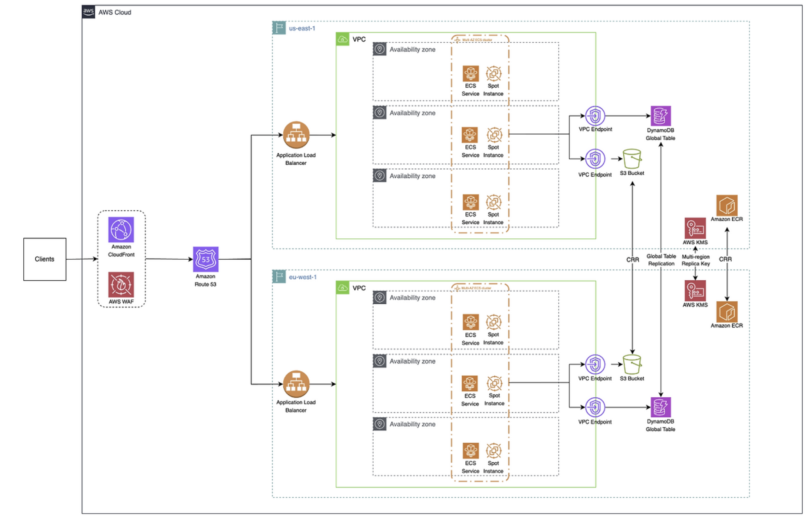

# UNiDAYS 아키텍처 분석

---

## 1. 개요

영국의 에듀테크 플랫폼 UNiDAYS가 AWS 위에서 멀티 리전 Active-Active 아키텍처를 3주 만에 구축한 사례를 보안 관점에서 분석합니다.

### 1.1 인프라 구성 요약

UNiDAYS는 영국에 본사를 둔 학생 전용 혜택 플랫폼으로, 전 세계 2,900만 명 이상의 인증된 학생 회원을 보유한 글로벌 서비스입니다. 나이키, 애플, 아디다스 등 수백 개의 글로벌 브랜드와 파트너십을 맺고 학생 독점 할인 혜택을 제공합니다.

이 플랫폼은 AWS 기반의 **멀티 리전 Active-Active 아키텍처**로 운영됩니다. 핵심 구성 요소는 다음과 같습니다.

| 구분 | 서비스 | 역할 |
|------|--------|------|
| **엣지 레이어** | Amazon CloudFront, AWS WAF | 글로벌 콘텐츠 전달 및 애플리케이션 보안 |
| **라우팅** | Amazon Route 53 | 지연 기반 멀티 리전 트래픽 분산 |
| **수신 레이어** | Application Load Balancer (ALB) | 리전별 트래픽 수신 및 보안 검증 |
| **컴퓨팅** | Amazon ECS + Spot Instance | 멀티 AZ 컨테이너 오케스트레이션 |
| **내부 통신** | VPC Endpoint (PrivateLink) | 인터넷 우회 없는 AWS 서비스 접근 |
| **데이터** | DynamoDB Global Tables | 멀티 리전 자동 양방향 복제 |
| **이미지 관리** | Amazon ECR + Cross-Region Replication | 리전별 컨테이너 이미지 로컬 제공 |
| **암호화** | AWS KMS Multi-Region Key | 리전 간 통합 암호화 키 관리 |
| **레거시 연동** | Amazon EventBridge | 기존 모놀리식 시스템과 비동기 연동 |
| **IaC** | Terraform + CloudFormation | 인프라 코드화 및 리전 확장 자동화 |

Active-Active 구성이므로 모든 활성화된 리전(현재 `us-east-1`, `eu-west-1`)이 동시에 실시간 트래픽을 처리하며 단일 리전 장애 시에도 서비스 중단 없이 운영이 가능합니다.

---

### 1.2 분석 범위 및 목적

**분석 배경**

UNiDAYS는 글로벌 파트너십 확장과 함께 두 가지 핵심 문제에 직면했습니다.

- **레이턴시 문제**: 서버와 지리적으로 먼 사용자들에게 약 200ms의 응답 지연이 발생했습니다. Google 연구에 따르면 페이지 로딩 시간이 1초에서 3초로 증가할 경우 이탈률이 32% 증가하므로 B2C 서비스에서 레이턴시는 단순 기술 지표가 아닌 비즈니스 수치와 직결됩니다.
- **단일 장애점(SPOF) 리스크**: 단일 리전 구조에서는 리전 장애가 곧 전체 서비스 다운을 의미했습니다. 글로벌 파트너 브랜드가 늘어날수록 이 리스크는 신뢰 문제로 이어집니다.

**분석 목적**

UNiDAYS의 멀티 리전 AWS 아키텍처를 다음 세 가지 관점에서 분석합니다.

1. 전체 아키텍처 구성도와 계층별 트래픽 흐름 파악
2. 각 구성 요소의 역할 및 설계 의도 이해
3. 보안 관점에서의 현황 평가, 취약점 식별, 개선 방향 도출

---

## 2. 아키텍처 분석



### 2.1 전체 구성도

**전체 트래픽 흐름 (정상 경로 예시: 유럽 사용자)**

1. 사용자가 `unidays.com` 접속 → DNS 조회
2. **Route 53** 이 `eu-west-1` ALB의 레이턴시가 가장 낮음을 확인 → 라우팅 결정
3. 요청이 가장 가까운 **CloudFront 엣지**(예: 런던)에 도달
4. **AWS WAF** 보안 검사 → 악성 패턴 감지 시 차단(403/429), 정상 요청 통과
5. **CloudFront 캐시 확인** → Cache Hit 시 엣지에서 즉시 응답 / Cache Miss 시 `eu-west-1` ALB로 전달 (Shared Secret 헤더 자동 삽입)
6. **ALB** 수신 → Shared Secret 헤더 검증, CloudFront Prefix List 확인 후 ECS로 전달
7. **ECS 컨테이너** 가 비즈니스 로직 처리 (인증, 할인 코드 조회 등)
8. 데이터 필요 시 **VPC Endpoint** 를 통해 DynamoDB 접근 (인터넷 미경유)
9. DynamoDB 쓰기 발생 시 **Global Table** 설정에 의해 `us-east-1`으로 자동 복제
10. 응답이 역순으로 ECS → ALB → CloudFront → 사용자에게 전달

---

### 2.2 구성 요소별 역할

#### Layer 1. 글로벌 엣지: CloudFront + AWS WAF

모든 사용자 요청이 가장 먼저 도달하는 지점입니다. CloudFront는 전 세계 400개 이상의 엣지 로케이션에서 사용자와 물리적으로 가장 가까운 지점에서 요청을 처리합니다.

**CloudFront의 주요 역할**

- **캐싱을 통한 레이턴시 감소**: 정적 콘텐츠(이미지, CSS, JS 등)를 엣지에 캐싱하여 오리진 서버 요청을 생략합니다.
- **Shared Secret 헤더 삽입**: 오리진(ALB)으로 요청을 전달할 때 사전 정의된 커스텀 헤더를 자동 삽입합니다. ALB는 이 헤더가 없는 요청을 즉시 거부하여 CloudFront 우회 직접 공격을 원천 차단합니다.
- **DDoS 완화**: 대규모 공격 트래픽이 수백 개의 엣지 로케이션으로 분산 흡수되어 오리진이 직접 노출되지 않습니다.

**AWS WAF 역할**

CloudFront에 직접 통합되어 오리진 도달 전 엣지에서 보안 검사를 수행합니다.

- SQL Injection 및 XSS 패턴 차단
- AWS Managed Rules 적용으로 최신 위협 자동 반영
- Rate Limiting으로 비정상적인 대량 요청 차단

<br>

#### Layer 2. 글로벌 라우팅: Amazon Route 53

WAF를 통과한 요청이 어느 리전으로 향할지 결정하는 지점입니다.

**Latency-Based Routing (지연 기반 라우팅)**

Route 53은 각 리전의 ALB와 주기적으로 응답 시간을 측정하고 새 요청 시 요청자의 IP 위치를 기반으로 현재 레이턴시가 가장 낮은 리전으로 자동 전달합니다.

```
미국 동부 사용자  →  us-east-1 ALB
유럽 사용자      →  eu-west-1 ALB
한국 사용자      →  ap-northeast-1 ALB (확장 시)
```

**자동 장애 복구**

각 ALB에 대한 Health Check를 주기적으로 수행하며 연속 실패 감지 시 해당 리전 라우팅을 자동 중단하고 정상 리전으로 전환합니다. 사람의 개입 없이 리전 페일오버가 이루어집니다.

<br>

#### Layer 3. 리전별 수신: Application Load Balancer

Active-Active 구성이므로 모든 활성 리전에 독립적인 ALB가 존재하며 두 ALB 모두 실시간으로 트래픽을 처리합니다.

**보안 검증**

- 보안 그룹에 **CloudFront Prefix List**를 적용하여 CloudFront IP 대역에서 온 트래픽만 수신합니다.
- ALB 리스너 규칙에서 **Shared Secret 헤더**를 검증합니다. 헤더 불일치 또는 부재 시 즉시 거부(403 반환)합니다.
- **HTTPS(TLS 1.2 이상)** 만 허용하며 ACM 인증서로 암호화합니다.

**트래픽 분산**

VPC 내부의 여러 AZ에 배포된 ECS 컨테이너들로 균등하게 분산하며 각 컨테이너의 Health Check를 수행하여 비정상 컨테이너로의 트래픽을 차단합니다.

<br>

#### Layer 4. 컴퓨팅 레이어: ECS + Spot Instance (Multi-AZ)

각 리전의 VPC 안에 3개의 Availability Zone에 걸쳐 ECS 서비스가 배포됩니다.

```
리전 VPC
├── AZ-a: ECS Service + Spot Instance
├── AZ-b: ECS Service + Spot Instance
└── AZ-c: ECS Service + Spot Instance
```

**ECS 선택 이유**

Kubernetes(EKS) 대신 ECS를 선택한 것은 운영 단순성 때문입니다. 복잡한 오케스트레이션을 AWS가 관리해주므로 작은 팀이 단기간에 멀티 리전을 구축하기에 적합합니다.

**Spot Instance 활용**

온디맨드 대비 최대 90% 저렴한 Spot Instance를 활용하여 비용을 절감합니다. ECS는 Spot 중단 시 자동으로 새 인스턴스를 시작하고 컨테이너를 재배치하여 불안정성을 서비스 수준에서 흡수합니다.

**Multi-AZ 배치의 의미**

하나의 데이터센터에 화재, 정전, 네트워크 장애가 발생해도 나머지 2개 AZ가 서비스를 이어받습니다.

<br>

#### Layer 5. 내부 통신: VPC Endpoint (AWS PrivateLink)

ECS 컨테이너가 DynamoDB나 S3에 접근할 때 퍼블릭 인터넷을 경유하지 않고 AWS 내부 사설 네트워크만을 통해 접근합니다.

**VPC Endpoint 미적용 시 문제**

1. 인터넷 경유로 인한 보안 위험 존재
2. 데이터 전송 거리 증가로 레이턴시 상승
3. 인터넷 데이터 전송 비용 발생

이 아키텍처에서는 각 리전에 두 개의 VPC Endpoint가 존재합니다.

- ECS → DynamoDB용 VPC Endpoint
- ECS → S3용 VPC Endpoint

<br>

#### Layer 6. 데이터 레이어: DynamoDB Global Tables

양 리전의 DynamoDB 테이블이 **자동 양방향 Cross-Region Replication(CRR)**으로 동기화됩니다.

```
us-east-1 DynamoDB  ◄──── 자동 양방향 CRR ────►  eu-west-1 DynamoDB
```

**Active-Active 복제**

양쪽 리전 모두 읽기와 쓰기가 가능합니다. 어느 리전에서 데이터를 변경해도 AWS가 자동으로 다른 리전에 복제합니다.

**Eventual Consistency**

복제는 통상 1초 이내에 완료됩니다. 동시 충돌 발생 시 **Last Writer Wins**(최신 타임스탬프 우선) 방식으로 처리됩니다.

**리전 장애 대응**

`us-east-1`이 다운되어도 `eu-west-1` DynamoDB에 이미 최신 데이터가 복제된 상태이므로, 데이터 손실 없이 서비스를 이어갈 수 있습니다.

<br>

#### Layer 7. 컨테이너 이미지 관리: Amazon ECR + Cross-Region Replication

**문제 배경**

멀티 리전 초기 테스트에서 `eu-west-1` ECS가 `us-east-1` ECR에서 이미지를 다운로드할 때 리전 간 네트워크를 경유하여 컨테이너 시작 지연이 심하게 발생했습니다. Auto Scaling 상황에서 이는 확장 속도 자체의 걸림돌이 됩니다.

**해결책**

ECR Private Image Replication을 활성화했습니다.

```
개발팀 → us-east-1 ECR (push)
              │
              │ ECR CRR 자동 복제
              ▼
         eu-west-1 ECR (pull - 로컬)
              │
              ▼
         eu-west-1 ECS (컨테이너 시작)
```

이미지가 각 리전에 이미 존재하므로 원격 다운로드 없이 컨테이너 시작 시간이 획기적으로 단축됩니다.

<br>

#### Layer 8. 암호화: AWS KMS Multi-Region Key

```
us-east-1 KMS (Primary Key) ──── 복제 ────► eu-west-1 KMS (Replica Key)
```

양쪽 리전이 동일한 키 ID와 키 소재를 공유합니다. DynamoDB Global Tables가 리전 간 데이터를 복제할 때 **재암호화 과정 없이** 원활하게 처리됩니다. Key Rotation, 접근 제어, 사용 감사 로그도 중앙에서 통합 관리됩니다.

<br>

#### Layer 9. 기존 시스템 연동: Amazon EventBridge

기존 모놀리식 시스템과 새 멀티 리전 서비스 사이의 연결 다리 역할을 합니다.

```
새 멀티 리전 서비스  ◄────  EventBridge  ────►  기존 모놀리식 시스템
```

이벤트 기반 **비동기 통신**으로 느슨한 결합을 실현합니다. 한쪽이 다운되어도 다른 쪽은 영향을 받지 않으며 두 시스템이 서로 독립적으로 발전할 수 있습니다.

<br>

#### Layer 10. IaC 배포 전략: Terraform + CloudFormation 3계층 구조

3주 안에 멀티 리전 구축이 가능했던 핵심 요인입니다. 모든 인프라를 코드로 정의하고 3개 계층으로 분리했습니다.

| 계층 | 내용 | 배포 방식 |
|------|------|-----------|
| **Platform** | 공통 기반 인프라, 네트워크, IAM | 1회만 배포 |
| **Global** | CloudFront, Route 53, WAF 등 전역 리소스 | 1회만 배포 |
| **Regional** | ALB, ECS, DynamoDB, ECR 등 리전별 리소스 | 리전마다 반복 적용 |

새 리전 추가 시 Regional 계층 코드만 새 리전에 재실행하면 됩니다.

CloudFormation의 스택 익스포트는 동일 리전 내에서만 참조 가능합니다. 팀은 다른 리전의 CloudFormation 익스포트 값을 읽어오는 **커스텀 CloudFormation 매크로**를 직접 개발하여 리전 간 리소스 참조를 자동화했습니다.

---

## 3. 보안 관점 분석

### 3.1 현재 보안 구성 현황

#### 엣지 레이어 보안 (CloudFront + AWS WAF)

AWS WAF가 CloudFront에 통합되어 트래픽이 오리진 서버에 도달하기 전에 애플리케이션 레이어 공격을 차단합니다.

- SQL Injection, XSS 패턴 탐지 및 차단
- AWS Managed Rules를 통한 최신 위협 자동 반영
- Rate Limiting을 통한 대량 요청 억제

또한 CloudFront의 글로벌 분산 구조 자체가 DDoS 완화 역할을 수행합니다. 대규모 공격 트래픽이 수백 개의 엣지 로케이션으로 자연스럽게 분산되어 오리진 서버가 직접 노출되지 않습니다.

<br>

#### 오리진 보호: Shared Secret + Prefix List 이중 검증

CloudFront를 우회한 ALB 직접 접근을 차단하기 위해 두 가지 통제를 함께 적용합니다.

**Shared Secret 헤더 검증**

CloudFront는 오리진으로 요청을 전달할 때 사전에 정의된 커스텀 HTTP 헤더를 자동으로 삽입합니다. ALB 리스너 규칙은 이 헤더의 존재와 값을 검증하며 조건을 충족하지 못한 요청은 즉시 거부합니다.

```
정상 경로:  사용자 → CloudFront → [Secret 헤더 삽입] → ALB → ECS 
우회 시도:  공격자 → ALB 직접 접근 → [Secret 헤더 없음] → 403 거부
```

**CloudFront Prefix List 적용**

ALB 보안 그룹에 CloudFront가 사용하는 IP 대역 목록(Prefix List)을 화이트리스트로 등록합니다. CloudFront IP 범위 외의 모든 트래픽은 네트워크 수준에서 추가로 차단됩니다. Shared Secret 헤더 검증과 함께 적용되어 두 단계의 오리진 보호를 구성합니다.

<br>

#### 전송 구간 암호화

전체 트래픽 경로에서 평문 전송이 발생하지 않도록 구성되어 있습니다.

- 사용자 ↔ CloudFront: HTTPS (TLS 1.2 이상 강제)
- CloudFront ↔ ALB: HTTPS (ACM 인증서)
- ECS ↔ DynamoDB / S3: VPC Endpoint를 통한 AWS 내부 사설 네트워크 경유, 인터넷 미경유

<br>

#### 데이터 암호화 및 키 관리

저장 데이터에 대한 암호화는 KMS Multi-Region Key로 처리됩니다. Primary Key가 Replica Key로 자동 복제되어 DynamoDB Global Tables가 리전 간 데이터를 동기화할 때 재암호화 없이 동일한 키를 사용할 수 있습니다. 키 로테이션, 접근 제어, 감사 로그는 중앙에서 통합 관리됩니다.

<br>

#### 네트워크 격리

ECS는 VPC 내부 Private Subnet에 배치되어 인터넷에 직접 노출되지 않습니다. AWS 관리형 서비스(DynamoDB, S3)에 대한 접근은 VPC Endpoint를 통해 이루어지므로 내부 서비스 간 트래픽이 인터넷을 경유하지 않습니다.

---

### 3.2 식별된 취약점

#### Shared Secret 정적 관리 리스크

Shared Secret 헤더는 CloudFront 배포 설정과 ALB 리스너 규칙 양쪽에 동일한 정적 값으로 존재합니다. 이 값이 유출되면 Prefix List를 우회할 수 있는 환경에서 ALB 직접 공격이 가능해집니다.

구체적인 위험 시나리오는 다음과 같습니다.

- Terraform 또는 CloudFormation 코드가 형상관리 시스템에 평문으로 커밋될 경우 저장소 접근자 전원에게 노출됩니다.
- Secret 로테이션 주기가 별도로 정의되어 있지 않으면 장기간 동일한 값이 유지됩니다.
- 내부자가 AWS 콘솔에서 CloudFront 설정을 조회하는 것만으로 Secret 값을 확인할 수 있습니다.

<br>

#### EventBridge 연동 경계의 보안 수준 불일치

UNiDAYS가 EventBridge를 통해 기존 모놀리식 시스템과 비동기로 연동한다고 명시하고 있습니다. 새로 구축된 멀티 리전 아키텍처는 다중 보안 통제가 적용되어 있지만 기존 모놀리식 시스템의 보안 수준은 상대적으로 낮을 가능성이 있습니다.

이벤트 스키마 검증이 소비자 측에서 이루어지지 않으면 비정상 이벤트가 레거시 시스템에 그대로 전달될 수 있습니다. 또한 EventBridge 이벤트 발행 IAM 권한이 과도하게 부여되어 있을 경우 권한 탈취 시 레거시 시스템에 악의적인 이벤트를 주입할 수 있습니다.

---

### 3.3 개선 권고사항

#### Shared Secret의 AWS Secrets Manager 통합 관리

정적으로 설정된 Shared Secret을 **AWS Secrets Manager** 에서 중앙 관리하도록 전환합니다.

- Secrets Manager의 자동 로테이션 기능을 활용하여 Secret 값을 주기적으로 갱신합니다. 로테이션 시 CloudFront 설정과 ALB 리스너 규칙이 동시에 업데이트되도록 Lambda 기반 로테이션 함수를 구성합니다.
- Terraform 또는 CloudFormation 코드에서는 Secret 값을 직접 참조하는 대신 Secrets Manager ARN을 참조하는 방식으로 평문 노출을 방지합니다.

```yaml
# CloudFormation에서 Secrets Manager 참조 예시
Value: '{{resolve:secretsmanager:cloudfront-alb-secret:SecretString:header-value}}'
```

- Secret 접근 이력은 CloudTrail을 통해 감사하며 비정상적인 조회 패턴에 대한 알람을 설정합니다.

<br>

#### EventBridge 연동 경계 보안 강화

기존 모놀리식 시스템과의 연동 경계에서 보안 수준을 일치시킵니다.

- EventBridge 이벤트 발행 IAM 역할에 **최소 권한 원칙** 을 적용하여 특정 Event Bus와 특정 이벤트 패턴에만 발행 권한을 부여합니다.
- EventBridge Schema Registry에 이벤트 스키마를 등록하고 소비자 측(레거시 시스템)에서 수신 이벤트의 스키마를 검증하여 비정상 이벤트를 명시적으로 거부하도록 구성합니다.
- EventBridge 이벤트 발행 및 수신에 대한 CloudTrail 로그를 활성화하고 비정상적인 이벤트 발행 패턴에 대한 모니터링을 적용합니다.

---

## 참고 자료

- [How UNiDAYS Achieved AWS Region Expansion in 3 Weeks - AWS Architecture Blog](https://aws.amazon.com/ko/blogs/architecture/how-unidays-achieved-aws-region-expansion-in-3-weeks/)
- [Amazon DynamoDB Global Tables](https://aws.amazon.com/ko/dynamodb/global-tables/)
- [Latency-based routing - Amazon Route 53](https://docs.aws.amazon.com/Route53/latest/DeveloperGuide/routing-policy-latency.html)
- [Private image replication in Amazon ECR](https://docs.aws.amazon.com/AmazonECR/latest/userguide/replication.html)
