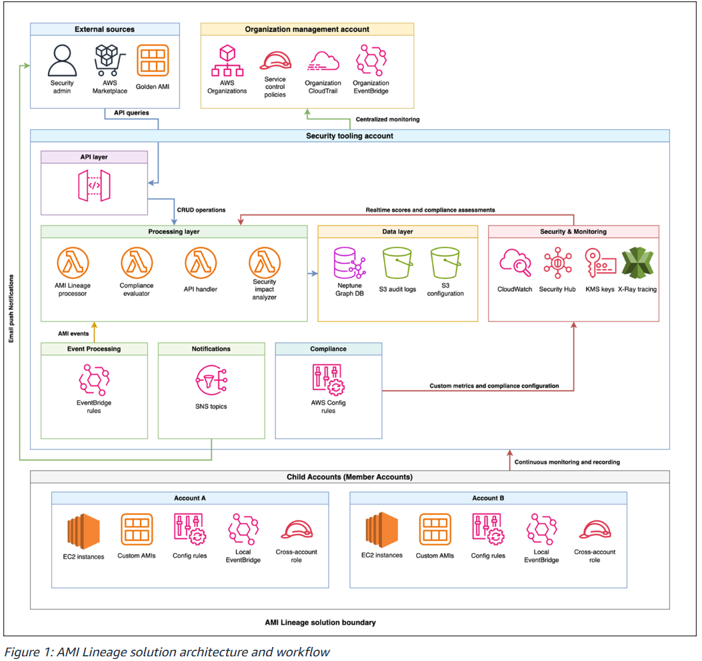

# AWS 인프라 분석 - AMI Lineage

---

## 1. 개요

### 인프라 구성 요약

AMI(Amazon Machine Image)는 EC2 인스턴스를 시작하는 데 필요한 모든 정보를 담은 템플릿입니다.

구성 요소는 아래와 같습니다.

- **루트 볼륨 스냅샷** - OS(Amazon Linux, Linux, Windows 등), 런타임, 보안 에이전트를 포함합니다.
- **블록 디바이스 매핑** - 인스턴스 실행 시 붙는 볼륨 구성을 정의합니다. (예: EBS)
- **런치 퍼미션** - AMI 사용 가능 계정 범위를 설정합니다. (퍼블릭/프라이빗/특정 계정)

조직에서는 AWS 기본 AMI에 보안 에이전트, 모니터링 도구, 사내 표준 설정 등을 추가해 골든 이미지 형태로 관리합니다. 해당 골든 이미지를 기반으로 파생 AMI가 계속 생성되기 때문에 전체 AMI Lineage 추적이 필요합니다.

### 분석 범위 및 목적

**범위**: AWS Organizations 전체 - Management Account, Security Tooling Account, 다수의 Member Account

**목적**

1. CVE 등 보안 취약점 발견 시 영향 범위를 신속하게 파악합니다.
2. 승인된 골든 이미지에서만 인스턴스가 실행되는지 정책 준수를 검증합니다.
3. AMI 생성, 복사, 삭제 이력을 감사 목적으로 보존합니다.

---

## 2. 아키텍처 분석



### 전체적인 이벤트 흐름

1. Member Account에서 `CreateImage` / `CopyImage` 등 AMI 이벤트가 발생합니다.
2. 로컬 EventBridge에서 캡처 후 Security Tooling Account로 전달합니다.
3. Lambda가 이벤트를 처리하여 Neptune 그래프 DB를 실시간으로 업데이트합니다.
4. 보안팀이 API Gateway를 통해 계보를 조회하고 영향 범위를 분석합니다.

해당 솔루션에서 Lambda를 트리거하는 경로는 두 가지입니다.

- **EventBridge → Lambda**
  - AMI 이벤트(`CreateImage`, `CopyImage` 등)가 발생했을 때 자동으로 트리거됩니다.
  - 사람의 개입 없이 Neptune DB를 실시간으로 업데이트하는 경로입니다.
- **API Gateway → Lambda**
  - 사람이 직접 조회할 때 사용됩니다.
  - 예: 특정 AMI 계보 조회, CVE 영향 범위 분석, 컴플라이언스 리포트 생성

### 구성 요소별 역할

| 구성 요소 | 역할 |
| --- | --- |
| Amazon Neptune | AMI 간 부모-자식 관계를 그래프로 저장합니다. 계보 추적의 핵심입니다. |
| AWS Lambda | AMI 이벤트 처리, 컴플라이언스 평가, Neptune DB 업데이트를 담당합니다. |
| Amazon API Gateway | 보안팀이 계보 혹은 보안 컨텍스트를 조회하는 REST 엔드포인트입니다. |
| Amazon EventBridge | Member Account AMI 이벤트를 중앙으로 라우팅합니다. |
| AWS Security Hub | 전체 계정의 보안 Finding을 중앙 집계합니다. (각 Member Account의 GuardDuty 탐지 결과, Config 규칙 위반, Inspector 취약점 스캔 결과 등) |
| Amazon GuardDuty | AMI 관련 위협을 탐지합니다. |
| AWS Config | 각 Member Account에서 AMI 태그 및 암호화 등 컴플라이언스를 지속 모니터링합니다. |
| AWS CloudTrail | AMI 관련 API 호출 감사 로그를 기록합니다. |
| SCP | `CreateImage`, `CopyImage` 등 비승인 AMI 작업을 조직 레벨에서 사전 차단합니다. |

---

## 3. 보안 관점 분석

### 해당 솔루션이 나오게 된 배경

AWS가 2024년 말에 AMI Lineage 기능을 발표하였으나 네이티브 기능만으로는 한계가 있었습니다.

- `CreateImage`, `CopyImage`, `CreateRestoreImageTask` API로 생성된 AMI만 소스 정보가 제공되었습니다.
- 그 외 API로 생성된 AMI는 소스 정보가 표시되지 않아 가시성 공백이 발생합니다.
- 단순 계보 추적만 제공될 뿐, CVE 영향 범위 분석이나 자동화된 컴플라이언스 평가 기능이 없었습니다.

#### 1. 가시성 문제

- 골든 이미지에서 파생된 AMI가 어느 리전, 계정에 얼마나 퍼져 있는지 전체 파악이 불가합니다.
- AMI에 설치된 보안 에이전트 버전, 패치 상태를 중앙에서 추적하는 수단이 부재하였습니다.

#### 2. CVE 대응 문제

- 특정 AMI에 취약점이 발견되었을 때 해당 AMI 기반 인스턴스가 몇 대인지 수동으로 추적해야 합니다.
- Auto Scaling Group, Launch Template까지 연결하여 파악하기가 어렵습니다.

#### 3. 컴플라이언스 문제

- AMI 암호화 여부, 승인된 소스 출처, 태그 정책 준수 여부를 계정별로 따로 관리합니다.
- AWS Marketplace AMI의 경우 신뢰할 수 있는 벤더인지 검증하는 중앙화된 수단이 없습니다.

#### 4. 감사 대응 문제

- AMI 복사·생성·삭제의 chain of custody를 증명할 통합 이력이 없습니다.

---

### 해당 솔루션에서의 대응 방법

#### 1. 가시성 문제 해결 방법

Amazon Neptune 그래프 DB로 AMI 계보를 중앙 저장합니다.

```
골든 이미지 (원본)
     파생 AMI-A (Account A, ap-northeast-2)
           └── 파생 AMI-A1 (Account B, us-east-1)
     파생 AMI-B (Account C, eu-west-1)
```

Neptune이 이 관계를 그래프로 저장하기 때문에 특정 골든 이미지에서 파생된 모든 AMI와 위치를 한 번의 쿼리로 조회할 수 있습니다.

또한 Neptune에 메타데이터를 포함하여 저장하면 아래와 같은 정보를 쉽게 파악할 수 있습니다.

- 소스 AMI 정보 및 유효성 검증 상태
- 생성 방법 및 타임스탬프
- 크로스 리전 / 크로스 계정 관계
- 컴플라이언스 상태 및 정책 위반 여부

#### 2. CVE 대응 문제 해결 방법

Security Impact Analyzer API로 대응할 수 있습니다.

```bash
curl -X POST ".../api/v1/security-impact" \
  -d '{
    "ami_id": "ami-1234567890abcdef0",
    "finding_type": "CVE",
    "finding_id": "CVE-2024-XXXX",
    "severity": "CRITICAL"
  }'
```

해당 API 한 번으로 반환되는 정보는 아래와 같습니다.

- 영향받는 AMI 계보 전체
- 현재 실행 중인 인스턴스 목록
- 영향받는 계정 및 리전
- 연관된 Auto Scaling Group 및 Launch Template 목록
- 컴플라이언스 영향 평가
- 우선순위별 remediation 단계

#### 3. 컴플라이언스 문제 해결 방법

**1) 각 Member Account에 AWS Config Rules를 배포합니다.**

감지 대상은 아래와 같습니다.

- 암호화 미적용 AMI
- 필수 태그 누락
- 퍼블릭 공개 AMI
- 미승인 소스 AMI

**2) SCP를 통해 Marketplace AMI 벤더를 검증합니다.**

Organization Management Account에서 신뢰할 수 있는 Marketplace 벤더 목록을 SCP로 정의하여 목록 외 벤더의 AMI 사용을 조직 레벨에서 사전 차단합니다.

**3) Compliance Assessment API를 사용합니다.**

계정별로 따로 보는 것이 아닌 조직 전체를 한 번에 평가합니다.

```bash
curl -X POST ".../api/v1/compliance-assessment" \
  -d '{
    "rules": [
      "required_tags",
      "approved_source_validation",
      "security_scan_status",
      "naming_convention",
      "lineage_verification"
    ],
    "scope": "ORGANIZATION"
  }'
```

#### 4. 감사 대응 문제 해결 방법

**1) CloudTrail Organization Trail**

모든 AMI 관련 API 호출을 조직 전체 단위로 기록하고 S3에 암호화하여 저장합니다.

**2) Neptune 감사 이력 API**

```bash
curl -X GET ".../api/v1/ami/ami-1234567890abcdef0/lineage?direction=both&depth=10"
```

반환되는 감사 이력은 아래와 같습니다.

- AMI 생성 및 수정 이벤트 전체
- 보안 스캔 결과 이력
- 승인 워크플로우 이력
- 컴플라이언스 상태 변경 이력

**3) KMS 암호화**

Neptune DB, S3 감사 로그, CloudTrail 로그 전체를 Customer Managed Key로 암호화하여 감사 로그의 무결성을 보장합니다.

---

### 보안 측면에서 추가되면 좋은 리소스

#### 1. AWS Systems Manager

현재 아키텍처에서는 AMI 계보를 AMI 단위로 추적하지만, AMI 안에 설치된 패키지/에이전트의 실제 상태는 추적하지 않습니다.

**현재 솔루션에서 추가되어야 하는 것은 'AMI-B 기반 EC2들의 현재 패치 상태, 보안 에이전트가 실제로 실행 중인지, OS 패키지 버전이 골든 이미지 기준과 동일한지'입니다.**

#### 2. Amazon Inspector v2

현재 아키텍처에서는 CVE가 발견되면 수동으로 Security Impact API를 호출하여 Neptune에 영향 범위를 조회합니다.

Inspector를 통합하면 Inspector가 EC2/ECR을 자동으로 스캔합니다. API를 호출하는 수동 과정이 생략됩니다.

CVE Finding 발견 즉시 Security Hub로 전송되고 EventBridge가 이를 감지하여 Lambda가 Neptune에 영향 범위를 자동으로 산정하고 SNS로 관리자에게 알립니다.

#### 3. AWS Config Aggregator

현재 솔루션에서는 각 Member Account에 Config Rules를 개별 배포합니다. AWS Config Aggregator를 추가하면 각 계정의 Config 결과를 Security Tooling Account에서 중앙 집계할 수 있어 Lambda(compliance evaluator)가 계정별로 따로 조회할 필요가 없어집니다.

---

## 출처

- [AWS Blogs - How to manage the lifecycle of Amazon Machine Images using AMI Lineage](https://aws.amazon.com/ko/blogs/security/how-to-manage-the-lifecycle-of-amazon-machine-images-using-ami-lineage-for-aws/)
- [GitHub - aws-samples/sample-ami-lineage-governance](https://github.com/aws-samples/sample-ami-lineage-governance)
