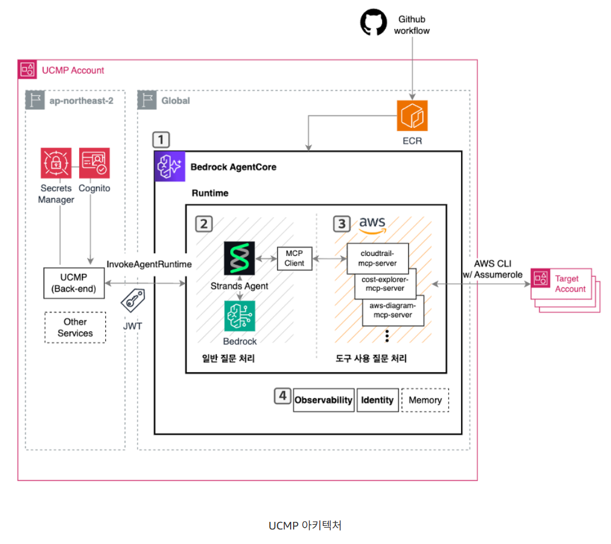

# LG유플러스 Bedrock AgentCore를 활용한 클라우드 Agent 구현 사례

---

## 개요

LG 유플러스에서는 UCMP (Uplus Cloud Management Platform) 을 구축하여 다양한 클라우드를 사용하는 환경에서도 일관된 사용자 경험으로 클라우드를 운영할 수 있도록 하였습니다. 자체 클라우드 관리 플랫폼을 만들어 멀티 클라우드 환경을 통합 관리하고 있습니다.

분산된 클라우드 정보를 한 곳에서 확인하고 빠른 의사결정과 운영 효율화를 위해 AI 활용 방안을 검토했습니다.

AWS BedrockAgentCore Runtime을 선택하여 Agent를 빠르게 배포한 과정에 대해 알아봅니다.

AI Agent를 도입하기 이전에도 다양한 클라우드 데이터를 확인하는 서비스가 있었지만 이는 모든 세부 사항을 담지 못했습니다.

여전히 해당 클라우드의 계정별 콘솔에 들어가 확인해야 했습니다.

이를 해결하기 위해 AI Agent를 도입하여 관리자가 필요한 정보를 Agent가 수집하고 분석해 의미있는 정보를 제공하도록 했습니다.

---

## 아키텍처 분석

### (1) AWS Bedrock AgentCore

Agent의 실행환경입니다. 세션별 격리, 자동 스케일링, 소비 기반 과금 등의 장점이 있습니다.

개발자는 인프라 관리 없이 Agent 로직에만 집중하면 됩니다.

Agent를 배포하는 방식으로 Lambda 와 EKS등이 있지만 왜 AgentCore Runtime을 선택했을까요?

AWS Lambda는 서버리스 환경이어서 관리 부담이 적지만 15분의 실행시간 제한이 있습니다.

복잡한 클라우드 분석 작업이나 여러 계정을 순회하여 데이터를 수집하고 분석하는 작업을 15분안에 하기 어려울 수 있습니다.

AWS EKS는 실행시간 제한이 없고 확장성이 유연하다는 장점이 있지만 클러스터 관리, Pod 스케일링 설정, 리소스 최적화와 같이 운영 부담이 큽니다. LLM 은 독립된 대화 세션이 필요한데 이러한 환경을 제공하려면 추가적인 아키텍처 설계가 필요합니다.

그렇기에 이 둘의 장점을 합쳐둔 AWS Bedrock AgentCore Runtime을 AI Agent 배포를 위해 사용합니다.

Lambda의 관리 편의성과 EKS의 확장 유연성을 결합하며 Agent 특화 기능을 제공합니다.

### (2) AWS MCP Server

Agent가 의미있는 데이터를 수집하고 분석하려면 외부 시스템과 통신해야 합니다.

MCP를 활용해 Agent가 외부 도구와 통신하는 방식을 표준화하여 Agent에 새로운 기능을 손쉽게 추가할 수 있습니다.

AWS 에서는 Cost Explorer, CloudTrail, Security Hub와 같은 주요 서비스를 위해 MCP Server를 제공합니다.

이외에 새로운 기능이 필요하면 MCP Server에 추가하기만 하면 됩니다.

이러한 MCP Server는 별도의 서버에서 운영되는 것이 아니라 앞에서 설명한 AgentCore Runtime에서 배포됩니다.

### (3) Strands-Agents SDK

Agent의 두뇌 역할을 하는 오픈소스 프레임워크입니다. AWS Bedrock을 비롯한 AWS 서비스와 네이티브하게 통합됩니다.

Agentic Loop을 구현하여 LLM이 상황을 인지하고 필요한 도구를 선택해 실행하며 다음 행동을 결정하도록 합니다.

### (4) CloudWatch + CloudWatch Generative AI Observability

Agent의 동작을 모니터링하고 디버깅하는 도구입니다. AgentCore는 기본 메트릭을 자동 생성하며 이를 CloudWatch에 저장합니다.

CloudWatch의 Generative AI Observability 대시보드는 Agent의 추론 과정 , 도구 호출, 실행 경로를 시각화하고 추적하여 사용자 <-> Agent 간의 전체 대화 흐름을 모니터링합니다.

---

## 동작 흐름

사용자 -> UCMP 를 통해 Agent에게 질문을 보냅니다. -> AgentCore Runtime이 세션을 형성하여 격리된 microVM에서 Agent를 실행합니다. -> Strands Agent가 질문을 분석하고 필요한 경우 MCP Server를 호출합니다. -> MCP Server가 AWS 서비스로부터 데이터를 수집합니다. -> Agent가 수집된 데이터를 기반으로 분석하고 사용자에게 제공합니다. -> 모든 과정은 CloudWatch에 기록됩니다.

---

## 보안관점 분석

### Secrets Manager

에이전트가 각각의 계정에 있는 클라우드 정보를 가져오기 위해 다양한 권한과 인증이 필요합니다.

MCP Server가 Target Account 에 접근할 때 API Key, 인증서, 민감한 설정값들을 secrets manager에 넣어둬 인증 정보 유출을 막습니다.

이러한 Secrets Manager을 이용할 때는 vpc 외부에 있기에 private link를 이용하여 안전하게 호출합니다. 또한 KMS와 같은 암호화 기능 서비스와 연동하여 데이터를 더욱 안전하게 보관합니다.

### Cognito

AWS 내의 인증 서비스가 아니라 AWS 위에 작동되는 애플리케이션의 인증 서비스인 Cognito는 위의 다이어그램을 보면 UCMP와 연결되어 있습니다. UCMP를 사용하는 사내 직원이 '누구인지' 확인하고 해당 사용자가 에이전트를 이용할 권한이 있는지 인가 검사를 합니다.

대략적인 흐름을 보면, 사용자가 로그인합니다. -> Cognito가 확인한 후 JWT를 발행합니다. -> 해당 토큰을 UCMP가 보고 InvokeAgentRuntime을 호출하여 에이전트를 실행합니다.

---

## 굳이 Claude, OpenAI 와 Agent를 연결하지 않고 Bedrock을 사용하는 걸까

**1) 먼저, 데이터가 모델 학습에 활용되지 않는다.**

보통 모델의 성능 향상을 위해 사용자가 입력한 데이터가 재학습에 활용되지만 Bedrock을 통해 입력하는 모든 데이터는 모델 제공사인 Anthropic, Meta가 모델을 학습시키는데에 활용할 수 없도록 AWS와 계약을 맺었습니다.

**2) AWS라는 울타리 안에서만 데이터가 이동한다.**

일반적인 API를 사용하면 데이터가 인터넷 망을 타고 외부 서버로 나가야하지만 Bedrock는 이미 사용하고 있는 VPC 내부에서 데이터가 이동하도록 설정할 수 있습니다. (+ Private Link 또한 지원합니다.)

**3) 모델 제공사도 데이터를 볼 수 없다.**

만약 사용자가 Bedrock에서 Claude를 사용한다고 했을 때 Anthropic이라는 회사로 내 데이터가 전송되지 않습니다.

AWS와 Anthropic의 파트너십을 통해 모델은 AWS가 관리하는 인프라 위에서 실행됩니다. Anthropic이 모델 가중치의 제어권을 유지하지만, 사용자의 데이터는 Anthropic 서버로 전송되지 않습니다.

즉 모델이 AWS 인프라 위에서 실행되기 때문에 모델 제공 회사는 입력되는 데이터를 받을 수 없는 것입니다.

**4) 규제 준수**

Bedrock은 AWS 내의 서비스이기 때문에 Cloudtrail과 연동하여 모든 호출 이력을 기록합니다.

---

## GitHub Workflow & ECR

깃헙, ECR은 배포를 자동화하기 위해 있습니다. CI/CD 파이프라인 역할을 하는 것입니다.

GitHub Workflow 는 개발자가 agent나 MCP Server 설정을 수정하여 Github에 올리면 자동으로 코드를 빌드하고 컨테이너 이미지로 만듭니다. 이때 만들어진 컨테이너 이미지가 ECR에 보관되어 Bedrock AgentCore 런타임에 전달됩니다.

즉 에이전트가 실행될 때 ECR에 보관되어 있는 최신 이미지를 가져와서 구동되는 것입니다. (AgentCore Runtime이 실행시킵니다.)

---

## Assume Role

MCP Server가 Target Account의 S3, EC2, CostExplorer 와 같은 데이터만 가져온다면 API 키나 인증서 없이도 Assume Role을 통해 얻은 임시 토큰으로 접근이 가능합니다. Assume Role은 IAM 사용자, 서비스, 다른 계정의 엔티티 등 다양한 주체 간에 임시 권한을 위임할 때 사용되는데 에이전트에게 타겟 계정의 관리자 권한을 부여하면 '최소권한 부여' 원칙이 위배되며 해킹당했을 때 타겟 계정이 전체 털리게 됩니다.

그렇기에 Assume Role을 이용해 '1시간 동안 비용 데이터를 읽을 수 만 있다.'라는 권한을 부여하여 제한할 수 있습니다.

예시) MCP Server가 AWS STS 에 Target Account 의 ReadOnlyRole을 요청합니다. 이후 임시 자격증명을 얻고 server는 Target Account로 들어가 클라우드 정보를 가져옵니다.

---

## 여기서 생성된 데이터들은 어디에 저장될까

에이전트와 사용자가 나눈 대화 이력은 보통 AWS DynamoDB에 저장됩니다. 서버를 직접 관리할 필요가 없어서 사용한 만큼 비용이 나갑니다. 복잡한 관계형 데이터에는 RDBMS를 사용합니다.

AWS Vector DB 솔루션을 이용해 AI가 이해할 수 있는 숫자 형태로 변환하여 저장합니다. 이후 AI가 다시 찾아보고 참고할 지식의 기반이 됩니다.

이러한 UCMP 내부 AI의 보안과 성능 분석을 위해 CloudWatch를 사용하며 실시간 로그를 저장합니다.

대화량이 매우 많은 경우에는 비용 절감을 위해 오래된 대화 이력을 파일 형태로 저장합니다. 이후 AI를 다시 학습시킬 데이터셋으로 쓰기도 합니다.

[참고자료]

https://talk3130.tistory.com/entry/LG%EC%9C%A0%ED%94%8C%EB%9F%AC%EC%8A%A4-Bedrock-AgentCore%EB%A5%BC-%ED%99%9C%EC%9A%A9%ED%95%9C-%ED%81%B4%EB%9D%BC%EC%9A%B0%EB%93%9C-Agent-%EA%B5%AC%ED%98%84-%EC%82%AC%EB%A1%80
