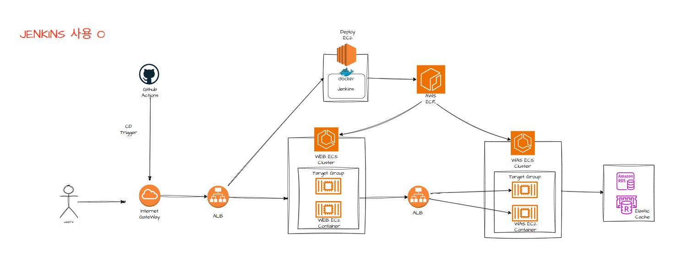
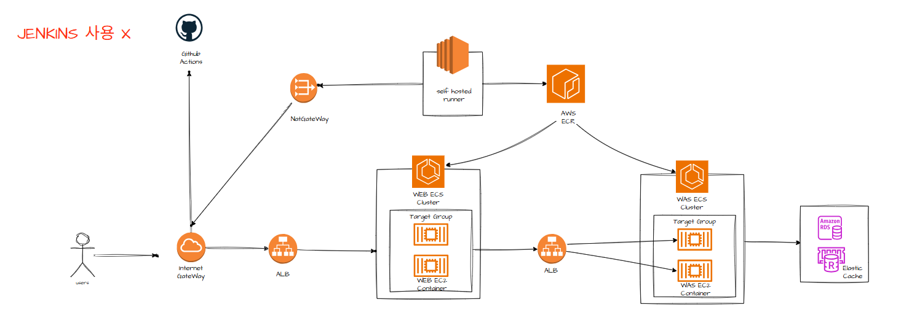
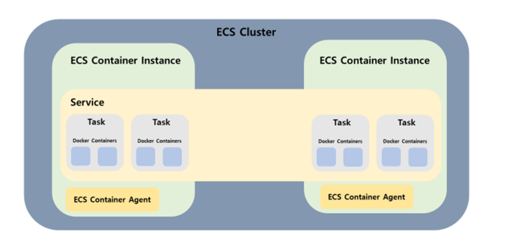

# 인프라 환경에서의 CI/CD 구축

---

## 개요

이 글은 CI/CD 파이프라인을 기존 인프라에 추가할 때 필요한 변경사항을 다룹니다. 개인 프로젝트를 통해 CI/CD를 직접 구축하며 학습한 내용을 정리했습니다.

---

## CI/CD 개념

**CI (Continuous Integration)**

지속적인 통합을 의미합니다. Main branch로 PR을 Open한 뒤 Github Actions workflow로 빌드 & 테스트를 수행합니다. 빌드 & 테스트 실패 시 실패 리포트를 발행합니다.

**CD (Continuous Deployment)**

지속적인 배포를 의미합니다. Main branch로 PR Merge 시 자동 배포가 진행됩니다.

---

## 아키텍처 비교

### Jenkins 사용 경우

PR Merge event로 Jenkins를 트리거 → Docker 이미지 생성 후 ECR에 Push → ECS에서 해당 이미지 이용

### Self-hosted Runner 사용 경우

- Main branch로 PR이 Merge되면 Github Actions Workflow가 실행
- VPC 내부 Private subnet의 Self-hosted Runner가 Github으로부터 작업명령을 PULL
- Runner가 Docker 이미지 빌드 후 ECR로 푸시
- ECS가 ECR에서 새 이미지를 Pull하여 이용

---

## Self-hosted Runner 사용의 장점

Jenkins EC2 앞의 ALB를 제거하여 외부에서 들어오는 통로가 없어 안전합니다. Private Subnet에 작은 EC2 (Runner)을 배치하여 runner EC2 → Nat GW → IGW → GitHub으로 가는 방향만(Outbound) 열어둡니다.

**이점:**

- 공격표면 제거가 가능합니다.
- Runner가 VPC 내부에 위치하여 WAS나 DB에 쉽게 접속합니다.
- Jenkins 설치, 플러그인, 업데이트 관리 부담이 없습니다.

---

## GitHub-hosted Runner 사용 경우

VPC 외부 Github의 데이터 센터에 위치합니다. VPC 내부로 들어올 때 GitHub Actions가 AWS STS에 권한을 요청하여 임시 토큰을 얻습니다. IAM USER Access Key 없이도 GitHub와 AWS의 신뢰관계를 통해 임시 권한을 받습니다 (Assume Role).

---

## ECR/ECS 사용 이유

Docker Hub는 외부 퍼블릭 레지스트리이기에 Private Subnet에서 접근 시 NAT Gateway 비용이 발생하지만, ECR은 VPC Endpoint를 통해 내부 통신이 가능해 비용과 지연을 줄일 수 있습니다.

ECR은 IAM으로 접근 제어를 통합 관리할 수 있습니다. ECS는 ALB와 네이티브 통합을 지원해 인스턴스 증감 시 Target Group 등록과 해제가 자동화됩니다.

---

## ECS 구성요소

**Cluster** - 가장 큰 단위의 논리적 그룹입니다.

**Task & Task Definition** - Task는 컨테이너를 실행하는 최소 단위입니다. 최소 한 개 이상의 컨테이너를 포함합니다. Task Definition은 컨테이너 이미지, CPU/Memory 리소스 할당, Volume 설정 등이 포함됩니다.

**Service** - Task의 수명주기를 지속적으로 관리하는 상위 그룹 단위입니다.

**Container Instance** - EC2 기반 배포 시 EC2 Instance를 의미합니다. 하나의 Cluster 안에 여러 Container Instance가 있을 수 있고, 하나의 Instance 안에 여러 Task가 있을 수 있습니다. Fargate 사용 시 Container Instance 개념은 사라집니다.

---

## 리소스 배치 및 흐름

**Public Subnet:**

- NAT GW - Private 자원들이 인터넷으로 나갈 수 있는 통로를 제공합니다.
- External ALB - 외부 사용자가 인터넷을 통해 내부로 접근하는 입구입니다.

**Private Subnet:**

- Self-hosted Runner - 외부에서 접근할 필요가 없으며 NAT GW를 통해 밖으로만 나갑니다.
- WEB ECS Cluster - 외부 사용자가 ALB를 통해 접근합니다.
- Internal ALB - WEB에서 WAS로 가는 내부 통신용 로드밸런서입니다.
- WAS ECS Cluster - 비즈니스 로직과 데이터 처리, 외부와 철저히 격리됩니다.
- RDS/Elastic Cache - 주요 데이터 보관, 외부와 격리됩니다.

**배포 흐름:**

Self hosted runner → Nat GW → GitHub 명령을 가져옴 → ECR에 푸시 → ECS에 업데이트

**외부 접속 흐름:**

외부 users → IGW → Public ALB → WEB ECS → WAS ECS → DB

---

## 추가 고려사항

### ECS 대신 EC2 사용 시

개발자가 코드를 작성하면 Git Actions가 배포를 관리합니다. EC2 내에 Self hosted runner가 해당 코드를 PULL하여 Docker image로 빌드합니다. 그런 다음 ECR에 저장하고 EC2가 해당 image를 pull하게 됩니다.

### 자동화 없이 수동 배포 시

개발자가 EC2에 접속해 (ssm or ssh) 서버 내에서 docker image를 빌드한 후 ECR에 저장합니다. EC2에서 이미지를 사용할 때는 직접 ECR에서 pull하여 사용합니다.

또는 로컬에서 빌드를 진행한 후 ECR에 이미지를 바로 보내고, 저장된 이미지를 EC2가 사용하는 방법도 있습니다.

---

## 로컬에서 빌드 시 보안상 이점

1. **빌드 도구 부재** - EC2에 빌드 도구가 없어서 해커가 침입했을 때 악성 코드를 다운로드하고 컴파일해서 실행하기 힘듭니다. Docker의 Multi-stage build 기법을 사용하면 실행 이미지에 빌드 도구를 제외하고 필요한 최소 바이너리만 남길 수 있습니다.

2. **바이너리 코드 실행** - 소스 코드가 서버에 올라가는 것이 아니라 바이너리 코드로 실행되므로 해커가 이미지를 봐도 로직을 그대로 읽기 어렵습니다.

3. **.git 폴더 부재** - 서버 내에서 빌드 시 .git 폴더가 존재해 과거 수정 이력, 이전 개발자의 커밋 기록, 실수로 올린 비밀번호 등이 남습니다. 이미지 형태로 바로 서버에 올리면 최종 결과물인 스냅샷이 실행되므로 정보 유출이 적습니다.

4. **Read-only 실행** - 이미지 형태로 배포하면 Read-only로 띄우기가 쉽습니다. 해커가 침입해도 이미지가 읽기 전용이어서 코드를 임의로 수정할 수 없습니다.

---

## CI/CD의 이점

CI/CD를 통해 기존에 새 코드를 commit에서 production으로 가져오는 데 필요했던 수동 개입을 자동화했습니다. 그 결과 다운타임을 최소화하고 코드 릴리스 주기가 단축되었으며, 코드의 업데이트와 변경 사항을 더욱 빠르게 통합할 수 있게 되었습니다.

