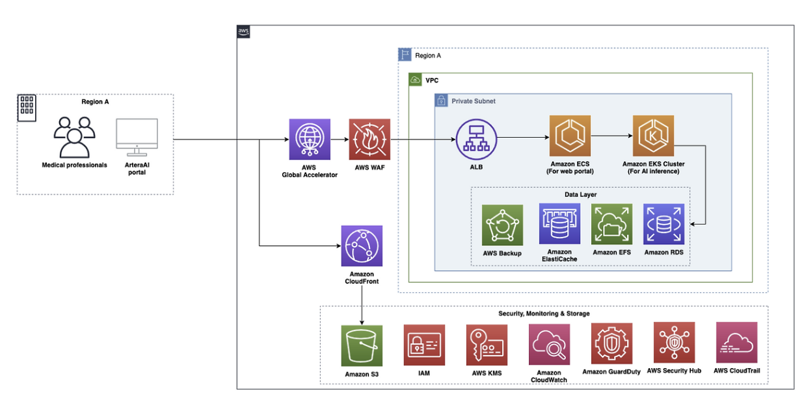

# Artera 아키텍처 분석

## 1. 개요

### Artera

의사가 암 환자에게 치료 방향을 제시하려면 그 암이 얼마나 빠르게 진행될지, 어떤 치료법이 이 환자에게 효과적일지를 알아야 합니다. 지금까지는 이 질문에 답하기 위해 환자의 생검 조직 샘플을 화학적으로 분석하는 유전체 검사를 사용해 왔습니다. 문제는 이 검사가 결과를 돌려주는 데 최대 6주가 걸린다는 것입니다. 암 진단을 받은 환자가 치료 방향조차 모른 채 6주를 기다려야 하는 상황입니다.

Artera는 이 문제를 AI로 해결한 회사입니다. 핵심 제품인 **ArteraAI Prostate Test**는 환자의 생검 이미지를 디지털로 분석하여 두 가지를 예측합니다. 하나는 국소 암이 전이될 위험도이고, 다른 하나는 환자가 특정 치료법으로 효과를 볼 가능성입니다. 기존 검사가 소수의 유전자 발현량만 측정하는 데 반해, Artera의 AI는 생검 이미지 전체에서 다양한 바이오마커를 동시에 탐지합니다.

기존 검사의 또 다른 문제는 조직 샘플을 소모한다는 점입니다. 한 번 화학 분석에 사용된 샘플은 돌아오지 않습니다. 추가 검사가 필요하거나 임상 시험에 등록하려 해도 샘플이 없으면 불가능합니다. ArteraAI는 디지털 이미지만으로 분석하므로 원본 조직은 그대로 보존됩니다.

### Artera가 AWS로 해결해야 했던 기술 과제

ArteraAI의 핵심 작동 방식은 생검 이미지를 AI 모델에 입력하여 분석하는 것입니다. 이 과정에는 세 가지 현실적인 기술 과제가 있었습니다.

**첫째, 대용량 이미지 처리 문제입니다.** 생검 슬라이드를 디지털로 스캔한 이미지 한 장의 크기가 최대 8GB에 달합니다. AI 모델은 이 거대한 이미지를 통째로 처리할 수 없습니다. 수만 개의 작은 패치로 잘게 분할한 뒤 각 패치를 병렬로 처리해야 합니다. 이를 위해서는 대량의 컴퓨팅 자원을 탄력적으로 확장하고 축소할 수 있는 인프라가 필요합니다.

**둘째, 글로벌 데이터 거주 요건입니다.** Artera는 미국뿐 아니라 여러 나라에서 서비스를 운영합니다. 의료 데이터는 각국의 규정에 따라 해당 국가 경계 내에서만 처리, 저장되어야 합니다. 미국에서는 HIPAA를 준수해야 하고, 글로벌로 서비스하면서도 각 국가의 데이터가 해당 리전 밖으로 나가지 않도록 설계해야 합니다.

**셋째, ML 엔지니어의 집중 환경입니다.** Artera의 핵심 경쟁력은 AI 알고리즘 자체입니다. ML 엔지니어들이 서버 관리나 인프라 운영에 시간을 쏟는 대신, 암 연구와 모델 개선에만 집중할 수 있어야 합니다.

---

## 2. 아키텍처 분석

### 2.1 전체 아키텍처 개요

아키텍처는 크게 세 개의 레이어로 나뉩니다.

**사용자 접근 레이어**는 의료 전문가가 ArteraAI 포털을 통해 시스템에 진입하는 구간입니다. 이 진입 요청은 AWS Global Accelerator와 AWS WAF를 거쳐 VPC 내부로 들어옵니다. Amazon CloudFront는 포털의 정적 자산을 전달하는 별도 경로로 Amazon S3와 연결되어 있습니다.

**컴퓨팅 레이어**는 VPC 내 Private Subnet에 위치합니다. ALB가 트래픽을 받아 Amazon ECS(웹 포털)와 Amazon EKS(AI/ML 추론) 두 클러스터로 분배합니다. 외부에서 이 Private Subnet에 직접 접근하는 경로는 없으며 반드시 ALB를 통해서만 트래픽이 들어옵니다.

**데이터 레이어**도 Private Subnet 안에 위치합니다. Amazon EFS, Amazon RDS, Amazon ElastiCache, AWS Backup이 이 레이어를 구성합니다. Amazon S3는 VPC 외부에 위치하며 원문에서 명시된 역할은 두 가지입니다. 하나는 CloudFront와 연결되어 포털의 정적 자산을 제공하는 것이고, 다른 하나는 생검 이미지 저장과 분석 결과 보관입니다. IAM, AWS KMS, Amazon CloudWatch, Amazon GuardDuty, AWS Security Hub, AWS CloudTrail은 아키텍처 전반의 보안과 모니터링을 담당하는 Security, Monitoring & Storage 영역으로 별도 구성되어 있습니다.

### 2.2 핵심 서비스 선택과 이유

| **서비스** | **선택 이유** |
|---|---|
| **AWS Global Accelerator** | 전 세계 의료기관에서 일관된 저지연 접속 보장 |
| **AWS WAF** | 의료 포털에 대한 악성 웹 요청을 애플리케이션 레이어에서 차단 |
| **Amazon CloudFront** | 포털 정적 자산의 글로벌 저지연 전달 |
| **Amazon ECS** | 웹 포털 컨테이너를 관리형 환경에서 운영, 인프라 부담 제거 |
| **Amazon EKS** | 대규모 AI/ML 추론 워크로드의 병렬 처리 및 자동 스케일링 |
| **Amazon EFS** | ECS와 EKS가 동일한 이미지 패치에 동시 접근하기 위한 공유 스토리지 |
| **Amazon RDS** | 환자 기록과 진단 결과를 안정적으로 저장하는 관리형 관계형 DB |
| **Amazon ElastiCache** | 자주 조회되는 데이터를 메모리에 캐싱하여 RDS 부하와 응답 지연 감소 |
| **Amazon S3** | 생검 이미지와 분석 결과의 내구성 높은 장기 보관 |
| **AWS Backup** | EFS, RDS, S3 등 데이터 스토리지 전반의 백업을 중앙에서 자동화 |

### 2.3 사용자 접근 및 네트워크 레이어

의료 전문가가 브라우저에서 ArteraAI 포털에 접속하면 요청은 가장 먼저 **AWS Global Accelerator**에 도달합니다.

Global Accelerator는 일반 인터넷 대신 AWS 자체 글로벌 백본 네트워크를 통해 트래픽을 라우팅하는 서비스입니다. 덕분에 일본의 병원이든 유럽의 연구소든, 전 세계 어디서 접속해도 일관된 낮은 지연 시간과 안정적인 연결성을 보장받습니다. 또한 Global Accelerator는 고정된 애니캐스트 IP 두 개를 전 세계에 공통으로 노출합니다. Artera는 여러 나라에 리전별 ALB를 두고 있어 ALB마다 IP 주소가 다릅니다. Global Accelerator 없이 각 ALB IP를 직접 노출하면, Artera 포털에 접속하는 병원이나 연구소의 IT팀이 방화벽 허용 목록에 리전마다 다른 IP를 전부 등록해야 하고 리전이 추가될 때마다 새 IP도 추가해야 합니다. Global Accelerator를 사용하면 외부에 노출되는 IP는 두 개뿐이고, 실제로 어느 리전 ALB로 트래픽을 보낼지는 Global Accelerator가 내부에서 처리합니다. 접속하는 기관 입장에서는 IP 두 개만 관리하면 되고, 리전이 늘어나도 외부에 노출되는 IP는 변하지 않습니다.

다음으로 요청은 **AWS WAF**를 통과합니다. WAF는 HTTP/HTTPS 트래픽의 내용을 검사하여 악성 요청을 차단하는 서비스입니다. SQL Injection, XSS 같은 OWASP Top 10 공격 패턴을 룰 기반으로 탐지하고, 의심스러운 요청은 오리진 서버에 도달하기 전에 즉시 차단합니다.

**Amazon CloudFront**는 별도 경로로 포털의 정적 자산(이미지, JavaScript, CSS 등)을 전달합니다. CloudFront는 전 세계에 분산된 엣지 로케이션에 콘텐츠를 캐싱하는 CDN 서비스입니다. 사용자가 포털을 열 때 로고 이미지나 UI 스크립트 같은 정적 파일은 사용자와 가장 가까운 엣지 로케이션에서 직접 전달되므로, 오리진 서버까지 요청이 가지 않아도 됩니다. 이는 페이지 로딩 속도를 높이고 오리진 서버의 부하를 줄입니다. CloudFront는 Amazon S3와 직접 연결되어 이 정적 자산들을 안전하게 제공합니다.

**Global Accelerator + WAF + CloudFront 조합이 담당하는 역할은 각각 다릅니다. Global Accelerator는 네트워크 경로 최적화, WAF는 악성 요청 필터링, CloudFront는 정적 콘텐츠의 빠른 전달입니다. 세 서비스가 각자의 역할로 입체적인 1차 방어선을 구성합니다.**

### 2.4 컴퓨팅 레이어 (VPC 내부 Private Subnet)

WAF와 Global Accelerator를 통과한 요청은 VPC 내부 Private Subnet에 위치한 ALB에 도달합니다.

ALB는 들어오는 트래픽을 뒤에 있는 여러 서버 또는 컨테이너로 분산시키는 로드 밸런서입니다. 단순히 트래픽을 나누는 것 외에도 각 타깃의 헬스 체크를 주기적으로 수행하여, 응답이 없는 컨테이너에는 트래픽을 보내지 않습니다.

일반적으로 Private Subnet의 리소스는 외부 인터넷에서 접근이 불가능합니다. 이 아키텍처에서는 **Global Accelerator가 그 다리 역할**을 합니다. Global Accelerator는 AWS 내부 서비스이기 때문에 Private Subnet에 위치한 ALB를 엔드포인트로 직접 등록할 수 있습니다. 외부에서 들어온 트래픽은 Global Accelerator의 애니캐스트 IP로 수신된 뒤, AWS 내부 백본 네트워크를 통해 Private Subnet의 ALB로 전달됩니다. 외부에서 ALB IP로 직접 접근하는 경로는 존재하지 않습니다.

ALB를 Public Subnet에 두면 ALB의 IP 주소가 외부에 노출되어, 공격자가 Global Accelerator와 WAF를 우회하고 ALB에 직접 요청을 보내는 것이 가능해집니다. Private Subnet에 두고 Global Accelerator를 유일한 진입점으로 강제함으로써, 모든 트래픽이 반드시 WAF를 통과하도록 구조적으로 보장하는 것입니다.

ALB는 요청의 목적지에 따라 트래픽을 **Amazon ECS**와 **Amazon EKS** 두 곳으로 분배합니다.

**Amazon ECS**는 ArteraAI 포털의 웹 UI를 담당합니다. ECS는 AWS가 완전히 관리하는 컨테이너 오케스트레이션 서비스입니다. 의료 전문가가 브라우저에서 보는 포털 화면, 생검 이미지를 업로드하는 인터페이스, 진단 결과를 확인하는 대시보드가 모두 ECS 위에서 동작하는 컨테이너가 제공하는 것입니다. ECS를 선택한 이유는 운영 단순성입니다. 컨테이너를 어떤 서버에서 실행할지, 장애가 발생했을 때 어떻게 재시작할지를 AWS가 처리해 주므로, 팀이 웹 애플리케이션 개발 자체에만 집중할 수 있습니다.

**Amazon EKS**는 AI/ML 추론 워크로드를 처리하는 핵심 엔진입니다. EKS는 Kubernetes 클러스터를 AWS가 관리해주는 서비스입니다. Kubernetes는 수십, 수백 개의 컨테이너를 오케스트레이션하고 워크로드에 따라 자동으로 스케일링하는 데 특화되어 있습니다. Artera의 AI 분석 파이프라인은 수많은 단계로 구성된 복잡한 워크플로우입니다. 각 단계마다 다른 역할을 하는 AI 모델들이 관여하며, 하나의 생검 슬라이드당 수만 개의 이미지 패치가 병렬로 처리됩니다. EKS는 이 대규모 병렬 처리를 자동으로 관리하고, 분석 요청이 많아지면 필요한 만큼 컨테이너를 늘리고 줄이는 자동 스케일링을 수행합니다. ML 엔지니어들은 Kubernetes 인프라를 직접 관리하는 대신 AI 알고리즘 개선에 집중할 수 있습니다.

### 2.5 데이터 레이어 (VPC 내부 Private Subnet)

**Amazon EFS**는 ECS와 EKS가 동시에 접근하는 공유 파일 시스템입니다. EFS는 여러 컴퓨팅 인스턴스나 컨테이너가 동시에 같은 파일 시스템을 마운트하여 읽고 쓸 수 있는 NFS(Network File System) 기반의 완전 관리형 스토리지입니다.

AI 분석 파이프라인에서 전처리 단계는 EKS 컨테이너가 8GB짜리 원본 이미지를 수만 개의 패치로 잘라내는 작업입니다. 잘린 패치들은 다음 단계의 AI 모델이 즉시 접근할 수 있어야 합니다. EFS가 공유 스토리지로서 중간 역할을 하기 때문에, 전처리 컨테이너가 패치를 EFS에 쓰는 즉시 추론 컨테이너가 그 패치를 EFS에서 읽어갈 수 있습니다. 또한 EFS는 같은 AWS 리전 내에서 마운트되므로, 애플리케이션이 처리하는 데이터가 항상 동일 리전 내에 머물러 있습니다. 이것이 데이터 거주 요건을 충족하는 핵심 메커니즘 중 하나입니다.

**Amazon RDS**는 환자 기록, 진단 결과, 포털 운영에 필요한 애플리케이션 데이터를 저장하는 관리형 관계형 데이터베이스입니다. 자동 백업, 소프트웨어 패치, 장애 복구를 AWS가 처리해주는 완전 관리형 서비스로, 고가용성을 갖춘 데이터베이스입니다. 의료 데이터처럼 정형화된 구조의 중요한 기록을 안정적으로 보관하기 위해 관계형 DB를 선택한 것입니다.

**Amazon ElastiCache**는 자주 조회되는 데이터를 메모리에 저장하는 인메모리 캐시 서비스입니다. 예를 들어 포털에서 반복적으로 조회되는 진단 결과나 세션 정보 같은 데이터를 RDS 대신 ElastiCache에서 먼저 조회하면, 데이터베이스 쿼리 없이 즉시 응답을 돌려줄 수 있습니다. 이는 포털의 응답 속도를 높이는 동시에 RDS에 가해지는 읽기 부하를 줄여 데이터베이스의 안정성을 높이는 효과가 있습니다.

**Amazon S3**는 VPC 외부에 위치하며 두 가지 역할이 명시되어 있습니다. 첫째는 CloudFront와 연결되어 포털의 정적 자산을 제공하는 역할이고, 둘째는 생검 이미지 저장과 분석 결과 보관입니다.

**AWS Backup**은 EFS, RDS, S3 등 아키텍처 전반에 걸친 데이터 스토리지의 백업을 중앙에서 통합 관리하는 서비스입니다. 서비스별로 백업 정책을 따로 설정하는 대신, AWS Backup 하나에서 모든 스토리지의 백업 스케줄, 보관 기간, 저장 위치를 코드로 정의하고 자동화합니다.

### 2.6 AI/ML 워크플로우 (4단계 파이프라인)

아키텍처의 서비스들이 실제로 어떻게 연결되어 동작하는지, 생검 이미지가 시스템에 들어와 진단 결과로 나오기까지의 과정을 단계별로 따라가 봅니다.

**1단계 — 데이터 수집:** 생검 이미지는 포털을 통해 업로드되어 Amazon S3에 저장됩니다.

**2단계 — 전처리 파이프라인:** EKS 클러스터는 이미지 분석을 위한 준비 작업을 수행하는 컨테이너화된 전처리 애플리케이션을 오케스트레이션합니다.

**3단계 — ML 모델 학습 및 실행:** AI 모델은 Amazon EKS에서 학습 및 배포되며, Amazon EFS에서 전처리된 이미지에 접근하여 Artera의 독자적인 ML 알고리즘을 실행합니다. 메타데이터와 결과는 Amazon RDS에 저장됩니다. Artera의 ML 팀은 EKS를 사용하여 모든 암 샘플에 걸쳐 환자의 위험도와 치료 효과를 평가할 수 있는 대규모 범종양 기반 모델을 학습합니다.

**4단계 — 결과 저장 및 전달:** 분석 결과는 Amazon S3에 저장되며, 안전한 웹 포털을 통해 의료 서비스 제공자에게 제공됩니다.

---

## 3. 보안 관점 분석

### 3.1 신원 및 접근 관리

IAM은 최소 권한 원칙으로 설계되어야 합니다. 웹 포털을 운영하는 ECS 컨테이너는 RDS와 ElastiCache에만, AI 추론을 담당하는 EKS 컨테이너는 EFS와 RDS에만 접근 권한이 부여되는 식입니다. 이렇게 하면 하나의 컨테이너가 침해되더라도 공격자가 접근할 수 있는 범위가 해당 역할의 권한으로 제한됩니다.

VPC 측면에서는 ALB, ECS, EKS, EFS, RDS, ElastiCache가 모두 Private Subnet에 위치하여 외부에서 직접 접근이 불가능합니다. 보안 그룹은 서비스 간의 통신 규칙을 허용 목록 방식으로 제어하여, ECS 컨테이너는 RDS, ElastiCache에만, EKS 컨테이너는 EFS, RDS에만 통신할 수 있도록 경로를 제한합니다.

### 3.2 데이터 암호화

AWS KMS는 암호화 키를 중앙에서 통합 관리할 수 있습니다. 각 서비스가 암호화를 개별적으로 처리하면 키 관리가 분산되어 어느 키가 어떤 데이터를 보호하는지 파악하기 어렵고, 키 교체나 접근 감사도 복잡해집니다. KMS를 중심에 두면 S3, RDS, EFS, ElastiCache의 암호화 키를 한 곳에서 관리하고, 누가 언제 어떤 키를 사용했는지 CloudTrail을 통해 모두 추적할 수 있습니다.

저장 시 암호화는 S3의 생검 이미지와 분석 결과, RDS의 환자 기록과 진단 결과, EFS의 이미지 패치, ElastiCache의 캐시 데이터 모두에 KMS 키가 적용되어야 합니다.

전송 시 암호화는 포털과 브라우저 사이의 TLS(HTTPS)뿐 아니라 VPC 내부 서비스 간 통신에도 적용되어야 합니다.

S3에는 재생성이 불가능한 생검 이미지와 진단 결과가 담겨 있습니다. Versioning을 활성화하면 객체가 실수로 덮어쓰이거나 삭제되더라도 이전 버전으로 복구할 수 있습니다. 여기에 MFA Delete를 추가하면 객체의 영구 삭제 시 MFA 인증을 요구하게 되어 내부 실수든 외부 공격이든 환자 데이터가 복구 불가능한 상태로 삭제되는 상황을 구조적으로 막을 수 있습니다.

### 3.3 위협 탐지 및 모니터링

CloudWatch는 인프라 성능과 이상 징후를 실시간으로 감지하는 운영 모니터링을 수행하고, CloudTrail은 모든 API 호출 이력을 남기고, GuardDuty는 그 로그들을 머신러닝으로 분석하여 악의적 행동 패턴을 찾아내는 위협을 탐지하고, Security Hub는 이 모든 결과를 통합하여 전체 보안 상태를 한 화면에서 보여줍니다.

특히 CloudTrail은 ArteraAI가 FDA 승인 SaMD라는 점에서 단순한 로그 이상의 의미를 갖습니다. FDA의 SaMD 규정은 의료기기로서의 감사 추적성을 요구하기 때문에, 인프라에서 발생한 모든 변경 이력이 기록되어야 합니다.

더 생각해 볼 수 있는 것은 GuardDuty가 위협을 탐지하여 Security Hub로 결과를 올리더라도, 그 이후 대응은 담당자가 수동으로 확인하고 처리해야 한다는 점입니다. GuardDuty 탐지 결과를 트리거로 자동 대응 파이프라인을 연결하는 것을 고려해볼 수 있습니다. 예를 들어 특정 자격증명에서 비정상 API 호출이 감지되면 즉시 해당 자격증명을 비활성화하거나, 의심스러운 EKS Pod를 자동으로 격리하는 방식입니다.

### 3.4 네트워크 보안

외부 경계는 Global Accelerator와 WAF가 보안을 담당합니다. Global Accelerator는 트래픽을 AWS 내부 백본으로 조기에 유입시켜 퍼블릭 인터넷 구간을 최소화하고 DDoS를 완화합니다. WAF는 그 뒤에서 OWASP Top 10 공격 패턴과 비정상적인 대량 요청을 차단합니다. 앞서 언급했듯이 ALB를 Private Subnet에 배치하고 Global Accelerator를 유일한 진입점으로 강제한 것은, 모든 트래픽이 반드시 이 외부 경계를 통과하도록 구조적으로 보장하기 위한 설계입니다.

내부 경계는 VPC와 보안 그룹이 담당합니다. ECS와 EKS는 역할이 다른 별개의 클러스터로 Private Subnet 내에 분리 배치되고, 보안 그룹이 각 서비스가 실제로 필요한 대상에만 통신할 수 있도록 경로를 제한합니다.

---

**참고 자료**

- [AWS Architecture Blog — How Artera enhances prostate cancer diagnostics using AWS](https://aws.amazon.com/ko/blogs/architecture/how-artera-enhances-prostate-cancer-diagnostics-using-aws/)
