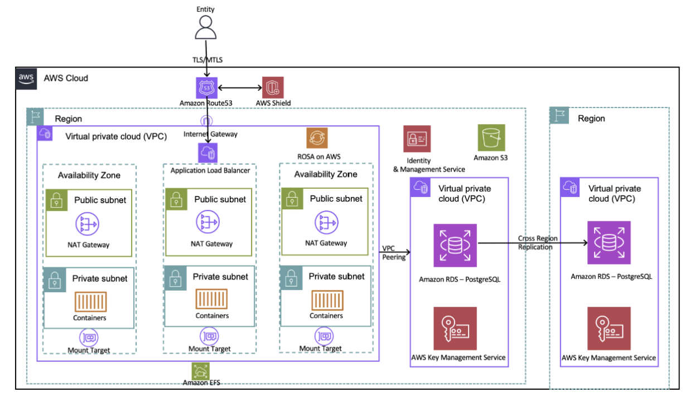

# Banfico 아키텍처 분석

## 1. 개요

금융 서비스를 개발하다 보면 우리 서비스가 규제 환경 속에서 얼마나 안전하게 작동하는지가 중요합니다.

처음에는 기능 개발이 우선입니다. 하지만 서비스가 커지고 규제 요건이 강화될수록 한 가지 문제가 드러납니다.

보안과 가용성, 규제 컴플라이언스를 동시에 충족하면서도 빠르게 확장할 수 있는 구조가 필요하다는 것입니다. 이번 글에서는 영국의 핀테크 기업 Banfico가 EU의 PSD2 규정을 준수하는 Open Banking Directory를 구축한 과정을 작성합니다.

> **PSD2 규정:** PSD2(Payment Services Directive 2)는 EU(유럽연합)가 2018년에 시행한 결제 서비스 지침입니다. 쉽게 말해 은행이 독점하던 금융 데이터를 고객 동의 하에 제3자에게도 열어라는 규제입니다. 예를 들어 이를 통해 여러 계좌의 잔액을 하나의 예산 관리 앱에서 추적할 수 있습니다.

### Banfico

Banfico는 영국 런던에 본사를 둔 핀테크 기업으로 Open Banking 규제 컴플라이언스 솔루션을 제공하는 회사입니다.

- 185개 이상의 금융기관 및 핀테크 기업에 서비스 제공
- EU PSD2, eIDAS 규정 기반 인증서 관리 및 TPP 인증 솔루션
- ISO27001 보안 인증 취득

> **eIDAS (electronic IDentification, Authentication and trust Services):** EU가 만든 **전자 신원확인 및 신뢰 서비스에 관한 규정**입니다. eIDAS 인증서는 이 규정을 기반으로 발급되는 **디지털 신분증**이라고 보면 됩니다.

플랫폼의 핵심 가치는 신뢰입니다. 은행과 제3자 결제 서비스 제공자(TPP, Third-Party Provider)가 서로를 실시간으로 신원 확인하고 안전하게 데이터를 주고받을 수 있도록 중간에서 그 신뢰의 기반을 제공합니다.

예를 들면 **토스** 앱에서 카카오뱅크 잔액을 조회할 때 토스가 바로 **TPP**입니다. 카카오뱅크(은행)의 데이터를 제3자인 토스가 API로 가져오는 것입니다.

PSD2 규정에 따르면 모든 거래 참여자는 실시간으로 신원이 확인되어야 하고 서비스는 계획적, 비계획적 장애를 사전에 통보해야 하며 99.95% 이상의 가용성을 보장해야 합니다. 따라서 고가용성과 보안은 단순한 기술 요건이 아니라 법적 의무입니다.

### 설계 요구사항

Banfico가 아키텍처를 구성할 때 우선한 원칙은 네 가지였습니다.

- **확장성:** 더 많은 금융기관과 TPP가 연결될수록 서비스 중단 없이 스케일 아웃이 가능해야 합니다.
- **운영 부담 최소화:** Banfico의 핵심 역량은 금융 규제와 Open Banking입니다. 인프라 관리는 최대한 AWS에 위임하고 제품 개발에 집중하고 싶었습니다.
- **신뢰성:** PSD2 규정이 요구하는 99.95% 가용성을 충족하기 위해 단일 장애점이 없어야 합니다.
- **보안과 컴플라이언스:** 민감한 금융 데이터와 디지털 인증서를 항상 안전하게 보호해야 하며 ISO27001 인증 요건도 충족해야 합니다.

이러한 요구 사항을 충족하기 위해 Banfico는 AWS 및 Red Hat과 협력하여 Red Hat OpenShift Service on AWS(ROSA)를 사용하기로 결정했습니다. ROSA는 Red Hat이 운영하고 AWS와 공동으로 지원하는 서비스로 확장 가능하고 안전하며 안정적인 제품 구축 환경을 제공하는 완전 관리형 Red Hat OpenShift 플랫폼을 제공합니다. 또한 Banfico는 다른 AWS 관리형 서비스도 활용하여 인프라 관리 작업을 최소화하고 고객에게 비즈니스 가치를 제공하는 데 집중했습니다.

### 핵심 AWS 서비스 선택과 이유

| **서비스** | **선택 이유** |
|---|---|
| **Red Hat OpenShift Service on AWS (ROSA)** | 완전 관리형 컨테이너 플랫폼, 3 AZ 고가용성, 운영 부담 제거 |
| **Elastic Load Balancer (ELB)** | 컨테이너 간 트래픽 분산, 헬스 체크, ROSA 라우터 연동 |
| **Amazon EFS** | 다중 컨테이너 공유 파일 스토리지, 자동 스케일링 |
| **Amazon S3** | eIDAS 디지털 인증서 고내구성 오브젝트 스토리지 |
| **Amazon RDS (PostgreSQL)** | 관리형 관계형 DB, Multi-AZ, 보조 리전 DR 복제 |
| **AWS KMS** | RDS 볼륨 암호화, 키 중앙 관리, CloudTrail 감사 연동 |
| **AWS IAM** | 최소 권한 원칙 기반 접근 제어 |
| **AWS Shield** | DDoS 동적 탐지 및 자동 인라인 완화 |
| **Amazon Route 53** | 글로벌 DNS 라우팅, 커스텀 라우팅 정책으로 지역 규정 준수 |

---

## 2. 아키텍처 분석



### Layer 1. 글로벌 진입: Route 53 + AWS Shield

모든 외부 트래픽이 가장 먼저 통과하는 레이어입니다.

Amazon Route 53은 전 세계에 분산된 DNS 서버를 통해 사용자를 가장 적합한 엔드포인트로 안내합니다. 여기서 핵심은 커스텀 라우팅 정책입니다. 단순히 빠른 곳으로 보내는 것이 아니라 특정 국가의 트래픽을 특정 리전에서만 처리하도록 강제할 수 있습니다. PSD2는 데이터 처리 위치에 대한 규정도 포함하기 때문에 지리적 규정 준수(Geo-compliance)는 선택이 아닌 필수입니다.

AWS Shield는 DDoS 공격을 실시간으로 탐지하고 자동으로 완화합니다. 금융 서비스 플랫폼은 DDoS 공격의 주요 타겟입니다. Open Banking API가 다운되면 은행과 TPP 사이의 실시간 인증이 불가능해지고 이는 곧 PSD2 위반으로 이어집니다. Shield는 이 위험을 상시 방어합니다.

### Layer 2. 트래픽 분산: Elastic Load Balancer

Shield를 통과한 요청은 Elastic Load Balancer가 받아 ROSA 클러스터 내부로 분산합니다.

ELB는 두 가지 역할을 동시에 수행합니다. 첫 번째는 트래픽 분산으로 여러 컨테이너에 트래픽을 균등하게 나눠 특정 컨테이너가 과부하 상태가 되지 않도록 합니다. 두 번째는 헬스 체크로 주기적으로 각 컨테이너의 상태를 확인하고 비정상 컨테이너로는 트래픽을 보내지 않습니다. 컨테이너 하나가 다운되어도 사용자는 그 사실을 모릅니다. ELB가 자동으로 정상 컨테이너에만 트래픽을 전달하기 때문입니다.

### Layer 3. 컴퓨팅 레이어: ROSA Cluster (3 AZ)

트래픽이 실제로 처리되는 곳입니다.

```
리전 VPC
  AZ-a: ROSA Worker Node (컨테이너)
  AZ-b: ROSA Worker Node (컨테이너)
  AZ-c: ROSA Worker Node (컨테이너)
```

ROSA(Red Hat OpenShift Service on AWS)는 Red Hat과 AWS가 공동 운영하는 완전 관리형 Kubernetes 플랫폼입니다. Banfico는 이 위에서 다섯 가지 핵심 서비스를 컨테이너로 실행합니다.

- **Core API Platform:** TPP에게 Open Banking API를 제공하는 핵심 서비스
- **Payment Authorization Service:** 결제 승인 처리
- **TPP Authentication & Authorization:** TPP가 각국 중앙은행으로부터 실제 인가를 받았는지 실시간 확인 + eIDAS 인증서 유효성 검증
- **Certificate Management Service:** eIDAS 인증서 발급, 관리, 저장
- **Central Bank Data Collector:** 각국 중앙은행에서 규제 기관 정보 수집 (API 또는 HTML 스크래핑)

3개 AZ에 걸쳐 배포된 덕분에 하나의 AZ에 장애가 발생해도 나머지 2개 AZ에서 서비스를 이어받습니다. 이것이 리전 내 고가용성의 기반입니다.

### Layer 4. 내부 통신: VPC와 VPC Peering

ROSA 클러스터 내부의 컨테이너들은 VPC 안에서 격리되어 실행됩니다.

인터넷에서 직접 컨테이너에 접근하는 경로는 존재하지 않습니다. 모든 외부 접근은 ELB를 통해서만 이루어집니다. 서비스 간 통신도 VPC 내부에서만 이루어집니다. 이 구조는 외부 공격자가 특정 컨테이너를 직접 접근하거나 서비스 간 통신을 가로채는 것을 구조적으로 막습니다.

여기서 한 가지 고려해야 할 점이 있습니다. ROSA 클러스터, RDS, EFS가 모두 같은 VPC 안에 있다면 내부 통신은 자연스럽게 이루어집니다. 하지만 보안 격리 수준을 높이기 위해 ROSA VPC와 데이터 레이어 VPC를 분리하는 구성을 택한다면 이야기가 달라집니다.

두 VPC는 기본적으로 서로 통신할 수 없습니다. 이때 VPC Peering이 연결해줍니다.

```
ROSA Cluster VPC (컴퓨팅 레이어) <-- VPC Peering --> Data VPC (RDS, EFS)
```

VPC Peering은 AWS 내부 사설 네트워크를 통해 두 VPC를 연결합니다. 인터넷 게이트웨이나 NAT를 경유하지 않기 때문에 트래픽이 퍼블릭 인터넷에 노출되지 않습니다.

중요한 것은 VPC Peering 자체가 연결을 열어주는 것이 아니라는 점입니다. Peering 설정 후에도 Security Group과 Route Table에서 허용한 트래픽만 통과합니다. ROSA의 특정 컨테이너만 RDS 포트로 접근 가능하도록 Security Group을 설정하면 컴퓨팅과 데이터 레이어 사이의 접근을 최소 권한 수준으로 제어할 수 있습니다.

### Layer 5. 공유 스토리지: Amazon EFS

Central Bank Data Collector가 각국 중앙은행에서 데이터를 수집할 때 문제가 생깁니다.

여러 컨테이너가 동시에 실행되면서 수집한 데이터를 어디에 써야 할까요? 컨테이너는 상태가 없습니다(Stateless). 컨테이너가 재시작되면 로컬에 쓴 데이터는 사라집니다. 그렇다고 모든 컨테이너가 DB에 직접 쓰면 스키마 변환 전 원시 데이터를 다루기가 복잡해집니다.

Amazon EFS는 이 문제를 해결합니다. 여러 컨테이너가 동시에 마운트해서 읽고 쓸 수 있는 공유 파일 시스템입니다. 자동으로 스케일링되기 때문에 수집 데이터가 아무리 늘어나도 용량 걱정이 없습니다. 컨테이너가 재시작되어도 EFS에 쓴 데이터는 그대로 남아 있습니다.

### Layer 6. 인증서 스토리지: Amazon S3

Banfico가 발급하는 eIDAS 디지털 인증서는 Amazon S3에 저장됩니다.

S3를 선택한 이유는 내구성입니다. S3는 99.999999999%의 내구성을 제공합니다. 인증서는 한 번 발급되면 유효기간 동안 안전하게 보관되어야 합니다. 분실이나 손상은 허용되지 않습니다.

여기에 서버 사이드 암호화와 버킷 정책을 통한 세밀한 접근 제어가 더해집니다. ROSA 클러스터 내에도 Certificate Management Service 컨테이너만 인증서 버킷에 접근할 수 있도록 제한됩니다.

### Layer 7. 데이터베이스: Amazon RDS (PostgreSQL) + AWS KMS

애플리케이션 데이터는 Amazon RDS PostgreSQL에 저장됩니다.

```
Primary Region (RDS Multi-AZ)
  └─ 실시간 복제 → Secondary Region (RDS) [재해 복구용]
```

RDS는 Multi-AZ로 구성되어 Primary DB 장애 시 자동 Failover가 이루어집니다. 여기에 더해 보조 리전으로 DB를 복제해 리전 전체 장애에도 데이터를 보호합니다.

AWS KMS는 RDS 볼륨 전체를 암호화합니다. 누군가 물리적으로 스토리지에 접근하더라도 암호화 키 없이는 데이터를 읽을 수 없습니다. 키 사용 이력은 CloudTrail과 연동되어 누가 언제 어떤 데이터를 복호화했는지 감사 추적이 가능합니다. ISO27001 인증 유지에 있어 이 감사 로그는 필수적입니다.

### Layer 8. 접근 제어: AWS IAM

아키텍처 전반에 걸쳐 IAM이 접근 제어를 담당합니다.

최소 권한 원칙은 간단한 개념이지만 구현이 쉽지 않습니다. 각 서비스가 필요한 최소한의 권한만 가져야 합니다. 예를 들어 이런 방식입니다.

- **Central Bank Data Collector:** EFS 쓰기 권한만 보유, RDS 직접 접근 불가
- **Certificate Management Service:** 특정 S3 버킷 읽기/쓰기만 보유
- **Core API Platform:** RDS 읽기/쓰기만 보유, S3 인증서 삭제 불가

이 구조에서는 특정 컨테이너가 공격자에게 탈취되더라도 그 컨테이너가 접근할 수 있는 범위 밖의 데이터는 건드릴 수 없습니다. 피해 범위가 구조적으로 제한됩니다.

### 전체 트래픽 흐름 분석

지금까지 설명한 모든 레이어가 실제로 어떻게 연결되어 동작하는지 사용자의 요청이 시스템을 통과하는 전체 과정을 따라가 봅니다.

**정상 흐름 (TPP의 API 요청)**

1. TPP(핀테크 앱)이 Open Banking API로 고객 계좌 조회 요청 전송
2. DNS 조회 → Amazon Route 53 → 지역 라우팅 정책 확인 → 해당 리전 ELB로 라우팅 결정
3. AWS Shield → 트래픽 패턴 실시간 분석 → DDoS 패턴 없음 → 통과
4. Elastic Load Balancer 수신 → ROSA 클러스터 내 정상 컨테이너로 트래픽 전달
5. TPP Authentication & Authorization Service (컨테이너) → TPP의 eIDAS 인증서 유효성 검증 → 해당 TPP가 중앙은행에 의해 인가된 기관인지 실시간 확인 → 인증 실패 시 403 반환 및 요청 종료 / 인증 성공 시 Core API Platform으로 라우팅
6. Core API Platform (컨테이너) → 비즈니스 로직 처리 → RDS PostgreSQL에서 계좌 정보 조회 → AWS KMS가 복호화 키 제공 → 데이터 복호화
7. 응답이 역순으로 Core API → ELB → TPP에게 전달

**중앙은행 데이터 수집 흐름 (비동기)**

1. Central Bank Data Collector (컨테이너) 주기적으로 실행
2. 각국 중앙은행 API 호출 또는 HTML 스크래핑으로 규제 기관 정보 수집
3. 수집된 원시 데이터 → Amazon EFS에 임시 저장 (다중 컨테이너 공유)
4. 데이터 가공 후 → RDS PostgreSQL에 정형화된 데이터로 저장
5. TPP Authentication Service가 조회 시 최신 인가 기관 목록 활용

---

## 3. 보안 관점 분석

### 3.1 이 아키텍처에 더 추가하면 좋을 보안 요소

**AWS WAF**

현재 아키텍처는 DDoS 방어(Shield)와 로드 밸런싱(ELB)은 갖추고 있지만 애플리케이션 레이어(Layer 7) 공격에 대한 명시적 방어가 없습니다. ELB 앞에 AWS WAF를 추가하면 SQL Injection, XSS, 비정상 요청 패턴을 엣지에서 사전 차단할 수 있습니다.

**Amazon API Gateway + Throttling**

Open Banking API 진입점에 API Gateway를 추가하면 TPP별 호출 속도 제한(Rate Limiting), API 키 관리, 상세 액세스 로깅이 가능해집니다. 특정 TPP의 비정상적 과도한 요청도 자동 차단됩니다.

**Amazon GuardDuty + AWS CloudTrail**

모든 AWS API 호출을 CloudTrail로 기록하고 GuardDuty로 이상 행동을 자동 탐지하면 보안 감사 추적과 실시간 위협 탐지가 가능해집니다. ISO27001 인증 유지 측면에서도 감사 로그 자동화는 핵심 요소입니다.

**AWS Secrets Manager**

RDS 접속 자격증명, API 키 등의 시크릿을 코드에서 분리하고 자동 로테이션을 적용하면 자격증명 탈취 위험이 크게 줄어듭니다.

**Amazon Macie**

S3에 저장된 디지털 인증서와 민감 데이터를 지속적으로 스캔해 버킷 권한 오설정이나 민감 정보 노출을 자동 탐지합니다. 인증서 저장소가 중요한 이 아키텍처에서 추가 보안 요소가 됩니다.

---

**참고 자료**

- [AWS Architecture Blog — How Banfico built an Open Banking and PSD2 compliance solution on AWS](https://aws.amazon.com/ko/blogs/architecture/how-banfico-built-an-open-banking-and-payment-services-directive-psd2-compliance-solution-on-aws/)
