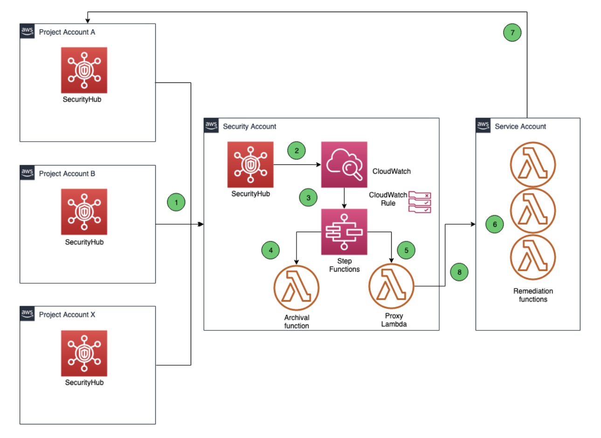

# ERGO의 이벤트 기반 보안 자동 대응 아키텍처 분석

---

## 1. 개요

ERGO는 독일과 유럽의 주요 보험 그룹 중 하나입니다. 산하의 **ERGO Technology & Services S.A.(ET&S)** 는 디지털 전환과 복잡한 IT 시스템 구축을 담당하며 AWS 기반의 멀티 계정 클라우드 환경을 운영하고 있습니다.

클라우드 전환 초기 ERGO는 **CIS AWS Foundations Benchmark Standard** 를 보안 컴플라이언스의 핵심 지표로 채택했습니다. 초기 측정 결과 보안 태세에 상당한 개선 여지가 있었고 다음과 같은 과제가 있었습니다.

- 다수의 AWS 계정에서 발생하는 보안 이벤트를 **스케일에 맞게** 관리해야 함
- 보안 이벤트 대응과 교정을 **중앙에서 실시간에 가깝게** 처리해야 함
- 각 프로젝트 계정에 직접 접근하지 않고 책임 분리를 유지해야 함

이 아키텍처는 위 세 가지 요구 사항을 모두 만족하는 **완전한 서버리스 이벤트 기반 보안 자동 대응 시스템** 입니다. 최종적으로 CIS 컴플라이언스를 약 **95%** 수준으로 끌어올렸으며 클라우드 보안팀의 지속적인 플랫폼 유지 부담을 크게 줄였습니다.

---

## 2. 아키텍처 분석

### 2.1 핵심 계정 구조

ERGO는 AWS Organizations를 사용해 멀티 계정 환경을 중앙 관리합니다. 보안 아키텍처는 **세 가지 계정 유형** 으로 역할을 명확히 분리합니다.

| 계정 유형 | 역할 | 주요 서비스 |
|---|---|---|
| **Security Account** | 보안 이벤트 집계 및 워크플로 오케스트레이션 | Security Hub (Admin), CloudWatch, Step Functions, Proxy Lambda |
| **Service Account** | 실제 교정 액션 실행 | Remediation Lambda, IAM Cross-Account Role |
| **Project Account** | 워크로드가 실행되는 멤버 계정 | Security Hub (Member), GuardDuty |

이 구조는 **역할 분리의 핵심 원칙** 을 실현합니다. Security Account는 감지와 오케스트레이션만 담당하고 실제 리소스에 대한 액션은 반드시 Service Account를 통해서만 수행됩니다. Project Account에는 어떤 자동화 코드도 직접 배포되지 않습니다.

---

### 2.2 데이터 흐름 단계별 분석

아키텍처의 전체 데이터 흐름은 8단계로 구성됩니다.

#### 1단계. 보안 이벤트 수집

각 Project Account에서 실행 중인 AWS Security Hub가 보안 탐지 결과(Finding)를 생성합니다. Amazon GuardDuty가 VPC Flow Logs, CloudTrail, DNS 쿼리 로그 등을 분석해 이상 행동을 탐지하면 이 결과가 Security Hub로 전송됩니다.

AWS Organizations와 Security Hub의 통합을 통해 Security Account가 Security Hub 관리자 계정으로 지정됩니다. 모든 Project Account는 자동으로 멤버 계정으로 등록되어 자신의 Finding을 Security Account의 Security Hub로 전송합니다.

#### 2단계. 이벤트 집계 및 CloudWatch 전달

Security Account의 Security Hub는 모든 멤버 계정의 Finding을 집계합니다. Security Hub는 Amazon CloudWatch와 통합되어 모든 보안 이벤트를 CloudWatch Events로 전송합니다.

#### 3단계. 1차 필터링 - CloudWatch Events Rules

CloudWatch Events Rules를 통한 **1차 필터링** 이 수행됩니다. 이벤트 패턴 매칭을 통해 ERGO가 집중하고자 하는 이벤트 유형을 추려냅니다. 이 규칙에 매칭된 이벤트는 Step Functions 상태 머신의 트리거가 됩니다.

#### 4단계. 2차 필터링 및 오케스트레이션 - AWS Step Functions

> **AWS Step Functions란?**  
> 여러 AWS 서비스를 순서대로 연결해 하나의 워크플로로 만들어주는 서버리스 오케스트레이션 서비스. 각 단계를 시각적으로 정의하고 조건 분기, 재시도, 에러 처리를 워크플로 수준에서 통합 관리할 수 있습니다. Lambda를 단독으로 쓰면 각 함수마다 에러 처리 코드를 넣어야 하지만 Step Functions를 쓰면 그 로직을 워크플로 정의에서 한 번에 처리할 수 있습니다.

AWS Step Functions는 이 아키텍처의 **두뇌** 역할을 합니다. CloudWatch Rules보다 더 세밀한 2차 필터링을 수행하며 이벤트 유형에 따라 두 가지 처리 경로로 분기합니다.

- **경로 A (Suppress):** Project Account에 직접 접근할 필요 없이 억제가 가능한 이벤트 → Archival Lambda 호출
- **경로 B (Remediate):** Project Account에서 교정 액션이 필요한 이벤트 → Proxy Lambda 호출

Step Functions를 선택한 결정적 이유는 **에러 처리의 중앙화** 입니다. 실제 운영 중 Archival Lambda 함수가 Security Hub API Rate Throttling으로 인해 간헐적으로 실패하는 문제가 발생했습니다. ERGO는 다음 대안들을 검토했습니다.

- AWS SDK 자동 재시도 → Rate Limit 상황에서 충분하지 않음
- Lambda 예약 동시성 제한 → Archival 함수 스로틀링
- 이벤트 배치 처리 → 단일 API 호출로 여러 파라미터 처리

최종적으로 Step Functions의 **"retry on error" 메커니즘** 을 활용하는 방식을 선택했습니다. 이를 통해 각 Lambda 함수에 개별적으로 에러 처리 로직을 구현하지 않고도 워크플로 수준에서 일관된 에러 처리가 가능해졌습니다.

#### 5단계. 교정 요청 전달 - Proxy Lambda

Project Account에서 교정이 필요한 이벤트의 경우 Step Functions는 Security Account 내의 **Proxy Lambda** 를 호출합니다. Proxy Lambda는 다음 정보를 인자로 받습니다.

- 실행할 Remediation 함수 이름 및 버전
- 대상 Project Account ID

Proxy Lambda의 역할은 Security Account와 Service Account 사이의 **크로스 계정 브릿지** 입니다. Security Account의 Step Functions는 다른 계정의 Lambda를 직접 호출할 수 없으므로 동일 Security Account 내 Proxy Lambda가 이 역할을 대신합니다.

#### 6단계. 크로스 계정 교정 실행 - Remediation Lambda

Proxy Lambda는 Service Account의 **Remediation Lambda** 를 호출합니다. Remediation Lambda는 IAM의 **AssumeRole** 을 사용해 각 Project Account에서 교정 액션을 수행할 수 있는 권한을 위임받습니다.

이때 사용되는 IAM 역할은 조직 레벨 역할로 모든 Project Account에 배포되어 있으며 교정 수행에 필요한 최소한의 권한만을 갖습니다. IAM 퍼미션, VPC 리소스 조작 등 다양한 교정 액션이 이 함수를 통해 실행됩니다.

#### 7단계. 교정 액션 수행

이벤트 유형에 따라 해당 Project Account에서 구체적인 교정 액션이 실행됩니다. CIS Benchmark 기준에 따른 대표적인 교정 액션의 예는 다음과 같습니다.

- 과도하게 열린 보안 그룹 규칙 제거
- MFA가 비활성화된 IAM 루트 계정 알림
- 암호화되지 않은 S3 버킷에 서버 사이드 암호화 적용
- CloudTrail 로깅 재활성화

#### 8단계. 실행 결과 반환

Remediation Lambda는 교정 결과를 Proxy Lambda로 반환하고 이는 다시 Step Functions 상태 머신으로 전달되어 워크플로를 완료합니다. 교정에 실패한 케이스는 예외 상황으로 분류되어 수동 처리됩니다.

---

### 2.3 주요 설계 결정 포인트

#### 서버리스 완전 관리형 아키텍처

이 아키텍처는 EC2, ECS 등 관리형 서버를 전혀 사용하지 않습니다. Lambda, Step Functions, CloudWatch 모두 완전 관리형 서버리스 서비스입니다. 이는 보안팀이 인프라 유지보수가 아닌 보안 정책 개선에 집중할 수 있게 합니다.

#### 계층적 이중 필터링 구조

CloudWatch Events Rules(1차)와 Step Functions 워크플로(2차)로 이어지는 이중 필터링 구조는 이벤트 처리의 정밀도를 높입니다. 1차에서는 대분류, 2차에서는 교정 액션과의 매핑이라는 역할 분담이 명확합니다.

#### Proxy Lambda 패턴을 통한 크로스 계정 통합

Step Functions에서 다른 계정의 Lambda를 직접 호출하는 대신 동일 계정의 Proxy Lambda를 경유하는 패턴은 크로스 계정 권한 관리의 복잡성을 줄입니다. Service Account의 Remediation Lambda에 대한 접근 권한을 Proxy Lambda에만 부여하면 됩니다.

#### 조직 레벨 IAM 역할을 통한 확장성

모든 Project Account에 표준화된 조직 레벨 IAM 역할을 배포함으로써 새로운 프로젝트 계정이 AWS Organizations에 추가될 때마다 자동으로 교정 기능이 적용됩니다. 개별 계정별 커스텀 설정이 필요하지 않습니다.

---

## 3. 추가하면 좋을 보안 요소

### 3.1 Amazon SNS를 통한 교정 실패 알림

원문에서도 "실패한 교정은 예외적으로 수동 처리한다"고 명시하고 있기 때문에 Step Functions의 실패 분기에 **Amazon SNS** 를 연결해 교정 실패 시 보안팀에게 즉시 통보할 수 있습니다.

### 3.2 SQS Dead Letter Queue를 통한 이벤트 유실 방지

Lambda 실행이 반복 실패할 경우 해당 보안 이벤트 자체가 사라집니다. **Amazon SQS DLQ** 를 Lambda 함수에 설정하면 처리에 실패한 이벤트를 보존해 원인 분석과 재처리가 가능합니다.

---

## 참고자료

- [How ERGO Implemented an Event-driven Security Remediation Architecture on AWS](https://aws.amazon.com/ko/blogs/architecture/how-ergo-implemented-an-event-driven-security-remediation-architecture-on-aws/)
