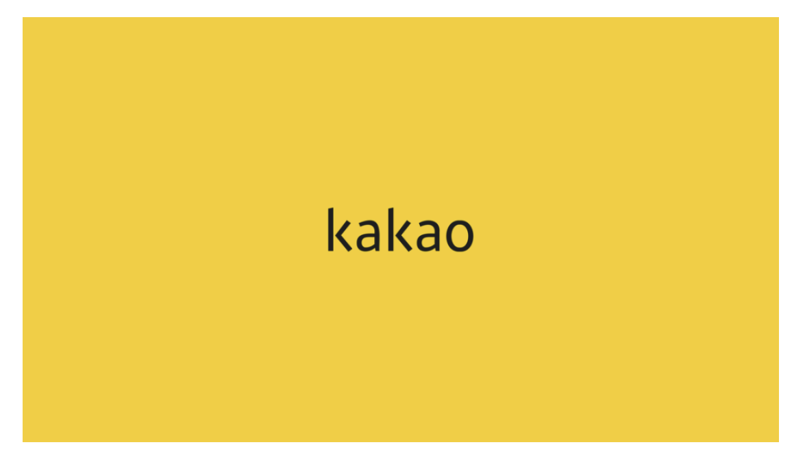
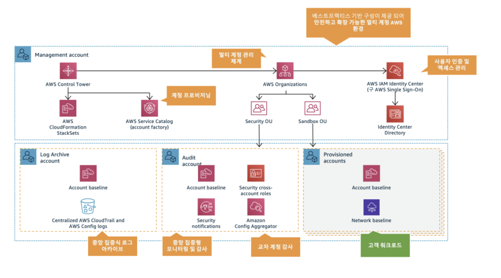
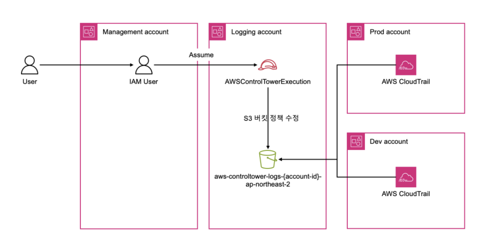
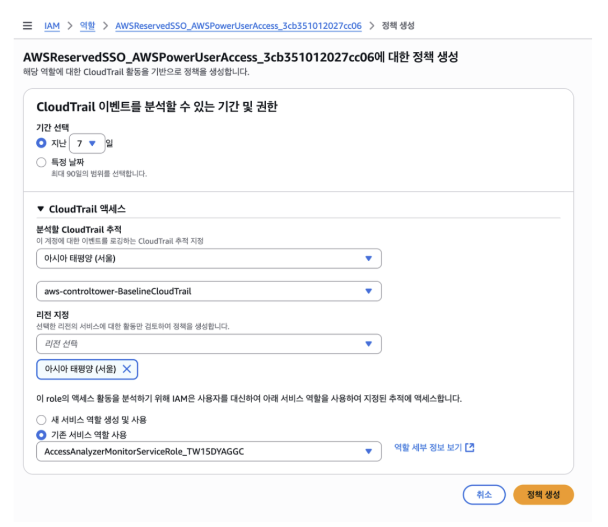
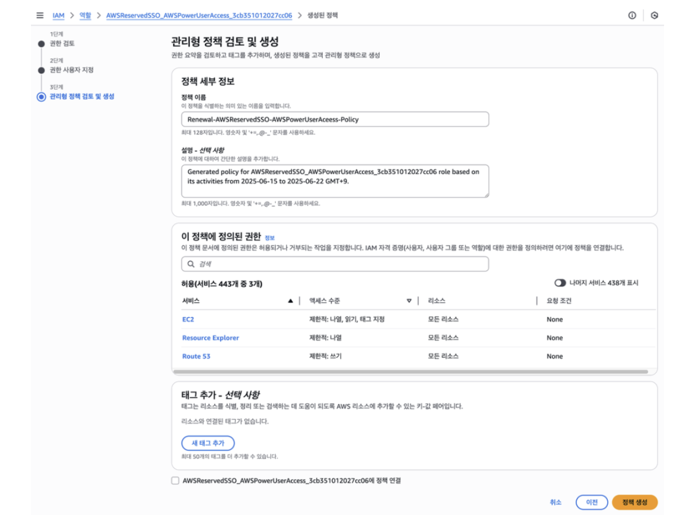
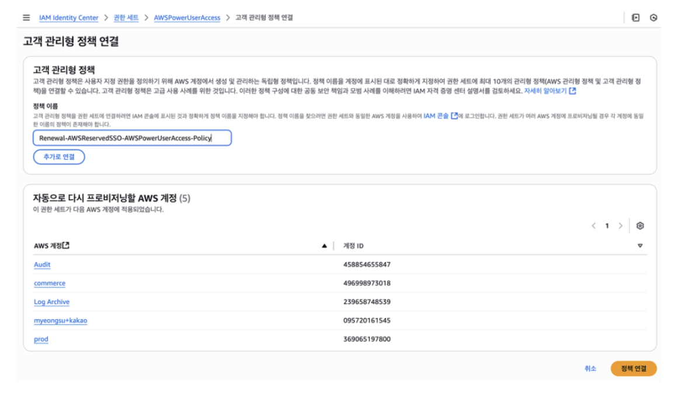
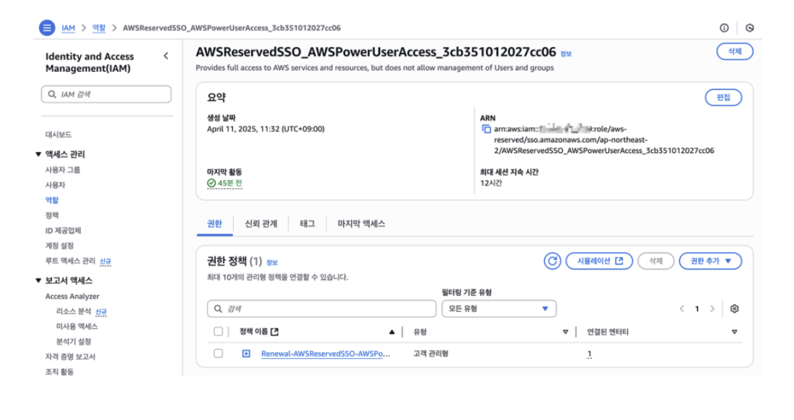
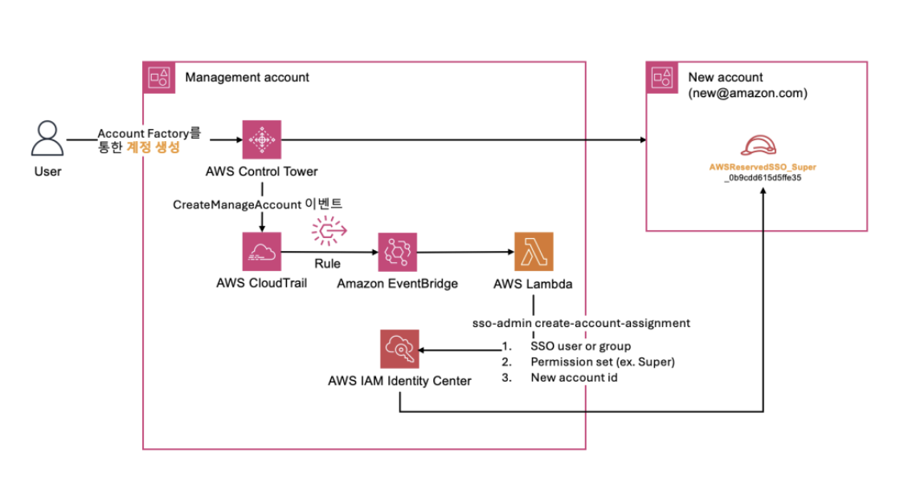

# 카카오(Kakao) Control Tower 구축 사례

## 1. 아키텍처 개요

카카오는 카카오톡, 카카오페이, 카카오모빌리티 등 수십 개 서비스를 독립적인 조직 단위로 운영합니다. AI 서비스 도입이 빨라지면서 실험 계정을 빠르게 만들고 폐기하는 패턴이 생겼고, 이 흐름에서 계정별 권한 체계가 제각각이 되기 시작했습니다.

카카오가 겪은 문제는 크게 세 가지 였습니다.
하나는 AWS Managed Permission Set을 그대로 써서 실제 필요한 것보다 훨씬 넓은 권한이 부여되는 상황이었고, 다른 문제는 새 계정이 생길 때마다 수동으로 IAM Identity Center에 권한을 할당하다 보니 시간 지연과 실수가 반복된다는 점이었습니다. 그리고 마지막으로는 On-premise와 Direct Connect로 연결되는 워크로드와 독립 운영 워크로드가 OU로 분리되어 있었는데, OU마다 다른 보안 정책이 필요한 상황에서 중앙 거버넌스가 없으면 계정이 늘어날수록 통제가 어려워진다는 것이었습니다.
카카오는 이를 Control Tower 도입을 통해서 해결했습니다.

---

## 2. 아키텍처 분석

### 2.1 계정 거버넌스 구조 — Control Tower + Organizations
위 그림은 이 사례의 전체 구조를 보여줍니다. Management Account 하나가 전체 멀티 계정 환경을 통제하고, 그 아래 목적별로 분리된 세 가지 계정 영역이 존재합니다.

#### Management Account

- Control Tower, CloudFormation StackSets, Service Catalog(Account Factory), Organizations, IAM Identity Center가 모두 여기서 동작합니다. 계정 프로비저닝, OU 구성, 사용자 인증 및 접근 관리가 이 계정에서 중앙 제어됩니다.

#### Log Archive Account

- Organization-level CloudTrail과 AWS Config 로그가 여기 S3에 중앙 수집됩니다. 개별 계정에서 로그를 끄거나 지울 수 없고, 이 계정만 로그를 보관합니다.

#### Audit Account

- Security cross-account roles, Security notifications, Config Aggregator가 위치합니다. 전 계정의 보안 이벤트와 Config 상태를 여기서 집계해서 모니터링합니다.

#### Provisioned Accounts

- 실제 워크로드가 올라가는 계정들입니다. Account baseline과 Network baseline이 StackSets로 자동 배포됩니다.

---

### AWS Control Tower

Management Account에서 전체 OU 구조를 정의하고, Log Archive Account, Security(Audit) Account가 이 구조 안에서 분리 운영됩니다. 카카오는 Direct Connect 연결이 필요한 워크로드용 OU와 독립 워크로드용 OU를 분리하여 각기 다른 SCP를 적용했습니다.

### AWS Organizations + OU 설계

계정 자체가 보안 경계 역할을 수행합니다. 서비스별로 계정을 나누면 한 계정에서 발생한 IAM 권한 오남용 등이 다른 서비스 계정으로 전파되지 않습니다. 교육·실습용 계정을 Account Factory로 빠르게 생성하고 폐기하는 패턴이 반복되는 구조였기 때문에, 계정 생성 자체는 자동화하되 권한 할당 누락이 발생하지 않아야 했습니다.

---

### 2.2 최소 권한 구현 흐름 — IAM Access Analyzer → Custom Permission Set

카카오는 실제로 사용된 권한만 추출하기 위해 IAM Access Analyzer를 사용했습니다. 이 도구는 CloudTrail 로그를 분석해서 지난 90일 동안 실제로 호출된 API가 어떤 것인지를 뽑아낼 수 있습니다.
그런데 CloudTrail 로그는 Logging Account의 S3 버킷에 쌓여 있고, Control Tower가 이 버킷을 기본적으로 잠가두고 있기 때문에 평상시에는 Access Analyzer가 로그를 읽으려면 이 버킷에 접근이 불가능 했습니다.
따라서 아래 그림처럼 먼저 버킷 정책 수정을 통해. Management Account에서 AWSControlTowerExecution 역할을 빌려서 Logging Account의 S3 버킷에 예외를 하나 추가하는 방식으로 로그를 읽도록 하였습니다.

Management Account의 IAM User가 Logging Account의 AWSControlTowerExecution 역할을 Assume해서 S3 버킷 정책을 수정합니다. 수정 이후에는 Prod Account, Dev Account의 CloudTrail이 각자 로그를 이 S3 버킷(aws-controltower-logs-{account-id}-ap-northeast-2)으로 전송하는 구조입니다.

이 과정을 통해 Access Analyzer가 Prod, Dev 계정의 CloudTrail 로그를 읽어서 실제 사용된 API 목록을 뽑아낼 수 있게 됩니다.

#### CloudTrail

버킷 정책 수정이 끝나면 실제로 Access Analyzer를 실행할 수 있습니다. 아래 화면처럼 분석할 역할(AWSReservedSSO_AWSPowerUserAccess)을 선택하고, 분석 기간과 CloudTrail 추적(aws-controltower-BaselineCloudTrail)을 지정한 뒤 정책을 생성할 수 있습니다.

원래 AWSPowerUserAccess는 443개 서비스에 대한 권한을 갖고 있었는데, 실제로 사용된 건 EC2, Resource Explorer, Route 53 단 3개뿐으로 조정을 통해 권한을 제어할 수 있습니다.

#### IAM Identity Center — Custom Permission Set

이 결과물을 Renewal-AWSReservedSSO-AWSPowerUserAccess-Policy라는 이름의 고객 관리형 정책으로 저장하고, 아래처럼 기존 Permission Set에 연결하면 정책을 Audit, commerce, Log Archive, prod 등 5개 계정에 자동으로 반영할 수 있습니다.

---

### 2.3 계정 자동화 파이프라인

사용자가 Account Factory를 통해 계정을 생성하면, Control Tower가 CreateManagedAccount 이벤트를 발생시키고 이 이벤트가 CloudTrail → EventBridge → Lambda 순으로 전달됩니다. Lambda는 sso-admin create-account-assignment를 호출해서 SSO 사용자/그룹, Permission Set(예: Super), 새 계정 ID 세 가지를 IAM Identity Center에 전달합니다. 그 결과 New Account 안에 AWSReservedSSO_Super_0b9cdd... 역할이 자동 생성되고, 사용자는 계정 생성 직후 바로 접근 가능한 상태가 됩니다.

#### EventBridge 역할

- Control Tower가 CreateManagedAccount 이벤트를 발생시키면 규칙이 Lambda를 트리거합니다.
이벤트 payload에 새 계정 ID가 포함되어 있어 Lambda가 별도 조회 없이 바로 사용할 수 있습니다.

#### Lambda 역할

- sso-admin 클라이언트의 create_account_assignment를 호출해서 미리 정의된 Permission Set과 그룹을 계정에 연결합니다. 프로비저닝 상태를 폴링해서 SUCCEEDED 확인 후 종료합니다. 실패 시 예외를 발생시켜 CloudWatch로 추적 가능합니다.
- Lambda 자체 IAM Role에는 sso:CreateAccountAssignment, sso:DescribeAccountAssignmentCreationStatus 등 SSO 관련 최소 권한만 부여합니다.

이 구조가 없으면 계정 생성과 권한 할당 사이에 수동 작업 구간이 생기고, 그 공백 시간 동안 계정에 아무도 접근하지 못하거나 반대로 임시 과권한이 남을 수 있습니다.

---

## 3. 분석

### 3.1 악의적 행동 탐지

카카오가 이번 아키텍처에서 적용한 주요 차단 규칙들입니다.

- **루트 계정 액세스 키 발급 금지**: 루트 계정으로 API 키를 만들면 거의 모든 걸 할 수 있는데, 이런 발급 자체를 막아서 계정이 탈취되더라도 프로그래밍 방식으로 쓰는 건 불가능하도록 했습니다.
- **S3 암호화 전송 강제**: S3에 데이터를 주고받을 때 반드시 HTTPS를 쓰도록 강제했습니다.
- **스냅샷·이미지 공개 금지**: 개발자가 실수로 서버 이미지나 디스크 스냅샷을 외부에 공개하는 경우를 원천 차단했습니다.
- **인터넷 연결 차단**: 인터넷망이 필요 없는 내부 워크로드 계정에만 선택적으로 적용했습니다.

이렇게 접근 및 권한 제어를 잘 했지만 만약 이 올바른 권한 내에서 악의적인 행동이 있었을 때 어떻게 대처해야할지 탐지를 위해서, 언급되지는 않았지만 GuardDuty, Security Hub, 상용 SIEM 등을 활용해서 탐지를 할 필요가 있습니다.

### 3.2 추가로 고려할 점

#### Permission Set 관리

Custom Permission Set은 처음 생성 시점의 사용 패턴을 기준으로 만들어집니다. 시간이 지나면서 새 기능을 쓰기 시작하면 권한이 부족해서 작업이 막히고, 그때마다 임시로 권한을 추가하다 보면 다시 커질 수 있습니다. 그렇기 때문에 주기적으로 Access Analyzer를 재실행해서 Permission Set을 재검토하는 사이클을 추가하는 것이 필요합니다.

#### Lambda 단일 Permission Set 할당 구조의 한계

현재 Lambda 코드는 하나의 Permission Set과 하나의 그룹을 신규 계정에 할당합니다. 워크로드 유형(AI 실험 계정, 프로덕션 계정 등)에 따라 다른 Permission Set을 할당해야 한다면, 계정 이름 패턴이나 OU 정보를 EventBridge 이벤트에서 읽어서 조건 분기하는 로직이 추가로 필요합니다.

#### 계정 폐기 시 권한 잔존 문제

교육용 계정을 빠르게 만들고 폐기하는 패턴에서, 계정 삭제 전에 Permission Set 할당 해제가 자동으로 처리되지 않으면 IAM Identity Center에 상태 할당이 남아있을 수 있습니다. 따라서 삭제 또한 이벤트를 이용해 할당 해제 Lambda도 대칭으로 구성해야 합니다.

---

## 참고 자료

- [카카오의 AWS Control Tower 환경에서 권한 최소화 및 계정 연동 자동화 구현하기](https://aws.amazon.com/ko/blogs/tech/kakao-corp-aws-control-tower/)
