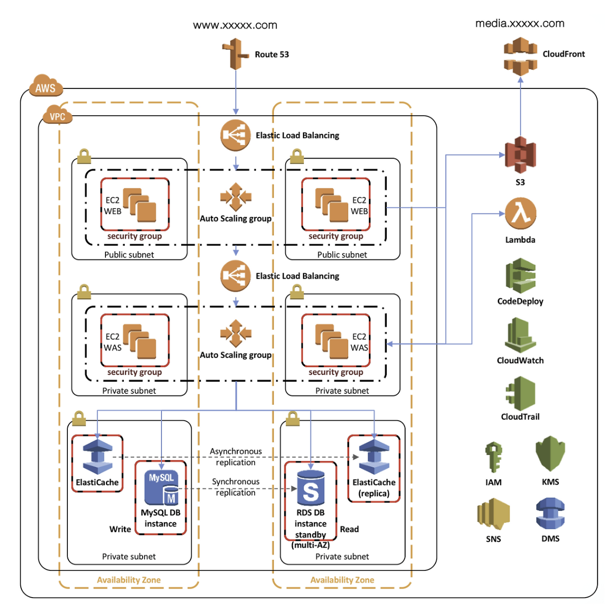

# MIDAS IT 아키텍처 분석

## 1. 개요

### 마이다스아이티(MIDAS IT)

- **설립 및 규모:** 2000년 9월 설립, 600여 명의 글로벌 기술 인력 보유.
- **주요 사업:** 공학 기술용 소프트웨어 개발 및 엔지니어링 서비스, 웹 비즈니스 통합 솔루션.
- **글로벌 네트워크:** 8개 현지 법인과 35개국 네트워크를 통해 **110여 개국에 소프트웨어 수출**.
- **핵심 서비스:** 2017년 AWS 기반의 임대형 채용 솔루션 **'마이다스 인사이트'** 론칭 (현재 약 300여 개 주요 기업 사용 중).

### 당면 과제

1. **극심한 트래픽 변동성:** 채용 시즌에는 수만 명이 몰리지만 비시즌에는 사용률이 거의 제로에 가까운 비즈니스 특성.
2. **비용 및 관리 비효율:** 기존 온프레미스(자체 서버) 환경에서는 최대 트래픽에 맞춰 장비를 사야 했기에 평상시 노는 장비에 대한 유지비 부담이 큼.
3. **유연성 부족:** 지원자 수를 정확히 예측하기 어려운 상황에서 서버를 즉각적으로 늘리거나 줄이는 확장성이 필요했음.

**→ 인프라 관리의 효율성을 높이기 위해 AWS 클라우드 도입을 결정.**

---

## 2. 아키텍처 분석

### 2.1 트래픽 흐름

이미지나 영상 같은 정적 미디어 파일은 **S3**에 저장되며 **CloudFront**가 이를 전 세계 엣지 로케이션에 캐싱하여 오리진 서버의 부하를 줄이고 응답 속도를 높입니다.

사용자의 도메인 질의를 **Route 53**이 수신하여 **External ELB**로 라우팅합니다. Web 계층(Public Subnet)으로 들어온 요청은 **External ELB**를 통해 여러 대의 **EC2 WEB** 서버로 분산됩니다. 이 서버들은 **Auto Scaling Group**으로 구성되어 트래픽 변동에 따라 대수가 자동 조절되며 **Security Group** 설정을 통해 80(HTTP)과 443(HTTPS) 포트만 외부에 개방하여 보안을 유지합니다.

App 계층(Private Subnet)은 외부 인터넷과 격리된 환경에서 비즈니스 로직을 수행합니다. 웹 서버의 요청은 내부 전용 로드 밸런서인 **Internal ELB**를 거쳐 **EC2 WAS** 서버로 전달됩니다. 이 계층의 보안 그룹은 WEB 계층의 보안 그룹 ID를 소스(Source)로 설정합니다. 이를 통해 웹 서버를 거치지 않은 비정상적인 모든 접근을 막고 안정성을 확보합니다.

Database 계층(Private Subnet)은 최종적으로 데이터를 저장하고 관리합니다. 빈번한 조회 쿼리는 인메모리 기반의 **ElastiCache**에서 처리하며 성능 최적화를 위해 마스터와 복제본 간에 비동기 복제(Asynchronous Replication)를 수행합니다. 실제 원본 데이터는 Amazon RDS(MySQL)에 저장되며 **Multi-AZ** 구성을 통해 Master와 Standby 인스턴스 간 동기 복제(Synchronous Replication)를 실시합니다. 동기 복제는 Master에 기록된 데이터가 Standby에도 동일하게 기록되었음을 확인한 후 트랜잭션을 완료하므로 장애 발생 시 데이터 유실 없는 즉각적인 페일오버(Failover)와 데이터 무결성을 보장합니다. DB 및 캐시 계층의 보안 그룹 또한 오직 WAS 계층의 보안 그룹으로부터 오는 전용 포트 요청만 수락하도록 제한합니다.

### 2.2 배포 자동화 및 관리 서비스

**S3**는 정적 미디어 파일과 배포 아티팩트를 보관하는 확장성 높은 객체 스토리지로 **CloudFront**에 콘텐츠를 공급하는 원본 저장소 역할을 합니다. **CodeDeploy**와 **Lambda**는 애플리케이션 업데이트의 자동화를 담당합니다. **CodeDeploy**가 새로운 코드를 인스턴스에 배포하면 **Lambda**는 배포의 시작과 종료 이벤트를 감지하여 필요한 스크립트를 실행하거나 시스템 상태를 트리거합니다. 이 과정에서 발생하는 주요 상태 변화와 알림은 **SNS**를 통해 관리자에게 실시간 메시지로 전달됩니다.

### 2.3 관측성 및 모니터링 서비스

시스템의 안정성 유지를 위해 **CloudWatch**와 **CloudTrail**이 상시 구동됩니다. **CloudWatch**는 EC2, RDS 등의 리소스 성능 지표(CPU 사용률, 메모리 등)를 모니터링하고 로그를 수집하여 특정 임계치 초과 시 알람을 발생시킵니다. **CloudTrail**은 계정 내에서 발생하는 모든 API 호출 내역을 기록합니다. 이를 통해 "누가, 언제, 어떤 리소스를 변경했는지"에 대한 감사 데이터를 제공하여 침해 사고 분석의 근거가 됩니다.

### 2.4 보안 및 데이터 이관 서비스

**IAM**과 **KMS**는 접근 제어와 데이터 보호를 수행합니다. **IAM**은 사용자 및 서비스 역할에 대한 권한을 정의하여 최소 권한 원칙을 구현합니다. **KMS**는 S3에 저장된 파일이나 RDS 데이터베이스를 암호화하기 위한 암호화 키를 안전하게 생성하고 관리합니다. 마지막으로 **DMS**는 온프레미스 데이터베이스나 다른 환경의 데이터를 AWS로 안전하게 이전할 때 사용되며 서비스 중단 시간을 최소화하면서 데이터베이스 스키마와 데이터를 마이그레이션하는 역할을 지원합니다.

---

## 3. 보안 관점 분석

### 3.1 추가됐으면 하는 보안 요소

**1. EC2 서버의 Private Subnet 이동**

Public Subnet에 있던 EC2를 Private Subnet으로 이동시키고 외부 트래픽은 Public Subnet의 ALB가 전담하도록 합니다. Web 서버에서 공인 IP를 제거하여 공격자가 ELB를 거치지 않고 서버에 도달하는 경로를 차단합니다.

**2. AWS WAF 및 ACM 적용**

ALB 앞단에는 AWS WAF를 배치합니다. WAF로 L7 계층의 공격을 방어합니다. 그리고 ACM을 적용하여 SSL/TLS 인증서를 ALB에 적용함으로써 모든 전송 구간을 HTTPS로 강제합니다.

**3. VPC Endpoint와 AWS SSM 활용**

Private Subnet의 서버들이 S3나 CloudWatch 등과 통신할 때 IGW나 NAT Gateway를 거치지 않고 VPC Endpoint를 통한 내부 망 통신을 수행합니다. SSM Session Manager는 SSH를 열지 않고 인스턴스에 접속할 수 있는 환경을 만들어줍니다. 이에 따라 Bastion Host도 두지 않아도 됩니다.

**4. VPC Flow Logs 및 AWS Config 추가**

VPC Flow Logs와 AWS Config를 두어 IP 트래픽을 기록하고 리소스의 설정 변경 사항을 감시하는 요소를 추가합니다.

**참고 자료**

https://aws.amazon.com/ko/solutions/case-studies/midas-it/