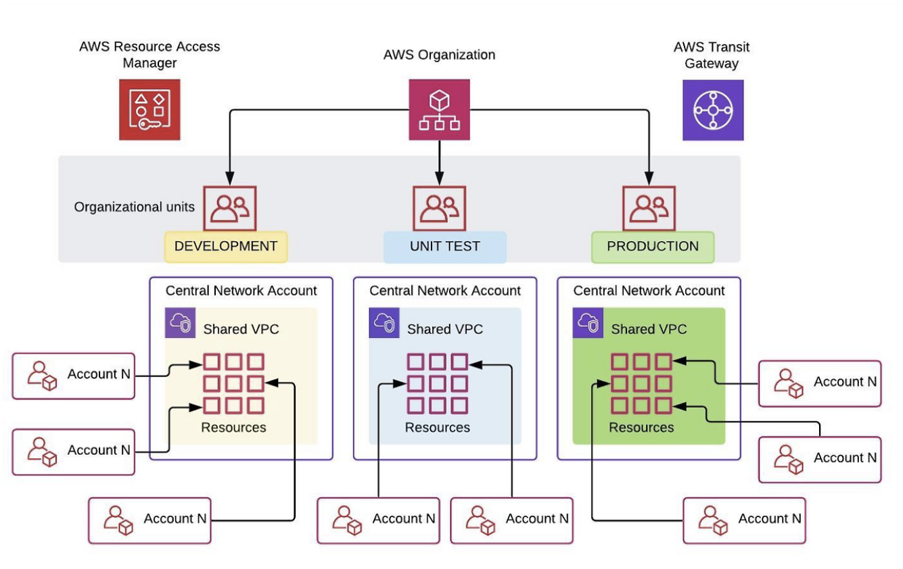
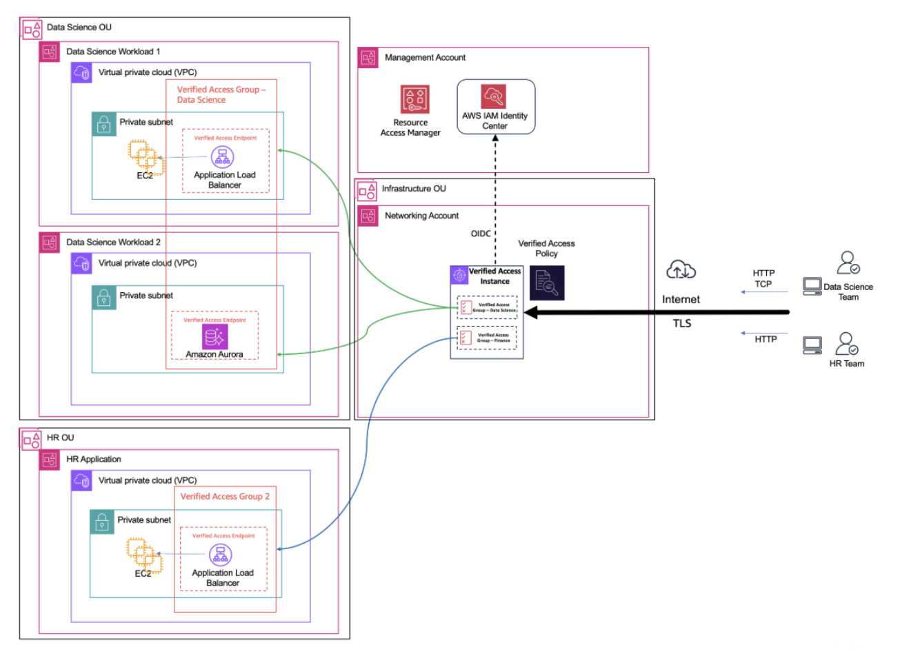

# AWS 인프라 분석 - Multi Account 관리

## 1. 개요

### 1.1 인프라 구성 요약

AWS Organizations의 Unit(OU) 단위로 VPC를 분리하고 운영되는 구조에 대해 알아보고자 합니다.

각 OU는 비즈니스 유닛 혹은 환경에 따라 전용 VPC를 가지고 있으며, 해당 OU 내 모든 계정이 공유 VPC 서브넷을 통해 네트워크에 접근합니다.

핵심 구성 요소는 다음과 같습니다.

- **AWS Organizations**: OU 계층 구조를 통한 계정 그룹핑 및 정책 관리
- **공유 VPC (Shared VPC)**: OU 단위로 생성된 중앙 관리형 VPC
- **AWS RAM (Resource Access Manager)**: OU ID 기반 VPC 서브넷 자동 공유
- **AWS Transit Gateway**: OU 간 VPC 연결 및 온프레미스 연동
- **SCP (Service Control Policy)**: OU 단위 네트워크 접근 제어 및 VPC 생성 제한
- **AWS Verified Access**: Zero Trust 기반 중앙 집중식 애플리케이션 접근 제어

### 1.2 분석 범위 및 목적

OU 별 VPC 분리 구조의 전체적인 아키텍처에 대해 이해하고, 각 구성요소의 역할 및 상호작용에 대해 파악하고자 합니다.

또한 보안 관점에서의 격리 수준 및 통제 메커니즘을 분석하고, 현재 구조의 한계점을 도출하여 개선 방향을 제시하고자 합니다.

---

## 2. 아키텍처 분석



### 2.1 전체 구성도

```
[ AWS Organizations ]
Root
├── OU: Infrastructure (Network Account)
│   ├── VPC: shared-infra (Transit Gateway 허브)
│   └── RAM 공유 → 전체 OU
├── OU: Content-Prod
│   ├── VPC: content-prod (RAM으로 OU 내 자동 공유)
│   ├── Account: content-app-1
│   └── Account: content-app-2
├── OU: Wealth-Prod
│   ├── VPC: wealth-prod (RAM으로 OU 내 자동 공유)
│   └── Account: wealth-app-1
├── OU: HR
│   ├── VPC: hr-prod (private subnet only)
│   └── Verified Access Endpoint (Networking Account 공유)
└── OU: Security
    ├── Log Archive Account
    └── Security Tooling Account (GuardDuty, Security Hub)
```

전체 흐름을 요약하면 다음과 같습니다.

> 사용자 요청 → AWS WAF / Verified Access → 인증/인가 통과 후 → Transit Gateway를 통해 OU의 VPC로 라우팅 → OU 내 공유 서브넷에 배포된 워크로드 계정 리소스에 접근, 모든 트래픽 로그 → Security OU의 Log Archive 계정으로 중앙 집계



### 2.2 구성요소별 역할

#### 1) OU 역할 분담

- **Infrastructure**: Networking 계정, Transit Gateway, Verified Access 중앙 관리 (허브 VPC로 공유 서비스 제공)
- **Content-Prod**: 콘텐츠 비즈니스 유닛 프로덕션 워크로드 (OU 내 공유)
- **Wealth-Prod**: 자산 관리 비즈니스 유닛 프로덕션 워크로드 (OU 내 공유)
- **HR**: 인사 시스템 — 고도 민감 데이터 (private-only)
- **Security**: 로그 아카이브, 보안 툴링, 감사 대응 (외부 접근 차단)
- **Sandbox**: 개발자의 실험 환경 (격리)

#### 2) 공유 VPC + AWS RAM

OU 별로 VPC를 하나 생성하고 RAM Resource Share의 Resource Principal에 OU ID를 지정합니다.

해당 설정으로 OU에 새 계정이 추가되면 별도 설정 없이 자동으로 VPC 서브넷 접근 권한이 부여됩니다.

예시) VPC Owner/Participant — Network 계정

- **VPC Owner**: 서브넷, 라우팅 테이블, NAT Gateway, VPC Endpoint 생성 및 관리 가능
- **VPC Participant (각 워크로드 계정)**: EC2, RDS, Lambda 등 애플리케이션 리소스를 배포

서브넷 설계 시 VPC Participant마다 전용 서브넷 세트를 AZ 별로 할당합니다.

#### 3) SCP 기반 접근 통제

RAM 기본 권한은 범위가 넓어서 의도치 않은 OU 간 VPC 공유가 발생할 수 있습니다. 이를 방지하기 위해 SCP로 권한을 제한합니다.

- **VPC 직접 생성 차단**: 워크로드 계정이 자체 VPC를 만들지 못하도록 합니다.
- **VPC 공유 권한 제한**: RAM Resource Share 생성 및 연결 권한을 Network 계정에만 허용합니다.

#### 4) Transit Gateway

OU 간 VPC 연결 및 온프레미스 네트워크 연동을 담당합니다. Hub and Spoke 구조로 중앙 Network 계정의 Transit Gateway가 각 OU VPC와 연결됩니다.

#### 5) AWS Verified Access — Zero Trust

중앙 Network 계정에 Verified Access 인스턴스를 배포하고 OU 별로 Verified Access Group을 RAM으로 공유합니다.

VPN이나 Bastion Host 없이 사용자 신원 및 디바이스 상태를 기반으로 애플리케이션 접근을 제어합니다.

---

## 3. 보안 관점 분석

### 3.1 보안 고려 사항

#### 1) 구조적 강점: 계정 + 네트워크 이중 방어

VPC를 단순하게 격리한 것과는 다르게 AWS 계정 경계가 1차 방어선 역할을 합니다. 한 계정이 침해되더라도 다른 OU의 계정으로 자동 전파되지 않습니다.

#### 2) 관리 통제: VPC 소유권 중앙 집중

워크로드 계정은 서브넷 사용권만 가집니다. 라우팅 테이블, NAT Gateway, VPC Endpoint 변경 및 생성은 Network 계정만 가능하여 무단 네트워크 변경을 차단합니다.

#### 3) 운영 보안: RAM + OU ID 자동화로 신규 계정 온보딩 보안 강화

신규 계정이 OU에 추가될 때 별도 수작업 없이 미리 정의된 VPC 서브넷에만 접근 가능합니다.

#### 4) 접근 보안: Zero Trust 접근 제어 — Verified Access

IP 주소나 네트워크 위치가 아닌 사용자 신원과 디바이스 상태를 기준으로 접근을 허용합니다. VPN 없이도 Private Subnet 애플리케이션에 안전하게 접근 가능합니다.

### 3.2 한계점

#### 1) Noisy Neighbor 문제

동일 OU 내 여러 계정이 공유 VPC 서브넷을 사용하는 구조이기 때문에, 특정 계정이 IP 주소를 대량으로 소진하는 경우 같은 VPC를 공유하는 다른 계정에 영향을 미칩니다.

#### 2) VPC 서비스 쿼터 공유

Hyperplane ENI 한도가 OU 내 모든 계정이 공유하는 자원입니다. NLB, PrivateLink Endpoint, Lambda 함수가 각각 ENI를 소비하므로 대규모 운영 시 한도 초과 위험이 발생합니다.

#### 3) OU 간 접근 통제 복잡성

서로 다른 OU의 워크로드가 통신해야 할 때 Transit Gateway 라우팅 테이블 설정이 복잡해집니다. OU가 늘어날수록 허용/차단 경로 관리 부담이 증가합니다.

#### 4) SCP 적용 범위의 한계

SCP는 IAM 권한을 제한하지만 이미 존재하는 리소스를 완전히 차단하지는 못합니다. SCP 도입 이전에 생성된 자체 VPC나 RAM 같은 공유 자원이 있다면 별도 정리 작업이 필요합니다.

#### 5) Verified Access HTTP 유휴 타임아웃

Verified Access HTTP 유휴 타임아웃이 60초로 고정되어 있습니다. 장기 실행 작업이나 WebSocket 기반 애플리케이션에서 연결이 끊기는 경우가 발생할 수 있습니다.

### 3.3 개선 사항

#### 1) 서브넷 IP 소진 방지 모니터링 자동화

CloudWatch Metric을 통해 `NetworkInterfaceCount`, `AvailableIpAddressCount` 지표 알람을 설정합니다. 각 서브넷의 여유 IP 주소를 주기적으로 확인하여 임계치 도달 시 자동으로 알림을 발송합니다.

#### 2) 서비스 쿼터 사전 관리

Hyperplane ENI 한도를 AWS Support를 통해 사전에 증설 요청합니다. OU별 VPC를 분할 때 예상 ENI 소비량을 계산하여 VPC CIDR 크기를 설계하고, AWS Service Quotas 대시보드를 통해 정기적으로 모니터링 체계를 수립합니다.

#### 3) Transit Gateway 라우팅 정책 체계화

Transit Gateway Route Table을 OU별로 분리하여 허용된 경로만 명시적으로 관리합니다. OU 간 통신이 필요한 경우 별도 승인 프로세스를 통해 라우팅 경로를 추가하는 거버넌스를 수립하고, AWS Network Firewall을 Transit Gateway와 연동하여 OU 간 트래픽을 검사합니다.

#### 4) SCP 기존 리소스 정리 자동화

AWS Config Rules로 SCP 정책에 위반되는 기존 리소스를 지속적으로 탐지합니다. AWS Config Remediation으로 비준수 리소스 자동 알림 및 수동 대응 워크플로우를 구성하고, SCP 적용 전 AWS Access Analyzer로 기존 리소스 영향도를 사전 분석합니다.

#### 5) 장기 연결 시 애플리케이션 대응

Verified Access 60초 유휴 타임아웃을 고려하여 애플리케이션에 KeepAlive를 설정합니다. WebSocket이나 장기 실행 작업의 경우 별도 NLB + PrivateLink 경로를 검토하고, Verified Access 로그를 통해 타임아웃으로 인한 연결 실패 패턴을 지속 모니터링합니다.

#### 6) 규정 준수 요건이 높은 워크로드 추가 격리

CloudTrail Organization Trail로 전체 OU 활동 로그를 Log Archive 계정에 중앙 집계합니다. 크로스 계정 접근 시 STS Assume Role로 필요한 권한만 임시로 위임하여 영구 자격증명 사용을 제거합니다.

---

## 참고 자료

- [How FactSet handles networking for 1,000 AWS accounts](https://aws.amazon.com/ko/blogs/networking-and-content-delivery/how-factset-handles-networking-for-1000-aws-accounts/)
- [Control VPC sharing in an AWS multi-account setup with Service Control Policies](https://aws.amazon.com/ko/blogs/security/control-vpc-sharing-in-an-aws-multi-account-setup-with-service-control-policies/)
- [Building Zero Trust access across multi-account AWS environments](http://aws.amazon.com/ko/blogs/networking-and-content-delivery/building-zero-trust-access-across-multi-account-aws-environments/)
