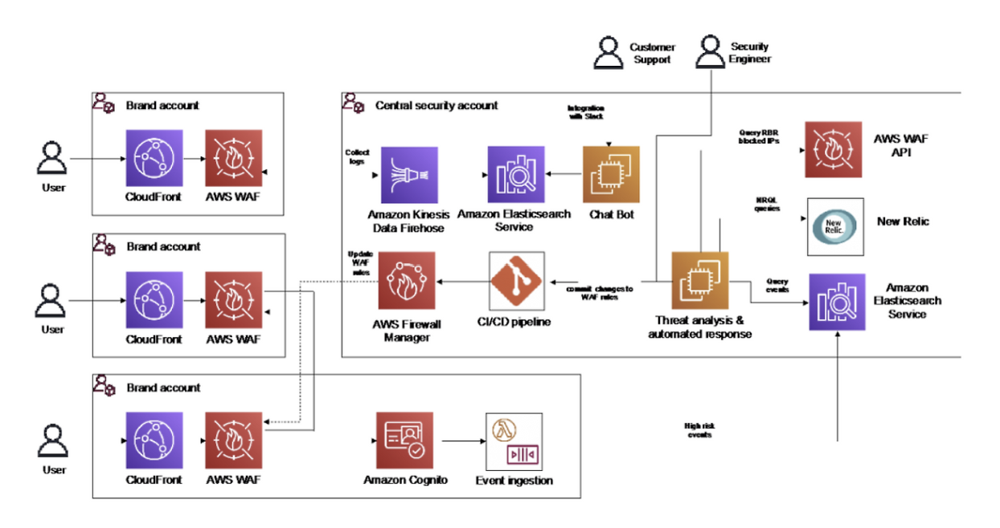
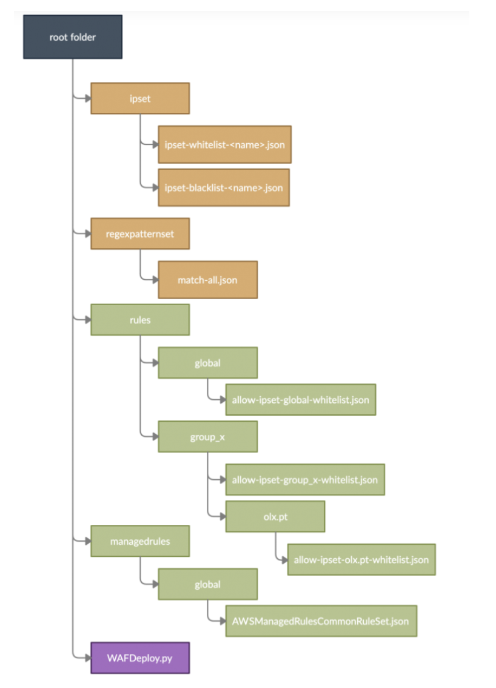
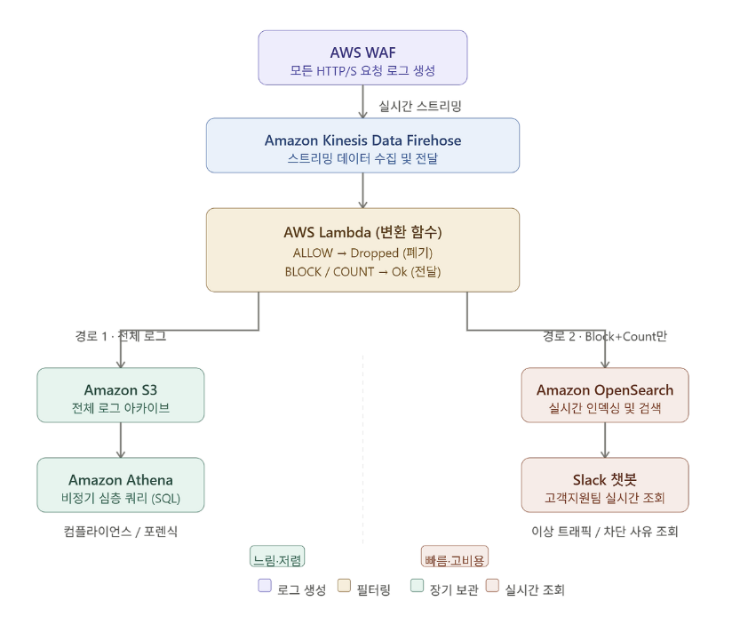
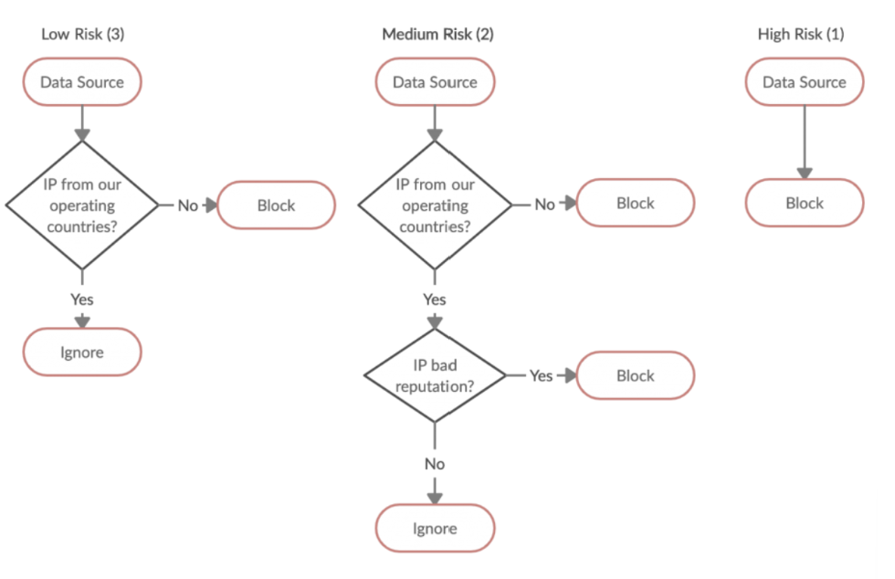

# OLX Europe의 AWS 기반 봇 방어 아키텍처 분석

## 1. 개요

OLX Europe은 매월 3억 명 이상이 이용하는 글로벌 중고 거래 플랫폼으로, 32개 이상의 국가에서 서비스를 운영하고 있습니다. 이 규모의 플랫폼은 자연스럽게 다양한 악성 봇의 표적이 됩니다.

OLX가 직면한 주요 위협은 크게 세 가지였습니다.

- **콘텐츠 스크래핑**: 경쟁 사이트가 OLX의 상품 정보를 자동으로 수집하여 자사 플랫폼에 활용
- **DDoS 공격**: 서비스 가용성을 위협하는 대규모 분산 서비스 거부 공격
- **계정 탈취(Account Takeover, ATO)**: 자동화된 브루트포스를 통한 사용자 계정 침해

계정이 탈취될 경우 공격자는 OLX 마켓플레이스에서 가짜 상품을 판매하는 등 사기 행위를 벌일 수 있어, 사용자 신뢰를 핵심 가치로 삼는 OLX에게 심각한 비즈니스 리스크로 작용했습니다.

### 전환 배경 및 목표

기존에 OLX는 외부 벤더의 봇 보호 솔루션을 사용하고 있었으나, 비용이 높고 가시성과 제어 유연성이 부족하다는 한계가 있었습니다. CDN 마이그레이션 기회를 활용해 AWS 기반의 인하우스 엣지 보안 솔루션을 직접 구축하기로 결정했습니다.

**구축 목표**는 다음과 같았습니다.

- 중앙 집중식 보안 거버넌스 구현 (다수의 AWS 계정 및 리전 관리)
- 룰 업데이트 및 차단 이유 파악 등 운영 단순화
- 기존 CDN 계약 만료 전 무중단 전환
- CDN 및 봇 보호 비용 50% 절감

결과적으로 OLX는 **3개월 만에** 월 2,400억 건의 요청을 처리하는 엣지 보안 솔루션을 성공적으로 구축하였고, 관련 비용을 50% 절감하는 성과를 달성했습니다.

---

## 2. 아키텍처 분석

OLX의 엣지 보안 아키텍처는 크게 세 개의 레이어로 구성됩니다.

1. WAF 기반 보호 기반 구축
2. WAF 로그를 활용한 가시성 확보
3. 자동화된 봇 탐지 및 차단

### 2-1. AWS WAF + AWS Firewall Manager

#### AWS WAF 규칙 구성

OLX는 공개 엔드포인트에 AWS WAF를 적용하여 애플리케이션 계층(L7)에서 악성 요청을 차단합니다. 보호 정책은 두 가지 레이어로 구성됩니다.

- **AWS Managed Rules**: SQL Injection, XSS 등 일반적인 웹 위협에 대한 표준 기준선 보호
- **Custom Rules**: IP 매칭(IP Matching) 기반의 자체 커스텀 규칙 추가 적용

#### 중앙 집중식 규칙 관리 (GitOps 방식)

다수의 AWS 계정과 리전에 WAF 규칙을 일관되게 적용하기 위해 OLX는 GitOps 기반의 중앙화된 규칙 관리 체계를 도입했습니다.

**규칙 저장소 구조**

각 WAF 규칙은 **AWS WAF JSON 포맷**으로 개별 파일로 관리됩니다. 보안 엔지니어가 규칙 파일을 추가하거나 수정한 뒤 Git에 커밋하면, **CI/CD 파이프라인**이 자동으로 트리거되어 다음 단계를 수행합니다.

1. 규칙 파일 통합 및 CloudFormation 템플릿 생성
2. 중앙 AWS 계정에 Firewall Manager WAF 정책 배포
3. Firewall Manager가 각 AWS 계정의 CloudFront 리소스에 WAF WebACL 자동 배포

#### AWS Firewall Manager의 역할

AWS Firewall Manager는 이 아키텍처의 핵심 거버넌스 레이어입니다. 중앙 관리자 계정 하나로 전체 AWS 조직의 WAF 규칙을 제어하며, 신규 계정이나 리소스가 추가되더라도 보안 정책이 자동으로 적용됩니다. OLX는 Firewall Manager를 통해 WAF 로그 수집도 중앙에서 자동으로 활성화합니다.

### 2-2. 가시성 확보: WAF 로그 파이프라인

OLX는 하루 **400GB**에 달하는 WAF 로그를 두 가지 경로로 이원화하여 처리합니다.

#### Amazon Kinesis Data Firehose

Amazon Kinesis Data Firehose(현재 명칭: Amazon Data Firehose)는 스트리밍 데이터를 수집하여 실시간으로 원하는 목적지에 전달하는 **완전 관리형 서비스**입니다. 서버 프로비저닝이나 인프라 관리 없이 데이터 양에 따라 자동으로 스케일링되며, 초 단위로 데이터를 전송합니다.

AWS WAF는 Kinesis Data Firehose와 네이티브 통합을 지원합니다. WAF WebACL에서 로깅을 활성화하면, AWS WAF가 검사하는 **모든 HTTP/S 요청**에 대한 로그(요청 헤더, 발신 IP, 매칭된 규칙 등)를 지정된 Firehose 스트림으로 실시간 전송합니다. 단, 스트림 이름은 반드시 `aws-waf-logs-`로 시작해야 합니다.

#### 로그 흐름 구조

Kinesis Data Firehose의 변환 기능을 활용하여 허용 로그를 필터링한 것입니다. 차단 및 카운트 로그만 OpenSearch로 전송함으로써 비용을 절감하고 조회 성능을 높였습니다.

- Amazon S3: 전체 로그 아카이빙 및 Amazon Athena를 통한 비정기적 심층 분석
- Amazon OpenSearch: 차단, 카운트 로그만 수집하여 고객지원 엔지니어의 빠른 조회 지원

Firehose는 기본적으로 **버퍼 크기(Buffer Size)** 또는 **버퍼 인터벌(Buffer Interval)** 조건 중 먼저 충족되는 시점에 Lambda를 호출합니다. OLX처럼 대용량 로그 환경에서는 Lambda 호출 횟수를 줄이기 위해 버퍼 크기와 인터벌을 최대값(3MB, 900초)으로 설정하는 것이 일반적입니다.

 

**Amazon OpenSearch Service**

Amazon OpenSearch Service는 대규모 데이터를 밀리초 단위로 검색하고 분석할 수 있는 AWS의 완전 관리형 검색, 분석 엔진 서비스입니다. 원래는 오픈소스 검색 엔진인 Elasticsearch를 기반으로 한 Amazon Elasticsearch Service였으나 2021년 라이선스 정책 변경으로 AWS가 Elasticsearch 7.10을 기반으로 오픈소스 포크 프로젝트인 OpenSearch를 만들었고 서비스 이름도 Amazon OpenSearch Service로 변경되었습니다.

OpenSearch는 실시간 전문 검색이 가능한 데이터베이스에 가깝습니다. 데이터가 들어오는 즉시 인덱싱하여 IP 주소, User-Agent, 차단 규칙 이름 등 어떤 필드로든 수초 안에 검색 결과를 반환합니다. 또한 내장된 OpenSearch Dashboards(구 Kibana)를 통해 차단 현황, 공격 IP 분포, 시간별 트래픽 패턴 등을 시각화한 대시보드를 별도 도구 없이 구성할 수 있습니다.
 
#### 고객 지원 챗봇 (Slack 연동)

OLX는 **Slack 챗봇**을 자체 구축하여 고객지원팀이 별도의 AWS 콘솔 접근 없이 Slack에서 직접 특정 요청의 차단 이유를 조회할 수 있도록 했습니다. Amazon CloudFront가 각 요청에 부여하는 고유한 `request-id`가 WAF 로그와 HTTP 응답 헤더 양쪽에 포함되므로, 고객 티켓 처리 속도를 크게 향상시킬 수 있었습니다.

또한 **카운트 모드 로그**를 분석함으로써 특정 규칙을 실제 차단 모드로 전환하기 전에 운영 환경에서의 영향도를 사전에 파악할 수 있습니다.

### 2-3. 봇 탐지 자동화

OLX 봇 탐지 시스템의 핵심은 **EC2 인스턴스에서 동작하는 위협 분석 로직**으로, 세 가지 소스에서 위협 데이터를 주기적으로 수집합니다.

#### 위협 데이터 소스

**1. AWS WAF Rate Limiting**

AWS WAF의 기본 레이트 기반 규칙은 5분 이내에 임계치(최소 100회) 이상의 요청을 보낸 IP를 임시 차단하지만, 임계치 아래로 내려가면 차단이 해제됩니다. OLX는 AWS WAF API를 통해 이 차단 IP 목록을 주기적으로 수집하고, **더 긴 기간 동안 차단을 유지**하여 적응형 봇(Adaptive Bot)의 재진입을 차단합니다.

**2. Amazon Cognito Advanced Security**

Amazon Cognito의 고급 보안 기능은 로그인 요청의 다양한 속성(사용 디바이스, 접속 위치, IP 주소 등)을 분석하여 위험 점수를 부여합니다. OLX는 Cognito Events를 Lambda 함수로 소비하여, **고위험 이벤트**를 Amazon OpenSearch 클러스터로 전송하고 봇 탐지 파이프라인에 통합합니다.

**3. New Relic (클라이언트 사이드 행동 분석)**

New Relic을 통해 수집된 클라이언트 사이드 모니터링 데이터를 분석하여, 정상 사용자와 다른 **비정상적인 내비게이션 패턴**을 가진 의심 IP를 식별합니다.

#### 위협 레벨별 자동 대응 (Working Mode)

오탐(False Positive)을 줄이기 위해 OLX는 위협 수준에 따른 **3단계 대응 모드**를 도입했습니다.

봇 IP가 탐지되고 차단 결정이 내려지면, 자동화 로직이 **중앙 Git 규칙 저장소에 커밋**하고, CI/CD 파이프라인이 트리거되어 몇 분 내에 차단이 실제 WAF에 반영됩니다.

AWS 마이그레이션 1주일 후, OLX는 초당 약 70만 건(700K RPS)에 달하는 대규모 DDoS 공격을 받았습니다. 구축된 봇 탐지 시스템을 통해 공격자 IP를 신속하게 탐지하고 차단하여 서비스를 방어했습니다.

---

## 3. 추가하면 좋을 보안 요소

이 아키텍처는 강력한 엣지 보안을 제공하지만 다음의 보안 요소를 추가하면 보호 수준을 더욱 높일 수 있습니다.

### 3-1. AWS Shield Advanced 통합

현재 아키텍처는 AWS WAF 레이트 리미팅으로 DDoS 대응을 수행하지만 AWS Shield Advanced를 통합하면 L3/L4 계층 DDoS에 대한 전문적인 방어와 AWS DDoS 대응 팀(DRT)의 24/7 지원을 받을 수 있습니다.

### 3-2. AWS WAF Bot Control 관리형 규칙 그룹 적용

현재 봇 탐지는 자체 구축한 EC2 기반 로직에 의존합니다. AWS WAF Bot Control 관리형 규칙 그룹을 추가하면 AWS가 지속적으로 업데이트하는 봇 시그니처 데이터베이스를 활용하여 Selenium, Headless Chrome 등 일반적인 자동화 도구를 별도의 커스텀 로직 없이 탐지하고 차단할 수 있습니다.

### 3-3. AWS WAF Fraud Control - Account Takeover Prevention (ATP) 보완 검토

현재 계정 탈취 대응은 Amazon Cognito Advanced Security를 통해 이루어지고 있습니다. AWS WAF ATP(Account Takeover Prevention) 관리형 규칙 그룹은 다크웹에서 수집된 유출 자격증명 데이터베이스를 실시간으로 검사하고 로그인 실패율을 IP 및 세션 단위로 집계하여 차단하는 기능을 제공합니다. 단 ATP는 현재 Amazon Cognito User Pool에는 직접 적용이 불가능하며 CloudFront 배포 앞단에서의 로그인 엔드포인트 보호에 적용 가능합니다.

---

## 4. 참고자료

- [Field Notes: How OLX Europe Fights Millions of Bots with AWS](https://aws.amazon.com/ko/blogs/architecture/field-notes-how-olx-europe-fights-millions-of-bots-with-aws/) - AWS Architecture Blog