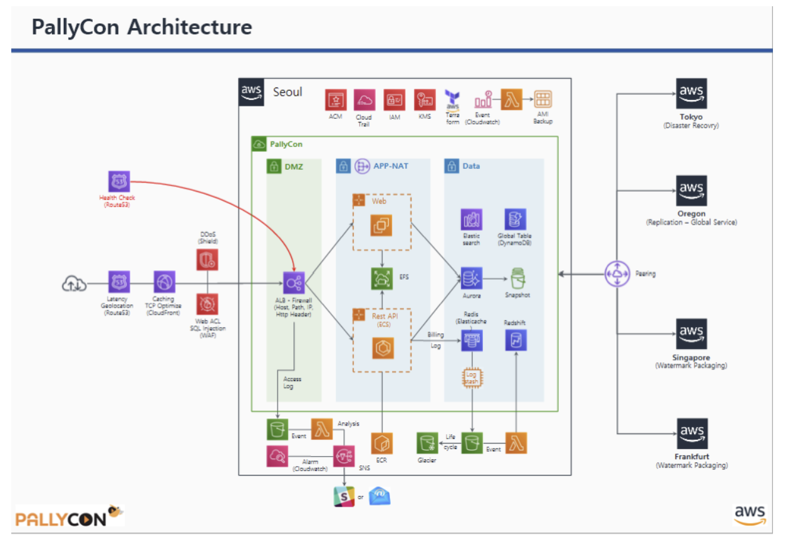
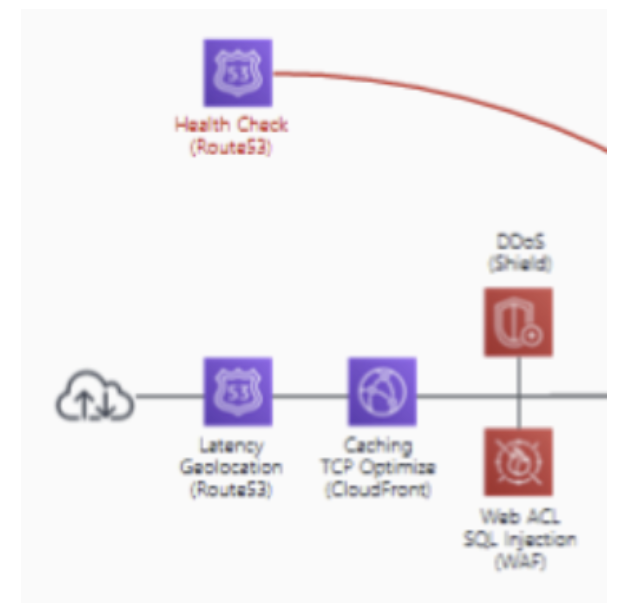
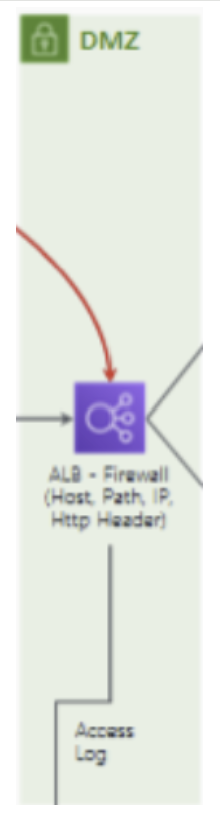
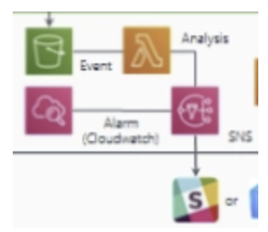
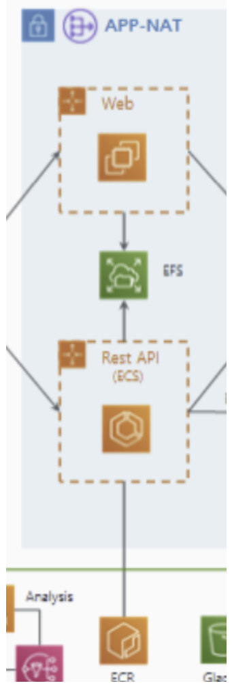
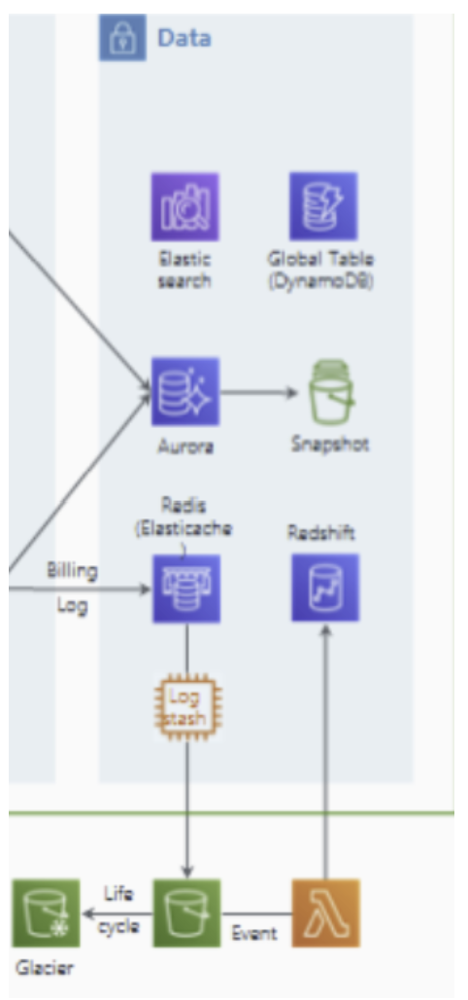
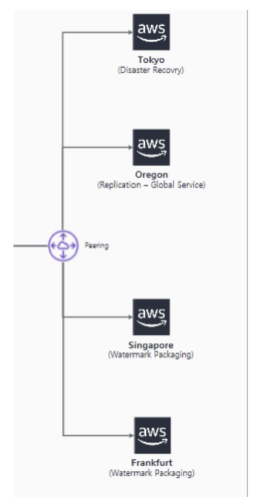
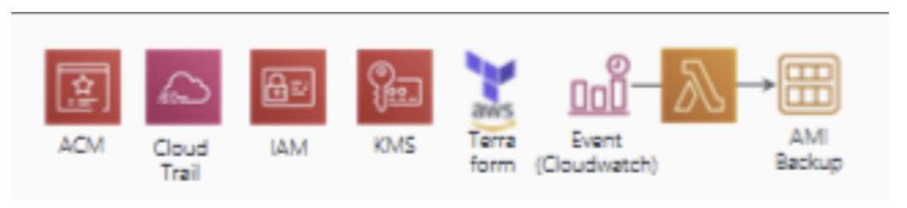

# AWS PallyCon 아키텍처 분석

## 1. 개요

**PallyCon**은 글로벌 OTT 및 미디어 시장을 겨냥한 **Cloud-Native 멀티 DRM 및 포렌식 워터마킹 솔루션**입니다.

- 기존 온프레미스 구축 방식의 긴 도입 시간과 인력 소모 문제를 SaaS(Software as a Service) 형태로 전환하여 해결했습니다.
- **비즈니스 목표:** 전 세계 어디서든 지연 없는 라이선스 발급과 콘텐츠 보호를 위해 AWS의 글로벌 리전(서울, 도쿄, 오레곤 등)을 활용한 다중 리전 아키텍처를 구현했습니다.
- 트래픽 가변성이 큰 OTT 서비스 특성에 맞춰 Auto Scaling과 서버리스(Lambda)를 결합하여 비용 효율성과 확장성을 동시에 확보했습니다.

---

## 2. 아키텍처 분석

### 2.1 구성 요소 분석

#### Edge & Network Security

외부 사용자가 가장 먼저 마주하는 구간으로 가용성 확보와 공격 차단 그리고 통신 암호화에 집중되어 있습니다.

- **Route 53 (Latency & Geolocation & Health Check):** 사용자의 위치에 따라 가장 빠른 리전으로 연결하는 **지연 시간 기반 라우팅**을 수행합니다. 사용자가 속한 대륙이나 국가를 기준으로 라우팅하며 대상 그룹의 상태를 감시하여 장애 발생 시 정상 서버로만 트래픽을 보냅니다.
- **AWS Shield & WAF:** Shield는 인프라 수준의 **DDoS 공격**을 방어하고 WAF는 **SQL Injection, XSS** 등 L7 계층의 웹 공격을 차단하는 ACL 역할을 합니다.
- **CloudFront (CDN):** 전 세계 Edge Location을 통해 정적 콘텐츠(보안 모듈, 라이브러리 등)를 캐싱하여 지연 시간을 줄이고 Origin 서버의 부하를 분산합니다.
- **ACM (AWS Certificate Manager):** 서비스 전체에 필요한 **SSL/TLS 인증서**를 발급하고 관리합니다. CloudFront와 ALB에 적용되어 모든 통신 구간을 HTTPS로 암호화합니다.

#### DMZ & Application Tier

실질적인 DRM 라이선스 발급과 워터마킹 로직이 돌아가는 구간입니다.

- **ALB (Application Load Balancer):** 호스트 이름, URL 경로, HTTP 헤더 등을 분석하여 트래픽을 Web 또는 ECS로 분기하며 접속 기록인 **Access Log**를 생성하여 S3에 저장합니다.
- **ECS & ECR:** ECR(Elastic Container Registry)에 저장된 이미지를 기반으로 ECS(Elastic Container Service)가 컨테이너를 실행합니다. 이는 DRM 라이선스 발급 로직을 마이크로서비스로 운영하는 엔진입니다.
- **EC2 (Web):** 사용자 인터페이스나 관리 도구를 위한 웹 서버 그룹입니다. Auto Scaling을 통해 부하를 견딥니다.
- **APP-NAT (NAT Gateway):** Private Subnet에 위치한 서버들이 보안 패치 등을 위해 **인터넷으로 나가는 일방통행로**를 제공합니다. 외부로부터의 직접적인 침입은 차단합니다.
- **EFS (Elastic File System):** 여러 서버 인스턴스가 동시에 접근해야 하는 공유 설정 파일이나 콘텐츠 데이터를 저장합니다.

#### Data & Storage Tier

- **Amazon Aurora & Snapshot:** 고성능 RDBMS 및 시점 복구를 위한 스냅샷 관리입니다.
- **DynamoDB (Global Table):** 전 세계 리전 간에 1초 미만의 속도로 데이터를 동기화하는 **NoSQL**입니다. 글로벌 사용자가 어느 리전에 접속하든 동일한 보안 정책과 세션을 유지할 수 있게 해줍니다.
- **VPC Peering:** 서울 리전과 해외 리전(도쿄, 오레곤 등) 간의 사설 네트워크를 연결합니다. 이를 통해 공용 인터넷을 거치지 않고 안전하고 빠르게 데이터를 복제하고 관리합니다.
- **ElastiCache (Redis):** 라이선스 토큰 정보나 빈번하게 조회되는 데이터를 메모리에 올려 초고속으로 처리합니다.
- **Amazon S3 & Glacier:** 원본 데이터 및 이벤트 로그는 S3에 저장하며 법적 근거 등을 위해 장기 보관해야 하는 로그는 저비용 저장소인 Glacier로 아카이빙합니다.
- **AMI Backup:** DB와 서버의 특정 시점 상태를 백업합니다. 장애나 침해 사고 시 데이터 복구를 위한 필수 요소입니다.

#### Management & DevSecOps

인프라를 안전하게 관리하고 가시성을 확보하는 도구들입니다.

- **KMS (Key Management Service):** DRM 솔루션에서 가장 중요한 **암호화 키**를 하드웨어 보안 모듈(HSM) 수준으로 안전하게 생성하고 관리합니다.
- **Terraform (IaC):** 복잡한 인프라를 수동으로 구축하지 않고 **코드로 관리**합니다. 실수 방지는 물론 전 세계 리전에 동일한 환경을 즉시 배포할 수 있게 합니다.
- **CloudTrail & IAM:** 누가, 언제, 어떤 API를 호출했는지 모든 기록을 남기고 최소 권한 원칙에 따라 접근 제어를 수행합니다.
- **CloudWatch & SNS:** 시스템 지표를 실시간 모니터링(CloudWatch)하고 비정상 징후 발견 시 관리자에게 즉시 알림(SNS)을 보냅니다.
- **Lambda (Event Driven):** S3에 로그가 쌓이거나 알람이 발생할 때 즉각적으로 코드를 실행하여 분석하거나 SNS를 통해 관리자에게 경보를 전송합니다.

#### Logging & Analysis

서비스 개선과 침해 사고 분석을 위한 파이프라인입니다.

- **Logstash & Elasticsearch:** 흩어져 있는 로그를 수집(Logstash)하고 실시간으로 검색 및 대시보드화(Elasticsearch)하여 서비스 상태를 한눈에 파악합니다.
- **Amazon Redshift:** 대규모 데이터 웨어하우스로 결제 로그나 사용 패턴 등 비즈니스 분석(BI)을 위한 무거운 쿼리를 처리합니다.

### 2.2 기본 트래픽 흐름

#### 1. Edge Layer

사용자의 요청이 AWS 인프라로 들어오는 구간입니다.

- **Route 53:** 글로벌 사용자가 접속하면 지연 시간(Latency)을 계산해 가장 가까운 리전으로 안내합니다. 서비스 가용성을 체크해 장애가 난 리전은 자동으로 배제합니다.
- **CloudFront & ACM:** 정적 리소스(스크립트, 보안 모듈 등)를 캐싱하여 응답 속도를 높입니다. 이때 **ACM** 인증서를 통해 모든 통신은 HTTPS로 암호화됩니다.
- **AWS Shield & WAF:** 요청이 내부로 들어오기 전 **WAF**가 악성 페이로드를 검사하고 **Shield**가 인프라 수준의 DDoS 공격을 방어하여 내부 서버의 부하를 원천 차단합니다.

#### 2. Application Layer

보안 검사를 마친 트래픽이 실질적인 비즈니스 로직을 처리하는 구간입니다.

- **ALB (Load Balancer):** 들어온 요청의 URL이나 헤더를 보고 웹 페이지 요청이면 EC2(Web)로, DRM 라이선스 발급 API 요청이면 ECS(Rest API)로 정확히 전달합니다.
- **ECS & ECR:** **ECR**에서 검증된 최신 이미지를 가져와 **ECS** 컨테이너를 구동합니다. 마이크로서비스 구조 덕분에 라이선스 요청이 폭증해도 해당 컨테이너만 빠르게 확장(Auto Scaling)하여 대응할 수 있습니다.
- **APP-NAT:** 내부망에 있는 ECS와 EC2가 외부 라이브러리 업데이트나 보안 패치를 내려받을 때 사용합니다. 외부에서 안으로 들어오는 통로는 막고 밖으로 나가는 통로만 열어두어 서버 노출을 최소화합니다.

#### 3. Data Layer

요청 처리에 필요한 정보를 참조하고 전 세계 리전에 데이터를 전파하는 구간입니다.

- **Aurora & Redis:** **Aurora**에서 사용자 권한과 결제 상태를 확인합니다. 자주 참조되는 라이선스 토큰 정보는 Redis(ElastiCache)에 올려두어 DB 부하를 줄이고 초고속으로 응답합니다.
- **DynamoDB & VPC Peering:** 새로 생성된 라이선스 정보나 세션 데이터는 **DynamoDB**에 저장됩니다. 이 데이터는 **VPC Peering**으로 연결된 전용 사설망을 타고 전 세계 리전(도쿄, 오레곤 등)으로 **1초 미만**에 동기화되어 사용자가 어디로 이동하든 끊김 없는 서비스를 제공합니다.

#### 4. Logging & Analysis Layer

처리가 완료된 후 운영 지표를 생성하고 침해 사고를 분석하는 구간입니다.

- **S3 & Lambda:** 서비스 결과와 각종 로그(Access/Billing Log)가 **S3**에 저장됩니다. 로그가 생성되는 순간 **Lambda**가 가동되어 데이터를 가공하거나 특정 조건(결제 오류 등) 발생 시 실행됩니다.
- **SNS & Messengers:** Lambda나 CloudWatch가 이상 징후를 감지하면 **SNS**를 통해 관리자에게 즉시 푸시 알림을 보냅니다.
- **ELK Stack & Redshift:** **Logstash**가 수집한 로그는 **Elasticsearch**에 쌓여 실시간 모니터링 대시보드를 구성합니다. 동시에 모든 데이터는 **Redshift**로 모여 비즈니스 매출 분석 및 보안 감사를 위한 장기 데이터로 활용됩니다.

### 2.3 이외의 흐름

#### 1. 상단 관리 영역

서비스가 가동되기 전 보안 정책과 자원 관리를 담당하는 제어 흐름입니다.

- **CloudTrail:** AWS 계정 내에서 발생하는 모든 API 호출(누가, 언제, 무엇을 했는지)을 기록하여 보안 감사 및 추적을 수행합니다.
- **IAM:** 서비스 간(예: ECS가 S3에 접근할 때) 혹은 관리자의 리소스 접근 권한을 제어합니다.
- **KMS:** Aurora, DynamoDB 등에 저장된 데이터를 암호화하기 위한 마스터 키를 관리합니다.
- **Terraform:** 이 모든 복잡한 인프라를 수동이 아닌 코드(IaC)를 통해 일관성 있게 생성하고 변경 관리합니다.

#### 2. 자동 백업 흐름

인프라의 안정성을 위해 자동으로 실행되는 백업 및 이벤트 흐름입니다.

- **Event (CloudWatch) → AMI Backup:** 정해진 스케줄이나 특정 이벤트가 발생하면 **CloudWatch**가 신호를 보내 현재 실행 중인 서버(EC2/ECS)의 상태를 **AMI(이미지)** 형태로 자동 백업합니다.

#### 3. 애플리케이션 계층과 데이터 계층 사이의 세부 데이터 흐름

- **EFS (Elastic File System):** Web(EC2)과 Rest API(ECS)가 공동으로 사용하는 공유 파일 저장소입니다. 여러 서버가 동시에 같은 파일에 접근해야 할 때 사용합니다.
- **Aurora Snapshot:** 데이터베이스(Aurora)의 데이터를 특정 시점에 **스냅샷**으로 찍어 보관함으로써 DB 장애 시 원하는 시점으로 복구할 수 있게 합니다.

#### 4. 하단 스토리지 — 로그 생명주기 관리

로그의 저장부터 장기 보관까지의 생명주기 관리 흐름입니다.

- **ALB Access Log → S3:** 사용자가 **ALB**를 통해 들어온 모든 접속 기록(Access Log)을 분석 및 보안 조사를 위해 **S3** 버킷에 저장합니다.
- **S3 → Lifecycle → Glacier:** S3에 저장된 로그 중 시간이 오래되어 자주 확인하지 않는 데이터는 **Lifecycle** 정책에 따라 비용이 훨씬 저렴한 Glacier(장기 보관 저장소)로 자동 이동합니다.

#### 5. 우측 피어링 영역 — 리전별 역할 분담

전 세계 리전별로 할당된 구체적인 역할 분담 흐름입니다.

- **VPC Peering:** 서울 리전과 해외 각 리전을 사설망으로 연결합니다.
    - **Tokyo:** Disaster Recovery (재해 복구용 백업 리전)
    - **Oregon:** Replication (글로벌 서비스 데이터 복제)
    - **Singapore / Frankfurt:** Watermark Packaging (각 대륙별 사용자에게 최적화된 워터마킹 작업 수행)

---

## 3. 보안 관점 분석

### 3.1 엣지단 보안

#### AWS Shield (DDoS 방어)

L3, L4에서 발생하는 DDoS 공격으로부터 인프라를 보호하여 서비스 가용성을 유지합니다.

AWS Shield는 서비스의 정상적인 트래픽 패턴을 상시 학습해서 이를 초과하는 비정상적인 트래픽 유입 시 탐지 알고리즘을 바로 가동합니다. AWS 전 세계 엣지 네트워크에서 인라인 방식으로 공격 패킷을 필터링합니다. 유입되는 패킷의 시그니처를 분석해서 SYN Flood, UDP Reflection 등 알려진 공격 패킷을 드랍시키고 정상적인 트래픽만 전달합니다.

**→ ALB, ECS에 도달하기 전 네트워크 단에서 공격을 차단해서 오토스케일링으로 인한 과도한 비용 발생도 막고 DRM 라이선스 발급 서비스의 가용성도 보장합니다.**

#### AWS WAF (Web Application Firewall, L7 방어)

애플리케이션 계층의 웹 취약점 공격을 주로 탐지하고 차단합니다.

AWS WAF는 HTTP/HTTPS 요청의 Header, Query String, Body 내용을 분석하여 사전에 정의된 규칙(Managed Rules나 Custom Rules)과 비교해서 SQLi, XSS 등 특정 패턴이 발견되면 요청을 차단합니다.

**→ 애플리케이션 로직 내부로 악성 쿼리가 전달되는 것을 차단하여 데이터베이스 무결성을 보호하고 취약점을 이용한 권한 탈취 시도 등도 무력화합니다.**

#### Route 53 Health Check (DNS-level Failover & Availability)

웹 서버, 애플리케이션 등 공용 리소스의 가용성을 지속적으로 모니터링하여 장애 발생 시 자동으로 트래픽을 건강한 엔드포인트로 전환(DNS Failover)하거나 알림을 제공하는 서비스입니다.

Route 53 Health Check는 설정된 엔드포인트(ALB 등)에 대해 HTTP/HTTPS 또는 TCP 기반의 상태 확인 패킷을 주기적으로 전송해서 응답 코드 및 성능을 모니터링합니다. 특정 리전의 엔드포인트가 Unhealthy로 판단되면 DNS 응답에서 해당 IP를 제외합니다.

Latency와 Health Check 결과를 연동해서 정상 작동 중인 가용 구역 중 지연 시간이 가장 짧은 리전의 IP를 사용자에게 반환합니다.

**→ 사용자에게 제일 빠른 서버가 어딘지 일단 Latency로 보고 가장 빠른 IP를 주지만 Health Check로 인하여 비정상인 서버라면 그 서버를 제외하고 그 다음 빠른 IP를 제공합니다.**

### 3.2 DMZ 보안

**DMZ는 Public Subnet이며 유일하게 ALB만 배치되어 있습니다.**

#### ALB (Application Load Balancer) — L7 계층 보안 및 필터링

이미지에서 ALB는 `Firewall (Host, Path, IP, Http Header)`로 명시되어 있습니다.

외부 트래픽을 받는 역할을 하고 비정상적인 접근을 애플리케이션 도달 전 단계에서 차단합니다.

HTTP 헤더 정보나 URL 경로를 검사합니다. 예를 들어 공격자가 관리자 페이지(`/admin`)에 접근을 시도할 때 사전에 정의된 IP 대역이 아니면 즉시 차단하는 화이트리스트 기반 통제를 수행합니다.

ALB는 자신의 보안 그룹을 가집니다. 특정 포트(80, 443) 이외의 모든 포트를 차단하고 오직 CloudFront의 IP 대역으로부터 오는 요청만 수용하도록 설정되어 공격 표면을 제한합니다.

ACM과 연동하여 서버 전 구간의 암호화를 유지하고 TLS 1.2 이상을 강제하여 취약한 암호화 프로토콜을 사용하는 클라이언트를 차단합니다.

**→ 백엔드 서버(ECS)의 직접적인 IP 노출을 방지하고 헤더 변조나 비정상적인 경로 접근을 차단하여 애플리케이션 로직 보호의 첫 번째 방어선을 만듭니다.**

### 3.3 로그 기반 보안 탐지

#### Amazon S3 (Access Log Storage)

ALB의 **Access Log**가 저장되는 곳입니다.

ALB에서 발생하는 모든 HTTP/HTTPS 요청 상세 내역(출발지 IP, 요청 시간, 경로, 응답 코드 등)이 .gz 형태의 로그 파일로 S3 버킷에 저장됩니다.

#### AWS Lambda (Security Analysis)

로그가 생성되자마자 즉시 분석을 수행하는 **이벤트 기반 보안 엔진**입니다.

S3에 새로운 로그 파일이 생성되는 순간 Lambda 함수가 자동으로 트리거됩니다. Lambda는 로그를 파싱하여 미리 정의된 위험 패턴을 탐지합니다.

#### Amazon CloudWatch (Alarm)

시스템의 가용성과 보안 지표를 감시합니다.

Lambda 분석 결과나 인프라 지표(CPU 급증, 트래픽 폭주 등)를 수집하여 시각화하고 설정된 임계치를 넘어서면 **Alarm** 상태로 전환됩니다.

#### Amazon SNS

탐지된 위협 정보를 전달하는 역할입니다.

Lambda의 분석 결과나 CloudWatch Alarm으로부터 메시지를 전달받아 등록된 구독자(관리자 이메일, Slack 등)에게 메시지를 팬아웃 방식으로 전송합니다.

### 3.4 애플리케이션 계층 보안

#### APP-NAT (Private Subnet & NAT Gateway)

외부 인터넷과 격리된 Private Subnet입니다.

외부에서는 이 구역의 IP로 직접 접속할 수 없도록 차단되어 있습니다. 내부에 위치한 **Web**이나 **Rest API(ECS)** 서버들은 공인 IP가 없습니다.

서버 업데이트나 외부 API 호출이 필요할 때만 **NAT Gateway**를 거쳐 나가는데 이때 외부에서는 NAT Gateway의 IP만 보입니다. 외부에서 들어오는 연결 요청은 ALB를 통해서만 허용되고 그 외의 모든 직접 접근은 네트워크 레벨에서 차단됩니다.

#### Web (EC2 Auto Scaling Group)

보안 그룹을 통한 **최소 접근 제어**를 수행합니다.

이 서버들은 Security Group이라는 가상 방화벽 안에 있습니다. 오직 ALB로부터 오는 80/443 포트 트래픽만 받겠다는 규칙을 강제합니다. **즉, 해커가 같은 네트워크 안에 침투하더라도 웹 서버로 직접 붙는 것을 방어합니다.**

Auto Scaling을 통해 서버가 늘어나거나 줄어들 때도 이 보안 규칙은 동일하게 복제되어 적용됩니다.

#### Rest API (Amazon ECS)

**프로세스 격리**와 임시 자격 증명을 사용합니다.

ECS는 애플리케이션을 컨테이너 단위로 실행합니다. 만약 하나의 API 프로세스가 해킹당하더라도 컨테이너 기술을 통해 호스트 서버나 다른 프로세스로 공격이 번지는 것을 차단합니다.

서버에 고정된 비밀번호(Access Key)를 저장하지 않고 Task Role이라는 임시 권한을 사용하여 DynamoDB나 S3 같은 데이터 영역에 접근합니다. 이 권한은 짧은 시간만 유효하며 자동으로 갱신되어 키 탈취 위험을 낮춥니다.

#### EFS (Elastic File System)

**전송 및 저장 데이터 암호화**와 **네트워크 레벨의 접근 통제**를 적용합니다.

데이터가 저장될 때와 서버 사이를 이동할 때 모두 암호화되어 물리적인 저장 장치가 탈취되거나 네트워크 패킷을 가로채더라도 내용을 알 수 없게 합니다.

**EFS 마운트 타겟 보안 그룹**을 사용하여 허가된 보안 그룹을 가진 Web/API 서버 외에는 저장소 근처에도 오지 못하게 막습니다.

#### ECR (Amazon Elastic Container Registry)

이미지 취약점 스캔을 수행합니다.

개발자가 코드를 짜서 이미지를 올리면 ECR이 그 안에 보안 약점이 있는지(예: 취약한 버전의 라이브러리 등)를 자동으로 전수 조사합니다. 심각한 취약점이 발견되면 배포를 중단합니다.

### 3.5 데이터 계층 보안

#### Amazon Aurora & Snapshot

데이터 유출 방지(기밀성) 및 재해 복구(가용성)에 집중합니다.

**AWS KMS**와 연동하여 모든 데이터 파일, 인덱스, 로그를 AES-256 방식으로 암호화합니다. 물리적 저장 장치가 탈취되어도 데이터를 읽을 수 없습니다.

서버와 DB 사이의 모든 통신에 **SSL/TLS**를 강제하여 스니핑을 방어하며 주기적으로 데이터 상태를 백업하여 별도의 격리된 저장소에 보관합니다.

#### Global Table (DynamoDB)

지역적 재난 상황에서의 서비스 연속성(가용성)을 보장합니다.

서울 리전뿐만 아니라 다른 리전(도쿄, 오레곤 등)에 동일한 데이터를 실시간 복제합니다. 특정 리전의 데이터 센터가 공격을 받거나 마비되어도 다른 리전의 데이터를 즉시 사용하여 서비스 중단을 막습니다.

**IAM 기반 세밀한 접근 제어:** 테이블 레벨이 아니라 **행(Row) 또는 속성(Attribute) 레벨**로 접근 권한을 제한하여 특정 API 서버가 탈취되어도 전체 데이터가 아닌 허가된 범위의 데이터만 접근할 수 있게 합니다.

#### Redis (ElastiCache) & Logstash (로그 전송 보안)

과금 데이터의 누락 방지 및 전송 구간을 보호합니다.

비밀번호 인증을 통해서만 ECS(Rest API)가 로그를 던질 수 있게 제한합니다. ECS 서버가 로그를 직접 DB에 쓰지 않고 Redis에 우선 적재함으로써 DB 부하로 인한 서비스 지연이나 로그 유실을 방지합니다. Redis에 쌓인 로그를 읽어가는 Logstash 역시 사설망 내부에 배치하여 외부 노출을 차단합니다.

#### Amazon S3 & Glacier

로그 변조 방지(무결성) 및 장기 감사(Audit) 대응을 목적으로 합니다.

**Lifecycle Policy:** 일정 기간이 지난 로그를 자동으로 비용이 저렴한 **Glacier**로 이관합니다.

#### AWS Lambda & Redshift

분석 데이터 접근 통제 및 감사 로그를 생성합니다.

**Lambda:** S3에 로그가 쌓이면 즉시 실행되어 민감 정보를 마스킹하거나 비식별화 처리한 후 Redshift로 보냅니다. 분석가가 원본 개인정보를 직접 보지 못하게 하는 보안 장치입니다.

**Redshift:** 특정 보안 담당자나 관리자만 과금 상세 내역을 볼 수 있도록 열(Column) 단위 권한 제어를 실시합니다.

### 3.6 리전 간 보안 및 DR

#### VPC Peering (Inter-Region Peering)

서울 리전과 해외 리전(도쿄, 오레곤 등) 간의 데이터 전송 시 공용 인터넷망을 거치지 않고 **AWS 내부 전용 망**만을 사용합니다. AWS는 리전 간 통신 시 물리적 계층에서 모든 트래픽을 자동으로 암호화합니다.

#### Tokyo: Disaster Recovery (재해 복구, DR)

서울 리전의 주요 데이터와 서버 설정값(AMI, Snapshot 등)을 도쿄 리전에 실시간 또는 주기적으로 복제해 둡니다. 서울 리전에 대규모 물리적 재난이나 사이버 테러가 발생해 서비스가 마비될 경우 Route 53이 트래픽을 즉시 도쿄 리전으로 돌려 서비스를 재개합니다.

#### Oregon: Replication — Global Service (데이터 무결성 유지)

- **DynamoDB Global Tables:** 서울에서 발생한 사용자 라이선스 정보를 오레곤(미국) 리전에 실시간으로 복사합니다.
- **보안 정책 동기화:** 서울 리전에서 설정한 IAM 권한이나 KMS 암호화 정책이 해외 리전에도 동일하게 적용되도록 관리합니다.

#### Singapore & Frankfurt: Watermark Packaging (콘텐츠 보호 최적화)

영상 콘텐츠에 시청자 정보를 담은 포렌식 워터마크를 입히는 작업을 사용자 근처 리전에서 수행합니다. 워터마킹 작업은 연산량이 많은데 이를 전 세계 리전으로 분산시켜 특정 서버의 과부하로 인한 보안 공백을 방지합니다. 콘텐츠가 최종 사용자에게 전달되기 직전 가장 가까운 곳에서 워터마킹을 완료함으로써 원본 콘텐츠가 보호되지 않은 상태로 먼 거리를 이동하는 시간을 최소화합니다.

### 3.7 관리 및 감사 보안

#### ACM (AWS Certificate Manager)

인증서의 발급, 배포, 갱신을 자동화합니다. 관리자가 갱신 시점을 놓쳐 보안 연결이 끊기거나 서비스가 중단되는 위험을 원천 방어합니다. ALB나 CloudFront와 직접 연동되어 서버 내부에 개인키를 저장할 필요 없이 안전하게 암호화 통신을 종료합니다.

#### AWS CloudTrail

AWS 계정 내에서 발생하는 모든 활동(누가, 언제, 어디서, 어떤 명령을 내렸는지)을 JSON 형태의 로그로 기록합니다. 로그 파일이 수정되거나 삭제되지 않았음을 증명하는 디지털 서명 기능을 제공하여 사고 후 포렌식 자료로서의 신뢰성을 확보합니다.

#### AWS IAM (Identity and Access Management)

사용자(User), 그룹(Group), 역할(Role)로 나누어 필요한 만큼의 권한만 부여합니다. 특히 ECS나 Lambda 같은 서비스에 고정된 ID/PW가 아닌 특정 시간 동안만 유효한 임시 토큰을 부여하여 자격 증명 탈취 시의 피해를 최소화합니다.

#### AWS KMS (Key Management Service)

**중앙 집중식 키 관리:** 하드웨어 보안 모듈(HSM)로 보호되는 마스터 키를 생성하고 관리합니다.

**봉투 암호화(Envelope Encryption):** 데이터를 암호화한 키(Data Key)를 다시 마스터 키(Master Key)로 암호화하는 방식을 사용하여 보안성을 극대화합니다. 모든 키 사용 이력은 CloudTrail에 기록됩니다.

#### Event (CloudWatch Events) + Lambda + AMI Backup

자동화된 백업 체계 구축을 통한 **가용성(Availability)**을 확보합니다.

- **스케줄링:** CloudWatch Event가 정해진 시간을 감지합니다.
- **자동 수행:** 이벤트가 발생하면 Lambda 함수를 실행하여 현재 운영 중인 서버의 이미지(AMI)를 생성합니다.
- **데이터 보존:** 생성된 AMI 백업본을 통해 랜섬웨어 공격이나 데이터 파손 시 즉시 시스템을 복구할 수 있는 무결성을 확보합니다.

**참고 자료**

https://aws.amazon.com/ko/partners/success/inka-entworks/
