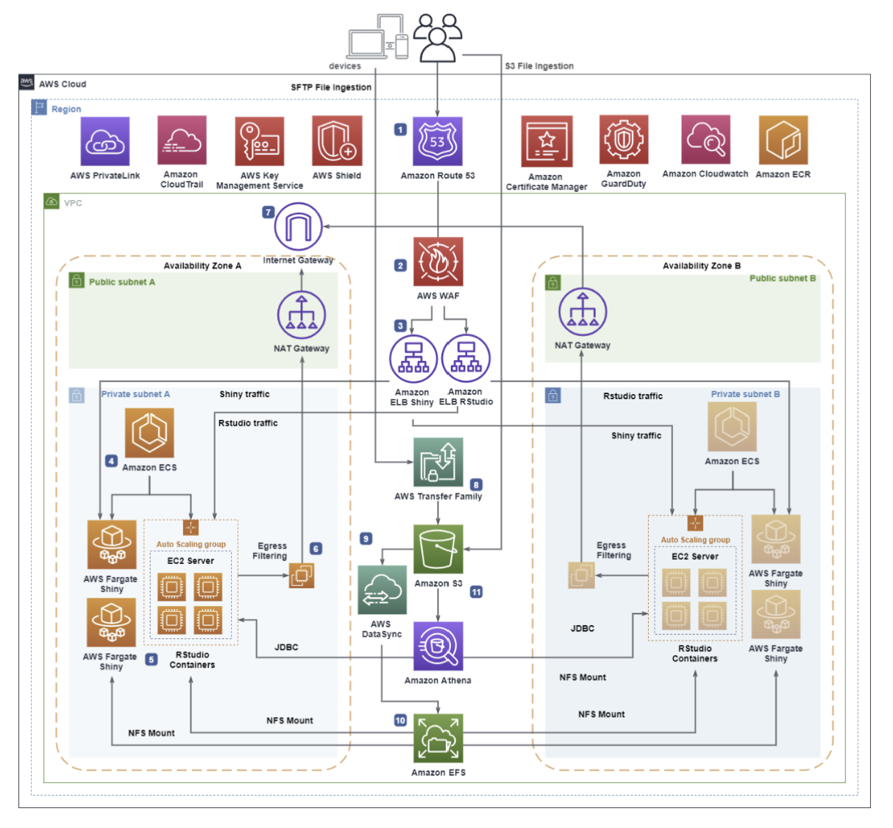

# RStudio/Shiny를 AWS Fargate로 확장하는 서버리스 아키텍처 분석

## 1. 개요

### RStudio Server

RStudio Server는 데이터 분석과 통계에 특화된 프로그래밍 언어인 **R**을 위한 웹 기반 IDE입니다. 로컬 PC에 프로그램을 설치하는 대신 브라우저에서 접속하여 R 코드를 작성하고 실행할 수 있습니다. 데이터 사이언티스트들이 데이터 전처리, 통계 분석, 머신러닝 모델 학습 등을 수행하는 작업 공간으로 활용합니다.

### Shiny Server

Shiny Server는 RStudio에서 개발한 R 코드 기반의 **인터랙티브 웹 대시보드**를 배포하고 서빙하는 서버입니다. 데이터 사이언티스트가 RStudio에서 분석한 결과물을 Shiny 앱으로 만들면 비개발자인 비즈니스 사용자들도 브라우저에서 시각화된 차트와 대시보드를 통해 인사이트를 확인할 수 있습니다. 즉 RStudio가 **분석하는 공간**이라면 Shiny는 **공유하는 공간**입니다.

### 왜 서버리스 아키텍처가 필요한가?

클라우드에서 가상 서버 인프라를 사용해 R 워크로드를 운영하는 것은 가능하지만 컨테이너화는 훨씬 더 큰 운영상의 이점을 제공합니다. R 워크로드를 AWS 서버리스 모델로 마이그레이션하면 관리형 인프라, 확장성, 보안의 혜택을 누릴 수 있습니다. 인프라를 관리하는 대신 애플리케이션 개발에만 집중할 수 있고 대시보드를 사용하는 사용자 수요에 맞춰 유연하게 확장할 수 있습니다.

데이터 사이언티스트들은 분석 결과를 빠르게 시각화하고 공유하기 위해 **RStudio Server**와 **Shiny Server**를 활발히 사용합니다. 그러나 전통적인 방식처럼 온프레미스 유닉스 서버나 단순 VM 위에서 이 도구들을 운영하면 다음과 같은 문제가 발생합니다.

- 인프라 패치 및 유지보수 부담
- 트래픽 급증 시 수동 확장의 어려움
- 고가용성 구성의 복잡성
- 보안 관리 범위의 확대

이 글은 [Scaling RStudio/Shiny using Serverless Architecture and AWS Fargate](https://aws.amazon.com/ko/blogs/architecture/scaling-rstudio-shiny-using-serverless-architecture-and-aws-fargate/) 포스트를 바탕으로 해당 아키텍처를 분석합니다.

핵심 목표는 세 가지입니다.

1. **서버리스(Serverless)**: 인프라 관리 부담을 AWS로 위임
2. **확장성(Scalability)**: 사용자 수요에 따라 자동으로 컨테이너 확장
3. **보안(Security)**: AWS Well-Architected Framework 보안 원칙 준수

이 아키텍처는 오픈소스 RStudio를 **AWS Fargate** 위에서 구현합니다. Fargate는 Amazon ECS와 Amazon EKS에 컴퓨팅 용량을 제공하는 서버리스 컨테이너 서비스로 서버를 직접 프로비저닝하거나 관리할 필요가 없습니다. 애플리케이션별로 리소스를 지정하고 사용한 만큼만 비용을 지불하며 컨테이너 실행 인프라가 항상 최신 패치 상태로 유지되어 보안도 강화됩니다. 또한 아키텍처의 모든 구성 요소가 서버리스 인프라로 이루어져 있어서 사용자는 컨테이너화된 애플리케이션 관리에만 집중하면 됩니다.

---

## 2. 아키텍처 분석

### 2.1 트래픽 진입 계층 (Ingress Layer)

#### Amazon Route 53

사용자가 RStudio 또는 Shiny App에 접근할 때 가장 먼저 만나는 서비스입니다. Route 53은 DNS 서비스로 들어오는 요청을 적절한 엔드포인트로 라우팅합니다. 서브도메인 형태로 RStudio와 Shiny 각각의 URL을 분리하여 제공합니다. 예를 들어 `rstudio.mycompany.com`, `shiny.mycompany.com` 형태로 운영됩니다.

#### AWS WAF

Route 53으로 들어온 요청은 WAF를 통과합니다. WAF는 SQL Injection, XSS 등을 차단하고 IP 기반 차단 규칙을 적용하며 허용된 IP 범위에서만 RStudio/Shiny에 접근하도록 제한할 수 있습니다. 이 아키텍처에서 WAF는 ALB 앞에 배치되어 애플리케이션 레이어 공격을 사전에 차단합니다.

#### Application Load Balancer

WAF를 통과한 유효한 요청은 ALB로 전달됩니다. ALB는 두 가지 역할을 수행합니다.

첫째 **HTTPS 인증서 검증**입니다. ACM에서 발급된 인증서를 통해 TLS 암호화 통신을 보장합니다. 평문(HTTP) 트래픽을 허용하지 않고 모든 통신을 암호화합니다.

둘째 **ECS 서비스로의 트래픽 분산 및 헬스 체크**입니다. 컨테이너가 비정상 상태가 되면 ECS에 알려 새 컨테이너를 시작시키고 비정상 타겟을 자동으로 제거합니다.

### 2.2 컨테이너 실행 계층 (Compute Layer)

#### AWS Fargate + Amazon ECS

Fargate는 EC2 인스턴스를 직접 관리할 필요 없이 컨테이너를 실행하는 서버리스 컨테이너 플랫폼입니다.

**RStudio 컨테이너의 특성**

- 오픈소스 버전은 수평 확장이 제한됩니다. 데이터 사이언티스트 1인당 컨테이너 1개를 별도 URL로 제공하는 방식으로 확장합니다.
- 컴퓨팅 요구사항이 Fargate 한계를 초과할 경우 ECS EC2 Launch Type으로 전환할 수 있습니다.

**Shiny 컨테이너의 특성**

- 요청 수, CPU/메모리 사용량에 따라 자동 수평 확장이 가능합니다.
- 대시보드 사용자 트래픽을 효과적으로 처리합니다.

두 개 이상의 Availability Zone에 컨테이너가 분산 배치됩니다. 한 AZ에 장애가 발생해도 다른 AZ의 컨테이너가 서비스를 유지합니다.

**Amazon ECS Exec:** 운영 중인 컨테이너에 직접 접근이 필요할 때 Amazon ECS Exec을 사용합니다. SSH 없이 실행 중인 RStudio 및 Shiny 컨테이너에 셸을 열거나 명령어를 실행할 수 있어 디버깅과 진단에 활용됩니다.

#### Amazon ECR

RStudio와 Shiny의 컨테이너 이미지를 저장하고 관리하는 프라이빗 컨테이너 레지스트리입니다. ECR을 사용하면 이미지가 AWS 계정 내에서만 관리되므로 외부 노출 위험이 없습니다. ECR은 이미지 푸시 시 자동으로 취약점 스캔을 수행하며 크로스 계정 접근도 IAM 정책으로 세밀하게 제어할 수 있습니다.

### 2.3 스토리지 계층 (Storage Layer)

#### Amazon EFS

RStudio와 Shiny 컨테이너 모두에 마운트되는 **공유 영구 파일 시스템**입니다. EFS의 핵심 역할은 다음과 같습니다.

- RStudio에서 개발한 Shiny App을 `/srv/shiny-server/` 경로로 복사하면 Shiny 컨테이너가 즉시 해당 앱을 서빙합니다. 컨테이너 재시작 시에도 데이터가 유지됩니다.
- AWS KMS로 저장 데이터를 암호화합니다.
- 여러 AZ에 데이터를 복제하여 내구성을 보장합니다.
- EFS 백업이 자동으로 활성화되어 파일 보호가 이루어집니다.

#### Amazon S3 + AWS DataSync + AWS Transfer Family

데이터 파일을 컨테이너에 전달하는 파이프라인입니다.

1. 사용자가 **AWS Transfer Family(SFTP)** 또는 직접 S3 업로드로 파일을 S3 버킷에 업로드합니다.
2. **AWS DataSync**가 S3의 파일을 EFS로 동기화합니다. 정기 스케줄 또는 Lambda 트리거를 통한 온디맨드 방식으로 실행됩니다.
3. **Amazon EventBridge**로 이벤트 기반 오케스트레이션을 구성할 수 있습니다.

### 2.4 데이터 분석 계층 (Analytics Layer)

#### Amazon Athena

RStudio 컨테이너에서 JDBC 연결을 통해 S3에 저장된 데이터를 표준 SQL로 직접 쿼리합니다. Athena는 서버리스 쿼리 서비스이므로 별도의 데이터베이스 서버 관리 없이 대규모 데이터를 분석할 수 있습니다. S3 버킷의 데이터를 Athena 테이블로 정의하고 RStudio에서 R 코드로 쿼리 결과를 받아 시각화하는 워크플로가 가능합니다.

### 2.5 프라이빗 통신 계층 (Private Communication Layer)

#### AWS PrivateLink (VPC 엔드포인트)

컨테이너가 S3, ECR, CloudWatch, Secrets Manager 등 AWS 서비스와 통신할 때 NAT Gateway를 통해 인터넷을 경유하지 않고 AWS 내부 백본 네트워크를 통해 직접 연결합니다. VPC 엔드포인트 정책을 함께 적용하면 특정 계정의 리소스만 접근을 허용하는 세밀한 제어도 가능합니다.

### 2.6 로깅 및 모니터링 계층

- **AWS CloudTrail**: 모든 API 호출 기록 및 감사 로그
- **Amazon CloudWatch**: 컨테이너 및 서비스 메트릭, 로그 집계
- **AWS Control Tower**: 멀티 계정 환경에서 중앙 감사 계정으로 로그 집계

---

## 3. 보안 관점 분석

원본 아키텍처도 AWS Well-Architected Framework를 기반으로 탄탄한 보안 설계를 갖추고 있습니다. 더 높은 보안 수준이 필요한 경우 다음 요소들을 추가적으로 고려할 수 있습니다.

### 3.1 기본 보안 구성

#### Amazon GuardDuty

배포 계정 내 위협을 탐지하는 서비스입니다. AWS Organizations와 연동하여 멀티 계정 전반의 위협을 중앙에서 탐지하며 VPC Flow Logs, CloudTrail, DNS 쿼리 로그를 ML로 분석해 비정상 행위를 자동으로 식별합니다.

#### AWS Shield

Route 53 리소스에 대한 DDoS 공격을 방어합니다. 기본 제공되는 Shield Standard 외에 더 높은 수준의 공격 방어가 필요한 경우 Shield Advanced를 구독할 수 있습니다.

### 3.2 AWS Secrets Manager를 활용한 자격증명 관리

현재 아키텍처는 RStudio 프론트엔드 사용자가 로컬 리눅스 계정으로 인증합니다. 패스워드나 Athena 접근 키 같은 민감한 자격증명을 환경변수나 코드에 하드코딩하는 것은 보안 리스크입니다.

AWS Secrets Manager를 사용하면 자격증명을 안전하게 저장하고 자동 교체를 설정할 수 있습니다. 컨테이너는 런타임에 Secrets Manager에서 자격증명을 동적으로 가져오고 IAM 정책으로 특정 컨테이너만 특정 시크릿에 접근하도록 제한합니다. AWS KMS로 시크릿 자체도 암호화됩니다.

### 3.3 GuardDuty Runtime Monitoring 활성화

원본 아키텍처에서는 GuardDuty를 계정 레벨 위협 탐지에 활용하지만 Fargate에서의 런타임 모니터링은 별도로 활성화해야 합니다.

GuardDuty Runtime Monitoring을 활성화하면 경량 보안 에이전트가 파일 접근 패턴, 프로세스 실행, 네트워크 연결을 실시간으로 분석합니다. 권한 상승 시도, 노출된 자격증명 사용, 악성 IP와의 통신 등을 즉시 탐지합니다. 컨테이너 내부에서 발생하는 공격을 런타임 레벨에서 탐지하는 기능입니다.

---

**참고 자료**

- AWS Architecture Blog. Scaling RStudio/Shiny using Serverless Architecture and AWS Fargate (2021). [https://aws.amazon.com/ko/blogs/architecture/scaling-rstudio-shiny-using-serverless-architecture-and-aws-fargate/](https://aws.amazon.com/ko/blogs/architecture/scaling-rstudio-shiny-using-serverless-architecture-and-aws-fargate/)
- AWS Security Blog. Security considerations for running containers on Amazon ECS (Updated 2024). [https://aws.amazon.com/blogs/security/security-considerations-for-running-containers-on-amazon-ecs/](https://aws.amazon.com/blogs/security/security-considerations-for-running-containers-on-amazon-ecs/)
