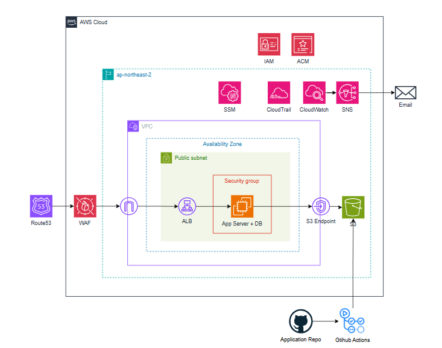

# 바이브코딩 아키텍처 설계

## 1. 전체 아키텍처



### 1.1 아키텍처 개요 및 설계 원칙
이 아키텍처는 1인 개발자가 바이브코딩(AI 생성 코드) 기반 서비스를 AWS에 배포할 때 적용할 수 있는 보안 최소 기준입니다. 비용과 운영 복잡도를 최소화하면서도 실질적인 보안 위협을 차단하는 것을 목표로 합니다.
구성 서비스는 Route53, WAF, ALB, EC2(App + DB), S3이며 ap-northeast-2(서울) 리전의 단일 가용 영역에 배포합니다. 인증·접근 제어는 IAM과 ACM이 담당하고, 운영 접속은 SSM, 감사 로그는 CloudTrail, 리소스 모니터링은 CloudWatch가 담당합니다.
설계의 핵심 원칙은 세 가지입니다. 첫째, 외부에서 EC2로 직접 접근하는 모든 경로를 구조적으로 차단합니다. ALB를 단일 진입점으로 두고 EC2 Security Group은 ALB SG 참조로만 트래픽을 허용합니다. 둘째, 자격증명을 코드와 완전히 분리합니다. IAM Instance Profile로 임시 자격증명을 사용하고, 민감 정보는 .env로 관리하며 코드에 하드코딩하지 않습니다. 셋째, 각 서비스에 필요한 최소 권한만 부여합니다. EC2 IAM Role은 SSM 접속과 특정 S3 버킷 접근만 허용하고, S3는 해당 EC2 Role에서만 접근 가능하도록 버킷 정책을 설정합니다. 

### 1.2 사용자 접근 흐름
Route53에서 도메인을 ALB로 라우팅합니다. HTTP 80 요청은 ALB에서 HTTPS로 자동 리다이렉트합니다. ALB에서 TLS 종단 처리 후 ALB에 연결된 AWS WAF가 SQLi, XSS 등 L7 공격을 필터링합니다. 필터링을 통과한 요청은 EC2 앱 포트로 전달됩니다. EC2에서 요청을 처리하고 필요 시 localhost DB 또는 S3 VPC Gateway Endpoint를 통해 S3에 접근합니다.
개발자의 EC2 접속 경로는 별도로 분리되어 있습니다. SSH 포트는 완전히 차단되어 있으며, AWS Console 또는 AWS CLI에서 SSM Session Manager를 통해 EC2에 접속합니다. DB GUI 툴이 필요한 경우 SSM Port Forwarding으로 로컬에서 터널링하여 접근합니다.

### 1.3 월 예상 비용
- 아시아 태평양(서울) 기준

| 서비스 | 비용 | per |
| --- | --- | --- |
| WAF | WebACL(5$) + AWS 관리형 규칙 2개 (2$) = 7 $| 고정 비용/월 |
| WAF | 0.006 $ | 10,000 요청 당/월 |
| ALB | 16.43 $ (1 로드 밸런서 x 0.0225 시간당 USD x 730 시간(1달 기준) ) | 개당/월 |
| Cloudwatch | 표준 해상도 지표(Standard resolution**)** 0.1 $ | 경보 개당/월 |
| Cloudwatch | 표준 로그(EC2, cloudtrail 등) 0.76 $ | 1GB/월 |
| S3 | 1GB 저장 + 소량 PUT/GET 요청 기준 0.07$ | 1GB/월  |
| SNS | 이메일 알람 0.18 $ (1,000 호출까지 무료, 이후 호출 당 0.00002 $) | 10,000 알림/월 |
| Cloudtrail | 관리 이벤트/읽기 관리 이벤트 트레일 수가 1개일 때 0 $ |
| SSM session manager | Session Manager 자체 0 $ (로그 저장 시 CloudWatch/S3 비용 발생) |
| ACM | 무료  | - |

### 1.3.1. 10,000 요청당 서비스 합계
* **WAF**: 0.006 $
* **SNS**: 0.18 $
* **합계**: **0.186 $ / 월**

### 1.3.2. 1GB당 서비스 합계
* **CloudWatch 표준 로그**: 0.76 $
* **S3**: 0.07$
* **합계**: **0.83 $ / 월**

### 1.3.3. 나머지 서비스 합계 (고정/개당/월)
* **WAF 고정**: 7 $
* **ALB**: 16.43 $
* **CloudTrail**: 0$
* **CloudWatch 경보 1개**: 0.1 $
* **SSM Session Manager**: 0$
* **ACM**: 0 $
* **합계**: **23.53 $ / 월**

### 최종 정리

| 구분 | 합계 |
| :--- | :--- |
| **10,000 요청당 서비스 총합** | **0.186 $ / 월** |
| **1GB당 서비스 총합** | **0.83 $ / 월** |
| **나머지 서비스 총합** | **23.53 $ / 월** |

**총 합계:** **24.546 $ / 월**


<br>

## 2. 서비스별 상세 설계
### 2.1 ALB (Application Load Balancer)
- **설정 방식**: 인터넷(0.0.0.0/0)에서 오는 HTTPS(443) 트래픽만 Inbound로 허용합니다. HTTP(80)는 수신하되 HTTPS(443)로 자동 리다이렉트 처리합니다. Outbound는 EC2로의 트래픽 전달을 위해 전체 허용합니다. ACM(AWS Certificate Manager)에서 발급한 인증서를 ALB에 연결하여 TLS 종단을 처리합니다. ALB에 AWS WAF WebACL을 연결하여 TLS 복호화 이후 수신 시점에 L7 공격을 필터링합니다.

| 방향 | 포트 | 소스 | 목적 |
| :--- | :--- | :--- | :--- |
| Inbound | 443 (HTTPS) | 0.0.0.0/0 | 사용자 트래픽 수신 |
| Inbound | 80 (HTTP) | 0.0.0.0/0 | HTTPS 리다이렉트용 |
| Outbound | 전체 허용 | — | EC2로 트래픽 전달 |

- **설계 이유**: ALB를 인터넷과 EC2 사이의 단일 진입점으로 두면 EC2를 외부에 직접 노출하지 않아도 됩니다. TLS 처리를 ALB에서 끝내면 EC2는 평문 트래픽만 처리하면 되므로 구조가 단순해집니다. ACM 인증서는 자동 갱신되므로 인증서 만료 사고를 예방할 수 있습니다.

- **반영된 보안 요소**: 평문(HTTP) 전송 완전 차단, TLS 인증서 자동 갱신, EC2 직접 노출 차단, 단일 진입점 통제, WAF L7 필터링 적용.

### 2.2. EC2 (App Server + DB)

- **설정 방식**: EC2 Security Group의 Inbound는 ALB Security Group 참조로만 허용합니다. SSH(22) 포트는 Security Group에서 완전히 제거하고 SSM Session Manager로 대체합니다. DB(MySQL 3306)는 EC2와 동일 인스턴스에서 localhost로만 접근하며 외부에 포트를 열지 않습니다. Outbound는 443, 80 포트만 허용하여 패키지 업데이트, SSM 연결, GitHub 코드 pull에 사용합니다. 배포는 GitHub Actions에서 SSM Run Command를 통해 EC2에 명령을 전달하는 방식으로 이루어집니다. SSH 포트 없이 기존 SSM 연결을 재활용하므로 추가 포트 오픈이 불필요합니다.

| 방향 | 포트 | 소스 | 목적 |
| :--- | :--- | :--- | :--- |
| Inbound | 앱 포트 (예: 8080) | ALB SG 참조 | ALB에서 오는 트래픽만 허용 |
| Inbound | 22 (SSH) | 없음 | SSM으로 대체, 포트 자체 제거 |
| Outbound | 443, 80 | 0.0.0.0/0 | 패키지 업데이트, SSM 연결 |

- **설계 이유**: ALB SG 참조 방식은 IP 기반 허용보다 안전합니다. ALB의 IP가 변경되어도 규칙 수정이 불필요하고, ALB를 통하지 않는 직접 접근은 구조적으로 차단됩니다. SSH 포트를 완전히 제거하면 브루트포스 공격 시도 자체가 불가능해집니다. DB를 동일 인스턴스에 두는 것은 비용·운영 복잡도를 낮추기 위한 의도적 선택이며, 외부 포트 노출 없이 localhost 접근만 허용하여 위험을 최소화합니다.

- **반영된 보안 요소**: ALB SG 참조로 트래픽 소스 제한, SSH 포트 제거, DB 외부 포트 미노출, Outbound 최소화.

### 2.3. S3

- **설정 방식**: 버킷의 퍼블릭 액세스를 완전히 차단합니다. EC2 Instance Profile에 부여된 IAM Role ARN만 PutObject, GetObject, DeleteObject를 허용하는 버킷 정책을 설정합니다. aws:SecureTransport 조건으로 HTTPS가 아닌 요청은 전체 Deny합니다. EC2에서 S3로 가는 트래픽은 S3 VPC Gateway Endpoint를 통해 AWS 내부망으로 라우팅합니다. Gateway Endpoint 생성 후 반드시 VPC Route Table에 S3 Endpoint 경로를 추가해야 실제 내부망 라우팅이 적용됩니다.

```json
{
  "Version": "2012-10-17",
  "Statement": [
    {
      "Sid": "AllowEC2Role",
      "Effect": "Allow",
      "Principal": {
        "AWS": "arn:aws:iam::ACCOUNT_ID:role/ec2-role"
      },
      "Action": ["s3:PutObject", "s3:GetObject", "s3:DeleteObject"],
      "Resource": "arn:aws:s3:::my-bucket/*"
    },
    {
      "Sid": "AllowGithubActionsRole",
      "Effect": "Allow",
      "Principal": {
        "AWS": "arn:aws:iam::ACCOUNT_ID:role/github-actions-role"
      },
      "Action": ["s3:PutObject"],
      "Resource": "arn:aws:s3:::my-bucket/*"
    },
    {
      "Sid": "DenyNonHttps",
      "Effect": "Deny",
      "Principal": "*",
      "Action": "s3:*",
      "Resource": [
        "arn:aws:s3:::my-bucket",
        "arn:aws:s3:::my-bucket/*"
      ],
      "Condition": {
        "Bool": {"aws:SecureTransport": "false"}
      }
    }
  ]
}
```

- **설계 이유**: 퍼블릭 액세스 차단과 IAM Role 기반 접근 제어를 함께 적용하면 자격증명 없이는 버킷에 접근할 수 없습니다. Gateway Endpoint는 인터넷을 경유하지 않으므로 전송 중 데이터 노출 위험이 줄고, 별도 비용이 발생하지 않습니다. HTTPS 강제로 전송 구간 암호화를 보장합니다.

- **반영된 보안 요소**: 퍼블릭 액세스 완전 차단, IAM Role 기반 최소 권한 접근, HTTPS 강제, 인터넷 비경유 내부망 라우팅.

### 2.4. IAM

- **설정 방식**: 루트 계정은 MFA를 설정하고 Access Key를 생성하지 않으며 일상 작업에 사용하지 않습니다. 일상 작업용 IAM User 1개를 생성하고 MFA를 설정합니다. AdministratorAccess를 부여하되, MFA 인증이 없으면 모든 API를 Deny하는 정책을 추가로 연결합니다(aws:MultiFactorAuthPresent 조건 사용). 단, 이 Deny 정책을 적용하기 전에 반드시 MFA 설정을 먼저 완료해야 합니다. MFA가 설정되지 않은 상태에서 정책을 먼저 연결하면 MFA 설정 페이지 접근도 차단되어 계정이 잠깁니다. EC2에는 필요한 권한만 담긴 IAM Role을 Instance Profile로 부여합니다. 부여 권한은 AmazonSSMManagedInstanceCore와 특정 S3 버킷 ARN 지정 s3:PutObject, GetObject, DeleteObject로 한정합니다. Access Key를 EC2에 직접 넣는 방식은 사용하지 않습니다. GitHub Actions 배포에 사용하는 IAM User에는 ssm:SendCommand 권한을 별도로 부여해야 합니다. 이 권한이 없으면 GitHub Actions에서 EC2로 배포 명령을 전달할 수 없습니다.

[EC2 Instance Profile]

| 권한 | 목적 |
| :--- | :--- |
| AmazonSSMManagedInstanceCore | SSM Session Manager 접속 |
| s3:PutObject, s3:GetObject, s3:DeleteObject | 특정 S3 버킷만, ARN 지정 |

- **설계 이유**: 루트 계정 탈취는 계정 전체 장악으로 이어지므로 MFA와 Access Key 미생성으로 공격 표면을 최소화합니다. IAM User에 MFA 강제 정책을 추가하면 자격증명이 유출되더라도 MFA 없이는 API 호출이 불가능합니다. EC2에 Instance Profile을 사용하면 자격증명이 코드나 파일에 노출되지 않고 IAM 서비스가 임시 자격증명을 자동으로 관리합니다.

- **반영된 보안 요소**: 루트 계정 MFA 강제, IAM User MFA 미인증 시 전체 API 차단, EC2 최소 권한 부여, 임시 자격증명 사용으로 Access Key 미노출.

### 2.5. SSM Session Manager

- **설정 방식**: SSH 대신 AWS Systems Manager Session Manager로 EC2에 접속합니다. EC2 Instance Profile에 AmazonSSMManagedInstanceCore 권한을 부여하고, EC2가 아웃바운드로 SSM 엔드포인트(443)에 연결하는 방식으로 동작합니다. 이 아키텍처는 Public Subnet에 EC2가 위치하므로 EC2에 퍼블릭 IP 또는 Elastic IP가 할당되어 있어야 SSM 연결이 가능합니다. Private Subnet 환경이라면 SSM VPC 인터페이스 엔드포인트가 별도로 필요하지만 이 아키텍처에서는 해당되지 않습니다. Inbound 규칙 추가 없이 접속이 가능합니다. DB GUI 툴 접근이 필요한 경우 SSM Port Forwarding으로 로컬 포트에서 DB 포트로 터널링합니다.

- **설계 이유**: SSH는 포트(22)를 외부에 노출해야 하므로 브루트포스, 키 유출 위험이 있습니다. SSM은 아웃바운드 연결 방식이라 Inbound 포트를 열 필요가 없고, IAM 권한 기반으로 접근이 제어되므로 SSH 키 관리가 불필요합니다. 세션 로그를 CloudWatch 또는 S3에 저장할 수 있어 접속 감사도 가능합니다.

- **반영된 보안 요소**: SSH 포트(22) 완전 제거, IAM 기반 접근 제어, Inbound 포트 미노출, 접속 세션 로깅 가능.

### 2.6. CloudTrail

- **설정 방식**: CloudTrail을 활성화하여 AWS 관리 이벤트(Management Events)를 90일간 무료 보관합니다. 별도 S3 저장 없이 기본 Event History만 사용합니다. S3 객체 수준 접근 로그 등 데이터 이벤트는 기본 보관 대상에 포함되지 않으며, 필요 시 별도 Trail을 생성해야 하고 이 경우 추가 비용이 발생합니다.

- **설계 이유**: 누가, 언제, 어떤 API를 호출했는가를 기록하는 핵심 감사 데이터입니다. 기본 90일 보관은 무료이므로 별도 비용 없이 사고 발생 시 사후 분석에 활용할 수 있습니다.

- **반영된 보안 요소**: AWS API 호출 전체 감사 로그 보관, 사고 발생 시 사후 추적 가능.

### 2.7. CloudWatch

- **설정 방식**: EC2의 CPU 사용률, 디스크 I/O 등 인스턴스 리소스 사용량을 모니터링합니다. 별도 Agent 설치 없이 CloudWatch 기본 지표로 수집됩니다. 임계값 초과 시 알림을 받으려면 SNS 토픽을 먼저 생성하고 이메일 구독을 추가한 뒤 구독 확인 이메일을 직접 승인해야 합니다. 구독 확인을 완료하지 않으면 알람이 발동해도 이메일이 발송되지 않습니다.

- **설계 이유**: EC2에 App과 DB가 동거하는 구조이므로 리소스 부족이 서비스 전체 장애로 직결됩니다. 배포 중 빌드 연산으로 CPU가 급증하는 구간이 있으므로 임계값을 사전에 설정해두면 장애를 조기에 감지할 수 있습니다.

- **반영된 보안 요소**: EC2 리소스 이상 징후 조기 감지, SNS 이메일 실시간 알림.

### 2.8. WAF

- **설정 방식**: ALB에 AWS WAF를 연결하고 AWSManagedRulesCommonRuleSet을 기본으로 적용합니다. 여기에 더해 SQL Injection 공격을 전용으로 차단하는 AWSManagedRulesSQLiRuleSet을 별도 Rule Group으로 추가 적용합니다. 예상 비용은 WebACL $5/월 + Rule Group당 $1/월 + 요청 처리 비용(백만 건당 $0.60)/월 수준입니다.

- **설계 이유**: 바이브코딩(AI 생성 코드) 특성상 코드 레벨의 보안 취약점이 존재할 가능성이 높습니다. OWASP Top 10 (2025) 기준으로 AWS WAF Managed Rule Group은 Injection(A05), Broken Access Control(A01), Authentication Failures(A07) 등 주요 카테고리에 대한 방어 레이어를 제공합니다. 특히 AWSManagedRulesSQLiRuleSet은 쿼리 파라미터, 요청 본문, 쿠키 등에서 전형적인 SQL Injection 패턴을 신뢰성 있게 탐지합니다.

- **반영된 보안 요소**: OWASP Top 10 주요 항목 방어 레이어 확보, SQL Injection 전용 룰셋 추가 적용, XSS 및 비정상 요청 차단, 알려진 악성 IP 자동 차단, AI 생성 코드의 취약점 보완.

### 2.9 GitHub Actions + Semgrep

- **설정 방식**: GitHub Actions 워크플로우에 Semgrep을 연동하여 PR 생성 및 main 브랜치 push 시점에 자동으로 정적 분석(SAST)을 실행합니다. 적용 룰셋은 p/owasp-top-ten, p/secrets, p/default를 기본으로 사용합니다. 비용은 Semgrep OSS 무료, GitHub Actions 월 2,000분 무료 제공입니다.

```yaml
# .github/workflows/semgrep.yml
name: Semgrep SAST

on:
  push:
    branches: [main]
  pull_request:

permissions:
  contents: read

jobs:
  semgrep:
    runs-on: ubuntu-latest
    steps:
      - uses: actions/checkout@v4

      - uses: semgrep/semgrep-action@v1
        with:
          config: >-
            p/owasp-top-ten
            p/secrets
            p/default
```

- **설계 이유**: 바이브코딩 특성상 인가 체크 누락, 하드코딩된 시크릿, 직접 파라미터 참조 등의 패턴이 코드에 포함될 가능성이 높습니다. Semgrep은 AST 기반 패턴 매칭으로 이러한 코드 구조를 커밋 시점에 탐지하며, p/secrets 룰셋으로 하드코딩된 시크릿까지 별도 도구 없이 단일 워크플로우에서 커버합니다. GitHub Actions 인증은 OIDC 방식을 사용하여 Access Key 없이 임시 자격증명으로 AWS 리소스에 접근합니다.

- **반영된 보안 요소**: OWASP Top 10 주요 항목 코드 레벨 탐지, URL 파라미터를 인가 체크 없이 DB 쿼리에 직접 사용하는 IDOR 유발 패턴 탐지, API 키·시크릿·토큰 등 하드코딩 탐지, SQL Injection 유발 패턴 탐지, PR 단계 보안 게이트로 프로덕션 배포 전 취약점 사전 차단, OIDC 기반 Access Key 미사용 인증.

[Role에 S3 업로드 정책을 부여한 코드]

```hcl
{
  "Sid": "AllowGithubActionsRole",
  "Effect": "Allow",
  "Principal": {
    "AWS": "arn:aws:iam::ACCOUNT_ID:role/github-actions-role"
  },
  "Action": ["s3:PutObject", "s3:GetObject"],
  "Resource": "arn:aws:s3:::my-bucket/builds/*"
}
```

## 3. 위협 모델링

### 3.1. 아키텍처에서 대응된 위협

| 위협 | 위협 설명 | 방어 방법 | 방어 방법 상세 설명 |
| :--- | :--- | :--- | :--- |
| **SQLi / XSS 등 웹 공격** | 악성 쿼리나 스크립트를 요청에 삽입하여 DB 탈취 또는 브라우저를 공격합니다. | WAF Managed Rules (CommonRuleSet, SQLiRuleSet) | Route53으로 유입된 모든 트래픽은 WAF를 먼저 통과합니다. CommonRuleSet과 SQLiRuleSet이 알려진 웹 공격 패턴을 자동으로 탐지 및 차단하므로, 악성 요청이 ALB 및 EC2에 도달하기 전에 필터링됩니다. |
| **ALB 직접 우회 공격** | WAF를 거치지 않고 ALB 엔드포인트를 직접 호출하여 필터링을 우회합니다. | ALB Security Group (EC2 SG 참조) | ALB의 Security Group을 통해 EC2 Inbound는 ALB에서 오는 트래픽만 허용합니다. WAF를 우회하여 ALB에 직접 요청이 도달하더라도 EC2로의 접근은 ALB SG 참조 규칙으로 차단됩니다. |
| **EC2 직접 접근 (SSH)** | 외부에서 SSH(22) 포트로 서버에 직접 접근을 시도합니다. | SSH 차단 + SSM Session Manager | Security Group에서 SSH(22) 포트를 완전히 제거합니다. EC2 접속은 SSM Session Manager로만 허용하며, SSM은 EC2가 아웃바운드로 SSM 엔드포인트에 연결하는 방식이라 Inbound 규칙 추가가 불필요합니다. |
| **S3 직접 접근** | 사용자가 S3 URL로 버킷 객체에 직접 접근을 시도합니다. | S3 퍼블릭 액세스 차단 + 버킷 정책 (EC2 Role만 허용) | S3 버킷의 퍼블릭 액세스를 완전히 차단하고, EC2 Instance Profile Role에서만 접근 가능하도록 버킷 정책을 설정합니다. 외부에서의 직접 URL 접근 요청은 모두 거부됩니다. |
| **S3 데이터 평문 전송** | HTTP를 통해 S3로 전송되는 데이터가 평문으로 노출됩니다. | S3 버킷 정책 (aws:SecureTransport Deny) + S3 Gateway Endpoint | 버킷 정책에서 aws:SecureTransport가 false인 요청을 전체 Deny하여 HTTPS가 아닌 접근을 차단합니다. 또한 EC2→S3 트래픽은 S3 VPC Gateway Endpoint를 통해 AWS 내부망으로만 라우팅되어 인터넷을 경유하지 않습니다. |
| **DB 외부 접근** | 외부에서 DB 포트(3306/5432)를 직접 공격하여 데이터를 탈취합니다. | localhost 접근 + DB 포트 미개방 | DB는 EC2와 동일 인스턴스에 위치하여 localhost로만 접근합니다. Security Group에서 DB 포트를 외부에 일절 열지 않으며, DB GUI 접근이 필요한 경우 SSM Port Forwarding을 사용합니다. |
| **크립토재킹 / EC2 리소스 남용** | EC2가 침해된 후 암호화폐 채굴 등 비정상적인 연산에 악용됩니다. | CloudWatch CPU 사용률 알람 + SNS 이메일 알림 | CloudWatch에서 EC2 CPU Utilization 메트릭을 모니터링하고, 임계값(예: 80%) 초과 시 SNS를 통해 이메일 알림을 즉시 발송합니다. 비정상적인 CPU 급등을 빠르게 감지하여 대응할 수 있습니다. |
| **비정상 트래픽 급증** | 갑작스러운 트래픽 증가로 EC2 리소스가 고갈되어 서비스가 중단됩니다. | CloudWatch 메트릭 알람 + SNS 이메일 알림 | CPU Utilization 등 EC2 기본 메트릭에 임계값 알람을 설정합니다. 트래픽 급증으로 인한 리소스 고갈 상황을 조기에 감지하고 이메일 알림을 통해 빠른 수동 대응이 가능합니다. |
| **루트 계정 탈취** | 루트 계정에 무단으로 로그인하여 AWS 전체 리소스를 장악합니다. | MFA 필수 설정 + CloudTrail → CloudWatch 알람 | 루트 계정에 MFA를 설정하고 Access Key를 생성하지 않습니다. CloudTrail 로그를 CloudWatch로 스트리밍하여 루트 계정 콘솔 로그인 발생 즉시 SNS → 이메일 알림을 수신합니다. |
| **IAM Access Key 탈취** | 개발자의 IAM Access Key가 유출되어 AWS 리소스가 악용됩니다. | EC2 Instance Profile (IAM Role) + CloudTrail 알람 | EC2에는 Access Key를 직접 저장하지 않고, 최소 권한의 IAM Role을 Instance Profile로 부여합니다. CloudTrail에서 IAM Access Key 사용 이벤트를 탐지하여 비정상 사용 시 즉시 알림을 수신합니다. |
| **민감 정보 코드 노출** | DB 비밀번호·API Key 등이 코드에 하드코딩되어 GitHub에 유출됩니다. | 환경변수 (.env) + .gitignore | 민감 정보를 코드에 하드코딩하지 않고 .env 파일로 관리합니다. .env 및 .env.* 를 .gitignore에 등록하여 GitHub 업로드를 원천 차단합니다. |
| **CloudTrail 로그 삭제** | 공격자가 침해 흔적을 은폐하기 위해 감사 로그를 삭제합니다. | CloudTrail 활성화 (기본 90일 보관) | CloudTrail을 활성화하여 AWS API 이벤트를 90일간 무료 보관합니다. 로그 삭제·중지 이벤트 자체가 CloudTrail에 기록되므로 사후 분석 시 핵심 근거 데이터로 활용할 수 있습니다. |
| **평문(HTTP) 전송** | 암호화되지 않은 HTTP 요청으로 민감한 데이터가 도청됩니다. | HTTPS 강제 (ACM + ALB Listener 리다이렉트) | ACM 인증서를 ALB에 적용하고, HTTP(80) 요청은 HTTPS(443)로 자동 리다이렉트합니다. 평문 전송 경로를 완전히 차단합니다. |

### 3.2. 수용(감수)한 위협 및 근거

| 위협 | 현재 한계 | 이 규모에서 감수하는 이유 |
| :--- | :--- | :--- |
| **대규모 DDoS 공격** | WAF 기본 규칙으로 알려진 패턴은 차단하나, Shield Advanced 수준의 대규모 volumetric DDoS는 방어하지 못합니다. | 현재 서비스는 소규모 사용자 대상으로, 대규모 DDoS의 주요 표적이 될 가능성이 낮습니다. Shield Advanced는 월 $3,000 수준으로 이 단계에서는 비용 대비 효과가 없습니다. |
| **단일 EC2 장애 (App + DB 동거)** | EC2 장애 시 앱과 DB가 동시에 중단되며, 고가용성(HA)을 보장하지 않습니다. | RDS 분리 및 Multi-AZ 구성은 월 수만 원 이상의 추가 비용이 발생합니다. 초기 바이브코딩 서비스 특성상 빠른 배포와 운영 단순화를 우선합니다. 정기 스냅샷 백업으로 데이터 손실을 최소화합니다. |
| **Private Subnet 미사용** | EC2가 Public Subnet에 위치하여 네트워크 계층의 격리가 이루어지지 않습니다. | NAT Gateway 비용(월 ~$30 이상)이 발생하며, Security Group으로 ALB 트래픽 외 모든 Inbound를 차단하고 있어 실질적인 보호 수준은 유지됩니다. |
| **Secrets Manager 미적용** | .env 파일로 민감 정보를 관리하므로 자동 로테이션 및 중앙 관리가 불가합니다. | Secrets Manager는 시크릿당 월 $0.4의 비용이 발생하며, 1인 개발자 환경에서 .env + .gitignore 조합으로 충분한 수준의 보호가 가능합니다. |
| **CloudWatch 알람 최소화** | CPU Utilization 등 EC2 기본 메트릭 중심으로만 모니터링하며, 정교한 애플리케이션 레벨 위협 탐지는 불가합니다. | 알람 항목이 많아질수록 운영 피로도가 증가합니다. 루트 로그인·IAM Key 사용·CPU 급등 등 핵심 시나리오에 집중하여 실질적인 대응 가능성을 높입니다. |
| **단일 AZ 구성** | 단일 Availability Zone에서 운영하므로 AZ 장애 시 서비스 전체가 중단됩니다. | Multi-AZ 구성은 ALB, EC2, DB 모두 이중화가 필요하여 비용과 복잡도가 크게 증가합니다. 초기 서비스 단계에서는 빠른 배포를 우선하며, 서비스 안정성 요구가 높아지는 시점에 도입을 고려합니다. |

## 4. 한계점 및 향후 개선 방향
### 4.1 현재 아키텍처의 한계

본 아키텍처는 바이브코딩 환경에서 1인 개발자가 소규모 서비스를 빠르게 배포하는 것을 최우선으로 설계하였습니다. AWS Free Tier 범위를 기준으로 비용을 최소화하였으며, EC2 중심의 단순한 구조를 채택하여 운영 부담을 낮추는 데 초점을 맞추었습니다. 이러한 설계 방향에 따라 아래와 같은 구조적 한계가 존재합니다.

| 한계 항목 | 내용 |
| :--- | :--- |
| **단일 EC2 장애점** | App과 DB가 동일 인스턴스에 위치하여 EC2 장애 시 서비스 전체가 중단됩니다. |
| **가용성 미보장** | 단일 AZ, 단일 인스턴스 구성으로 고가용성(HA)을 제공하지 않습니다. |
| **CloudFront 미적용** | CDN 없이 ALB가 직접 노출되어 있어 글로벌 성능 최적화 및 DDoS 완화가 제한됩니다. |
| **Private Subnet 미사용** | EC2가 Public Subnet에 위치하여 네트워크 계층 격리가 이루어지지 않습니다. |
| **민감 정보 관리 수준** | Secrets Manager 없이 .env 파일로 민감 정보를 관리하여 자동 로테이션이 불가합니다. |

이러한 한계는 서비스 초기 단계에서 의도적으로 수용한 트레이드오프이며, 서비스 규모가 성장함에 따라 순차적으로 보완하는 것을 권장합니다.

### 4.2 추가 도입 권고 항목

서비스 규모와 보안 요구 수준이 높아지는 시점에 아래 항목의 순차적 도입을 권고합니다.

| 항목 | 도입 시점 | 기대 효과 |
| :--- | :--- | :--- |
| **CloudFront** | 사용자 증가 시점 | ALB 직접 노출 해소, CDN 성능 확보, DDoS 완화 |
| **RDS 분리 + Private Subnet** | 데이터 중요도 증가 시점 | DB 독립 운영, 네트워크 계층 격리 |
| **AWS Secrets Manager** | 팀 규모 확장 시점 | 민감 정보 중앙 관리 및 자동 로테이션 |
| **Multi-AZ 구성** | 서비스 안정성 요구 시점 | 단일 장애점 해소, 고가용성 확보 |