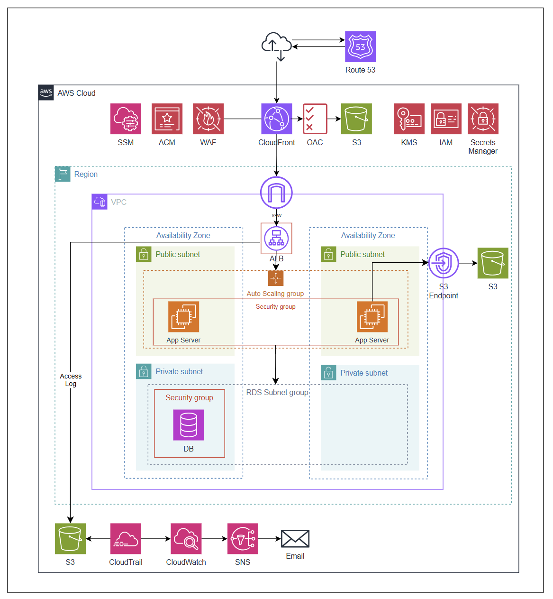
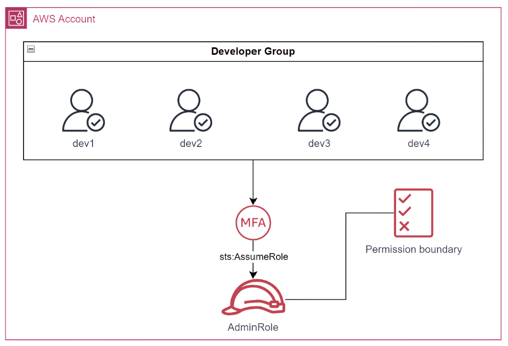
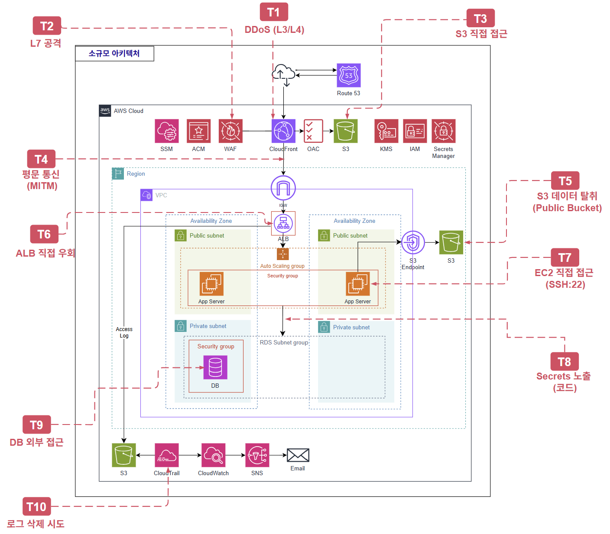
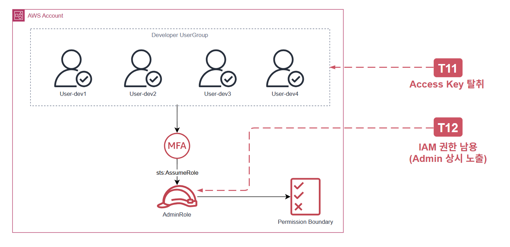

# 소규모 아키텍처 설계

## 1. 전체 아키텍처

### 1.1. 아키텍처 개요 및 설계 원칙

이 아키텍처는 약 1천~1만명 규모의 일반 사용자와 4명의 관리자가 운영하는 환경을 기반으로 설계된 AWS 클라우드 아키텍처입니다. 전반적인 구성은 보안성을 우선으로 하여 설계되었습니다. 소규모 아키텍처에서 운영 복잡도의 증가는 보안성의 감소로 보았기 때문에 복잡도를 크게 증가하지 않는 선에서  가용성, 운영 효율성 등을 고려하여 설계 하였습니다.
이 아키텍처는 사용자 1천~1만명, 관리자 4명 규모의 환경을 기반으로 설계된 AWS 클라우드 아키텍처입니다.

사용하는 주요 서비스는 DNS 및 CDN 계층의 Route 53, CloudFront, 컴퓨팅 계층의 EC2와 Auto Scaling Group, 데이터 계층의 RDS와 S3, 보안 서비스로 WAF, ACM, IAM, KMS, Secrets Manager, 운영 도구로 SSM, 모니터링으로 CloudTrail, CloudWatch, SNS입니다.

설계의 첫 번째 기준은 **보안성**입니다. 
규모와 무관하게 사용자 데이터와 인프라 자산 보호는 기본 요건이며, 최소한의 보안 기준을 충족하지 않으면 데이터 유출이나 서비스 침해로 이어질 수 있습니다. 

두 번째 기준은 **운영 복잡도 최소화**입니다. 
4인 팀이 개발과 운영을 병행하는 환경에서는 구조의 단순함 자체가 안정성과 직결됩니다. 

세 번째 기준은 **비용 효율**입니다. 초기 스타트업 환경에서는 현재 규모에서 효용보다 비용이 앞서는 구성 요소 도입을 지양하였습니다.

### 1.2. 사용자 접근 흐름
**(1) 일반 사용자 접근 흐름**
 
사용자가 도메인에 접속하면 Route 53이 DNS 쿼리를 처리하여 CloudFront로 라우팅합니다. 
CloudFront는 ACM 인증서를 통해 HTTPS 통신을 보장하며, 정적 콘텐츠는 OAC를 통해 S3에서 직접 조회하여 제공합니다. 
S3 버킷은 퍼블릭 접근이 차단되어 CloudFront를 통해서만 접근 가능합니다.
동적 요청은 Internet Gateway를 통해 퍼블릭 서브넷의 App Server로 전달됩니다. 
App Server는 Security Group으로 보호되며 Auto Scaling Group에 의해 부하에 따라 자동으로 인스턴스 수가 조절됩니다. 
App Server는 프라이빗 서브넷의 DB에 접근하며, S3와의 통신은 VPC Endpoint를 경유하여 인터넷을 거치지 않고 처리합니다.

**(2) 관리자 접근 흐름**
 
관리자는 SSH 포트를 별도로 개방하지 않으며, SSM Session Manager를 통해 App Server에 접근합니다. 배스천 호스트 없이도 서버 유지보수 및 운영 작업이 가능하며, 모든 세션 이력은 자동으로 기록됩니다.
 

**(3) 모니터링 및 알림 흐름**
 
시스템 전반의 API 호출 이력은 CloudTrail이 수집하여 S3에 저장합니다. CloudWatch는 사전에 정의된 임계값을 초과하면 SNS를 통해 관리자 이메일로 즉시 알림이 발송됩니다.

### 1.3 월 예상 비용
- 아시아 태평양(서울) 기준

| 서비스 | 비용 | per |
| --- | --- | --- |
| WAF | WebACL(5$) + AWS 관리형 규칙 3개 (3$) = 8 $ | 고정 비용/월 |
| Secrets Manager | 0.4 $ (rotation 30일 가정) | secret/월 |
| ALB | 16.43 $ (1 로드 밸런서 x 0.0225 시간당 USD x 730 시간(1달 기준) ) | 개당/월 |
| Cloudwatch | 표준 해상도 지표(Standard resolution**)** 0.1 $ | 경보 개당/월 |
| Cloudwatch | 표준 로그(EC2, cloudtrail 등) 0.76 $ | 1GB/월 |
| S3 | 1GB 저장 + 소량 PUT/GET 요청 기준 0.07$ | 1GB/월  |
| Cloudfront | 인터넷으로 데이터 전송 0.12$ | 1GB/월 |
| Cloudfront | 오리진으로 데이터 전송 0.06$ | 1GB/월 |
| WAF | 0.006 $ | 10,000 요청 당/월 |
| KMS | 0.03 $ (aws managed key 기준) | 10,000 요청 당/월 |
| Secrets manager | 0.05 $ | 10,000 요청 당/월 |
| Cloudfront | HTTPS 요청 수 0.01 $ | 10,000 요청 당/월 |
| SNS | 이메일 알람 0.18 $ (1,000 호출까지 무료, 이후 호출 당 0.00002 $) | 10,000 알림/월 |
| Cloudtrail | 관리 이벤트/읽기 관리 이벤트 트레일 수가 1개일 때 0 $ | - |
| SSM session manager | Session Manager 자체 0 $ (로그 저장 시 CloudWatch/S3 비용 발생) | - |
| ACM | 무료  | - |

### 1.3.1. 10,000 요청당 서비스 합계
* **WAF**: 0.006 $
* **Secrets Manager**: 0.05 $
* **KMS**: 0.03 $
* **SNS**: 0.18 $
* **CloudFront HTTPS 요청**: 0.01 $

**합계**: **0.276 $**

### 1.3.2. 1GB당 서비스 합계
* **CloudWatch 표준 로그**: 0.76 $
* **S3**: 0.07$
* **CloudFront 인터넷 전송**: 0.12 $
* **CloudFront 오리진 전송**: 0.06$

**합계**: **1.01 $**

### 1.3.3. 나머지 서비스 합계 (고정/개당/월)
* **WAF 고정**: 8 $
* **Secrets Manager**: 0.4$
* **ALB**: 16.43 $
* **CloudTrail**: 0 $
* **CloudWatch 경보 1개**: 0.1 $
* **SSM Session Manager**: 0 $
* **ACM**: 0 $

**합계**: **24.93 $**

### 최종 정리

| 구분 | 합계 |
| :--- | :--- |
| **10,000 요청당 서비스 총합** | **0.276 $ / 월** |
| **1GB당 서비스 총합** | **1.01 $ / 월** |
| **나머지 서비스 총합** | **24.93 $ / 월** |

총 합계: **26.216 $ / 월**

## 2. 서비스별 상세 설계
### 2.1 Route 53
- **설정 방식**: Hosted Zone을 생성하고 A 레코드(Alias)로 CloudFront Distribution과 연결합니다. ACM 인증서 DNS 검증 레코드는 Route 53에 자동 생성되어 HTTPS 인증서 발급과 연동됩니다. 외부 도메인 사용 시 등록 기관에서 Route 53 네임서버로 NS 레코드를 변경합니다.
- **설계 이유**: ALB DNS를 외부에 직접 노출하지 않기 위해 Route 53 → CloudFront 구조를 채택했습니다. Alias 레코드는 CloudFront IP 변경에 자동 대응하고, 루트 도메인 적용이 가능하며 Route 53 쿼리 비용도 발생하지 않습니다.
- **반영된 보안 요소**: ALB 및 EC2 엔드포인트가 DNS에 직접 노출되지 않아 Origin IP 은닉 효과가 있습니다. 모든 트래픽이 CloudFront를 반드시 경유하도록 강제하여 Shield Standard 등 보안 레이어를 우회할 수 없게 합니다.

### 2.2 CloudFront
- **설정 방식**: Distribution을 생성하고 Origin을 두 가지로 구성합니다. ALB Origin은 Origin Protocol Policy를 HTTPS Only로 설정하고, Custom Origin Header에 X-Origin-Secret 헤더를 추가합니다. 이 값은 Secrets Manager에서 관리합니다. S3 Origin은 OAC를 생성하여 연결합니다.
- **설계 이유**: 단순 CDN이 아닌 보안 레이어로 도입했습니다. CloudFront를 앞에 두면 ALB IP 은닉, Shield Standard 자동 적용, WAF 연동점 확보를 한 번에 해결할 수 있습니다. ALB Origin에 커스텀 헤더를 추가한 이유는 Security Group의 CloudFront Prefix List만으로는 CloudFront IP를 아는 공격자가 ALB에 직접 요청할 수 있기 때문이며, 헤더 검증을 병행해야 우회를 완전히 차단할 수 있습니다.
- **반영된 보안 요소**: Shield Standard 자동 적용으로 L3/L4 DDoS를 방어합니다. ALB Origin IP를 은닉하고, redirect-to-https로 평문 전송을 차단합니다. OAC로 S3 직접 URL 접근을 차단하고, X-Origin-Secret 헤더로 CloudFront 우회를 방지합니다.

### 2.3 ACM (AWS Certificate Manager)
- **설정 방식**: CloudFront용(us-east-1)과 ALB용(ap-northeast-2) 인증서를 각각 발급합니다. 검증 방식은 DNS 검증을 사용하며 Route 53에 검증 레코드를 자동 생성합니다.
- **설계 이유**: 인증서를 서버에서 직접 관리하면 갱신과 TLS 설정을 인스턴스마다 수동으로 처리해야 합니다. ACM은 자동 갱신을 제공하고, Route 53과 연동해 DNS 검증 레코드 생성까지 자동화되므로 관리 복잡도가 크게 줄어듭니다.
- **반영된 보안 요소**: 클라이언트 ↔ CloudFront ↔ ALB 전 구간 HTTPS를 보장하며, 자동 갱신으로 인증서 만료 사고를 방지합니다.

### 2.4 WAF
- **설정 방식**: CloudFront에 AWS WAF를 연결하고 CloudFront Flat-Rate Free 플랜을 적용합니다. AWSManagedRulesCommonRuleSet, AWSManagedRulesSQLiRuleSet, AWSManagedRulesAntiDDoSRuleSet 세 가지 Managed Rule Group을 적용합니다.
- **설계 이유**: 코드 레벨 보안 취약점에 대한 방어 레이어 확보를 위해 도입했습니다. AWSManagedRulesCommonRuleSet은 OWASP Top 10 기준 주요 공격 카테고리를 방어하고, AWSManagedRulesSQLiRuleSet은 쿼리 파라미터, 요청 본문, 쿠키 등에서 SQL Injection 패턴을 탐지합니다. AWSManagedRulesAntiDDoSRuleSet은 L7 DDoS 공격 패턴 탐지 시 Silent Challenge 또는 Block으로 대응합니다. 다만 WAF는 알려진 패턴에 대한 가드레일이며, 코드 레벨 입력값 검증과 반드시 병행해야 합니다.
- **반영된 보안 요소**: OWASP Top 10 주요 항목 방어, SQL Injection 전용 룰셋 적용, XSS 및 비정상 요청 차단, 알려진 악성 IP 자동 차단, L7 DDoS 탐지 및 자동 완화를 제공합니다.

### 2.5 ALB (Application Load Balancer)
- **설정 방식**: ALB를 Public Subnet에 배치하고 HTTPS(443) 리스너를 생성합니다. 리스너의 기본 액션은 403 Fixed Response로 설정하며, X-Origin-Secret 헤더 값이 일치하는 요청만 Target Group으로 포워딩합니다. Access Log는 S3에 저장합니다.
- **설계 이유**: 정적 리소스를 CloudFront + S3로 처리하고 있어 별도 Web Server 계층이 불필요했습니다. ALB 하나로 TLS 종료, 라우팅, 헤더 검증, 로깅을 모두 처리할 수 있어 보안성이 강화됩니다. 기본 액션을 403으로 설정하고 헤더 일치 시에만 포워딩하는 구조를 택한 이유는 CloudFront Prefix List + Security Group만으로는 CloudFront IP를 아는 공격자의 직접 요청을 막을 수 없기 때문입니다.
- **반영된 보안 요소**: X-Origin-Secret 헤더 검증으로 CloudFront 우회를 차단합니다. 기본 액션 403으로 비인가 요청을 차단하고, drop_invalid_header_fields로 비정상 헤더를 드롭합니다. Access Log로 요청 단위 로깅을 수행합니다.

### 2.6 VPC 및 Subnet
- **설정 방식**: VPC(10.0.0.0/16)를 생성하고 2개 AZ에 걸쳐 Public Subnet과 Private Subnet을 각각 구성합니다. Public Subnet은 Internet Gateway를 통해 인터넷과 연결되며, Private Subnet은 인터넷 경로 없이 VPC 내부 통신만 존재합니다. S3 Gateway Endpoint를 생성하여 Public Route Table에 연결하며, EC2에서 S3로의 트래픽이 Internet Gateway를 거치지 않고 내부망으로 처리됩니다.
- **설계 이유**: ALB는 멀티 AZ를 요구하므로 2개 AZ에 Public Subnet을 구성했습니다. App Server를 Public Subnet에 배치한 이유는 NAT Gateway 비용(월 약 $32 고정)을 절감하면서도, Security Group으로 ALB 트래픽만 허용하고 SSH 포트를 열지 않으면 Public 배치 자체가 보안 약점이 되지 않기 때문입니다. S3 Gateway Endpoint는 추가 비용 없이 EC2 → S3 트래픽을 내부망으로 처리하기 위해 추가했습니다.
- **반영된 보안 요소**: Private Subnet에 인터넷 경로가 없어 DB가 외부와 완전히 격리됩니다. NAT Gateway 미사용으로 비용을 절감하면서 Security Group 체이닝으로 보안을 유지합니다.

### 2.7 Security Group
- **설정 방식**: ALB SG는 CloudFront Managed Prefix List에서 오는 443 트래픽만 인바운드로 허용하고, EC2 SG로의 8080 아웃바운드만 허용합니다. EC2 SG는 ALB SG로부터의 8080 인바운드만 허용하며 SSH(22)는 열지 않습니다. 아웃바운드는 DB SG로의 3306과 SSM 연결 및 패키지 업데이트를 위한 443/80만 허용합니다. DB SG는 EC2 SG로부터의 3306 인바운드만 허용하고 아웃바운드는 전체 차단합니다.
- **설계 이유**: SG ID 참조와 Prefix List를 사용한 이유는 인스턴스 교체 시 룰 수정 없이 트래픽 흐름을 계층적으로 제한할 수 있기 때문입니다. SSH 포트를 열지 않은 이유는 SSM Session Manager로 대체하여 공격 표면을 줄이기 위해서입니다. DB SG 아웃바운드를 전체 차단한 이유는 DB가 침해되더라도 외부 C2 서버와의 통신을 원천 차단하기 위해서입니다.
- **반영된 보안 요소**: SG 체이닝으로 트래픽 흐름을 CloudFront → ALB → EC2 → DB 단방향으로 제한하고, SSH 포트 미개방 및 DB 아웃바운드 전체 차단으로 공격 표면을 최소화합니다.

### 2.8 EC2 (App Server)
- **설정 방식**: Launch Template을 생성하여 Auto Scaling Group에서 사용합니다. IMDSv2를 강제하고 hop_limit을 1로 설정합니다. EBS는 AWS Managed Key로 암호화합니다. Auto Scaling Group은 Public Subnet에 배치합니다.
- **설계 이유**: IMDSv2를 강제하고 hop_limit을 1로 설정한 이유는 SSRF 공격을 통한 메타데이터 탈취를 차단하기 위해서입니다. IMDSv1은 단순 GET 요청으로 메타데이터에 접근 가능하지만, IMDSv2는 PUT으로 토큰을 먼저 받아야 하므로 SSRF에 강합니다. EBS 암호화에 AWS Managed Key를 선택한 이유는 소규모에서 Customer Managed Key의 키 관리 복잡도가 불필요하기 때문입니다.
- **반영된 보안 요소**: IMDSv2 강제 및 hop_limit=1로 SSRF를 방어하고, EBS 암호화로 볼륨 탈취 시나리오를 차단합니다.

### 2.9 RDS (Database)
- **설정 방식**: DB Subnet Group을 생성하여 Private Subnet을 지정합니다. RDS MySQL 8.0 인스턴스를 생성하고, DB 비밀번호는 Secrets Manager에서 자동 관리합니다. 스토리지 암호화를 활성화하고, 자동 백업은 7일 보존으로 설정합니다.
- **설계 이유**: Private Subnet에 배치한 이유는 인터넷에서 DB로의 직접 접근을 원천 차단하기 위해서입니다. DB 관리자 접근 방식으로 App Server 경유를 검토했습니다. App Server를 Bastion으로 활용하고 SSM 포트 포워딩으로 접속하는 방식을 선택했습니다. Secrets Manager 자동 관리를 사용한 이유는 Terraform 코드에 비밀번호를 하드코딩하면 Git 저장소에 노출될 수 있기 때문입니다.
- **반영된 보안 요소**: Private Subnet 배치 및 SG로 EC2에서만 3306 접근을 허용합니다. KMS AWS Managed Key 암호화로 저장 데이터를 보호하고, Secrets Manager로 크리덴셜 하드코딩을 방지합니다. 자동 스냅샷 7일 보존 및 삭제 방지로 데이터를 보호합니다.

### 2.10 S3 - 정적 리소스 버킷
- **설정 방식**: Block Public Access를 전체 활성화합니다. 버킷 정책에 CloudFront OAC에서만 s3:GetObject를 허용하는 Statement와 HTTPS가 아닌 요청을 Deny하는 Statement를 추가합니다. 버킷 버저닝을 활성화합니다.
- **설계 이유**: S3 퍼블릭 호스팅, OAI, OAC 세 가지 중 OAC를 채택했습니다. 퍼블릭 호스팅은 버킷이 직접 노출되어 부적절하고, OAI는 AWS에서 OAC로의 전환을 권장하고 있습니다.
- **반영된 보안 요소**: Block Public Access 전체 활성화 및 OAC로 CloudFront 외 접근을 차단합니다. HTTPS가 아닌 요청을 Deny하고, SSE-S3 암호화 및 버저닝으로 실수 삭제/덮어쓰기 시 복구가 가능합니다.

### 2.11 S3 - 로깅 버킷
- **설정 방식**: Block Public Access를 전체 활성화하고 Versioning을 활성화합니다. 버킷 정책에 ALB Access Log와 CloudTrail 쓰기 권한을 허용하고, 삭제 요청 및 HTTPS가 아닌 요청을 Deny합니다.
- **설계 이유**: 로그 무결성 보장이 핵심 목적입니다. 공격자가 침입 후 로그를 삭제하면 사후 추적이 불가능해지기 때문입니다. DenyDelete 정책과 Versioning 조합으로 삭제 차단과 덮어쓰기 방지를 구현했습니다.
- **반영된 보안 요소**: DenyDelete와 Versioning으로 로그 삭제 및 덮어쓰기를 차단합니다. Block Public Access 전체 활성화 및 SSE-S3 암호화를 적용합니다.

### 2.12 S3 - 사용자 파일 저장 버킷
- **설정 방식**: Block Public Access를 전체 활성화합니다. 버킷 정책에 app-role에 uploads/ 경로의 오브젝트 읽기/쓰기/삭제 및 ListBucket 권한을 허용하고, HTTPS가 아닌 요청을 Deny합니다.
- **설계 이유**: Presigned URL과 서버 경유 방식을 비교했습니다. Presigned URL은 서버 부하가 줄지만 CORS 설정 등 구현 복잡도가 올라갑니다. 현재 규모에서는 트래픽이 적어 서버 경유로 충분하다고 판단했습니다. uploads/ 경로로 제한한 이유는 app-role의 접근 범위를 최소화하기 위해서입니다.
- **반영된 보안 요소**: app-role ARN만 허용하고 uploads/ 경로로 접근을 제한합니다. Block Public Access 전체 활성화 및 HTTPS가 아닌 요청을 차단합니다.

### 2.13 IAM - User, Group, MFA 정책
- **설정 방식**: IAM Group(UserGroup)을 생성하고 ReadOnlyAccess 정책을 부착합니다. 4명의 IAM User를 생성하여 UserGroup에 소속시킵니다. MFA 강제 정책을 생성하여 MFA 미인증 시 MFA 등록 관련 API를 제외한 모든 API를 차단합니다. AssumeRole 허용 정책을 생성하여 AdminRole로의 권한 상승만 허용합니다.
- **설계 이유**: 4인 팀에서 역할별 계정 세분화는 관리 복잡도만 높이므로 개인별 단일 User + 단일 Group 구조를 선택했습니다. 평소 ReadOnlyAccess만 부여하는 이유는 실수로 인한 리소스 변경을 방지하기 위해서입니다. MFA 강제 정책에서 DenyAllExceptMFA 패턴을 사용한 이유는 신규 User가 MFA 등록 없이 작업하는 것을 원천 차단하기 위해서입니다.
- **반영된 보안 요소**: 평소 ReadOnlyAccess만 보유하며, MFA 미인증 시 MFA 등록 외 모든 API를 차단합니다. Admin 권한은 AssumeRole로만 획득 가능합니다.

### 2.14 IAM - AdminRole 및 Permission Boundary
- **설정 방식**: AdminRole의 Trust Policy에 4명의 IAM User ARN을 지정하고, MFA 인증 및 인증 후 1시간 이내 조건을 설정합니다. AdministratorAccess 정책을 부착하고 Permission Boundary를 지정합니다. Permission Boundary는 이 아키텍처에서 사용하는 서비스만 화이트리스트로 허용하며, CloudTrail 수정, IAM 변경, Permission Boundary 자체 수정, Access Key 신규 발급을 Deny합니다.
- **설계 이유**: Admin 권한을 IAM User에 직접 붙이지 않고 AssumeRole로 간접 부여한 이유는 크리덴셜 탈취 시 피해 범위를 줄이고 AssumeRole 시점이 CloudTrail에 기록되어 감사 추적이 용이하기 때문입니다. Permission Boundary에서 CloudTrail 수정을 차단한 이유는 공격자가 침입 후 가장 먼저 로그를 비활성화하기 때문이며, IAM 변경을 차단한 이유는 Permission Boundary 없는 새 Role 생성을 통한 권한 에스컬레이션을 방지하기 위해서입니다. IAM User 생성/삭제는 AdminRole로 처리할 수 없으므로 root 계정으로 직접 처리합니다. IAM 관리 전용 Role도 검토했으나 탈취 시 IAM 전체를 제어할 수 있어 root 계정 + CloudWatch Alarm 즉시 탐지 방식을 선택했습니다.
- **반영된 보안 요소**: MFA + 1시간 세션 제한으로 Admin 권한 사용을 통제합니다. Permission Boundary로 CloudTrail 은닉, 권한 에스컬레이션, Boundary 우회, Access Key 발급을 차단하고, 허용 서비스 화이트리스트로 비허용 서비스를 자동 차단합니다.

### 2.15 IAM - EC2 Instance Role (app-role)
- **설정 방식**: Trust Policy에서 ec2.amazonaws.com만 AssumeRole을 허용합니다. AWS 관리형 정책으로 AmazonSSMManagedInstanceCore를 부착합니다. 인라인 정책으로 DB 크리덴셜 Secret ARN에 대한 Secrets Manager 읽기, S3 사용자 파일 버킷의 uploads/ 경로에 대한 읽기/쓰기/삭제 권한을 부여합니다.
- **설계 이유**: Secrets Manager와 S3 접근을 인라인 정책으로 분리하고 ARN을 직접 지정한 이유는 와일드카드 사용 시 다른 Secret이나 버킷까지 접근할 수 있어 최소 권한 원칙에 위배되기 때문입니다.
- **반영된 보안 요소**: ARN 지정 및 경로 제한으로 최소 권한 원칙을 적용합니다. SSM으로 SSH를 대체합니다. DB 크리덴셜을 런타임에 조회하여 하드코딩을 방지합니다.

### 2.16 Secrets Manager
- **설정 방식**: Secrets Manager 전용 KMS Key를 지정하여 Secret을 생성합니다. RDS 크리덴셜은 자동 로테이션을 활성화하여 관리합니다. 추가로 X-Origin-Secret 헤더 값, 외부 API Key을 각각 별도 Secret으로 관리합니다.
- **설계 이유**: DB 크리덴셜 관리 방식으로 Secrets Manager는 런타임에 IAM Role 기반으로 조회하므로 코드 어디에도 노출되지 않습니다. Parameter Store도 검토했으나 자동 로테이션과 RDS 비밀번호 자동 변경 기능이 없어 Secrets Manager를 선택했습니다.
- **반영된 보안 요소**: KMS Key로 Secret을 암호화하고, IAM Role 기반 접근 통제로 app-role만 조회를 허용합니다. 자동 로테이션으로 크리덴셜을 주기적으로 교체하고, Terraform 코드에 민감 정보가 노출되지 않습니다.

### 2.17 KMS
- **설정 방식**: Secrets Manager용 KMS Key를 생성하고 자동 키 로테이션을 활성화합니다. RDS와 EBS 암호화는 AWS Managed Key를 자동 적용합니다.
- **설계 이유**: Secrets Manager는 데이터 민감도가 높아 KMS Key로 키 로테이션 정책을 직접 제어합니다. RDS와 EBS는 소규모에서 키 관리 복잡도를 줄이기 위해 AWS Managed Key를 사용합니다.
- **반영된 보안 요소**: Secrets Manager 전용 KMS Key 및 자동 키 로테이션을 적용하고, RDS와 EBS 암호화로 저장 데이터를 보호합니다.

### 2.18 SSM Session Manager
- **설정 방식**: Amazon Linux 2023에 SSM Agent가 기본 설치되어 있어 별도 설치가 불필요합니다. EC2가 Public Subnet에 있어 Internet Gateway를 통해 SSM 엔드포인트와 통신하므로 VPC Endpoint 추가 설정도 불필요합니다. DB 접속 시 SSM 포트 포워딩으로 RDS 엔드포인트에 접속합니다.
- **설계 이유**: SSH는 22번 포트 오픈과 키 파일 관리가 필요하지만, SSM은 인바운드 포트가 불필요하고 IAM 기반 인증으로 키 파일 없이 접근할 수 있습니다. 4인 소규모에서 내부자 위협 가능성이 낮고 세션 로그에 민감 정보가 포함될 수 있어 현재는 CloudTrail만 사용하며, 컴플라이언스 요구 시 S3 세션 로그 저장을 도입할 예정입니다.
- **반영된 보안 요소**: SSH 포트 미개방으로 공격 표면을 축소하고, IAM 기반 인증으로 키 파일 관리를 제거합니다. CloudTrail에 세션 시작/종료가 자동 기록되며, SSM 포트 포워딩으로 Bastion Host 없이 DB에 접속합니다.

### 2.19 CloudTrail
- **설정 방식**: Trail을 생성하고 로깅 버킷의 cloudtrail/ 경로에 저장합니다. 글로벌 서비스 이벤트를 포함하고 로그 파일 위변조 탐지를 활성화합니다. CloudWatch Log Group을 생성하여 CloudTrail 로그를 스트리밍하며 보존 기간은 30일로 설정합니다. Data Events는 미설정합니다.
- **설계 이유**: CloudTrail은 누가 언제 어떤 AWS API를 호출했는지 기록하는 내부자 공격 방어의 핵심입니다. 관리 이벤트 로그는 무료이며 S3 저장 비용만 발생합니다. Data Events는 별도 비용이 발생하고 현재 규모에서 필요성이 낮아 미사용합니다. CloudWatch Logs로 스트리밍하는 이유는 Metric Filter 기반 알람을 설정하기 위해서입니다.
- **반영된 보안 요소**: 모든 AWS API 호출을 기록하고 로그 파일 무결성을 검증합니다. Permission Boundary로 StopLogging/DeleteTrail을 차단하고, CloudWatch Logs 연동으로 실시간 알람을 트리거합니다.

### 2.20 CloudWatch
- **설정 방식**: SNS Topic을 생성하고 이메일을 구독으로 등록합니다. CloudTrail Log Group에 Metric Filter 기반 알람 7개를 설정합니다. Root 계정 로그인, MFA 없이 콘솔 로그인, 권한 없는 API 호출 반복(5회/5분), IAM 정책/유저/롤 변경, Security Group 변경, S3 버킷 정책 변경, Secrets Manager 변경/삭제입니다. ALB 메트릭 알람으로 4xx 급증(100회/5분, 2회 연속)과 5xx 급증(20회/5분, 2회 연속)을 설정합니다. EC2 CPU 과부하(80% 이상, 3회 연속)도 설정합니다.
- **설계 이유**: 보안 위협 탐지에 직접 연관된 이벤트만 알람 대상으로 선정했습니다. Access Denied 임계값을 5회로 설정한 이유는 1회는 단순 설정 오류일 수 있지만 반복은 탈취된 크리덴셜로 권한 탐색을 시도하는 패턴일 가능성이 높기 때문입니다. EC2 CPU 알람을 3회 연속으로 설정한 이유는 일시적 부하 급증과 크립토재킹을 구분하기 위해서입니다. AssumeRole 같이 정상 작업에서도 발생하는 이벤트는 알람 대신 CloudTrail 사후 확인 방식을 선택하여 알람 피로도를 줄였습니다.
- **반영된 보안 요소**: Root 로그인, MFA 미인증, 권한 없는 API, IAM/SG/S3 정책/Secrets Manager 변경을 실시간 탐지합니다. ALB 4xx/5xx 급증으로 스캐닝 및 DoS를 탐지하고, EC2 CPU 과부하로 악성코드 감염을 탐지합니다. 모든 알람은 SNS를 통해 이메일로 즉시 발송됩니다.

## 3. 위협 모델링

### 3.1 방어 가능한 위협

| 위협 | 위협 설명 | 방어 방법 | 방어 방법 상세 설명 |
| :--- | :--- | :--- | :--- |
| **S3 직접 접근** | 사용자가 S3 URL로 직접 접근 시도 | CloudFront + OAC + Bucket Policy | S3 버킷이 CloudFront 배포만 신뢰하도록 제한되어 있어 직접 URL 요청은 거부됩니다. |
| **ALB 직접 우회 공격** | CloudFront 거치지 않고 ALB 직접 호출 | SG + CloudFront Prefix + Custom Header | CloudFront IP 대역과 커스텀 헤더를 동시에 검사하므로 우회 요청이 ALB에서 차단됩니다. |
| **웹 기반 공격** | XSS, LFI, RFI, SSRF 등 공격 시도 | CloudFront + WAF | Managed Rule Group을 통해 OWASP Top 10 및 L7 DDoS 공격을 방어합니다. |
| **DB 외부 접근** | RDS 직접 공격 시도 | Private Subnet + SG (EC2만 허용) | 퍼블릭 엔드포인트가 없고 EC2 SG만 허용되어 외부 직접 연결이 불가능합니다. |
| **EC2 직접 접근** | 외부에서 SSH 서버 접속 시도 | SSH 차단 + SSM | 22번 포트를 열지 않고 SSM으로만 접속을 허용하여 인터넷 직접 로그인을 차단합니다. |
| **Access Key 탈취** | IAM User의 Key 탈취 | MFA + AssumeRole | 탈취 시에도 MFA 2차 검증이 필요하며, 기본 권한은 ReadOnly로 제한됩니다. |
| **IAM 권한 남용** | 평소 Admin 권한 노출 | AssumeRole + ReadOnly 기본 | 관리자 권한은 상시 부여되지 않고 필요 시 MFA 인증 후 일시적으로만 획득합니다. |
| **로그 삭제 시도** | 공격자가 흔적 제거 시도 | Permission Boundary | 관리자 역할이더라도 CloudTrail 중지/삭제 권한을 제한하여 로그 은닉을 방지합니다. |
| **평문 통신 공격** | MITM, Sniffing | HTTPS 강제 + S3 SecureTransport | HTTP 요청은 차단되며 저장소 접근도 TLS가 아닌 경우 거부됩니다. |
| **S3 데이터 탈취** | Public Bucket 문제 | Bucket Policy + IAM Role 제한 | 익명 접근을 차단하고 특정 IAM Role만 접근 가능하도록 경로를 제한합니다. |
| **Secrets 노출** | 코드에 DB 비밀번호 포함 | Secrets Manager + IAM Role | 앱 실행 시점에만 비밀 정보를 조회하므로 코드 및 저장소에 비밀번호가 남지 않습니다. |
| **L3/L4 DDoS** | 대량 트래픽 공격 | AWS Shield Standard | CloudFront 앞단에서 AWS가 제공하는 기본 네트워크 계층 DDoS 완화가 적용됩니다. |
| **데이터 유출** | RDS, S3 데이터 노출 | KMS 및 데이터 암호화 | SSE-S3 및 KMS 암호화를 통해 데이터 유출 시에도 평문 노출을 방지합니다. |

### 2. 감수한 위협

| 위협 | 현재 한계 | 이 규모에서 감수하는 이유 및 보완책 |
| :--- | :--- | :--- |
| **Zero-day / 고급 공격 (APT)** | GuardDuty 등 고급 위협 탐지 체계 부재로 정교한 이상행위 탐지 제한 | 4인 규모 팀에서 고급 탐지 발생 시 대응 인력이 부족함. 탐지보다 대응 가능성에 집중하여 계정 오용, 보안 설정 변경 등 현실적 위협을 우선 관리함. |
| **네트워크 레벨 이상 탐지 부족** | VPC Flow Logs 미사용으로 L3/L4 수준의 세밀한 트래픽 분석 어려움 | 외부 진입점이 ALB 하나로 제한되어 있어 ALB Access Log와 CloudTrail만으로도 핵심 위협 추적이 충분함. 저수준 로그 수집보다 운영 효율을 우선함. |
| **EC2 Public 노출 위험** | App Server가 Public Subnet에 위치하여 Private 구조보다 노출 면 존재 | NAT Gateway 비용 절감을 위한 선택이며, SG와 SSM으로 접근을 강하게 제한하고 SSH 포트를 차단하여 실제 공격 경로를 원천 봉쇄함. |
| **내부자 악의적 행동** | 정당한 권한을 가진 내부자의 고의적 행위를 완전히 차단하기 어려움 | 소규모 팀에서는 통제보다 추적이 효율적임. MFA, AssumeRole, Permission Boundary로 권한 남용을 억제하고 모든 변경을 CloudTrail로 기록함. |
| **IAM User 기반 구조** | SSO/Identity Center 미사용으로 중앙 집중형 인증 및 수명주기 관리 한계 | 단일 계정 및 소수 인원 체계에서는 Organizations 도입 시 관리 복잡도가 과도함. ReadOnly 기본 부여와 MFA 강제로 위험을 관리 가능한 수준으로 유지함. |
| **로그 기반 대응 한계** | 탐지/알림 중심이며 이상행위 자동 격리 및 실시간 차단 체계 부재 | 자동 차단 오탐으로 인한 서비스 장애 리스크를 피하기 위함. 핵심 징후에 대해 사람이 즉각 대응하는 구조가 현재 인력 수준에서 더 안정적임. |
| **공급망 공격** | 베이스 이미지나 라이브러리 취약점을 전수 검사하는 시스템 부재 | 모든 오픈소스 취약점을 실시간 대응할 리소스가 부족함. 대신 검증된 Public 이미지를 사용하고 주요 보안 패치를 주기적으로 반영하여 위험을 최소화함. |

## 4. 한계점 및 향후 개선 방향
### 4.1 현재 아키텍처의 한계
현재 아키텍처는 ‘1천~1만 정도의 유저가 사용하는 소규모 시스템’을 가정하고 설계하였기에 이에 따른 trade-off가 발생합니다.

#### 4.1.1 단일 데이터베이스 인스턴스 구성의 위험
프라이빗 서브넷의 DB는 현재 단일 인스턴스로 구성되어 있습니다. 단일 DB 인스턴스 구성은 다음과 같은 위험을 내포합니다.

* **장애 시 데이터 접근 불가**: DB 인스턴스에 장애가 발생하면 서비스 전체가 중단됩니다.
* **점검 중 다운타임 발생**: OS 패치, 엔진 버전 업그레이드 등 유지보수 시 서비스 중단이 불가피합니다.
* **읽기 부하 분산 불가**: 모든 읽기/쓰기 요청이 단일 인스턴스에 집중되어, 조회 트래픽이 증가할 경우 성능 저하가 발생할 수 있습니다.
* DB 자동 백업이나 스냅샷 정책까지는 포함하지 않아, 데이터 유실 발생 시 복구 기준 시점(RPO, Recovery Point Objective)이 불명확합니다.

#### 4.1.2 모니터링 대응의 수동성
현재 모니터링 구성은 CloudWatch, SNS, Email 알림으로 이루어져 있습니다. 이상 징후 발생 시 관리자가 이메일을 확인하고 수동으로 대응해야 하는 구조로, 야간이나 공휴일 등 관리자가 즉각 대응하기 어려운 상황에서는 장애 대응이 지연될 수 있습니다. 4명의 관리자가 24시간 대응 체계를 구축하기 어려운 소규모 운영 환경임을 감안하면, 일부 장애 상황에 대한 자동화된 자가 복구 메커니즘이 부재하다는 점이 한계입니다.

#### 4.1.3 네트워크 아웃바운드 경로의 제한
현재 프라이빗 서브넷의 DB 인스턴스가 외부 인터넷과 통신해야 하는 경우(예: 엔진 업데이트, 외부 API 연동 등)를 위한 NAT Gateway를 비용상 사용하지 않도록 설계했습니다. 프라이빗 서브넷 리소스가 인터넷으로의 아웃바운드 통신을 해야 하는 상황이 발생할 경우, 별도의 구성 없이는 처리가 불가능합니다.

### 4.2 추가 도입 권고 항목
#### 4.2.1 VPC Flow Logs
현재 아키텍처에서는 네트워크 트래픽에 대한 로깅이 충분히 이루어지지 않아, 이상 행위나 침해 시도에 대한 가시성이 제한되는 보안 사각지대가 존재합니다. 특히 허용 또는 거부된 네트워크 통신, 특정 ENI 단위의 송수신 기록, 보안 그룹 정책 적용 결과를 사후에 분석하려면 VPC Flow Logs가 유용합니다.

VPC Flow Logs를 도입하면 인스턴스 간 비정상 통신, 외부와의 예상치 못한 연결 시도, 차단된 트래픽의 반복 발생 여부 등을 확인할 수 있어 네트워크 계층 포렌식 역량을 높일 수 있습니다. 또한 침해사고 발생 시 누가 어떤 IP와 어떤 포트로 통신했는가를 보다 명확하게 추적할 수 있으므로, 현재의 상위 계층 중심 로그 체계를 보완하는 효과가 있습니다.

다만 VPC Flow Logs는 수집량이 많아질 수 있고, 소규모 환경에서는 모든 로그를 장기간 보관하는 것이 비용과 운영 효율 측면에서 부담이 될 수 있습니다. 따라서 초기에는 전체 VPC 단위로 장기 보관하기보다, 중요한 서브넷이나 특정 네트워크 인터페이스를 중심으로 제한적으로 적용하고, 저장 위치도 S3 또는 필요한 범위의 CloudWatch Logs로 분리하여 운영하는 방식을 하는 것이 바람직할 수 있습니다.

#### 4.2.2 GuardDuty 도입
현재 구조는 CloudTrail, CloudWatch Alarm, SNS 알림을 통해 주요 이상 징후를 탐지할 수 있지만, 기본적으로는 사전에 정의한 규칙과 임계값에 의존하는 방식입니다. 이 구조는 루트 로그인, IAM 변경, 보안 그룹 변경과 같은 명확한 이벤트 탐지에는 효과적이지만, 비정상적인 접근 패턴이나 알려진 악성 행위와 같이 보다 정교한 위협을 자동으로 식별하는 데에는 한계가 있습니다.

GuardDuty를 도입하면 CloudTrail 관리 이벤트, VPC Flow Logs, DNS 로그 등을 바탕으로 AWS 계정 및 워크로드에 대한 이상 행위를 자동으로 분석할 수 있습니다. 이를 통해 비정상적인 API 호출, 의심스러운 자격 증명 사용, 악성 IP와의 통신, 내부 리소스의 비정상적 네트워크 활동 등을 추가로 탐지할 수 있어 현재의 수동 규칙 기반 감시 체계를 한 단계 보완할 수 있습니다.

특히 소규모 팀에서는 모든 보안 이벤트를 직접 해석하고 상관 분석하기 어렵기 때문에, GuardDuty와 같은 관리형 위협 탐지 서비스를 활용하면 운영 부담을 크게 줄일 수 있습니다. 다만 초기에는 전면적인 자동 차단보다는 탐지 결과를 CloudWatch, EventBridge, SNS와 연계하여 운영자에게 빠르게 전달하는 방식부터 도입하는 것이 현실적입니다.

#### 4.2.3 CloudWatch 기반 자동화 대응 강화
현재의 알림이 오면 담당자가 수동으로 대응하는 구조를 개선하여, 일부 장애 시나리오에 대한 자동화된 대응 체계를 구축하는 것을 권고합니다.

* **CloudWatch Alarm + Auto Scaling**: CPU 사용률, 요청 수 등의 지표에 따라 App Server 인스턴스가 자동으로 증감되도록 Scaling Policy를 연동합니다.
* **EventBridge + Lambda**: 특정 이벤트(예: DB 연결 오류, 비정상 API 호출 패턴) 발생 시 Lambda 함수를 자동으로 트리거하여 슬랙(Slack) 알림 발송, 인스턴스 재시작 등의 자동화된 초기 대응을 수행합니다.
* **CloudWatch Synthetics(Canary)**: 외부에서 주기적으로 서비스 엔드포인트를 호출하여 사용자 관점의 가용성을 모니터링합니다.

#### 4.2.4 RDS 읽기 전용 복제본(Read Replica) 도입
현재 단일 DB 인스턴스 구성에서 읽기 트래픽이 증가할 경우를 대비하여 RDS Read Replica 도입을 권고합니다. 이를 통해 Primary DB의 부하를 줄이고, 전체 데이터베이스 성능을 향상시킬 수 있습니다.