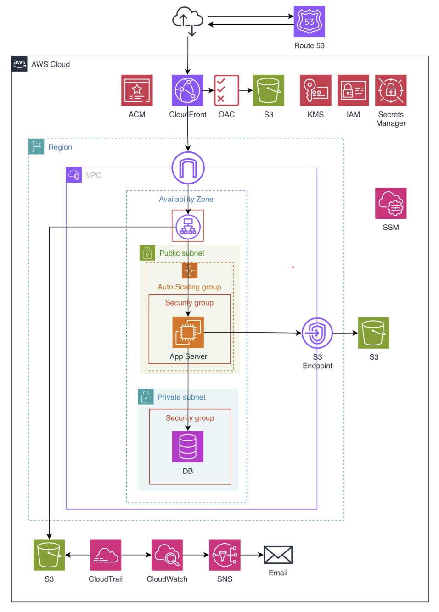

# 아키텍처 설계 제목 (예: 소규모 서비스를 위한 보안 아키텍처)

## 1. 전체 아키텍처

### 1.1 아키텍처 개요 및 설계 원칙
내용을 입력하세요.

### 1.2 사용자 접근 흐름
내용을 입력하세요.

### 1.3 추가 고려 사항
내용을 입력하세요.

## 2. 서비스별 상세 설계
### 2.1 [서비스명]
- **설정 방식**: 
- **설계 이유**: 
- **반영된 보안 요소**: 

## 3. 위협 모델링
### 3.1 식별된 위협 목록
내용을 입력하세요.

### 3.2 아키텍처에서 대응된 위협
내용을 입력하세요.

### 3.3 수용(감수)한 위협 및 근거
내용을 입력하세요.

## 4. 한계점 및 향후 개선 방향
### 4.1 현재 아키텍처의 한계
내용을 입력하세요.

### 4.2 추가 도입 권고 항목
내용을 입력하세요.