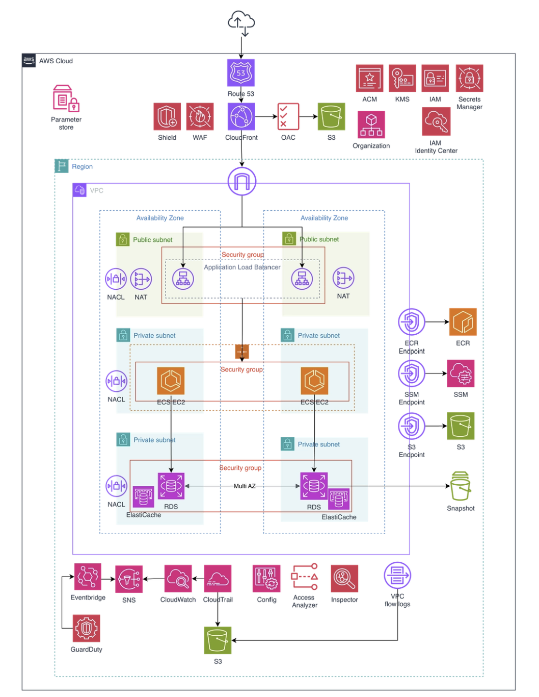
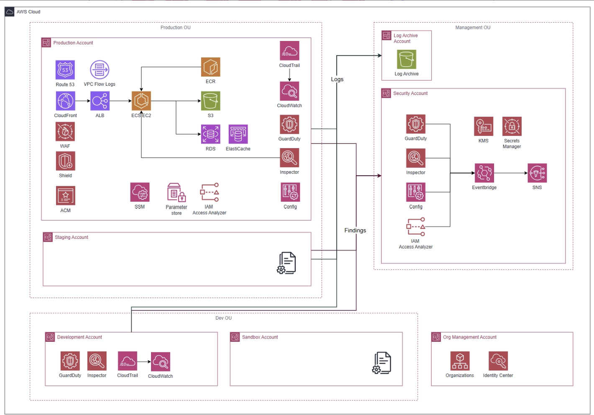
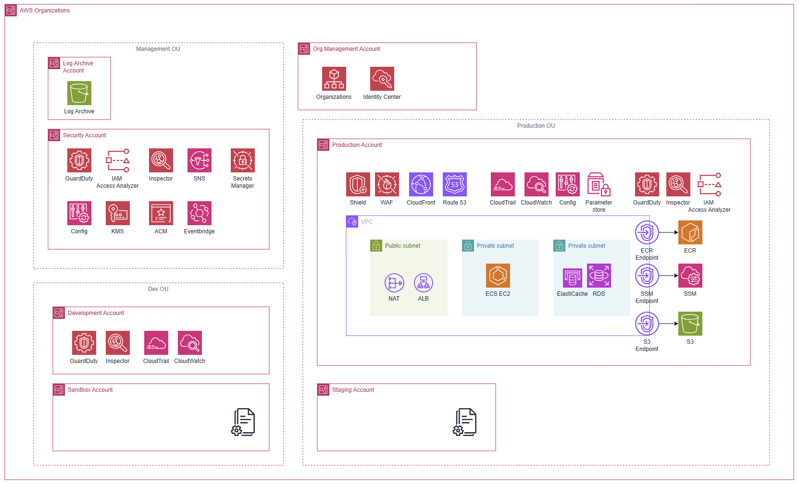
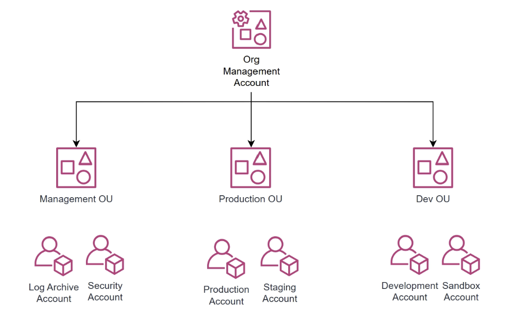
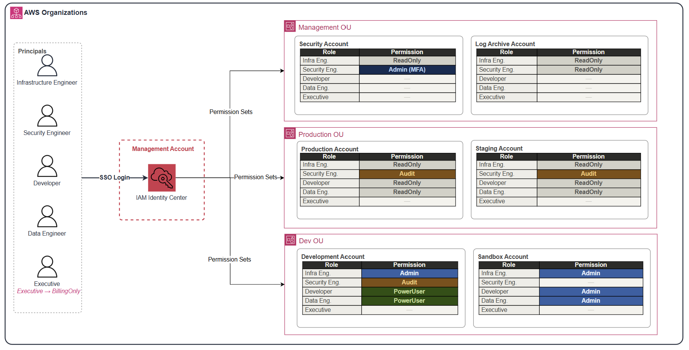
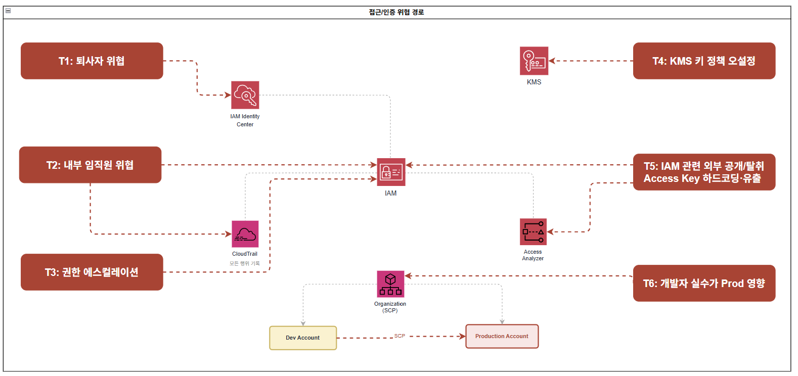
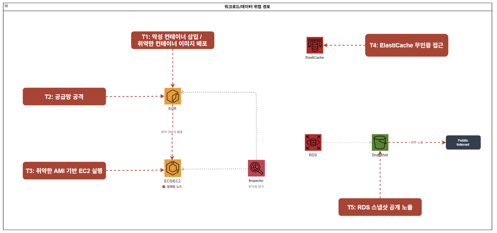
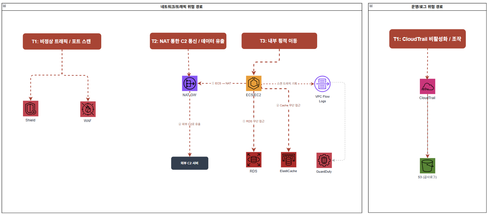

# 중규모 아키텍처 설계

## 1. 전체 아키텍처


### 1.1 아키텍처 개요 및 설계 원칙

이 아키텍처는 MAU 100만 규모의 서비스와 약 100명의 임직원(AWS 접근 인원 약 30명)이 운영하는 환경을 기반으로 설계된 AWS 클라우드 아키텍처입니다.

소규모 아키텍처에서 단일 계정 구조로 운영하던 방식은 개발자 실수가 프로덕션에 직접 영향을 미치고, 퇴사자 크리덴셜 관리나 내부자 위협에 대응하기 어려운 구조적 한계를 가집니다. 중규모부터는 사람에 의한 보안 사고가 외부 공격보다 현실적인 위협이 되기 때문에, AWS Organizations 기반의 멀티 계정 구조로 전환하여 계정 단위 격리와 중앙 집중식 보안 거버넌스를 설계의 핵심 축으로 삼았습니다.

사용하는 주요 서비스는 다음과 같습니다.

- 엣지 계층의 DNS 및 CDN 계층의 Route 53, CloudFront
- 컴퓨팅 계층의 ECS(EC2 또는 Fargate)
- 데이터 계층의 RDS(Multi-AZ), ElastiCache, S3
- 보안 서비스로 WAF, ACM, IAM Identity Center, KMS, Secrets Manager, AWS Config, GuardDuty, Amazon Inspector, IAM Access Analyzer
- 거버넌스로 AWS Organizations, SCP
- 운영 도구로 SSM, 로깅으로 CloudTrail(Organization Trail), VPC Flow Logs, CloudWatch, SNS

설계의 첫 번째 기준은 **계정 단위 격리**입니다. Production·Staging·Development·Sandbox 계정을 물리적으로 분리해 한 계정의 침해나 실수로 다른 계정에 영향이 확산되지 않도록 합니다. 이렇게 하면 개발자의 실수가 프로덕션에 미치는 위험을 구조적으로 차단할 수 있습니다.

두 번째 기준은 **중앙 집중식 보안 거버넌스**입니다. Security 계정을 GuardDuty·Inspector·Config·IAM Access Analyzer의 중앙 관리자 역할로 지정해 전 계정의 보안 이벤트를 한 곳에서 집계하고 관리합니다. 또한 SCP를 루트 및 OU 수준에서 적용해 관리자 권한으로도 우회할 수 없는 가드레일을 구성합니다.

세 번째 기준은 **장기 자격증명 금지**입니다. IAM Identity Center를 통해 임직원은 임시 자격증명으로만 AWS에 접근하도록 하고, 조직 전체에 대해 IAM User 및 Access Key 생성을 차단하는 Foundation SCP를 적용합니다. ECS Task Role, GitHub Actions OIDC, CloudFront OAC등 시스템 간 인증도 장기 크리덴셜 없이 동작하도록 설계합니다.

네 번째 기준은 **불변 감사 로그**입니다. Log Archive 계정을 별도로 분리하고 S3 Object Lock을 적용해 프로덕션 계정이 침해되더라도 감사 로그가 위변조·삭제되지 않도록 보장합니다. 이는 ISMS 등 규정 대응 시 증적의 신뢰성을 확보하기 위한 필수 기반입니다.

### 1.2 사용자 접근 흐름

**(1) 일반 사용자 접근 흐름**

사용자가 도메인에 접속하면 Route 53이 DNS 쿼리를 처리하여 CloudFront로 라우팅합니다.
CloudFront는 ACM 인증서를 통해 HTTPS 통신을 보장하며, 정적 콘텐츠는 OAC를 통해 S3에서 직접 조회하여 제공합니다. S3 버킷은 퍼블릭 접근이 차단되어 CloudFront를 통해서만 접근 가능합니다.
동적 요청은 CloudFront ALB Origin을 통해 퍼블릭 서브넷의 ALB로 전달됩니다. 이 과정에서 CloudFront에 연결된 AWS WAF가 OWASP Top 10, SQLi, 알려진 악성 IP, L7 DDoS 패턴을 필터링합니다. ALB는 X-Origin-Secret 커스텀 헤더를 검증하여 CloudFront를 거치지 않은 직접 요청을 차단합니다.
ALB를 통과한 요청은 프라이빗 서브넷의 ECS Task로 전달됩니다. ECS Task는 Secrets Manager에서 DB 크리덴셜을 런타임에 조회하고, RDS 및 ElastiCache에 접근합니다. S3와의 통신은 VPC Endpoint를 통해 인터넷을 경유하지 않고 AWS 내부망으로 처리됩니다.

**(2) 임직원 접근 흐름**

임직원은 IAM Identity Center(SSO)에 MFA 인증 후 로그인하여, 자신의 Persona에 맞는 Permission Set으로 각 계정에 접근합니다. 장기 Access Key 없이 임시 자격증명으로만 동작하며 세션 만료 시 자동 차단됩니다.
서버 접속이 필요한 경우 SSH 포트를 개방하지 않고 SSM Session Manager를 통해 ECS Exec 또는 EC2에 접근합니다. DB 접속 시에는 SSM Port Forwarding으로 RDS 엔드포인트에 터널링하여 Bastion Host 없이 접근합니다. 모든 세션 시작·종료 이력은 CloudTrail에 자동 기록됩니다.

**(3) CI/CD 배포 흐름**

GitHub Actions에서 코드가 병합되면 OIDC 기반 IAM Role로 AWS에 인증합니다. 빌드된 컨테이너 이미지는 ECR에 Push되며, Inspector가 Push 시점에 OS 패키지 및 언어 의존성 CVE를 자동 스캔합니다. 취약점이 임계값을 초과하면 배포가 차단됩니다. 검증된 이미지는 ECS Service를 통해 프라이빗 서브넷의 Task로 배포되며, 이미지 Pull은 ECR VPC Endpoint를 통해 인터넷을 경유하지 않습니다.

**(4) 모니터링 및 알림 흐름**

전 계정의 API 호출 이력은 CloudTrail Organization Trail이 수집하여 Log Archive Account S3 버킷에 중앙 저장합니다. GuardDuty·Inspector·Config·IAM Access Analyzer의 보안 이벤트는 Security Account에 집계되어 EventBridge를 통해 SNS → 보안 담당자 알림으로 전달됩니다. CloudWatch는 CloudTrail Metric Filter 기반 명시적 이벤트(Root 로그인, CloudTrail 비활성화 시도 등)와 서비스 지표(ALB 오류율, ECS CPU, WAF 차단 건수 등)를 함께 감시하여 GuardDuty와 상호 보완적으로 동작합니다.

### 1.3 월 예상 비용

- 아시아 태평양(서울) 기준
- ECS(컨테이너), RDS, ElastiCache, ALB 등 컴퓨팅·데이터 계층 비용은 인스턴스 타입과 규모에 따라 크게 달라지므로 별도 산정하며, 여기서는 **보안·거버넌스 서비스 중심**의 비용을 산정합니다.

---

### **고정 비용 (월)**

| **서비스** | **단위** | **단가** | **수량** | **월 비용** |
| --- | --- | --- | --- | --- |
| **WAF** | WebACL | $5.00 / WebACL | 1 | $5.00 |
| **WAF** | AWS 관리형 Rule Group | $1.00 / 룰그룹 | 5개 (CommonRuleSet, SQLiRuleSet, KnownBadInputsRuleSet, IpReputationList, AntiDDoSRuleSet) + 커스텀 Rate-based Rule 1개 | $6.00 |
| **ALB** | 로드밸런서 시간 | $0.0225 / 시간 | 730시간 × 1대 | $16.43 |
| **NAT Gateway** | 시간 (AZ당) | $0.059 / 시간 | 730시간 × 2 AZ | $86.14 |
| **KMS CMK** | 키 보관 | $1.00 / 키 | 5개 (rds-cmk, s3-cmk, secrets-cmk, ebs-cmk, s3-log-cmk) | $5.00 |
| **Secrets Manager** | 시크릿 보관 | $0.40 / secret | 3개 (DB 크리덴셜, X-Origin-Secret, 외부 API Key) | $1.20 |
| **CloudWatch** | 경보 (표준 해상도) | $0.10 / 경보 | 16개 (Metric Filter 알람 10개 + 서비스 지표 알람 6개) | $1.60 |
| **CloudTrail** | 관리 이벤트 (첫 번째 Trail) | $0 | Organization Trail 1개 | $0 |
| **SSM Session Manager** | 세션 자체 | $0 | - | $0 |
| **IAM Identity Center** | - | $0 | - | $0 |
| **ACM** | 인증서 | $0 | - | $0 |
| **IAM Access Analyzer** | 외부 액세스 분석기 | $0 | - | $0 |
| **AWS Organizations / SCP** | - | $0 | - | $0 |

---

### **요청/사용량 기반 비용**

| **서비스** | **단위** | **단가** | **가정 사용량** | **월 비용** | **산출 근거** |
| --- | --- | --- | --- | --- | --- |
| **WAF** | 요청 수 | $0.60 / 100만 건 | 6,000만 건 | $36.00 | DAU 20만 × 5req × 30일 = 3,000만, 봇 포함 ×2배 |
| **CloudFront** | 인터넷 데이터 전송 | $0.12 / GB | 1,440 GB | $172.80 | 6,000만 요청 × 800 KB × 캐시히트율 30%만 실제 전송 = 약 1,440 GB |
| **CloudFront** | 오리진 데이터 전송 | $0.06 / GB | 90 GB | $5.40 | 캐시 MISS 30% → 1,800만 요청 × 동적 응답 5 KB |
| **CloudFront** | HTTPS 요청 | $0.01 / 10,000건 | 6,000만 건 | $6.00 | WAF와 동일 요청 기준 |
| **NAT Gateway** | 데이터 처리 | $0.059 / GB | 300 GB | $17.70 | 외부 API 호출·CloudWatch Logs·SSM 아웃바운드 (S3·ECR은 VPC Endpoint 경유 제외) |
| **KMS** | API 요청 (대칭키) | $0.03 / 10,000건 | 10만 건 | $0.30 | ECS Task 기동·Secrets 조회 시 발생, S3 Bucket Key 적용으로 객체당 호출 제거 |
| **Secrets Manager** | API 요청 | $0.05 / 10,000건 | 1만 건 | $0.05 | Task 8대 × 일 10회 기동 × 30일, ECS Task Definition 캐시 사용 기준 |
| **CloudTrail** | S3 데이터 이벤트 (Write 전용) | $0.10 / 100,000건 | 1만 건 | $0.01 | Read 이벤트 제외. Read 포함 시 약 $18 추가 발생 |
| **CloudWatch** | 로그 수집 | $0.76 / GB | 30 GB | $22.80 | CloudTrail→CW Logs 0.7 GB + ECS 컨테이너 로그 8대 × 1 GB + 여유분 |
| **S3** | 저장 + 요청 | $0.025 / GB | 100 GB | $2.50 | 정적 에셋 50 GB + Log Archive 50 GB |
| **SNS** | 이메일 알림 | $0 | 소량 | $0 | 월 1,000건 무료 범위 이내 |
| **GuardDuty** | CloudTrail 관리 이벤트 | $4.00 / 100만 건 | 100만 건 | $4.00 | 7개 계정 × 일 약 4,800건 × 30일 합산 |
| **GuardDuty** | VPC Flow Logs | $1.15 / GB | 100GB | **$115** | EC2 인스턴스 약 10~30대 운영을 가정, DAU 5~10만으로 추정하여 월 약 100GB발생  |
| **GuardDuty** | Route53 Query Logs | $1.15 / GB | 30 GB | $34.50 | 6,000만 DNS 쿼리 × 200 bytes + 내부 서비스 간 DNS |
| **AWS Config** | 구성 항목 기록 | $0.003 / 건 | 7,000건 | $21.00 | 7개 계정 × 리소스 100개 × 월 평균 10회 변경 |
| **AWS Config** | Rule 평가 | $0.001 / 건 | 210,000건 | $210.00 | 30개 규칙 × 7,000 리소스 평가 |
| **Inspector** | EC2 인스턴스 스캔 | $1.258 / 인스턴스 | 8대 | $10.06 | ECS on EC2 선택 시 기준 |
| **Inspector** | ECR 이미지 Push 스캔 | $0.09 / Push | 200회 | $18.00 | 일 약 7회 배포 기준 |
| **Inspector** | 자동 재스캔 (신규 CVE) | $0.01 / 재스캔 | 500회 | $5.00 | 신규 CVE 발표 시 자동 재평가 |
| **VPC Flow Logs** | S3 저장 | $0.025 / GB | 50 GB | $1.25 | Log Archive Account S3 기준 |

**요청/사용량 기반 합계: 약 $682.37 / 월**

---

### 최종 정리

| **구분** | **합계** |
| --- | --- |
| **고정 비용** | **$121.37 / 월** |
| **요청/사용량 기반 비용** | **$682.37 / 월** |
| **보안·거버넌스 서비스 총합 (추정)** | **약 $804 / 월** |

> **중요 1**: 위 금액은 보안·거버넌스 서비스만 포함한 추정치입니다. ECS(컨테이너 실행), RDS Multi-AZ, ElastiCache, ECR, VPC Interface Endpoint 비용은 인스턴스 타입과 워크로드 규모에 따라 달라지므로 별도 산정이 필요합니다.
> 
> 
> **중요 2**: **AWS Config($231)** 가 전체 변동 비용의 약 40%를 차지합니다. 7개 계정 멀티 구조에서 리소스 변경이 잦을수록 비용이 급증하므로, 핵심 보안 규칙 위주로 Rule 수를 제한하고 주기적으로 사용하지 않는 Rule을 정리하는 것을 권고합니다.
> 
> **중요 3**: CloudTrail S3 데이터 이벤트는 **Write 이벤트만 기록**하는 것을 기본으로 설계했습니다. Read 이벤트(GetObject)를 포함하면 CloudFront → S3 정적 파일 조회 건수가 전부 기록되어 월 $18 이상이 추가 발생합니다. 보안 요건상 Read 기록이 필요한 경우 별도 산정이 필요합니다.
>

## 2. 서비스별 상세 설계
## 2.1 ECS on EC2

### 설정 방식

| 항목 | 설정 내용 |
| --- | --- |
| IAM Role 연결 | Instance Profile + Task Role 병행 설정 |
| AMI 관리 | AWS Managed AMI + SSM Patch Manager 자동 패치 |
| 컨테이너 실행 권한 | Task Definition에 `"user": "1000:1000"` 설정으로 루트리스 컨테이너 강제 |
| Inspector 스캔 범위 | OS 레벨 CVE + ECR 이미지 CVE 동시 스캔 |
| 접근 방식 | SSM Agent를 통한 세션 기반 접근 (SSH 비활성화) |

### 설계 이유

ECS on EC2 환경에서는 Task Role을 별도로 정의하지 않을 경우 동일 호스트의 모든 Task가 Instance Profile 권한을 공유하게 되므로, Task 단위로 Role을 명시적으로 분리하여 각 Task가 필요한 AWS 리소스에만 접근하도록 최소 권한 원칙을 적용하였습니다. 또한 ECS Fargate와 달리 EC2 기반 환경에서는 Inspector를 통해 OS 레벨 CVE와 이미지 CVE를 모두 스캔할 수 있어 보안 가시성이 높고, 현 규모에서 이 차이는 보안 운영 효율에 유의미한 영향을 미친다고 판단하였습니다. OS 패치 관리는 Golden AMI 파이프라인 자체 구축 대신 AWS Managed AMI와 SSM Patch Manager 자동 패치를 조합하는 방식을 채택하여, 중규모 환경에서 운영 복잡도는 최소화하면서 적정 보안 수준을 유지하였으며 대규모 전환 시점에 Golden AMI 파이프라인 도입을 재검토할 예정입니다.

### 반영된 보안 요소

| 보안 요소 | 적용 내용 | 방어하는 위협 |
| --- | --- | --- |
| **Task Role 분리** | Task 단위 IAM Role 명시 설정 | 권한 과잉 부여, 횡적 이동(Lateral Movement) |
| **루트리스 컨테이너** | `"user": "1000:1000"` Task Definition 적용 | 컨테이너 이스케이프 발생 시 호스트 EC2 피해 범위 제한 |
| **SSM Patch Manager** | AWS Managed AMI 기반 자동 OS 패치 | 미패치 OS 취약점(Unpatched CVE) 악용 |
| **Inspector (OS + 이미지)** | OS CVE 및 ECR 이미지 CVE 지속 스캔 | 알려진 취약점 방치, 신규 CVE 미탐지 |
| **SSM Agent 접근** | SSH 비활성화, SSM 세션 기반 접근 | 불법 원격 접근, 포트 노출 최소화 |

## 2.2 ECS Fargate

### 설정 방식

| 항목 | 설정 내용 |
| --- | --- |
| IAM Role 연결 | Task Definition에 Task Role 직접 명시 |
| OS 관리 | AWS 완전 관리 (직접 패치 불필요) |
| 이미지 스캔 | ECR Enhanced Scanning (Push 시점 + 지속 재스캔) |
| Inspector 스캔 범위 | ECR 이미지 CVE만 탐지 (OS 스캔 불가) |
| 컨테이너 접근 방식 | ECS Exec 사용, 평시 비활성화 / 운영 시에만 활성화 |

### 설계 이유

Fargate는 호스트 OS를 AWS가 완전히 관리하므로 OS 패치 및 AMI 버전 관리 부담이 없는 대신 컨테이너 이미지 자체가 핵심 방어선이 되며, ECR Enhanced Scanning을 통해 이미지 Push 시점에 OS 패키지 및 언어 의존성까지 스캔하여 취약한 이미지가 배포되지 않도록 설계하였습니다. 권한 관리 측면에서는 Instance Profile 개념이 없고 Task Definition에 Task Role을 직접 명시해야 하는 구조 덕분에 Task 단위 IAM 분리가 명확하고, Role 미설정 시 애플리케이션 오류로 즉시 드러나 권한 누락을 빠르게 탐지할 수 있습니다. 또한 SSH 접근이 구조적으로 불가능하고 ECS Exec만을 통해 컨테이너에 접근할 수 있어 OS 접근 경로가 원천 차단되며, Distroless 또는 Alpine 기반 베이스 이미지 최소화를 병행하여 이미지 자체의 공격 표면도 함께 줄였습니다.

### 반영된 보안 요소

| 보안 요소 | 적용 내용 | 방어하는 위협 |
| --- | --- | --- |
| **Task Role 명시** | Task Definition에 Task 단위 IAM Role 직접 설정 | 과도한 권한 공유, 권한 오용 |
| **ECR Enhanced Scanning** | Push 시점 + 신규 CVE 발표 시 자동 재스캔 | 배포 이후 발생한 신규 취약점 미탐지 |
| **베이스 이미지 최소화** | Distroless 또는 Alpine 기반 이미지 사용 | 불필요한 패키지를 통한 공격 표면 확대 |
| **ECS Exec 접근 제어** | 평시 비활성화, 운영 시에만 활성화 + CloudTrail 세션 기록 | 불법 컨테이너 접근, 접근 이력 미관리 |
| **Inspector (이미지)** | ECR 이미지 CVE 지속 스캔 | Push 이후 신규 공개된 CVE 방치 |
| **VPC 엔드포인트** | ECR 이미지 Pull 시 인터넷 미경유, AWS 내부 네트워크 사용 | 이미지 전송 구간 탈취 및 위변조 |

## 2.3 Inspector

### 설정 방식

| 항목 | 설정 내용 |
| --- | --- |
| 활성화 범위 | 계정 내 전체 EC2 인스턴스 + ECR 이미지 자동 탐색 |
| 스캔 방식 | 지속적 스캔 (신규 CVE 등록 시 자동 재평가) |
| 스캔 대상 | EC2 OS CVE, ECR 이미지 OS 패키지, 언어 패키지(pip/npm 등) |
| 분석 기능 | 네트워크 도달 가능성 분석(Reachability Analysis) |

Amazon Inspector는 EC2 인스턴스당 월 $1.258, ECR 이미지 푸시당 $0.09, 신규 취약점에 따른 재스캔당 $0.01의 비용이 발생합니다. 

예를 들어 EC2 8대 운영 시 약 $10, 월 200회의 이미지 푸시 발생 시 $18, 500회의 자동 재스캔 발생 시 $5의 비용이 산출되어 총 $33 내외의 비용이 발생할 수 있습니다.

### 설계 이유

ECR 기본 스캔은 Push 시점에만 실행되어 이후 신규 공개된 CVE를 자동으로 재평가하지 않는 반면, Inspector는 NVD 등에 신규 CVE가 등록될 때마다 기존 스캔 대상을 자동으로 재평가하여 배포 이후 시점의 위협에 대해서도 지속적인 가시성을 확보합니다. 또한 본 아키텍처 설계 기준이 적용되지 않은 Bastion Host, 레거시 워크로드 등 기존 EC2 인스턴스가 동일 계정 내에 존재할 수 있으며, 이들이 침해될 경우 신규 아키텍처로의 횡적 이동 경로가 될 수 있으므로 Inspector를 통해 계정 전체를 균일한 기준으로 모니터링합니다. 아울러 Inspector는 단순 CVE 목록에 그치지 않고 취약점이 실제 네트워크를 통해 접근 가능한지에 대한 도달 가능성 분석을 함께 제공하며, ECR 기본 스캔이 탐지하지 못하는 언어 패키지 취약점까지 스캔 범위에 포함하여 실질적인 위험 우선순위 판단을 지원합니다.

### 반영된 보안 요소

| 보안 요소 | 적용 내용 | 방어하는 위협 |
| --- | --- | --- |
| **지속적 재스캔** | 신규 CVE 등록 시 기존 이미지·인스턴스 자동 재평가 | Push 이후 발생한 신규 취약점 미탐지 |
| **계정 전체 EC2 자동 탐색** | 신규 아키텍처 범위 외 인스턴스 포함 스캔 | 관리 사각지대 EC2를 통한 횡적 이동 |
| **언어 패키지 스캔** | pip, npm 등 애플리케이션 의존성 취약점 탐지 | ECR 기본 스캔 탐지 범위 외 공급망 취약점 |
| **도달 가능성 분석** | CVE의 실제 네트워크 접근 가능성 분석 제공 | 위험도 오판으로 인한 중요 취약점 후순위 처리 |

---

### ECR 기본 스캔 vs Inspector 비교

| 구분 | ECR 기본 스캔 | Inspector |
| --- | --- | --- |
| 스캔 시점 | 이미지 Push 시 1회 | 지속적 (신규 CVE 발표 시 자동 재스캔) |
| 스캔 대상 | ECR 이미지 내 OS 패키지 | EC2 OS, ECR 이미지, 언어 패키지 |
| 네트워크 도달 가능성 분석 | 미지원 | 지원 |
| 기존 EC2 인스턴스 스캔 | 불가 | 가능 (계정 내 전체 자동 탐색) |
| 비용 | 무료 | EC2 및 ECR 스캔 단위 과금 |

## 2.4 AWS Config

### **설정 방식**

AWS 관리형 규칙을 우선 적용하고 필요 시 커스텀 규칙을 추가합니다. 네트워크, S3, IAM, RDS, ECS, ElastiCache, ALB, CloudTrail, KMS, Secrets Manager 영역별로 규칙을 분류하여 적용합니다.
Config는 별도의 심각도 체계가 없으며, NON_COMPLIANT 전환 시 EventBridge의 configRuleName 기반 필터로 즉시 알림 대상과 콘솔 확인 대상을 구분합니다. 즉시 알림 대상 규칙이 NON_COMPLIANT로 전환되면 EventBridge Rule이 트리거되어 SNS → 이메일로 알람을 발송하고, 그 외 운영성 규칙은 Config 대시보드에서 주기적으로 직접 확인합니다.

연속 구성 항목 기록은 변경 당 $0.003 비용이 발생하고 평가 비용으로 $0.001가 발생합니다. 예를 들어, 월 10,000건의 리소스 설정 변경 발생 시, 연속 구성 항목 기록 비용 30$, 리소스 별 규칙이 5개가 할당되었다고 했을때 월 50$의 비용, 총 80$의 비용이 발생할 수 있습니다.

### 네트워크 보안 Rules

| Rule 이름 | 탐지 내용 | 알림 처리 |
| --- | --- | --- |
| restricted-ssh | SG에 0.0.0.0/0 SSH(22) 오픈 | 즉시 알림 |
| restricted-common-ports | 불필요 포트 전체 오픈 | 즉시 알림 |
| vpc-sg-open-only-to-authorized-ports | 허용되지 않은 포트 오픈 | 콘솔 확인 |
| vpc-flow-logs-enabled | VPC Flow Logs 비활성화 | 즉시 알림 |
| no-unrestricted-route-to-igw | Private 서브넷 IGW 직접 연결 | 즉시 알림 |

### S3 보안 Rules

| Rule 이름 | 탐지 내용 | 알림 처리 |
| --- | --- | --- |
| s3-bucket-public-read-prohibited | S3 버킷 퍼블릭 읽기 허용 | 즉시 알림 |
| s3-bucket-public-write-prohibited | S3 버킷 퍼블릭 쓰기 허용 | 즉시 알림 |
| s3-bucket-ssl-requests-only | HTTP(비암호화) 접근 허용 | 즉시 알림 |
| s3-bucket-server-side-encryption-enabled | S3 암호화 미적용 | 즉시 알림 |
| s3-bucket-logging-enabled | S3 액세스 로깅 비활성화 | 콘솔 확인 |

### IAM 보안 Rules

| Rule 이름 | 탐지 내용 | 알림 처리 |
| --- | --- | --- |
| iam-root-access-key-check | 루트 계정 액세스 키 존재 | 즉시 알림 |
| mfa-enabled-for-iam-console-access | 콘솔 접근 IAM MFA 미설정 | 즉시 알림 |
| iam-user-mfa-enabled | IAM 사용자 MFA 미설정 | 즉시 알림 |
| iam-password-policy | 패스워드 정책 미준수 | 콘솔 확인 |
| access-keys-rotated | 액세스 키 90일 이상 미교체 | 콘솔 확인 |
| iam-no-inline-policy-check | 인라인 정책 사용 | 콘솔 확인 |

### RDS 보안 Rules

| Rule 이름 | 탐지 내용 | 알림 처리 |
| --- | --- | --- |
| rds-instance-public-access-check | RDS 퍼블릭 접근 허용 | 즉시 알림 |
| rds-storage-encrypted | RDS 스토리지 암호화 미적용 | 즉시 알림 |
| rds-multi-az-support | RDS Multi-AZ 비활성화 | 즉시 알림 |
| rds-automatic-minor-version-upgrade-enabled | 자동 마이너 업그레이드 비활성화 | 콘솔 확인 |
| rds-in-backup-plan | RDS 백업 미설정 | 즉시 알림 |

### ECS 보안 Rules

| Rule 이름 | 탐지 내용 | 알림 처리 |
| --- | --- | --- |
| ecs-task-definition-nonroot-user | ECS 태스크 root 사용자로 실행 | 즉시 알림 |
| ecs-containers-readonly-access | 컨테이너 파일시스템 쓰기 허용 | 콘솔 확인 |
| ecs-task-definition-memory-hard-limit | 메모리 제한 미설정 | 콘솔 확인 |

### ElastiCache 보안 Rules

| Rule 이름 | 탐지 내용 | 알림 처리 |
| --- | --- | --- |
| elasticache-repl-grp-encrypted-at-rest | ElastiCache 저장 데이터 암호화 미적용 | 즉시 알림 |
| elasticache-repl-grp-encrypted-in-transit | ElastiCache 전송 중 암호화 미적용 | 즉시 알림 |
| elasticache-repl-grp-auto-failover-enabled | 자동 장애 조치 비활성화 | 콘솔 확인 |

### ALB 보안 Rules

| Rule 이름 | 탐지 내용 | 알림 처리 |
| --- | --- | --- |
| alb-http-to-https-redirection-check | HTTP → HTTPS 리다이렉트 미설정 | 즉시 알림 |
| elb-deletion-protection-enabled | ALB 삭제 방지 비활성화 | 콘솔 확인 |

### CloudTrail 보안 Rules

| Rule 이름 | 탐지 내용 | 알림 처리 |
| --- | --- | --- |
| cloudtrail-enabled | CloudTrail 비활성화 | 즉시 알림 |
| cloudtrail-s3-dataevents-enabled | S3 데이터 이벤트 로깅 미설정 | 즉시 알림 |
| cloud-trail-log-file-validation-enabled | 로그 파일 무결성 검증 비활성화 | 즉시 알림 |
| cloud-trail-encryption-enabled | CloudTrail 로그 KMS 암호화 미적용 | 즉시 알림 |
| ecr-private-image-scanning-enabled | ECR 이미지 스캔 비활성화 | 즉시 알림 |
| ecr-private-lifecycle-policy-configured | ECR Lifecycle Policy 미설정 | 콘솔 확인 |

### KMS

| Rule 이름 | 탐지 내용 | 알림 처리 |
| --- | --- | --- |
| cmk-backing-key-rotation-enabled | CMK 자동 키 교체 비활성화 | 콘솔 확인 |

### Secrets Manager

| Rule 이름 | 탐지 내용 | 알림 처리 |
| --- | --- | --- |
| secretsmanager-rotation-enabled-check | 시크릿 자동 교체 비활성화 | 콘솔 확인 |
| secretsmanager-secret-unused | 90일 이상 미사용 시크릿 존재 | 콘솔 확인 |

### 설계 이유

리소스 설정 변경 이력을 지속적으로 추적하여 규정 준수 여부를 자동으로 점검합니다. Config는 별도의 심각도 체계가 없으므로, EventBridge에서 `configRuleName` 기반으로 핵심 보안 규칙과 운영성 규칙을 직접 분류하여 알림 우선순위를 관리합니다. 침해나 컴플라이언스에 직결되는 규칙은 즉시 알림으로 처리하고, 그 외 운영성 규칙은 Config 대시보드에서 주기적으로 확인하여 보안팀의 알림 피로도를 낮춥니다. ISMS 감사 시 설정 변경 증적으로 직접 활용할 수 있습니다.

### 반영된 보안 요소

인프라 전 계층(네트워크, 스토리지, IAM, DB, 컨테이너, 미들웨어)을 규칙으로 커버하여 단일 서비스 취약점도 누락 없이 탐지합니다.

## 2.5 Amazon GuardDuty

### **설정 방식**

리전별로 즉시 활성화하고 S3 보호, RDS 보호를 함께 활성화합니다. AWS Organizations와 연동하여 중앙 관리자 계정에서 멀티 계정을 통합 관리합니다. EventBridge Rule을 severity 숫자 기준으로 분리(≥7.0 즉시 알림, 4.0~6.9 주간 리포트)하고, CryptoCurrency·InstanceCredentialExfiltration 유형은 별도 Rule로 즉시 알람합니다.
GuardDuty의 심각도는 0.1~10.0 범위의 숫자로 표현되며, Critical(9.0~10.0), High(7.0~8.9), Medium(4.0~6.9), Low(1.0~3.9) 4단계로 구분됩니다. 

GuardDuty가 처리한 이벤트와 로그별로 과금됩니다.

|  | 사용량 | 건 당 요금(Tier 1) | 건 당 요금(Tier 2) |
| --- | --- | --- | --- |
| CloudTrail Mgmt Logs | 1,000,000 | 0.0000046 |  |
| VPC Flow Logs | 1,024 GB | 1.15$ | 0.58$ |
| Route53 Query Logs | 1,024 GB | 1.15$ | 0.58$ |

위와 같은 로그가 발생했다고 가정했을때 월별 GuardDuty 요금은 1,477.44$가 발생합니다.

### 설계 이유

VPC Flow Logs, CloudTrail, DNS 로그를 직접 분석하여 별도 에이전트 없이 이상 행위를 실시간 탐지합니다. EC2가 퍼블릭 IP 없이 Private Subnet에 배치된 구조이기 때문에 외부에서 직접 접근이 차단되어 있으며, GuardDuty는 내부 네트워크 이상(포트 스캔·크립토재킹·C&C 통신 등)을 탐지하는 핵심 레이어입니다.

### 반영된 보안 요소

보안 담당자는 해당 GuardDuty findings를 집계하여 다른 부서한테 severity ≥ 7.0 인 것을 SNS로 알린다. 

 

## 2.6 AWS Access Analyzer

### 설정 방식

외부 액세스 분석기를 즉시 활성화하고 신뢰 영역을 AWS Organization 단위로 설정합니다. S3 버킷, IAM Role, KMS 키, SQS 큐, Secrets Manager, SNS 토픽 등 주요 리소스가 조직 외부에 의도치 않게 노출되어 있는지 지속적으로 분석합니다. 

Finding 상태는 ACTIVE → ARCHIVED(의도된 설정으로 확인) 또는 RESOLVED(수정 완료)로 관리합니다. Access Analyzer는 별도의 심각도 체계가 없으므로 ACTIVE Finding 전량을 즉시 알림 대상으로 처리합니다. ACTIVE Finding 발생 시 EventBridge → SNS → 보안 담당자 즉시 알림으로 연결되며, ARCHIVED / RESOLVED 상태는 알림에서 제외합니다. 

외부 액세스 분석기만 사용하고 미사용 액세스에 대해서는 검토하지 않기에 요금이 발생하지 않습니다.

### 설계 이유

우리 아키텍처는 Foundation SCP의 Identity Perimeter 강제와 S3 Bucket Owner Enforced로 외부 공개를 구조적으로 차단하고 있습니다. 따라서 Access Analyzer Finding이 발생한다는 것 자체가 SCP 우회 시도이거나 설계 허점일 가능성이 높아 발생 즉시 전량 검토가 필요합니다. 또한 리소스 정책 변경 시에만 Finding이 생성되므로 GuardDuty 대비 발생 빈도가 낮아 전량 즉시 알림으로 처리해도 알람 피로도 문제가 없습니다.

### 반영된 보안 요소

IAM Role의 외부 AssumeRole 가능 여부, Secrets Manager 외부 노출 등 침해 시 파급력이 큰 리소스를 포함하여 조직 외부 접근 가능한 모든 리소스를 탐지합니다. 정상적인 외부 접근(CloudFront → S3 등)은 ARCHIVED 처리하여 오탐을 관리하고 실제 문제는 RESOLVED로 구분하여 이력을 명확히 남깁니다.

## 2.7 VPC Flow Logs

#### **설정 방식**

VPC 단위로 Flow Logs를 활성화하고 로그 대상을 S3 버킷으로 지정합니다. 기본 필드 외에  pkt-srcaddr, pkt-dstaddr 필드를 추가하여 NAT Gateway 뒤의 실제 IP를 식별할 수 있도록 설정합니다. 보관 기간은 1년 이상으로 설정하며 Log Archive Account S3 버킷에 저장되고 SSE-KMS 암호화가 적용됩니다. 필요 시 Athena 외부 테이블로 연동하여 SQL 기반 쿼리 분석도 가능합니다.

#### **설계 이유**

GuardDuty는 VPC Flow Logs를 기반으로 내부 포트 스캔, 비정상 트래픽 패턴 등을 탐지합니다. S3에 저장하면 Athena 연동 시 별도 인프라 없이 SQL로 로그를 직접 분석할 수 있습니다. ISMS 감사 시 네트워크 접근 기록 증적으로 제출 가능합니다.

#### **반영된 보안 요소**

ALL 트래픽(ACCEPT/REJECT)을 기록하여 거부된 접근 시도까지 사후 추적할 수 있습니다.  pkt-srcaddr, pkt-dstaddr 필드 추가로 NAT 뒤 ECS Task·EC2의 실제 통신 IP를 식별하여 GuardDuty 분석 정확도를 높입니다. S3 퍼블릭 접근 차단 및 SSE-KMS 암호화로 로그 무결성을 보장합니다.

## 2.8 AWS CloudTrail

### **설정 방식**

조직 Trail을 생성하여 전체 리전의 API 호출을 Log Archive Account S3 버킷에 중앙 수집합니다. 로그 파일 무결성 검증과 KMS 암호화를 활성화하고 CloudWatch Logs 연동으로 Metric Filter 기반 실시간 알람을 설정합니다. S3 데이터 이벤트도 함께 기록하며 보관 기간은 1년 이상으로 설정합니다. S3 버킷에는 MFA Delete, 버전 관리, 객체 잠금, SSE-KMS 암호화를 적용합니다.

### **설계 이유**

CloudTrail은 GuardDuty의 API 이상 탐지 분석 소스로도 동시에 사용됩니다. 조직 Trail로 설정하면 멀티 계정 환경에서 단일 버킷으로 모든 계정의 로그를 중앙 수집할 수 있어 감사 대응이 용이합니다. CloudWatch Logs와 연동하면 Metric Filter로 명시적 이벤트를 탐지하고 CloudWatch Alarm이 SNS를 직접 트리거할 수 있어 EventBridge 없이 구성이 단순합니다.

### **반영된 보안 요소**

로그 파일 무결성 검증 활성화로 로그 위변조를 방지하며 ISMS 감사 시 증적의 신뢰성을 보장합니다. S3 버킷의 MFA Delete와 객체 잠금으로 로그 삭제 시도를 원천 차단합니다.

## 2.9 Amazon CloudWatch

### **설정 방식**

CloudWatch는 두 가지 방식으로 보안 이상 징후를 탐지합니다.

첫째, **Metric Filter 기반 탐지**입니다. CloudTrail 로그를 CloudWatch Logs에 연동하고 사전 정의된 이벤트 패턴이 발생하면 커스텀 지표를 생성하여 CloudWatch Alarm → SNS로 즉시 알람합니다.

| 탐지 항목 | 알람 처리 |
| --- | --- |
| Root 계정 콘솔 로그인 | 즉시 알림 |
| MFA 없이 콘솔 로그인 | 즉시 알림 |
| 권한 없는 API 호출 반복 (5회/5분) | 즉시 알림 |
| IAM 정책/유저/롤 변경 | 즉시 알림 |
| Security Group 규칙 변경 | 즉시 알림 |
| CloudTrail 설정 변경/중지 시도 | 즉시 알림 |
| GuardDuty 비활성화 시도 | 즉시 알림 |
| S3 버킷 퍼블릭 접근 허용 변경 | 즉시 알림 |
| KMS 키 삭제 예약 | 즉시 알림 |
| Organizations 탈퇴 시도 | 즉시 알림 |

둘째, **AWS 서비스 지표 기반 알람**입니다. AWS 서비스가 수집하는 지표에 임계값을 설정하여 인프라 이상 징후를 감지합니다.

| 메트릭 | 임계값 | 의미 |
| --- | --- | --- |
| ALB 4xx 오류율 | 100건/5분 초과 | 비정상 요청 급증 (스캐닝/공격) |
| ALB 5xx 오류율 | 20건/5분 초과 | 서비스 장애 또는 공격 |
| ECS Task CPU | 80% 이상 3회 연속 | 크립토재킹 또는 부하 이상 |
| RDS CPUUtilization | 90% 이상 5분 지속 | 비정상 쿼리 또는 공격 |
| WAF 차단 건수 | 1000건/5분 초과 | DDoS 또는 스캐닝 공격 |
| GuardDuty Finding 수 | 10건/1시간 초과 | 이상 행위 급증 |

### **설계 이유**

GuardDuty가 ML 기반으로 이상 행위를 탐지한다면 CloudTrail Metric Filter는 명시적으로 정의한 이벤트를 탐지합니다. 두 체계가 상호 보완적으로 동작하여 GuardDuty가 놓칠 수 있는 IAM 변경, CloudTrail 비활성화 시도 등을 명시적 규칙으로 확실히 잡아냅니다. 서비스 지표 기반 알람은 보안 이벤트뿐 아니라 크립토재킹, DDoS 등 인프라 레벨의 이상 징후를 조기에 감지합니다.

### **반영된 보안 요소**

Metric Filter를 통해 CloudTrail 비활성화와 GuardDuty 비활성화 시도를 탐지하여 보안 감사 회피 시도를 즉시 알람합니다. Organizations 탈퇴 시도를 탐지하여 계정 분리를 통한 보안 우회를 방지합니다. GuardDuty Finding 수 급증을 서비스 지표 알람으로 별도 감시하여 공격이 집중되는 상황을 운영 레벨에서도 인지할 수 있습니다. 모든 알람은 SNS를 통해 이메일로 전달되며 CloudWatch Alarm이 SNS를 직접 트리거합니다.

## 2.10 KMS

### 설정 방식

KMS 키는 이를 사용하는 리소스와 동일한 계정에 생성하는 것을 원칙으로 합니다. 다만 키 관리 권한은 Security Account의 보안 전담 역할에 별도로 부여하여, 키 사용 주체와 키 관리 주체를 분리합니다.

Production Account에는 용도별로 KMS CMK를 분리하여 생성하며, 각 서비스별로 별도의 키를 사용합니다. 또한 Log Archive Account에는 로그 저장용 KMS 키를 별도로 구성합니다.

다음과 같이 암호화 대상별 KMS 키를 분리합니다.

| KMS 키 | 암호화 대상 | 사용 주체 | 관리 계정 |
| --- | --- | --- | --- |
| rds-cmk | RDS 인스턴스, RDS 스냅샷 | RDS Service Role | Production Account |
| s3-cmk | S3 버킷 (정적 에셋) | S3 Service, CloudFront | Production Account |
| secrets-cmk | Secrets Manager 시크릿 | ECS Task Role, Secrets Manager | Production Account |
| ebs-cmk | ECS/EC2 EBS 볼륨 | EC2 Service | Production Account |
| s3-log-cmk | Log Archive S3 버킷 | CloudTrail, Config, VPC Flow Logs, ALB Access Log | Log Archive Account |

키 정책은 Security Account의 `KeyAdminRole`이 관리할 수 있도록 크로스 계정으로 구성하고, ECS Task Role, RDS Service Role 등에는 필요한 범위의 `kms:Encrypt`, `kms:Decrypt` 권한만 부여합니다.

### 설계 이유

- 단일 KMS 키를 사용하는 경우 키 하나가 침해되었을 때 전체 데이터가 영향을 받을 수 있습니다. 따라서 용도별로 키를 분리하여 침해 범위를 최소화합니다.
- 키 관리 권한을 Security Account로 분리함으로써 운영 계정의 오남용 및 내부자 위협을 통제합니다. 동시에 서비스 계정은 키를 사용하는 역할만 수행하도록 하여 최소 권한 원칙을 유지합니다.
- CMK를 사용하면 키 정책을 직접 정의할 수 있어 특정 IAM 역할에만 암복호화 권한을 제한할 수 있습니다. 또한 크로스 계정 키 관리자 지정이 가능하여 계정 간 책임 분리가 가능합니다.
- AWS Managed Key와 달리 CMK는 키 비활성화 및 삭제 통제가 가능하므로 침해 상황 대응이 가능합니다.

### 반영된 보안 요소

- 서비스별 KMS 키 분리를 통해 암호화 범위를 세분화했습니다.
- Security Account 기반 키 관리자 분리를 통해 키 관리 권한과 사용 권한을 분리했습니다.
- 크로스 계정 키 관리 구조를 통해 운영 계정과 보안 계정 간 책임을 분리했습니다.
- 키 정책 기반 접근 제어를 통해 특정 역할에만 암복호화 권한을 제한했습니다.
- 결과적으로 키 탈취 및 권한 오남용 시 영향 범위를 최소화하는 구조를 반영했습니다.

## 2.11 NACL 설정

### 설정 방식

NACL은 Stateless로 동작하여 Security Group의 보완 레이어 역할을 합니다. 서브넷 계층별로 전용 NACL을 생성하여 적용합니다.

```
퍼블릭 NACL
  ├── 퍼블릭 서브넷 A (ap-northeast-2a)  ← ALB 위치
  └── 퍼블릭 서브넷 B (ap-northeast-2c)  ← ALB 위치

프라이빗 NACL
  ├── 프라이빗 서브넷 A (ap-northeast-2a) ← ECS 위치
  └── 프라이빗 서브넷 B (ap-northeast-2c) ← ECS 위치

DB NACL
  ├── DB 서브넷 A (ap-northeast-2a)       ← RDS·ElastiCache 위치
  └── DB 서브넷 B (ap-northeast-2c)       ← RDS·ElastiCache 위치
```

---

### 퍼블릭 서브넷 NACL (ALB 위치)

CloudFront에서만 트래픽이 인입되는 구조입니다. ALB는 인터넷에 직접 노출되어 있으나 CloudFront 관리형 접두사 목록을 소스로 지정하여 CloudFront IP 대역 외의 직접 접근을 차단합니다. CloudFront IP 대역은 동적으로 변경되므로 NACL에서는 직접 제한할 수 없으며, CloudFront IP 제한은 Security Group에서 관리형 접두사 목록(com.amazonaws.global.cloudfront.origin-facing)으로 처리합니다. NACL은 포트 레벨 제어만 담당합니다.

**인바운드**

| 규칙 번호 | 포트 | 소스 | 허용/거부 | 목적 |
| --- | --- | --- | --- | --- |
| 100 | 443 | 0.0.0.0/0 | 허용 | HTTPS 인입 |
| 110 | 80 | 0.0.0.0/0 | 허용 | HTTP 인입 (HTTPS 리다이렉트용) |
| 120 | 1024-65535 | 0.0.0.0/0 | 허용 | 응답 트래픽 (Ephemeral Port) |
| * | 전체 | 0.0.0.0/0 | 거부 | 나머지 전체 차단 |

**아웃바운드**

| 규칙 번호 | 포트 | 대상 | 허용/거부 | 목적 |
| --- | --- | --- | --- | --- |
| 100 | 8080 | 프라이빗 서브넷 CIDR | 허용 | ALB → ECS |
| 110 | 1024-65535 | 0.0.0.0/0 | 허용 | 응답 트래픽 반환 (Ephemeral Port) |
| * | 전체 | 0.0.0.0/0 | 거부 | 나머지 전체 차단 |

> NACL은 Stateless이므로 인바운드 120번과 아웃바운드 110번의 Ephemeral Port 허용이 반드시 필요합니다. 클라이언트는 ALB에 응답을 받을 때 1024~65535 범위의 임시 포트를 사용합니다.
> 

### 프라이빗 서브넷 NACL (ECS 위치)

ALB에서만 트래픽이 인입되고, ECS Task가 NAT Gateway를 통해 외부와 통신합니다.

**인바운드**

| 규칙 번호 | 포트 | 소스 | 허용/거부 | 목적 |
| --- | --- | --- | --- | --- |
| 100 | 8080 | 퍼블릭 서브넷 CIDR | 허용 | ALB → ECS |
| 110 | 1024-65535 | 0.0.0.0/0 | 허용 | 외부 통신 응답 트래픽 |
| * | 전체 | 0.0.0.0/0 | 거부 | 나머지 전체 차단 |

**아웃바운드**

| 규칙 번호 | 포트 | 대상 | 허용/거부 | 목적 |
| --- | --- | --- | --- | --- |
| 100 | 443 | 0.0.0.0/0 | 허용 | NAT → 외부 API
(ECR·S3·SSM은 VPC Endpoint 경유) |
| 110 | 3306 | DB 서브넷 CIDR | 허용 | ECS → RDS |
| 120 | 6379 | DB 서브넷 CIDR | 허용 | ECS → ElastiCache |
| 130 | 1024-65535 | 퍼블릭 서브넷 CIDR | 허용 | ALB 요청 응답 트래픽 반환 |
| * | 전체 | 0.0.0.0/0 | 거부 | 나머지 전체 차단 |

### DB 서브넷 NACL (RDS·ElastiCache 위치)

외부 접근이 절대 없어야 하는 레이어입니다. 허용 포트가 3306·6379로 고정되어 규칙이 단순합니다.

**인바운드**

| 규칙 번호 | 포트 | 소스 | 허용/거부 | 목적 |
| --- | --- | --- | --- | --- |
| 100 | 3306 | 프라이빗 서브넷 CIDR | 허용 | ECS → RDS |
| 110 | 6379 | 프라이빗 서브넷 CIDR | 허용 | ECS → ElastiCache |
| * | 전체 | 0.0.0.0/0 | 거부 | 나머지 전체 차단 |

**아웃바운드**

| 규칙 번호 | 포트 | 대상 | 허용/거부 | 목적 |
| --- | --- | --- | --- | --- |
| 100 | 1024-65535 | 프라이빗 서브넷 CIDR | 허용 | 응답 트래픽 반환 (Ephemeral Port) |
| * | 전체 | 0.0.0.0/0 | 거부 | 나머지 전체 차단 |

아웃바운드 대상을 프라이빗 서브넷 CIDR로만 한정하여 DB 서버가 외부로 직접 통신하는 경로를 차단합니다.

### 설계 이유

퍼블릭 서브넷 NACL은 80·443·Ephemeral Port만 허용하여 ALB로 인입 가능한 포트를 서브넷 레벨에서 제한합니다. Security Group이 CloudFront 관리형 접두사 목록으로 소스를 한정하더라도 NACL이 포트 단위로 추가 필터링하여 허용되지 않은 포트로의 직접 접근 시도를 차단합니다.

프라이빗 서브넷 NACL은 인바운드 소스를 퍼블릭 서브넷 CIDR로 한정하여 ALB를 경유하지 않는 ECS 직접 접근을 서브넷 레벨에서 차단합니다. 아웃바운드는 DB 서브넷 CIDR에 3306·6379만 허용하여 ECS가 DB 외의 내부 리소스에 접근하는 경로를 제한합니다.

DB 서브넷 NACL은 인바운드·아웃바운드 모두 프라이빗 서브넷 CIDR로만 한정하여 ECS를 경유하지 않는 DB 직접 접근과 DB에서 외부로의 통신을 서브넷 레벨에서 원천 차단합니다.

### 반영된 보안 요소

Security Group은 허용 규칙만 정의할 수 있지만 NACL은 명시적 거부 규칙을 정의할 수 있습니다. 침해 IP 즉시 차단이 필요한 긴급 상황에서 Security Group 변경 없이 NACL에서 빠르게 대응할 수 있습니다. VPC Flow Logs와 결합하면 NACL에서 REJECT된 트래픽도 기록되어 비정상 접근 시도의 출발지 IP·포트·시간을 사후 추적할 수 있으며 ISMS 감사 증적으로 활용 가능합니다.

## 2.12 WAF

### 설정 방식

CloudFront에 AWS WAF WebACL을 연결합니다. CloudFront 연결 시 WAF는 반드시 us-east-1(버지니아 북부) 리전에 생성해야 합니다. 적용 룰은 AWS 관리형 5개(AWSManagedRulesCommonRuleSet, AWSManagedRulesSQLiRuleSet, AWSManagedRulesKnownBadInputsRuleSet, AWSManagedRulesAmazonIpReputationList, AWSManagedRulesAntiDDoSRuleSet)와 커스텀 Rate-based Rule 1개(RateLimit-Login)로 구성합니다.

### 설계 이유

MAU 100만 규모는 공격 타깃이 될 가능성이 충분히 높아 OWASP Top 10 기반의 기본 방어 레이어가 필수입니다. SQLiRuleSet을 CommonRuleSet과 별도로 추가하는 이유는 SQLi 성공 시 RDS 고객 데이터 대량 탈취로 직결되기 때문입니다. KnownBadInputsRuleSet은 중규모 서비스에서 다양한 오픈소스 라이브러리를 사용하는 경우가 많아 Log4Shell 등 알려진 익스플로잇 패턴을 WAF 레이어에서 차단합니다. IpReputationList는 별도 룰 작성 없이 봇넷·악성 IP를 자동 차단하며 비용 대비 효과가 가장 높습니다. AntiDDoSRuleSet은 단순 횟수 기반이 아닌 트래픽 급증 패턴을 분석하여 L7 DDoS를 탐지하고 CloudFront 엣지에서 차단합니다.

커스텀 룰의 경우 크리덴셜 스터핑으로 인한 계정 탈취 가능성이 존재합니다. 동일 IP에서의 대량 로그인 시도를 차단하기 위해 RateLimit-Login(5분 20건)을 적용합니다.

### 반영된 보안 요소

OWASP Top 10 주요 항목 방어 레이어 확보, SQLi 이중 방어로 RDS 고객 데이터 보호, 알려진 악성 IP 자동 차단, 로그인 엔드포인트 부하 선제 차단, CloudFront 엣지 레벨 필터링으로 오리진 서버 보호, AntiDDoSRuleSet으로 L7 DDoS 트래픽 패턴 탐지 및 차단합니다.

## 2.13 멀티 Account 구조 설계


### 계정 구조 개요

총 **7개 계정 / 3개 OU**로 구성합니다.



### 각 계정 역할

| 계정 | 역할 |
| --- | --- |
| Management Account | Organizations 루트, SCP 관리, IAM Identity Center(SSO) 운영. 실제 서비스 인프라는 배포하지 않음. |
| Security Account | GuardDuty · Inspector · Config · IAM Access Analyzer 위임 관리자. 전 계정 보안 이벤트 집계 |
| Log Archive Account | CloudTrail Organization Trail · VPC Flow Logs · ALB 액세스 로그 중앙 수집. 버킷 삭제 SCP로 차단 |
| Production Account | 실제 사용자 트래픽 처리. 가장 엄격한 SCP 적용 |
| Staging Account | 프로덕션 배포 전 최종 검증 환경. Production과 동일한 보안 수준 적용 |
| Development Account | 개발자 팀별 개발/테스트 환경. 비용 통제 SCP 적용 |
| Sandbox Account | 개인 자유 실험 환경. 완전 격리, 가장 강력한 비용 통제 |

Security Account와 Log Archive Account를 분리한 이유는 보안 계정이 침해되더라도 감사 로그는 별도 계정에 격리되어 보존되기 때문입니다.

---

### OU별 SCP 설계

SCP는 **Deny List 전략**을 사용합니다. 기본적으로 모든 액션이 허용된 상태에서 명시적으로 차단할 항목만 Deny로 정의합니다. SCP는 관리자 권한으로도 우회할 수 없는 최상위 가드레일입니다.

### Foundation SCP (루트 레벨 / 전 계정 공통)

신규 계정 생성 시 자동으로 적용되는 기본 가드레일입니다.

| # | SCP | 차단 대상 | 설계 이유 |
| --- | --- | --- | --- |
| 1 | Root User 차단 | 모든 계정 Root API 호출 | Root는 IAM 정책 우회 가능, 일상 사용 금지 |
| 2 | 사용 리전 외 차단 | 허용 리전 목록 외 리소스 생성 | 미사용 리전 공격 확산 차단 |
| 3 | Organizations 탈퇴 금지 | LeaveOrganization 호출 | 탈퇴 시 SCP/보안 모니터링 전체 우회 가능 |
| 4 | IAM User / Access Key 생성 금지 | CreateUser, CreateAccessKey | IAM Identity Center 강제 사용, 장기 크리덴셜 방지 |
| 5 | S3 Bucket Owner Enforced 강제 | ACL 활성화 버킷 생성 | 외부 계정의 객체 소유권 탈취 방지 |
| 6 | EBS 암호화 비활성화 금지 | DisableEbsEncryptionByDefault | 암호화 기본값 해제 방지 |
| 7 | IAM 패스워드 정책 보호 | 패스워드 정책 삭제/변경 | 컴플라이언스 패스워드 정책 약화 방지 |
| 8 | Identity Perimeter 강제 | 조직 외부 계정의 API 호출 | 외부 AWS 계정의 리소스 접근 차단  |

### Management OU SCP

Security Account와 Log Archive Account에 적용합니다. 보안 인프라 계정이므로 워크로드 배포 금지와 보안 서비스 보호가 핵심입니다.

| # | SCP | 설계 이유 |
| --- | --- | --- |
| 1 | 워크로드 배포 금지 | 보안 계정에 서비스 인프라 혼재 방지 |
| 2 | 보안 서비스 포괄 보호 | GuardDuty · CloudTrail · Config 삭제/중지 차단. 공격자의 탐지 체계 무력화 시도 방어 |

### Production OU SCP

Production Account와 Staging Account에 적용합니다. 암호화 강제, 리소스 삭제 제한, 감사 로그 보호가 핵심입니다.

| # | SCP | 설계 이유 |
| --- | --- | --- |
| 1 | 암호화 강제 | S3 비암호화 업로드, EBS/RDS 비암호화 생성 차단. 민감 데이터를 평문으로 저장하는 것을 구조적으로 불가능하게 함 |
| 2 | 리소스 무단 삭제 제한 | ApprovedDestructionRole · TerraformExecutionRole만 EC2/RDS/DynamoDB 삭제 가능. 새벽 배포 중 운영 DB 삭제 사고 방지 |
| 3 | IMDSv2 강제 | IMDSv1 EC2 인스턴스 생성 차단. SSRF를 통한 IAM 크리덴셜 탈취 방지 |
| 4 | CloudTrail 보호 | Trail 삭제/중지/변경 차단. 공격자가 침해 흔적을 지우는 시도 방어 |
| 5 | VPC Flow Logs 보호 | Flow Logs 및 로그 그룹 삭제 차단. 네트워크 포렌식 로그 보존 |

### Dev OU SCP

Development Account와 Sandbox Account에 공통 적용합니다. 비용 통제와 안전한 실험 환경이 핵심입니다.

| # | SCP | 설계 이유 |
| --- | --- | --- |
| 1 | 비싼 인스턴스 금지 + NAT Gateway 금지 | t3/t2/m5·m6i 소형 인스턴스만 허용. NAT Gateway 고정 비용($32/월) 차단 |
| 2 | RI / Savings Plans 구매 금지 | 약정 구매는 중앙에서만 관리. 분산 구매 시 낭비 발생 |
| 3 | 비싼 AI/ML 서비스 금지 | SageMaker 훈련, EMR, Redshift 차단. 수만 달러 비용 사고 방지 |
| 4 | 리소스 태깅 강제 | Environment / Owner / Team 태그 없으면 EC2/RDS 생성 불가. 비용 추적 및 소유자 파악 |

### Sandbox Account 전용 추가 SCP

Dev OU SCP에 추가로 적용하여 완전 격리를 구현합니다.

| # | SCP | 설계 이유 |
| --- | --- | --- |
| 1 | 기본 서비스만 허용 + 초소형 인스턴스만 허용 | EC2, S3, Lambda, DynamoDB 등 기본 서비스 외 차단. 인스턴스는 t2/t3.micro·small만 허용 |
| 2 | 외부 네트워크 연결 금지 | VPC Peering · Transit Gateway 연결 차단. Production/Staging 완전 격리 |
| 3 | RAM 리소스 공유 금지 | 다른 계정과 리소스 공유/수락 불가. 격리 유지 |

---

### IAM Identity Center Persona 정의

IAM Identity Center(SSO)를 통해 임직원 100명의 AWS 계정 접근을 중앙에서 관리합니다. 임직원이 각 계정마다 IAM User를 생성할 필요 없이 한 번 로그인으로 권한에 맞는 계정에 접근할 수 있습니다.

### 임직원 역할 분류

AWS에 실제 접근하는 인원은 약 60명 이하입니다.

| 역할 그룹 | 인원 | AWS 접근 여부 |
| --- | --- | --- |
| 경영/운영 | 약 10명 | 일부 (Billing ReadOnly) |
| 개발자 | 약 45명 | 있음 |
| 인프라/DevOps | 약 10명 | 있음 (주요 관리자) |
| 보안 | 약 3명 | 있음 (보안 전담) |
| 데이터 엔지니어 | 약 3명 | 있음 |



### Persona별 Permission Set

**Persona 1 - 인프라 담당자 (약 4명)**

| 계정 | 권한 | 비고 |
| --- | --- | --- |
| Management Account | 없음 | 별도 승인 프로세스로만 접근 |
| Security Account | ReadOnly | 보안 현황 조회만 |
| Log Archive Account | ReadOnly | 로그 조회만, 삭제 불가 |
| Production Account | ReadOnly | 배포 확인, 로그 조회만. 인프라 변경은 CI/CD 파이프라인 전용 Role(TerraformExecutionRole)을 통해서만 가능 |
| Staging Account | ReadOnly | CI/CD 파이프라인 전용 Role로만 변경 가능 |
| Development Account | AdministratorAccess | 세션 8시간 |
| Sandbox Account | AdministratorAccess | 세션 8시간 |

**Persona 2 - 보안 담당자 (2명)**

| 계정 | 권한 | 비고 |
| --- | --- | --- |
| Management Account | ReadOnly | 계정 구조/SCP 조회만 |
| Security Account | AdministratorAccess | MFA 필수, 세션 4시간 |
| Log Archive Account | ReadOnly | 로그 조회만, 삭제 절대 불가 |
| Production / Staging / Development | SecurityAudit (ReadOnly) | 감사 목적 조회만 |
| Sandbox Account | 없음 | 접근 불필요 |

**Persona 3 - 백엔드/프론트엔드 개발자 (약 25명)**

| 계정 | 권한 | 비고 |
| --- | --- | --- |
| Management / Security / Log Archive | 없음 | 접근 불필요 |
| Production Account | ReadOnly | 배포 확인, 로그 조회만 |
| Staging Account | ReadOnly | 테스트 결과 확인만 |
| Development Account | PowerUserAccess | IAM 관리 제외 |
| Sandbox Account | AdministratorAccess | 자유 실험, SCP로 범위 제한 |

개발자가 급하게 프로덕션을 건드려야 할 일이 있으므로 EmergencyAccessRole을 운영합니다. 평소에는 아무도 할당되지 않은 상태로 유지하며, 긴급 상황 발생 시 팀장 또는 보안 담당자의 승인 후 IAM Identity Center에서 해당 개발자에게 임시로 할당합니다 (TTL:2~4시간). 작업 완료 후 즉시 회수합니다. 모든 접근 및 변경 이력은 CloudTrail에 기록됩니다. 

**Persona 4 - 데이터 엔지니어 (약 3명)**

개발자 Persona와 동일한 계정 접근 구조를 가지나, Production/Staging에서 RDS·S3 등 데이터 서비스 ReadOnly 접근이 주 목적입니다.

**Persona 5 - 경영진 (약 3명)**

Management Account의 BillingReadOnly만 부여합니다. 기타 모든 계정 접근은 불필요합니다.

### Root 계정 관리 정책

Management Account Root 계정은 가장 강력한 권한을 보유하므로 이중 관리 구조를 적용합니다.

```
보안 담당자 A         인프라 담당자 B
      ↓                      ↓
  비밀번호 보유          MFA 기기 보유
  (단독으로는 로그인 불가)  (단독으로는 로그인 불가)

  Root 로그인 = A + B 동시 협력 필요
```

- Access Key는 미생성(SCP로 강제 차단)
- Root 로그인 발생 시 CloudWatch 알람 → SNS 즉시 발송
- 비상 접근 시 두 담당자 동시 협력 후 사용 내역 문서화

### 퇴사자 처리 흐름

IAM Identity Center 비활성화 한 번으로 전 계정 접근이 즉시 차단됩니다.

```
퇴사 확정
    ↓
[즉시] IAM Identity Center 사용자 비활성화 → 전 계정 세션 즉시 만료
    ↓
[당일] CloudTrail에서 퇴사자 최근 API 호출 이력 검토
    ↓
[1주일 내] Owner 태그 기반 리소스 인수인계 완료
    ↓
[완료] IAM Identity Center 사용자 영구 삭제
```

### Tag Policy 운영

Dev OU SCP로 아래 태그 3개를 강제합니다.

| 태그 키 | 예시 값 | 목적 |
| --- | --- | --- |
| Environment | production / staging / development / sandbox | 환경 구분 |
| Owner | user@company.com | 리소스 생성자 |
| Team | backend / frontend / infra / security / data | 팀 구분 |

---

### Cross Account 흐름

7개 계정 구조에서 데이터 흐름입니다.

**로그 수집 흐름 (→ Log Archive Account)**

모든 계정의 감사 로그가 Log Archive Account S3 버킷으로 중앙 수집됩니다. Log Archive Account는 별도 계정이고 SCP로 삭제가 차단되어 있어, Production 계정이 침해되어도 로그는 보존됩니다.

```bash
Production / Staging / Development / Security Account
├── CloudTrail Organization Trail  → Log Archive Account S3 (cloudtrail-logs/)
├── VPC Flow Logs                  → Log Archive Account S3 (vpc-flow-logs/)
├── ALB Access Log                 → Log Archive Account S3 (alb-access-logs/)
└── Config Configuration History    → Log Archive Account S3 (config-history/) 
```

CloudTrail Organization Trail은 Management Account에서 한 번 생성하면 모든 계정의 API 호출이 자동 수집됩니다. 로그 보존 정책은 S3 Standard(90일) → Glacier(1년) → Glacier Deep Archive(장기)로 계층화합니다. 

**보안 탐지 흐름 (→ Security Account)**

Management Account에서 Security Account를 GuardDuty · Inspector · Config · IAM Access Analyzer 위임 관리자로 지정하면 전 계정의 보안 이벤트가 Security Account에 자동 집계됩니다. IAM Access Analyzer의 경우 조직 분석기(Organization Analyzer) 설정을 통해 전 계정의 리소스 공유 상태를 통합 모니터링합니다.

```bash
Production / Staging / Development Account (Member Accounts)
├── GuardDuty Finding        → Security Account 집계 (Severity 0.1~10.0)
├── Inspector Finding        → Security Account 집계 (Severity Label 기반)
├── Config 규정 위반         → Security Account 집계 (NON_COMPLIANT 상태 기반)
└── Access Analyzer Finding  → Security Account 집계 (ACTIVE Finding 기반)
                                        ↓
                                 EventBridge Rule
                                        ↓
                                 SNS → 보안 담당자 즉시 알림

├── CloudTrail → CloudWatch Logs → Metric Filter → CloudWatch Alarm → SNS
└── CloudWatch Metrics → CloudWatch Alarm → SNS
```

**SCP 적용 흐름 (Management Account → 전 계정)**

Management Account의 AWS Organizations에서 SCP를 정의하고 각 OU에 연결하면 하위 모든 계정에 가드레일이 자동 적용됩니다. Foundation SCP는 루트 레벨 적용으로 신규 계정 생성 시에도 즉시 효력이 발생합니다.

**IAM Identity Center 흐름 (Management Account → 전 계정)**

임직원이 IAM Identity Center에 로그인하면 Permission Set에 따라 각 계정의 임시 자격증명이 발급됩니다. 장기 Access Key 없이 임시 토큰으로만 접근하며, 세션 만료 시 자동 차단됩니다. 퇴사자 비활성화 시 전 계정 접근이 즉시 차단됩니다.


## 3. 위협 모델링
위협 대응 분류 기준 : **Accept / Avoid / Transfer / Mitigate**  

Accept - 위험 수용, Avoid - 위험 차단 가능, Transfer - AWS와 같은 서비스에 전가

Mitigate - 위험 완화 가능







### 3.1 **방어 가능한 위협(Avoid/Mitigate/Transfer)**

| 위협 | 위협 설명 | 방어 방법 | 방어 방법 상세 설명 |
| --- | --- | --- | --- |
| 퇴사자 크리덴셜 미삭제 | 퇴사 직원의 IAM 계정 미삭제로 무단 접근 가능 | IAM Identity Center + CloudTrail + Access Analyzer | IAM Identity Center에서 사용자 비활성화 시 전 계정 세션이 즉시 만료되고 신규 로그인이 차단됩니다. |
| 내부 임직원 위협(재직) | 재직 중 직원의 고의적 데이터 유출 또는 인프라 변경 시도 | IAM Identity Center + CloudTrail + Access Analyzer + Config | 역할 기반 최소 권한으로 접근을 제한하고, 모든 API 호출을 CloudTrail로 기록하여 추적합니다. |
| 개발자 실수가 프로덕션에 영향 | 잘못된 계정에서의 작업으로 프로덕션 리소스 변경·삭제 위험 | AWS Organizations + OU 계정 분리 + SCP | Production·Development 계정을 물리적으로 분리하여 계정 단위로 격리합니다. |
| IAM 정책 의도치 않은 외부 공개 | S3 버킷 정책, IAM Role 등이 실수로 외부 계정 접근을 허용 | IAM Access Analyzer | 외부 엔티티에 접근을 허용하는 정책 자동 탐지 |
| 취약한 컨테이너 이미지 배포 | CVE 취약점이 포함된 이미지가 프로덕션에 배포 | ECR + Inspector | ECR push 시점에 OS 패키지 및 애플리케이션 의존성 레이어까지 CVE를 자동 스캔합니다. |
| 공급망 공격 (앱 레이어) | 다양한 개발자가 도입한 라이브러리에 취약한 의존성 포함 가능성 증가 | Inspector Enhanced Scanning | ECR push 시 애플리케이션 의존성 레이어까지 자동 스캔하여 소규모에서 감수했던 위협을 탐지합니다. |
| 네트워크 레벨 이상 탐지 | 비정상 트래픽, 포트 스캔,  | VPC Flow Logs + GuardDuty | VPC Flow Logs로 트래픽 패턴을 수집하고, GuardDuty가 포트 스캔 및 알 수 없는 외부 IP 통신을 탐지합니다. |
| IAM 자격증명 탈취 (Access Key 유출) | 코드·환경변수에 하드코딩된 Access Key 스캔·탈취 | IAM Access Analyzer + Secrets Manager | Access Analyzer로 자격증명 노출을 탐지하고, Secrets Manager로 코드 내 하드코딩을 방지합니다. |
| IAM 권한 에스컬레이션 | 과도한 IAM 정책 악용으로 높은 권한 획득 | IAM PoLP + Access Analyzer + SCP | 최소 권한 원칙을 적용하고, SCP로 위험 IAM 액션(iam:PassRole, iam:CreatePolicy 등)을 조직 단위에서 차단합니다. |
| KMS 키 정책 오설정 | 과도한 kms:Decrypt 권한으로 암호화 데이터 무단 복호화 | KMS 키 정책 + AWS Config | 키 정책에 최소 권한만 부여하고, Config 규칙으로 키 관리 상태를 지속적으로 감사합니다. |
| 내부 서비스 횡적 이동 (East-West) | Security Group 설정 미흡으로 ECS ↔ RDS ↔ Cache 간 무단 접근 | Security Group + VPC Network ACL | Security Group을 계층별로 최소 개방하여 서비스 간 불필요한 접근을 차단하고, NACL로 추가 방어 계층을 구성합니다. |
| NAT Gateway 통한 데이터 유출 | 침해된 ECS에서 NAT를 통해 외부 C2 서버로 데이터 전송 | VPC Flow Logs + GuardDuty + 아웃바운드 제한 | GuardDuty와 VPC Flow Logs로 비정상 아웃바운드 트래픽을 탐지하고, 허용된 엔드포인트 외 통신을 차단합니다. |
| 악성 컨테이너 이미지 삽입 | ECR에 업로드된 이미지에 백도어 삽입 | Inspector + ECR 이미지 스캔 + Image Signing | 이미지 CVE를 자동 스캔하고, Image Signing으로 서명되지 않은 이미지가 배포되지 않도록 차단합니다. |
| RDS 스냅샷 공개 노출 | RDS 스냅샷의 퍼블릭 설정 또는 타 계정 무단 공유 | AWS Config + 스냅샷 암호화 | Config 규칙으로 퍼블릭 스냅샷 설정을 자동 탐지하고, 암호화를 적용하여 외부 노출 시에도 평문 데이터를 보호합니다. |
| ElastiCache 무인증 접근 | AUTH 미설정 시 내부망 접근자의 데이터 무단 열람 | Redis AUTH + TLS + Security Group | Redis AUTH로 인증 없는 접근을 차단하고, TLS 암호화와 Security Group 제한으로 내부망 접근도 통제합니다. |
| CloudTrail 비활성화·조작 | 감사 로그 삭제 또는 Trail 중단으로 공격 흔적 은폐 | SCP + S3 Object Lock | SCP로 CloudTrail 비활성화·삭제를 조직 단위에서 차단하고, Object Lock으로 저장된 로그를 변경·삭제로부터 보호합니다. |
| 취약한 AMI 기반 EC2 실행 | 패치되지 않은 OS 취약점을 포함한 AMI로 인스턴스 실행 | EC2 Image Builder + Inspector + Patch Manager | Image Builder 를 통해 Inspector 탐지 후 Patch Manager로 최신 버전 업데이트합니다.  |

### 3.2 **감수한 위협(Accept/Mitigate)**

| 위협 | 현재 한계 | 이 규모에서 감수하는 이유 및 보완책 |
| --- | --- | --- |
| Zero-day / APT | GuardDuty로 이상 탐지를 강화했으나 제로데이 익스플로잇은 완전 방어 불가 | 어떤 규모에서도 완전 차단은 불가능한 공격이지만, 계정 분리, 최소 권한, 이상 탐지 강화로 피해 범위를 최소화하는 방향으로 접근한다. ZeroDay 특성상 알려진 패턴이 없어 Inspector나 ECR Scan으로 탐지가 불가능하므로, GuardDuty를 활용한 이상 행위 기반 탐지를 적용하고 WAF Rate Limiting으로 비정상 요청 빈도를 차단한다. 이미 공격자가 환경에 침투한 경우에는 최소 권한 원칙과 네트워크 분리로 피해 범위를 최소화한다. |
| 정교한 대규모 DDoS 공격 | 회사를 정교하게 타겟한 대규모 DDoS의 대처가 부족하고, 완전 차단할 수 있는 체계의 미비 | Shield Advanced 비용($3,000/월)이 현 규모 대비 과도하다고 생각했기 때문에, 이 규모에서는 WAF Rate-based Rule로 L7 HTTP Flood를 완화하고, 중대규모 이상에서 도입을 검토한다. |
| 이상 탐지 후 자동 격리 미구현 | GuardDuty Finding 발생 시 사람이 확인 후 수동 대응하는 구조 | 자동 격리 오탐으로 인한 서비스 장애 리스크를 피할 수도 있고, 현재 보안 담당자가 2명이라는 부족한 상황에서 람다나 자동 처리를 확인하고 대응하는 것이 운영 부담이 갈 것이라고 생각했다. 따라서 현재는 ISMS 등 컴플라이언스에 대비해 로그를 저장하는 것에 집중하고, SNS 등 수동 확인 및 대처하는 방향으로 설정했다. |
| ISMS 증적 일부 수동 수집 | 정기 IAM 권한 검토 기록, 보안 교육 이수 기록 등 일부 증적은 수동으로 관리 | 핵심 증적(CloudTrail, Config 평가 결과, Inspector 스캔 결과)은 자동 생성된다. 수동 프로세스가 필요한 항목은 절차를 문서화하여 일관성을 유지한다. AWS Audit Manager 도입을 중대규모에서 검토한다. |

## 4. 한계점 및 향후 개선 방향
### 4.1 현재 아키텍처의 한계

현재 아키텍처는 MAU 100만 규모의 서비스가 보안성과 운영 효율성을 균형 있게 유지하면서 ISMS 수준의 거버넌스를 갖추는 것을 목표로 설계하였습니다. 멀티 계정 구조와 중앙 집중식 보안 탐지 체계를 도입했으나, 현재 인력 규모와 운영 성숙도에 따라 아래와 같은 구조적 한계가 존재합니다.

| 한계 항목 | 내용 |
| :--- | :--- |
| **이상 탐지 후 자동 격리 미구현** | GuardDuty Finding 발생 시 SNS 알림 후 보안 담당자가 수동으로 대응하는 구조입니다. 야간·공휴일 등 대응이 지연되는 상황에서 침해가 확산될 수 있으며, 자동 격리 체계가 부재합니다. |
| **Shield Advanced 미적용** | 현재 Shield Standard(무료)와 WAF AntiDDoSRuleSet으로 L3/L4 DDoS 및 L7 HTTP Flood를 완화하고 있으나, 정교하게 타겟팅된 대규모 volumetric DDoS에 대해서는 완전한 방어가 불가합니다. |
| **보안 담당자 2명 체계의 대응 한계** | 전 계정의 GuardDuty·Config·Inspector·Access Analyzer 이벤트를 2명이 검토하고 대응해야 하는 구조로, 이상 이벤트가 동시 다발적으로 발생하는 상황에서 처리 지연이 발생할 수 있습니다. |
| **ISMS 증적 일부 수동 수집** | 핵심 증적(CloudTrail, Config 평가 결과, Inspector 스캔 결과)은 자동 생성되나, 정기 IAM 권한 검토 기록, 보안 교육 이수 기록 등 일부 항목은 수동으로 관리해야 합니다. |
| **RDS Multi-AZ 단일 리전 구성** | 현재 Multi-AZ로 AZ 장애에는 대응 가능하나, 리전 전체 장애(ap-northeast-2) 시 서비스 중단이 발생합니다. 재해 복구(DR) 구성이 없어 RPO·RTO가 명확하지 않습니다. |
| **GuardDuty 비용 규모** | VPC Flow Logs와 Route53 Query Logs 처리량에 따라 GuardDuty 비용이 월 수백~수천 달러 수준으로 변동될 수 있어 트래픽 급증 시 예상치 못한 비용이 발생할 수 있습니다. |

### 4.2 추가 도입 권고 항목

서비스 규모와 보안 운영 성숙도가 높아지는 시점에 아래 항목의 순차적 도입을 권고합니다.

#### 4.2.1 GuardDuty Finding 기반 자동 격리 (EventBridge + Lambda)

현재 수동 대응 구조를 보완하여 Critical/High Finding 발생 시 Lambda를 통한 자동 초기 대응을 구현합니다.

- **IAM 크리덴셜 침해 탐지 시**: Lambda가 해당 IAM Role 또는 사용자의 세션을 즉시 무효화(AttachUserPolicy로 Deny All 적용)하고 Slack 긴급 알림 발송
- **EC2/ECS 크립토재킹 탐지 시**: Lambda가 해당 인스턴스의 Security Group을 격리 전용 SG로 교체하여 아웃바운드를 차단하고 스냅샷 생성 후 알림
- **S3 비정상 접근 탐지 시**: Lambda가 해당 버킷에 Deny All 버킷 정책을 임시 적용

자동 차단의 오탐으로 인한 서비스 장애 리스크를 고려하여, 초기에는 Critical(9.0 이상) Finding에만 적용하고 범위를 점진적으로 확대하는 것을 권고합니다.

#### 4.2.2 Shield Advanced 도입

MAU 100만을 크게 상회하거나 서비스가 명확한 DDoS 공격 표적이 되는 시점에 도입을 검토합니다. Shield Advanced는 월 $3,000의 고정 비용이 발생하나, AWS DDoS Response Team(DRT) 24시간 대응 지원과 공격으로 인한 WAF·CloudFront 비용 환급 기능을 제공합니다. 현재 규모에서는 WAF AntiDDoSRuleSet과 Rate-based Rule로 운영하며, 공격 임계값을 지속적으로 조정합니다.

#### 4.2.3 AWS Security Hub 도입

GuardDuty·Inspector·Config·IAM Access Analyzer·Firewall Manager 등 개별 보안 서비스의 Finding을 Security Hub에 통합하여 단일 대시보드에서 관리합니다. ASFF(Amazon Security Finding Format) 기반으로 이기종 Finding을 정규화하고, 심각도·계정·리소스 유형별 필터링으로 보안 담당자의 분석 효율을 높입니다. 현재 2명이 여러 콘솔을 오가며 확인하는 방식에서 단일 뷰로 전환하면 대응 지연을 줄일 수 있습니다.

| 항목 | 도입 시점 | 기대 효과 |
| :--- | :--- | :--- |
| **GuardDuty 자동 격리 (Lambda)** | 보안 담당자 3명 이상 확보 시점 | 야간·공휴일 침해 확산 방지, 대응 지연 해소 |
| **Shield Advanced** | MAU 급증 또는 DDoS 피해 발생 시점 | DRT 24시간 지원, volumetric DDoS 완전 방어 |
| **AWS Security Hub** | 보안 서비스 3개 이상 동시 운영 시점 | Finding 통합 뷰, 보안 분석 효율 향상 |