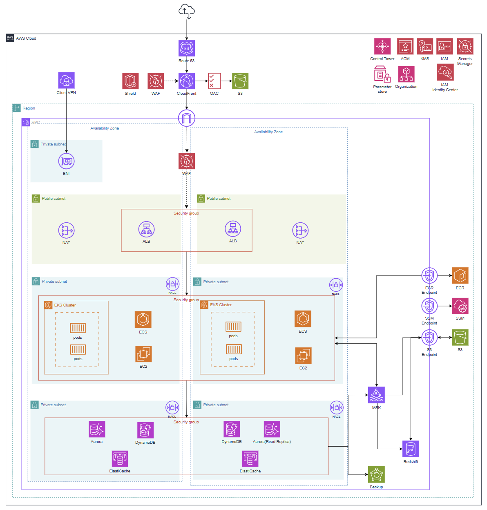
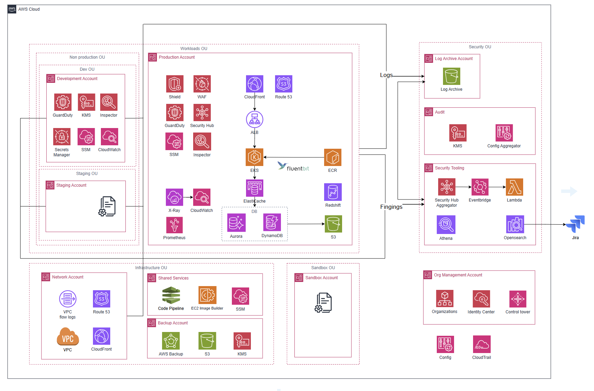
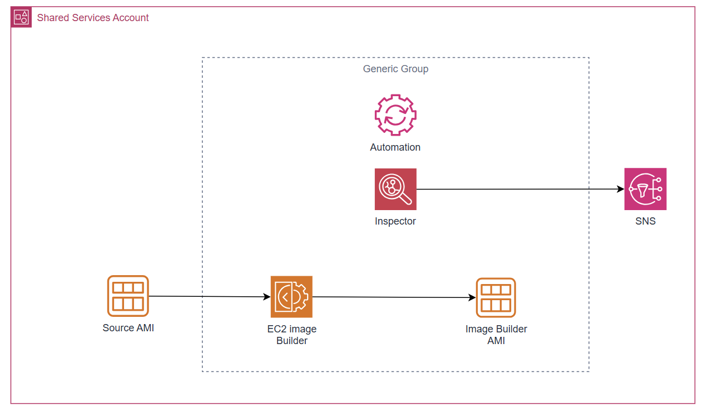
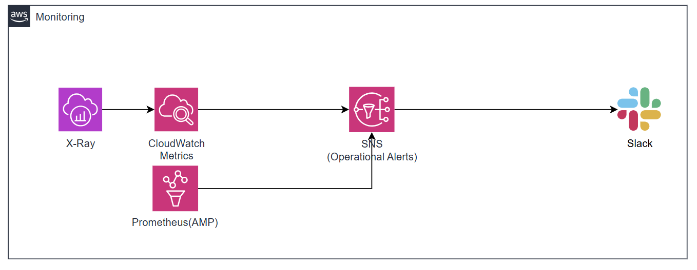
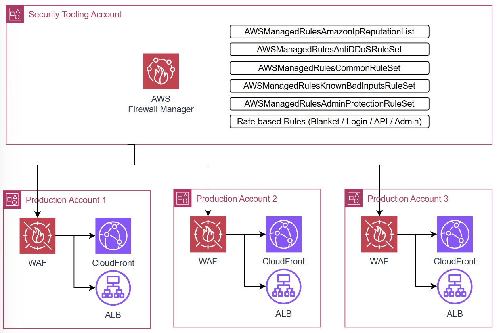
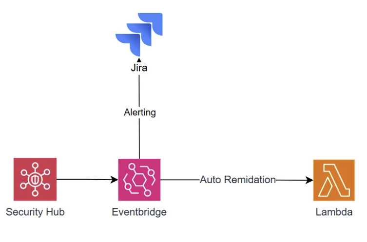
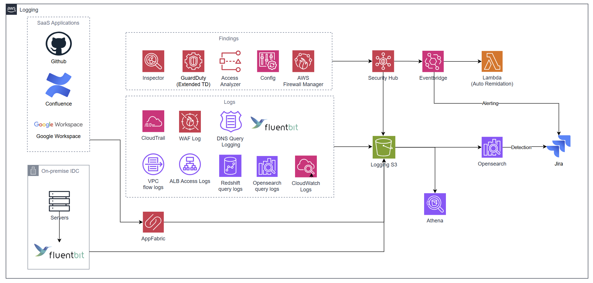
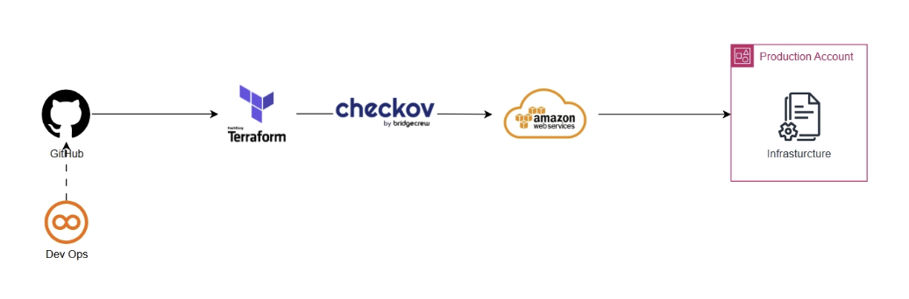
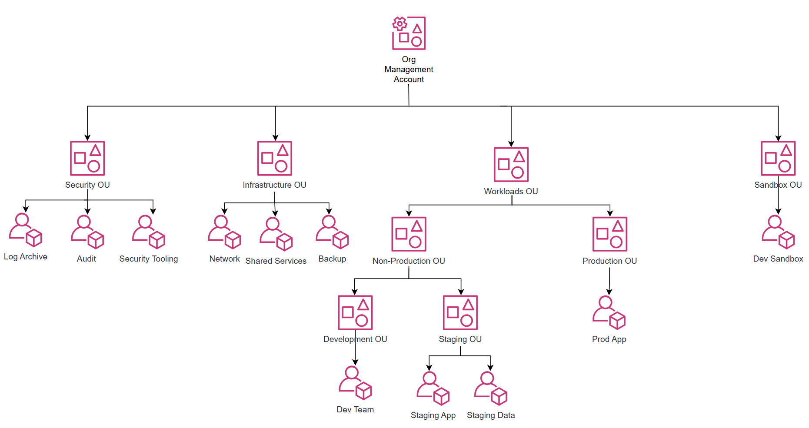
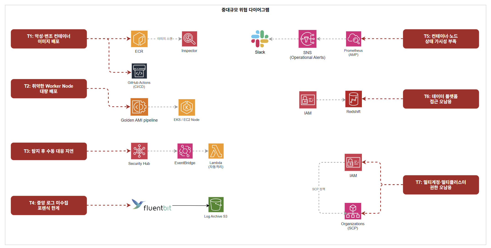

# 중대규모 아키텍처 설계

## 1. 전체 아키텍처





### 1.1 아키텍처 개요 및 설계 원칙

이 아키텍처는 MAU 700만 규모의 서비스와 약 300명의 임직원(AWS 실접근 인원 약 70~80명)이 운영하는 환경을 기반으로 설계된 AWS 클라우드 아키텍처입니다.

중규모 아키텍처에서 7개 계정의 멀티 계정 구조와 IAM Identity Center를 도입했으나, 계정이 늘어날수록 WAF·보안 서비스 설정을 계정마다 개별 관리해야 하는 한계가 드러났습니다. 또한 ECS 기반 컨테이너 환경에서 MAU 규모가 커질수록 Pod 단위의 세밀한 리소스 제어와 서비스 간 격리가 필요해졌습니다. 중대규모에서는 Control Tower와 Firewall Manager를 도입하여 계정 거버넌스와 보안 정책 배포를 완전 자동화하고, EKS 기반으로 전환하여 보안과 운영 효율을 동시에 높이는 것을 핵심 방향으로 설정했습니다.

사용하는 주요 서비스는 다음과 같습니다.

- 엣지 계층: Route 53, CloudFront
- 컴퓨팅 계층: EKS (EC2 기반 노드 그룹, Karpenter 오토스케일링)
- 데이터 계층: Aurora MySQL (Multi-AZ), DynamoDB, Redshift, MSK (Kafka)
- 보안 서비스: WAF, Firewall Manager, ACM, IAM Identity Center, KMS, Secrets Manager, AWS Config, GuardDuty, Amazon Inspector, IAM Access Analyzer, Security Hub, AWS Shield Standard
- 거버넌스: AWS Organizations, Control Tower, SCP, Account Factory for Terraform (AFT)
- CI/CD: GitHub Actions (OIDC), ECR, Image Builder (Golden AMI)
- 운영 도구: SSM, AWS Backup, X-Ray, CloudWatch, AMP (Amazon Managed Prometheus), OpenSearch, AppFabric
- 로깅: CloudTrail (Organization Trail), VPC Flow Logs, Fluent Bit, S3 Object Lock, Athena

설계의 첫 번째 기준은 **정책 중앙화 및 자동 배포**입니다. 중규모에서 계정마다 WAF와 보안 설정을 개별 관리하던 구조의 한계를 Firewall Manager와 Control Tower로 해결합니다. 신규 계정 생성 시점부터 보안 정책이 자동 적용되어 설정 공백 시간이 사라집니다.

두 번째 기준은 **이미지 수준 보안 통제**입니다. EKS Worker Node에 사용되는 AMI는 반드시 Golden AMI 파이프라인을 통해 Inspector 검증을 마친 이미지만 배포됩니다. 컨테이너 이미지 역시 ECR Continuous Scan과 Image Signing으로 무결성을 보장합니다.

세 번째 기준은 **자동 격리 및 보안 대응 자동화**입니다. 중규모에서 GuardDuty Finding 발생 시 보안 담당자가 수동으로 대응하던 구조를 Security Hub + EventBridge + Lambda 파이프라인으로 자동화합니다. CRITICAL/HIGH Finding은 Lambda가 즉시 격리 조치를 수행하고 Jira 티켓을 자동 발행합니다.

네 번째 기준은 **데이터 플랫폼 보안 분리**입니다. MAU 규모 성장에 따라 데이터 엔지니어링 조직이 생겨나면서 운영 DB와 분석 환경을 분리해야 합니다. MSK CDC → Redshift 파이프라인을 통해 데이터 엔지니어가 Aurora 운영 DB에 직접 접근하지 않고도 분석 업무를 수행할 수 있습니다.

다섯 번째 기준은 **SaaS 포함 통합 감사 가시성**입니다. AWS 내부 로그만으로는 임직원의 업무 환경 전체를 가시화할 수 없습니다. AppFabric을 통해 GitHub, Slack, Google Workspace 등 SaaS Audit 로그를 OCSF 포맷으로 정규화하여 AWS 로그와 단일 S3 데이터 레이크에 통합합니다.

### 1.2 사용자 접근 흐름

**(1) 일반 사용자 접근 흐름**

사용자가 도메인에 접속하면 Route 53이 DNS 쿼리를 처리하여 CloudFront로 라우팅합니다. CloudFront는 ACM 인증서를 통해 HTTPS 통신을 보장하며, 정적 콘텐츠는 OAC를 통해 S3에서 직접 제공합니다. S3 버킷은 퍼블릭 접근이 차단되어 CloudFront를 통해서만 접근 가능합니다.

동적 요청은 CloudFront ALB Origin을 통해 퍼블릭 서브넷의 ALB로 전달됩니다. CloudFront에는 Firewall Manager가 중앙 배포한 WAF WebACL이 연결되어 있으며, ALB에도 별도의 WAF WebACL이 적용되어 이중 방어 구조를 형성합니다. ALB는 X-Origin-Secret 커스텀 헤더를 검증하여 CloudFront를 거치지 않은 직접 요청을 차단합니다.

ALB를 통과한 요청은 프라이빗 서브넷의 EKS Pod로 전달됩니다. EKS Pod는 IRSA(IAM Roles for Service Accounts)를 통해 각 서비스별 전용 IAM Role로 Aurora, DynamoDB, S3, MSK에 접근합니다. S3·DynamoDB 통신은 VPC Endpoint를 통해 인터넷을 경유하지 않습니다.

**(2) 임직원 접근 흐름**

임직원은 IAM Identity Center(SSO)에 MFA 인증 후 로그인하여 자신의 Persona에 맞는 Permission Set으로 각 계정에 접근합니다. 장기 Access Key 없이 임시 자격증명으로만 동작하며, 세션 만료 시 자동 차단됩니다.

서버 접속은 SSH 포트를 열지 않고 SSM Session Manager를 통해 EKS 노드에 접근합니다. DB 접속 시에는 SSM Port Forwarding으로 Aurora 엔드포인트에 터널링합니다. Production 계정은 평상시 ReadOnly만 허용하며, 장애·배포 시 JIT(Just-in-Time) 임시 권한 승인 절차를 거칩니다. Break-glass 접근은 인프라·보안 담당자 한정으로 모든 접근이 CloudTrail에 기록되고 보안팀 알림을 트리거합니다.

**(3) CI/CD 배포 흐름**

GitHub Actions에서 코드가 병합되면 OIDC 기반 IAM Role로 AWS에 인증합니다. 빌드된 컨테이너 이미지는 ECR에 Push되며, Inspector가 Push 시점에 OS 패키지 및 언어 의존성 CVE를 자동 스캔합니다. CRITICAL/HIGH 취약점이 발견되면 배포가 자동 차단됩니다. 검증된 이미지는 kubectl 또는 Helm을 통해 EKS 프라이빗 서브넷 Pod로 배포되며, 이미지 Pull은 ECR VPC Interface Endpoint를 통해 인터넷을 경유하지 않습니다.

EKS Worker Node에 사용되는 AMI는 Golden AMI 파이프라인을 통해 Image Builder 빌드 → Inspector CVE 스캔 → 자동 승인/거부 절차를 거친 이미지만 사용합니다.

**(4) 모니터링 및 알림 흐름**

전 계정의 API 호출 이력은 CloudTrail Organization Trail이 수집하여 Log Archive Account S3 버킷에 중앙 저장합니다. S3에는 Object Lock을 적용하여 어떤 역할로도 로그를 삭제·변경할 수 없습니다.

GuardDuty·Inspector·Config·IAM Access Analyzer·Firewall Manager의 Finding은 Security Hub에 통합 집계됩니다. CRITICAL Finding은 EventBridge → Lambda 자동 격리 파이프라인을 즉시 실행하고 Jira 티켓을 자동 발행합니다. HIGH Finding은 서비스 영향 여부에 따라 자동 대응 또는 Jira 티켓 생성 후 수동 대응으로 분기합니다.

EKS 컨테이너·애플리케이션 로그는 Fluent Bit가 수집하여 Log Archive S3로 중앙 전달합니다. 운영 모니터링(X-Ray·CloudWatch·AMP)에서 발생하는 알람은 SNS → Slack(운영 채널)으로 On-call 담당자에게 전달되며, 보안 이벤트는 별도 Jira 티켓 채널로 분리됩니다.

### 1.3 월 예상 비용

- 아시아 태평양(서울, ap-northeast-2) 기준
- 규모 기준: MAU 700만, EKS Worker Node 약 15대, 임직원 AWS 실접근 약 70~80명
- EKS, Aurora, DynamoDB, MSK, Redshift, CloudFront, ALB, NAT Gateway, S3, AWS Backup 등 **워크로드 운영 비용은 제외**하며, 여기서는 **보안·거버넌스·모니터링 서비스** 중심으로 산정합니다.

---

#### 규모 가정

비용 산정의 핵심 가정은 다음과 같습니다. EKS Worker Node는 Karpenter 오토스케일링을 통해 피크 대응이 가능하므로 초기 진입 단계 기준 **15대**로 산정합니다. AppFabric은 AWS 실접근 임직원 70~80명을 기준으로 **100명**을 적용합니다. OpenSearch는 SIEM 초기 운영 수준에서 **r6g.large × 3노드(3-AZ)**로 충분하며, 트래픽 증가에 따라 r6g.xlarge로 스케일업할 수 있습니다. GuardDuty VPC Flow Logs는 15노드 기준 실측 평균 4 GB/노드/월, Route53 Query Logs는 CloudFront가 Route53 쿼리를 직접 생성하지 않으므로 내부 서비스 간 DNS 중심으로 산정합니다. AMP는 60초 수집 인터벌 기준으로 적용합니다.

---

#### 고정 비용 (월)

| **서비스** | **단위** | **단가** | **수량** | **월 비용** |
| --- | --- | --- | --- | --- |
| **WAF** | WebACL | $5.00 / WebACL | 2개 (CloudFront Global + ALB Seoul) | $10.00 |
| **WAF** | AWS 관리형 Rule Group | $1.00 / 룰그룹 | CloudFront 6개 + ALB 5개 = 11개 (중복 제거 적용) | $11.00 |
| **Firewall Manager** | WAF 정책 | $100.00 / 정책·리전 | 2개 정책 (CloudFront Global, ALB Seoul) | $200.00 |
| **KMS CMK** | 키 보관 | $1.00 / 키 | 8개 (rds-cmk, dynamodb-cmk, redshift-cmk, s3-cmk, secrets-cmk, ebs-cmk, s3-log-cmk, msk-cmk) | $8.00 |
| **Secrets Manager** | 시크릿 보관 | $0.40 / secret | 4개 (Aurora 크리덴셜, X-Origin-Secret, 외부 API Key, MSK 크리덴셜) | $1.60 |
| **CloudWatch** | 경보 (표준 해상도) | $0.10 / 경보 | 20개 (Metric Filter 알람 12개 + 서비스 지표 알람 8개) | $2.00 |
| **CloudTrail** | 관리 이벤트 (첫 번째 Trail) | $0 | Organization Trail 1개 | $0 |
| **SSM Session Manager** | 세션 자체 | $0 | - | $0 |
| **IAM Identity Center** | - | $0 | - | $0 |
| **ACM** | 인증서 | $0 | - | $0 |
| **IAM Access Analyzer** | 외부 액세스 분석기 | $0 | - | $0 |
| **AWS Organizations / SCP / Control Tower** | - | $0 | Control Tower 자체 무료, 활성화 서비스 비용 별도 | $0 |
| **AWS Shield Standard** | - | $0 | CloudFront 자동 적용 | $0 |

**고정 비용 소계: $232.60 / 월**

---

#### 요청/사용량 기반 비용

| **서비스** | **단위** | **단가** | **사용량** | **월 비용** | **산출 근거** |
| --- | --- | --- | --- | --- | --- |
| **WAF** | 요청 수 | $0.60 / 100만 건 | 1.5억 건 | $90.00 | DAU 50만 × 5req × 30일 = 7,500만, 봇 포함 ×2배 = 1.5억 |
| **KMS** | API 요청 (대칭키) | $0.03 / 10,000건 | 15만 건 | $0.45 | 15노드 기준 Pod 기동·Secrets 조회·S3 Put/Get. S3 Bucket Key 적용으로 객체당 호출 최소화 |
| **Secrets Manager** | API 요청 | $0.05 / 10,000건 | 2만 건 | $0.10 | 15 Pod × 일 10회 기동 × 30일 기준, 캐시 사용 |
| **CloudTrail** | S3 데이터 이벤트 (Write 전용) | $0.10 / 100,000건 | 2만 건 | $0.02 | Read 이벤트 제외. Read 포함 시 추가 비용 발생 |
| **CloudWatch** | 로그 수집 | $0.76 / GB | 35 GB | $26.60 | CloudTrail→CW Logs 1 GB + EKS 컨테이너 로그 15 Pod × 1 GB + 여유분 |
| **SNS** | 이메일·Slack 알림 | $0 | 소량 | $0 | 월 1,000건 무료 범위 이내 |
| **GuardDuty** | CloudTrail 관리 이벤트 | $4.00 / 100만 건 | 150만 건 | $6.00 | 15개 계정 × 일 약 3,300건 × 30일 합산 |
| **GuardDuty** | VPC Flow Logs | $1.00 / GB (첫 500 GB 티어) | 60 GB | $60.00 | 15노드 × 4 GB/노드/월. Runtime Monitoring 활성화 시 면제 가능 |
| **GuardDuty** | Route53 Query Logs | $1.00 / GB (첫 500 GB 티어) | 12 GB | $12.00 | CloudFront는 Route53 직접 쿼리 미생성. 내부 서비스 간 DNS 중심 산정 |
| **Security Hub (CSPM)** | 보안 체크 | $0.0010 / 체크 (첫 100,000건) | 15,000건 | $15.00 | 15개 계정 × 리소스 평균 1,000건 체크 (FSBP + CIS v5.0 기준) |
| **Security Hub (CSPM)** | Finding 인제스트 | $0.00003 / 건 (10,000건 초과분) | 25만 건 | $7.20 | 10,000건 무료 티어 초과분 240,000건 × $0.00003 |
| **AWS Config** | 구성 항목 기록 | $0.003 / 건 | 15,000건 | $45.00 | 15개 계정 × 리소스 100개 × 월 평균 10회 변경 |
| **AWS Config** | Rule 평가 | $0.001 / 건 | 150,000건 | $150.00 | 30개 규칙 × 5,000 리소스 평가. Firewall Manager Config Rules 포함 |
| **Inspector** | EC2 인스턴스 스캔 | $1.258 / 인스턴스 | 15대 | $18.87 | EKS on EC2 Worker Node 15대 기준 |
| **Inspector** | ECR 이미지 Push 스캔 | $0.09 / Push | 200회 | $18.00 | 일 약 7회 배포 기준 |
| **Inspector** | 자동 재스캔 (신규 CVE) | $0.01 / 재스캔 | 500회 | $5.00 | 신규 CVE 발표 시 자동 재평가 |
| **AMP (Amazon Managed Prometheus)** | 메트릭 샘플 수집 | $0.90 / 1,000만 샘플 | 약 6.6억 샘플 | $59.40 | 15노드 × 1,000 metrics × 60초 인터벌 × 730시간 ≈ 6.57억 샘플 |
| **AMP** | 메트릭 스토리지 | $0.03 / GB | 15 GB | $0.45 | 15노드 기준 30일 보관 |
| **AppFabric** | SaaS Audit 로그 수집 | $3.00 / 유니크 유저ID | 100명 | $300.00 | AWS 실접근 임직원 70~80명 기준 월 활성 유저. GitHub·Slack·Google Workspace 대상 |
| **OpenSearch** | 인스턴스 (r6g.large × 3노드, 3-AZ) | $0.182 / 시간 | 730시간 × 3노드 | $398.58 | SIEM 초기 운영 수준 (16 GiB × 3). ap-northeast-2 on-demand 기준 |
| **OpenSearch** | EBS GP2 스토리지 | $0.135 / GB | 600 GB | $81.00 | 200 GB × 3노드 |
| **AWS X-Ray** | 트레이스 수집·스캔 | $5.00 / 100만 트레이스 | 500만 트레이스 | $25.00 | EKS Pod 분산 추적, 최초 100만 트레이스 무료 |

**요청/사용량 기반 합계: 약 $1,318 / 월**

---

#### 최종 정리

| **구분** | **합계** |
| --- | --- |
| **고정 비용** | **$232.60 / 월** |
| **요청/사용량 기반 비용** | **$1,318 / 월** |
| **보안·거버넌스·모니터링 서비스 총합 (추정)** | **약 $1,551 / 월** |

> **중요 1**: 위 금액은 보안·거버넌스·모니터링 서비스만의 추정치입니다. EKS, Aurora, DynamoDB, MSK, Redshift, CloudFront, ALB, NAT Gateway, S3, AWS Backup 등 워크로드 운영 비용은 별도 산정이 필요합니다.
> 
> 
> **중요 2**: **AWS Config ($195)** 는 Firewall Manager WAF 정책이 자동으로 Config Rules를 생성하므로 계정 수·리소스 수·변경 빈도가 늘수록 빠르게 증가합니다. 핵심 보안 규칙 위주로 Rule 수를 제한하고 주기적으로 미사용 Rule을 정리하는 것을 권고합니다.
> 
> **중요 3**: **OpenSearch ($480)** 는 r6g.large 3노드 기준입니다. 로그 인덱싱 부하가 증가하면 r6g.xlarge로 스케일업이 필요하며, 이 경우 인스턴스 비용이 약 $335 추가됩니다. 오래된 인덱스는 UltraWarm 스토리지 티어($0.024/GB)로 이동하여 EBS 비용을 절감할 수 있습니다.
> 
> **중요 4**: **GuardDuty EKS Runtime Monitoring** 을 활성화하면 Runtime Agent가 설치된 노드의 VPC Flow Logs 분석 비용($60)이 면제됩니다. Runtime Monitoring 자체 비용(vCPU당 과금)과 비교하여 순절감 여부를 운영 초기에 검토하는 것을 권고합니다.
> 
> **중요 5**: **AppFabric ($300)** 은 월 활성 유니크 유저ID 기준으로 청구됩니다. 임직원 증가 또는 SaaS 연동 앱 추가 시 비용이 증가하므로 월별 활성 유저 수를 모니터링하는 것을 권고합니다.
> 
> **중요 6**: **Firewall Manager WAF 정책 ($200/월)** 은 정책 2개(CloudFront Global + ALB Seoul) 기준입니다. 추가 리전 확장 시 정책당 $100씩 추가됩니다.
> 
> **중요 7**: CloudTrail S3 데이터 이벤트는 **Write 이벤트만 기록**하는 것을 기본으로 설계했습니다. Read 이벤트(GetObject)를 포함하면 비용이 크게 증가하므로 보안 요건상 Read 기록이 필요한 경우 별도 산정이 필요합니다.
>

## 2. 서비스별 상세 설계

### 2.1 Golden AMI 파이프라인

AMI 자체에 취약점이 존재하면 해당 이미지로부터 생성된 모든 인스턴스가 동일한 위험에 노출됩니다. 런타임 보안 통제만으로는 이미지 레벨 취약점을 근본적으로 해결할 수 없으므로 Golden AMI 파이프라인을 도입합니다.

#### 2.1.1 구성 요소 및 설정 방식



파이프라인은 다음의 흐름으로 동작합니다. 허용된 Source AMI(AWS Marketplace 또는 내부 베이스 이미지)가 파이프라인에 진입하면 Image Builder가 OS 패치 적용, 불필요한 서비스 비활성화, 에이전트 설치 등 보안 강화 작업을 자동으로 수행합니다. 빌드된 이미지는 Inspector의 CVE 기반 취약점 스캔을 거치며 CRITICAL/HIGH 취약점 발견 시 배포가 자동 차단됩니다. 스캔을 통과한 이미지만 SSM Parameter Store에 AMI ID가 등록되어 EKS 노드 프로비저닝 시 참조되며, 파이프라인 주요 이벤트는 SNS로 담당자에게 실시간 통보됩니다.

#### 2.1.2 설계 이유

수동으로 AMI를 관리할 경우 이미지 간 설정 불일치, 패치 누락, 검증 절차 미준수 등의 문제가 발생할 수 있습니다. 자동화된 파이프라인은 인적 오류를 줄이고 모든 이미지가 동일한 보안 기준을 거쳐 생성됨을 보장합니다.

#### 2.1.3 반영된 보안 요소

- Shared Services Account 격리로 파이프라인 자체에 대한 접근을 최소화하고 무단 변경을 방지합니다.
- Inspector CVE 스캔 자동화로 취약한 이미지가 운영 환경에 배포되는 것을 차단합니다.
- Image Builder 레시피 기반 빌드로 수동 개입 여지를 제거하고 이미지 무결성을 보장합니다.

---

### 2.2 CI/CD

GitHub Actions를 오케스트레이터로 사용하며 브랜치 전략에 따라 트리거를 분리합니다. `main` 병합 시 프로덕션 배포, `develop` 푸시 시 스테이징 배포가 수행되고, PR 단계에서는 빌드·테스트만 실행하여 검증되지 않은 코드가 운영 환경에 반영되는 것을 방지합니다.

#### 2.2.1 구성 요소 및 설정 방식

AWS 인증은 OIDC(OpenID Connect)로 처리합니다. AWS 자격증명을 Secrets에 저장하는 대신 워크플로우 실행 시 STS에서 수명이 제한된 임시 자격증명을 발급받으며, IAM Trust Policy에 특정 리포지토리·브랜치 조건을 명시하여 허용된 워크플로우에서만 Role을 Assume할 수 있도록 제한합니다. 빌드된 컨테이너 이미지는 ECR 프라이빗 레지스트리에 Git 커밋 SHA 태그로 저장되며 Push 시점에 Inspector가 자동으로 취약점 스캔을 수행합니다. 스캔을 통과한 이미지는 `kubectl` 또는 Helm으로 EKS에 배포되며, GitHub Actions Role에는 최소 권한만 부여하고 EKS 내에서도 RBAC으로 배포 대상 Namespace를 제한합니다.

#### 2.2.2 설계 이유

GitHub Actions Secrets에 AWS Access Key를 저장하면 유효 기간 제한이 없는 장기 자격증명이 노출될 위험이 있습니다. OIDC 기반 임시 자격증명은 워크플로우 실행 시에만 유효하고 자동 만료되므로 자격증명 탈취로 인한 피해 범위를 근본적으로 제한합니다. 외부 레지스트리(Docker Hub 등) 이미지를 그대로 사용하면 이미지 무결성을 보장할 수 없으므로 ECR 프라이빗 레지스트리로 이미지 출처를 단일화합니다.

#### 2.2.3 반영된 보안 요소

- OIDC 기반 임시 자격증명으로 장기 Access Key를 GitHub 환경에 저장하지 않아 자격증명 탈취 시 피해 범위를 원천 차단합니다.
- ECR 프라이빗 레지스트리로 이미지 출처를 단일화하여 공급망 공격(Supply Chain Attack)을 방어합니다.
- ECR Push 시점 Inspector 자동 스캔으로 취약한 컨테이너 이미지의 EKS 배포를 차단합니다.

---

### 2.3 모니터링 파이프라인



X-Ray·CloudWatch·AMP(Amazon Managed Prometheus) 세 도구를 조합하여 애플리케이션부터 인프라까지 관측 데이터를 수집하고, CloudWatch Alarm → SNS → Slack으로 운영 알림을 전달합니다. 보안 이벤트 알림(Lambda → Jira)과 채널을 명확히 분리하여 운영 노이즈가 보안 알림을 덮지 않도록 합니다.

#### 2.3.1 구성 요소 및 설정 방식

| 도구 | 역할 |
| --- | --- |
| **AWS X-Ray** | EKS MSA 환경의 분산 추적. 서비스 간 요청 흐름을 세그먼트 단위로 기록하여 장애 지점 특정 및 비정상 호출 패턴 탐지에 활용 |
| **CloudWatch** | AWS 인프라 전반의 메트릭·로그·이벤트 수집. 임계값 초과 시 알람 트리거. Logs Insights로 로그 기반 이상 탐지 쿼리 운용 |
| **AMP (Prometheus)** | 컨테이너·쿠버네티스 환경 전용 메트릭 수집. CloudWatch가 커버하지 못하는 세분화된 애플리케이션 메트릭 보완 |

#### 2.3.2 설계 이유

X-Ray를 도입한 배경은 MSA 환경에서 단순 로그만으로는 장애 지점을 특정하기 어렵다는 점에 있습니다. 트레이스 데이터로 서비스 간 요청 흐름 전체를 추적할 수 있어 보안 사고 발생 시에도 어느 서비스·시점에서 이상이 발생했는지 재구성이 가능합니다. CloudWatch와 AMP를 병행하는 이유는 단일 도구로는 인프라 전반과 컨테이너 레벨 메트릭을 동시에 커버하기 어렵기 때문입니다.

#### 2.3.3 반영된 보안 요소

- X-Ray 분산 추적 데이터를 보안 사고 포렌식 증적으로 활용하여 사후 원인 분석에 직접 사용합니다.
- 수집된 모니터링 데이터는 보안 정책에 따라 보존 기간을 설정하여 사고 시점 이전 데이터까지 소급 분석이 가능합니다.
- 운영 알림(Slack)과 보안 알림(Jira) 채널을 분리하여 보안 이벤트가 운영 노이즈에 묻히지 않도록 합니다.

---

### 2.4 WAF + Firewall Manager



#### 2.4.1 중규모 대비 달라진 점

중규모에서는 각 계정이 WAF를 개별적으로 생성하고 관리했습니다. 계정이 늘어날수록 보안 담당자가 계정마다 WAF 설정을 직접 확인해야 하고, 신규 계정 생성 시 WAF 없는 공백 시간이 발생하는 구조적 한계가 있었습니다.

중대규모에서는 Firewall Manager를 도입하여 Security Tooling 계정에서 WAF 정책을 중앙 정의하고 Workloads OU 전체에 자동 배포합니다. 신규 계정이 추가되는 순간 정책이 자동 적용되어 공백 시간이 사라집니다.

---

#### 2.4.2 Firewall Manager 사전 요구사항

Firewall Manager는 아래 세 가지 전제조건이 충족되어야 동작합니다.

| 요구사항 | 적용 방식 |
| --- | --- |
| Organizations All Features 활성화 | Control Tower 구성 시 자동 활성화됨 |
| Firewall Manager 관리자 계정 지정 | Management Account → Security Tooling Account 위임 관리자로 지정 |
| 멤버 전 계정 AWS Config 활성화 | Control Tower가 전 계정 Config 자동 활성화. 신규 계정도 AFT 통해 자동 적용 |

Config가 비활성화된 계정에서는 Firewall Manager가 신규 리소스를 탐지하지 못하고 규정 준수 가시성도 사라집니다.

---

#### 2.4.3 관리자 계정 지정

Security Tooling Account를 Firewall Manager 위임 관리자로 지정합니다. Management Account는 조직 관리 전용으로 유지하고 실제 보안 운영은 Security Tooling 계정에서만 수행합니다.

```bash
Management Account
└── Firewall Manager 위임 관리자 지정 (단 한 번 실행)
        ↓
Security Tooling Account (위임 관리자)
└── 전체 Workloads OU 정책 정의·배포·모니터링
```

모든 정책 생성·수정·배포·모니터링은 Security Tooling Account에서만 수행합니다.

---

#### 2.4.4 Pre / Middle / Post 정책 구조

Firewall Manager WAF 정책은 PreProcess Rule Group과 PostProcess Rule Group을 강제 정의하고, 각 멤버 계정 팀이 그 사이(Middle)에 자체 규칙을 추가할 수 있는 구조입니다. 보안팀이 공통 가드레일을 잠그면서도 각 팀의 커스터마이징 유연성을 동시에 확보하는 방식입니다.

```bash
트래픽 인입
      ↓
[PreProcess — Firewall Manager 강제 배포, 보안 담당자만 수정 가능]
  ├── AWSManagedRulesAmazonIpReputationList
  ├── AWSManagedRulesAntiDDoSRuleSet
  └── AWSManagedRulesCommonRuleSet

[Middle — 각 계정 팀 자율 추가 영역]
  └── 서비스별 커스텀 Rule 허용 (PreProcess/PostProcess 변경 불가)

[PostProcess — Firewall Manager 강제 배포, 보안 담당자만 수정 가능]
  ├── AWSManagedRulesKnownBadInputsRuleSet
  ├── AWSManagedRulesAdminProtectionRuleSet
  └── Rate-based Rules (Blanket / Login / API / Admin)
      ↓
트래픽 통과 or 차단
```

**PreProcess에 IpReputation·AntiDDoS·Common을 두는 이유**

광범위한 위협을 가장 먼저 걷어내어 Middle 영역의 팀 규칙이 처리할 트래픽 볼륨 자체를 줄입니다. WAF는 처리한 요청 수만큼 비용이 발생하므로 앞에서 먼저 거르는 것이 비용 효율적입니다.

**PostProcess에 나머지를 두는 이유**

팀 규칙이 먼저 처리한 뒤 최종 방어선으로 KnownBadInputs와 Rate-based Rule이 마지막 확인을 수행합니다. 팀이 Middle에서 Rate 임계값을 높게 설정하더라도 PostProcess의 Blanket Rate Rule이 최종 안전망 역할을 합니다.

---

#### 2.4.5 배포 정책 구성 — 2개 정책으로 분리

CloudFront에 WAF를 적용하려면 WAF를 반드시 Global(us-east-1)에 생성해야 하고, ALB에 적용하려면 ALB가 위치한 리전(ap-northeast-2)에 생성해야 합니다. 하나의 Firewall Manager 정책은 하나의 리전만 담당하므로 정책을 2개로 분리합니다.

**정책 1 — CloudFront Web ACL (Global, us-east-1)**

| 항목 | 설정값 |
| --- | --- |
| 정책 이름 | FMS-WAF-CloudFront-Global |
| 리소스 타입 | CloudFront Distribution |
| 리전 | Global (us-east-1) |
| 적용 범위 | Workloads OU (Production OU + Non-Production OU) |
| 제외 | Security OU, Infrastructure OU, Sandbox OU |
| 자동 교정 | 활성화 (Non-compliant 리소스에 자동 Web ACL 연결) |
| 로그 전송 | Log Archive 계정 S3 (waf-logs/cloudfront/) 중앙 전송 |

**정책 2 — ALB Web ACL (ap-northeast-2)**

| 항목 | 설정값 |
| --- | --- |
| 정책 이름 | FMS-WAF-ALB-Seoul |
| 리소스 타입 | Application Load Balancer |
| 리전 | ap-northeast-2 (서울) |
| 적용 범위 | Workloads OU (Production OU + Non-Production OU) |
| 제외 | Security OU, Infrastructure OU, Sandbox OU |
| 자동 교정 | 활성화 |
| 로그 전송 | Log Archive 계정 S3 (waf-logs/alb/) 중앙 전송 |

---

#### 2.4.6 규정 준수 모니터링 및 Finding 연계

Firewall Manager는 WAF가 연결되지 않은 리소스를 자동 탐지하고 Finding을 Security Hub로 전송합니다.

```bash
Firewall Manager (WAF 미연결·정책 위반 탐지)
        ↓
Security Hub (Finding 집계)
        ↓
EventBridge Rule
        ├── CRITICAL → Lambda 자동 대응 + Jira 티켓 자동 생성
        └── HIGH     → Jira 티켓 생성 → 보안 담당자 수동 확인
```

---

#### 2.4.7 Count 모드 운영 전략

신규 Rule 추가 시 오탐으로 정상 트래픽이 차단되는 것을 방지하기 위해 단계적으로 전환합니다.

```bash
신규 Rule 추가
        ↓
Count 모드 (1~2주)
        ↓
CloudWatch로 차단될 요청 모니터링 + 오탐 확인
        ↓
오탐 없음 → Block 모드 전환
오탐 발견 → Rule 예외 처리 후 Block 모드 전환
```

---

### 2.5 Security Hub (CSPM)

#### 2.5.1 중규모 대비 달라진 점

중규모에서는 Security Hub를 도입하지 않았습니다. GuardDuty·Inspector·Config·Access Analyzer를 각각 개별 콘솔에서 확인하는 구조였고, 보안 담당자가 여러 콘솔을 오가며 Finding을 수동으로 취합해야 했습니다. 심각도 우선순위화와 자동 대응 연계가 어려운 한계가 있었습니다.
중대규모에서는 Security Hub를 신규 도입합니다. Security Tooling Account를 위임 관리자로 지정하고 Central Configuration으로 OU별 정책을 다르게 적용합니다. Inspector·GuardDuty·Access Analyzer·Config·Firewall Manager의 Finding이 모두 Security Hub로 수렴하는 단일 집계 구조를 구성하고, EventBridge 기반 자동 대응 파이프라인과 Jira 티켓 연동을 함께 구축합니다.

---

#### 2.5.2 계정 구조 연계 (위임 관리자 설정)

Management Account는 Security Hub 위임 관리자로 사용하지 않습니다. AWS는 보안 운영과 조직 관리를 분리하기 위해 전용 Security Tooling 계정을 위임 관리자로 사용합니다.

```bash
Management Account
└── Security Hub 위임 관리자 지정
        ↓
Security Tooling Account (위임 관리자)
├── 전체 멤버 계정 Finding 중앙 집계
├── Central Configuration으로 OU별 정책 관리
├── 신규 계정 자동 활성화 설정
└── Security Standards 중앙 관리
```

---

#### 2.5.3 Finding 소스 통합

Security Hub는 아래 5개 서비스의 Finding을 중앙 집계합니다.

```bash
Inspector            ┐
GuardDuty            │
Access Analyzer      ├──> Security Hub (중앙 집계·우선순위화)
Config               │         └──> 통합 대시보드 + 컴플라이언스 스코어
AWS Firewall Manager ┘
```

---

#### 2.5.4 Central Configuration — OU별 정책

Central Configuration은 위임 관리자가 단일 계정에서 전체 조직의 Security Hub를 구성할 수 있게 해줍니다. Configuration Policy를 OU별로 다르게 적용할 수 있어 멀티 계정 환경에서 가장 효율적인 방식입니다.

| OU | 정책 방향 |
| --- | --- |
| Security OU | 모든 Standards 활성화, 컨트롤 비활성화 없음 |
| Infrastructure OU | FSBP + CIS v5.0 활성화 |
| Workloads OU (Production) | FSBP + CIS v5.0 활성화, 엄격 적용 |
| Workloads OU (Non-Production) | FSBP 활성화, 일부 컨트롤 완화 |
| Sandbox OU | FSBP 활성화, PCI·NIST 비적용 |

---

#### 2.5.5 활성화할 Security Standards

| Standard | 활성화 이유 | 적용 범위 |
| --- | --- | --- |
| FSBP v1.0.0 | AWS 전체 서비스 보안 기본 기준, 모든 고객 필수 | 전체 OU |
| CIS AWS Foundations Benchmark v5.0.0 | 최신 CIS 기준, IAM·스토리지·로깅·네트워크 40개 컨트롤 | Production OU·Security OU |

---

#### 2.5.6 Automation Rules 운영

Security Hub Automation Rules는 Finding이 수집될 때 자동으로 처리합니다. 억제·심각도 조정·노트 추가 등으로 보안 워크플로우를 자동화하고 노이즈를 줄입니다.

| 조건 | 자동 처리 |
| --- | --- |
| Sandbox OU의 LOW·INFORMATIONAL Finding | 자동 억제 (노이즈 감소) |
| Non-Production의 알려진 허용 패턴 | 자동 아카이브 처리 |
| CRITICAL Finding | 심각도 유지 + 긴급 태그 자동 추가 |
| 동일 리소스 반복 Finding | 중복 억제 + 누적 카운트 노트 추가 |

---

#### 2.5.7 Finding 대응 흐름

```bash
Security Hub (Finding 집계·우선순위화)
        ↓
EventBridge
        ├──> Lambda (자동 대응)
        │         ├──> 자동 대응 실행
        │         └──> Jira 티켓 자동 생성 (대응 결과 기록)
        └──> Jira 티켓 생성 (수동 대응 대상)
                  └──> 보안 담당자·담당팀 할당
```

---

#### 2.5.8 심각도별 대응 기준

| 심각도 | 대응 방식 |
| --- | --- |
| CRITICAL | Lambda 즉시 자동 대응 + Jira 티켓 자동 생성 (대응 결과 기록) |
| HIGH | Finding 종류에 따라 Lambda 자동 대응 또는 Jira 티켓 생성 후 수동 대응 |
| MEDIUM | Jira 티켓 생성 → 담당자 배정 → 주간 리포트 검토 |
| LOW·INFORMATIONAL | Security Hub 집계 → 월간 리포트 검토 |

HIGH Finding의 자동 대응 여부는 자동 대응 실행 시 서비스 영향 여부를 기준으로 판단합니다. 자동 대응을 실행해도 서비스에 영향이 없는 것은 Lambda가 즉시 처리하고, 자동 대응 실행 시 서비스 중단이나 팀 접근 불가가 발생할 수 있는 것은 Jira 티켓을 생성하여 담당자가 확인 후 수동 대응합니다. 상세 기준은 3번 섹션에서 정의합니다.

---

#### 2.5.9 Finding 보존

- Security Hub Finding → Log Archive 계정 S3 (security-logs/) 자동 내보내기
- Security Hub 내 보관: 30일
- S3 장기 보존: 1년

---

### 2.6 Lambda / SSM Automation + Jira (자동 대응 및 티켓 연동)



#### 2.6.1 전체 대응 구조

보안 이벤트 발생 시 자동 대응이 무조건 좋은 것은 아닙니다. 자동 대응이 오히려 검증 과정 없이 실행될 경우 운영 장애로 이어질 수 있습니다. 이 구조에서는 서비스 영향 여부를 기준으로 자동 대응과 수동 대응을 분리합니다.

```bash
Security Hub Finding
        ↓
EventBridge
        ↓
Lambda (자동 대응 라우터)
        ├──> 서비스 영향 없는 경우 → 즉시 자동 대응 → Jira 티켓 자동 생성 (결과 기록)
        └──> 서비스 영향 있는 경우
                  ├──> CRITICAL·HIGH (명확한 공격 진행 중) → 자동 대응 → Jira 티켓
                  └──> HIGH·MEDIUM (서비스 영향 가능성) → Jira 티켓 생성 → 수동 대응
```

---

#### 2.6.2 멀티 계정 자동 대응 구조

Security Tooling Account의 Lambda가 CrossAccount AssumeRole로 멤버 계정 리소스를 직접 수정합니다.

```bash
Security Tooling Account
    EventBridge Rule 탐지
        ↓
    Lambda (대응 실행)
        ├──> AssumeRole → 멤버 계정 리소스 수정
        │         (SG 변경, S3 차단, IAM 비활성화 등)
        ├──> Security Hub Finding → RESOLVED 업데이트
        ├──> CloudWatch Logs → 대응 감사 로그 기록
        └──> Jira 티켓 자동 생성 (Finding 상세·대응 결과 포
```

---

#### 2.6.3 Critical — 전체 자동 대응

공격이 진행 중인 상태이므로 즉시 자동 대응합니다. 대응 완료 후 Jira 티켓이 자동 생성되어 보안 담당자가 사후 확인합니다.

| Finding | 판단 이유 | 대응 수단 |
| --- | --- | --- |
| 악성 IP IAM API 호출 | 공격 진행 중 | SSM Automation (해당 IAM 유저 인증 수단 전체 차단) |
| EKS 크립토마이닝 | 코드 실행 중 | Lambda (워커노드 격리) |
| EKS 포트 포워딩 | 백도어 진행 중 | Lambda (워커노드 격리) |
| CloudTrail 비활성화 | 공격 은닉 시도 | SSM Automation (즉시 재활성화) |
| EC2·EKS 악성 아웃바운드 | 악성코드 감염·C2 통신 중 | Lambda (SG 아웃바운드 차단) |
| GuardDuty 비활성화 탐지 | 탐지 회피 의도 | Lambda (즉시 재활성화) |
| Route53 퍼블릭 호스팅 존 변조 | 전체 트래픽 탈취 위험 | Lambda (변경 롤백) |
| MSK 비인가 접근 | 이벤트 스트림 전체 노출 | Lambda (보안 그룹 차단) |
| Self-hosted Runner 침해 | CI/CD 전체 장악 가능 | Lambda (Runner 격리·파이프라인 중단) |
| ECR 이미지 변조 | 컨테이너 환경 전체 침해 | Lambda (해당 이미지 태그 무효화) |

---

#### 2.6.4 High — 자동 대응 또는 수동 대응

서비스 영향 없이 즉시 자동 대응 가능한 것과 담당팀 확인이 필요한 것을 분리합니다.

| Finding | 판단 이유 | 자동 대응 여부 | 대응 수단 |
| --- | --- | --- | --- |
| S3 퍼블릭 허용 | 데이터 노출 상태, 공격 진행 중 아님 | 자동 대응 | SSM Automation (퍼블릭 액세스 차단) |
| SG 0.0.0.0/0 오픈 | 설정 오류, SSH 포트 노출 시 브루트포스 위험 | 자동 대응 | Lambda (해당 SG 규칙 제거) |
| VPC Flow Log 비활성화 | 로그 공백으로 탐지 어려움 | 자동 대응 | Lambda (Flow Log 재활성화) |
| Redshift 퍼블릭 접근 | 데이터 웨어하우스 직접 노출 | 자동 대응 | Lambda (퍼블릭 액세스 차단) |
| OpenSearch 퍼블릭 접근 허용 | 로그·보안 데이터 외부 노출 | 수동 대응 | 자동 차단 시 분석팀 접근 불가 가능성. Jira 티켓 생성 후 확인 |
| EC2·ECR Critical 취약점 탐지 | 취약점 존재 = 공격 가능 상태 | 수동 대응 | 패치는 개발팀 협업 필요. Jira 티켓 → 담당팀 배정 |
| EKS API 서버 퍼블릭 노출 | 외부에서 EKS API 접근 가능 상태 | 수동 대응 | 자동 차단 시 개발팀 접근 불가. Jira 티켓 생성 후 확인 |
| Root 액세스 키 존재 | Root 키 존재 자체가 보안 위협 | 수동 대응 | 자동 삭제 시 운영 중단 위험. Jira 긴급 티켓 생성 |
| Client VPN 비정상 접근 | VPN으로 내부 네트워크 직접 접근 가능 | 수동 대응 | Jira 티켓 생성 → 보안 담당자 VPN 세션 수동 종료 |
| NACL 과도한 허용 규칙 | NACL Stateless 특성상 SG 우회 가능 | 수동 대응 | Jira 티켓 생성 → 인프라 담당자 협업 |
| ElastiCache 암호화 미설정 | 세션 데이터 평문 저장 | 수동 대응 | Jira 티켓 생성 → 주간 리포트 검토 |
| Backup 미설정 리소스 | 랜섬웨어 공격 시 복구 불가 | 수동 대응 | Jira 티켓 생성 → 담당팀 배정 |
| EC2 Image Builder 취약한 베이스 이미지 | 취약한 이미지가 전체 노드에 전파 | 수동 대응 | Jira 티켓 생성 → 담당팀 이미지 갱신 |

---

#### 2.6.5 Medium — Jira 티켓 생성 후 수동 대응

즉각적 보안 위협은 아니지만 방치 시 취약점으로 악용될 수 있습니다. Jira 티켓이 생성되고 주간 리포트에서 검토합니다.

| Finding | 판단 이유 |
| --- | --- |
| 암호화 미설정 (EBS·RDS·ElastiCache) | 암호화 미설정 자체가 공격은 아님. 탈취 시 평문 노출 위험 |
| ACM 인증서 만료 30일 전 | 만료되면 서비스 장애로 이어지나 즉각적 보안 위협은 아님 |
| Secrets Manager 교체 미설정 | 시크릿이 장기간 고정된 상태. 즉각적 공격 진행 중 아님 |
| 90일 미사용 IAM 역할 | 미사용 역할 존재 (공격 표면 확장). 현재 악용 중 아님 |
| 미사용 IAM 액세스 키 | 미사용 상태. 외부 노출 가능성 있어 확인 후 삭제 필요 |
| WAF 미연결 | Shield·SG로 1차 방어는 됨. L7 방어를 위해 연결 필요. 검토 없이 연결 시 정상 트래픽 차단 위험 |
| MSK 암호화 미설정 | 이벤트 스트림 평문 전송. 내부 네트워크 스니핑 시 노출 |
| CloudFront HTTPS 미설정 | HTTP 평문 전송. 중간자 공격 가능 |
| SSM Endpoint 미사용 | EC2가 인터넷을 통해 SSM 통신하는 경우 |
| Redshift 감사 로그 미설정 | 데이터 접근 감사 불가 |

---

#### 2.6.6 Jira 연동 구조

자동 대응 완료 후 또는 수동 대응이 필요한 경우 모두 Jira 티켓이 자동 생성됩니다.

```bash
Lambda 자동 대응 완료
        └──> Jira 티켓 자동 생성
                  ├── Finding 상세 내용
                  ├── 자동 대응 실행 내용
                  ├── 대응 결과 (성공·실패)
                  └── 보안 담당자 사후 확인 요청

수동 대응 필요
        └──> Jira 티켓 자동 생성
                  ├── Finding 상세 내용
                  ├── 권고 대응 방안
                  └── 담당자 자동 배정 (Finding 유형·계정 기준)
```

OpenSearch Detection → Jira 흐름은 로그 분석 기반 이상 탐지에서 Jira 티켓으로 연결되는 별도 경로입니다. Security Hub Finding 기반 Jira 티켓과 병행 운영합니다.

---

### 2.7 OpenSearch (SIEM)

#### 2.7.1 구성 요소 및 설정 방식

OpenSearch는 Security Tooling 계정에 위치하는 AWS 관리형 SIEM입니다. Log Archive 계정 S3에 원본 로그가 장기 보존되고, OpenSearch는 Security Hub Finding 및 각종 로그를 OSI(OpenSearch Ingestion)로 인덱싱하여 보안 로그 분석·이상 탐지·대시보드 역할을 담당합니다. 이상 패턴 탐지 시 Jira 티켓을 자동 생성하며, Security Hub Finding 기반 Jira 흐름과 병행 운영합니다.

보안 탐지(OpenSearch → Jira)와 운영 모니터링(X-Ray·CloudWatch·AMP → Slack)은 채널을 명확히 분리하여 운영합니다.

| 구분 | 도구 | 알림 채널 |
| --- | --- | --- |
| 보안 탐지·분석 | OpenSearch | Jira 티켓 |
| 운영 모니터링 | X-Ray·CloudWatch·Prometheus AMP | Slack |

#### 2.7.2 설계 이유

AWS 네이티브 보안 서비스(GuardDuty·Inspector 등)의 Finding만으로는 로그 간 상관 분석이 어렵습니다. OpenSearch를 SIEM으로 운영하면 CloudTrail·VPC Flow Logs·EKS 앱 로그·Security Hub Finding을 단일 인덱스에서 연계하여 단일 이벤트로는 식별하기 어려운 다단계 공격 패턴을 탐지할 수 있습니다.

#### 2.7.3 반영된 보안 요소

- Log Archive S3 원본 보존 + OpenSearch 인덱싱 이중 구조로 로그 무결성과 분석 가시성을 동시에 확보합니다.
- 보안 알림(Jira)과 운영 알림(Slack) 채널 분리로 보안 이벤트가 운영 노이즈에 묻히지 않습니다.
- OpenSearch 접근은 P2(보안담당자)로 한정하여 보안 로그 무단 열람을 차단합니다.

### 2.8 로깅

AWS 인프라 환경에서의 모든 활동을 기록하고 한 곳으로 모아 상관분석을 진행한 후 로그에 이상이 있는 경우 알림을 보내는 것으로 구성하였습니다.



#### 2.8.1 Security Hub Findings

**Inspector, GuardDuty, Access Analyzer, Config, AWS Firewall Manager** 에서 발생한 Findings를 **Security Hub**로 중앙 집계합니다. Security Hub Finding도 Logging S3를 거쳐 OpenSearch로 전달되어 다른 로그들과 연계됩니다.

#### 2.8.2 Logging S3로 전달되는 로그

**AWS 서비스 로그는 직접 S3에 저장됩니다.**

- CloudTrail, WAF Log, DNS Query Logging
- VPC Flow Logs, ALB Access Logs, Redshift Query Logs, OpenSearch Query Logs

**EKS 로그는 Fluent Bit를 경유하여 S3로 전달됩니다.**

- EKS 컨테이너/애플리케이션 로그를 Fluent Bit이 수집 후 Logging S3로 포워딩

**AppFabric SaaS Audit 로그도 Logging S3로 전달됩니다.**

- GitHub, Slack, Google Workspace Audit 로그를 OCSF 포맷으로 정규화하여 저장

#### 2.8.3 Logging S3 이후 흐름

Logging S3에 수집된 로그는 두 가지 경로로 활용됩니다.

- **OpenSearch 인덱싱**: 실시간 보안 분석·이상 탐지·대시보드에 활용합니다. Detection 발생 시 Jira 티켓을 자동 생성합니다.
- **Athena 쿼리**: 장기 보존된 원본 로그를 대상으로 포렌식 분석·감사 증적 조회에 활용합니다. 보안 담당자(P2)와 감사팀(P6)이 주로 사용합니다.

### 2.9 AWS AppFabric

#### 2.9.1 설정 방식

AppFabric은 GitHub, Slack, Google Workspace 등 SaaS 서비스의 Audit 로그를 수집하여 OCSF(Open Cybersecurity Schema Framework) 포맷으로 정규화한 뒤 Log Archive S3로 전송합니다.

| SaaS 서비스 | 수집 로그 |
| --- | --- |
| GitHub | Push, PR, 멤버 추가/삭제, Audit Log |
| Slack | 채널 생성/삭제, 파일 공유, 외부 공유, 앱 설치 |
| Google Workspace | Drive 접근, 파일 공유, 로그인 이력, Admin 변경 |

| 항목 | 설정 |
| --- | --- |
| 인증 | AppFabric-Ingestion-Role + SaaS OAuth 토큰 |
| 로그 포맷 | OCSF (전 소스 통일) |
| 전송 경로 | Log Archive S3 |
| 암호화 | S3 저장 시 KMS CMK |
| 접근 권한 | P2(보안담당자), P6(감사팀) ReadOnly |

#### 2.9.2 설계 이유

AWS 내부 로그만으로는 임직원의 업무 환경 전체를 가시화할 수 없습니다. GitHub 코드 유출 시도, Slack 외부 공유, Google Drive 민감 파일 접근 등 SaaS에서 발생하는 보안 이벤트를 탐지하려면 Audit 로그 수집이 필요합니다. AppFabric은 SaaS별로 다른 로그 포맷을 OCSF로 자동 정규화하므로, 소스가 다른 로그를 단일 쿼리로 상관 분석할 수 있습니다. 직접 구현 시 SaaS별 파싱 코드를 별도로 작성·유지해야 하는 부담을 제거합니다.

#### 2.9.3 반영된 보안 요소

- SaaS Audit 로그를 AWS 로그와 동일한 Log Archive S3에 통합하여 단일 지점에서 전체 감사 증적을 확보합니다.
- OCSF 정규화로 소스가 다른 로그 간 상관 분석을 가능하게 하여 내부자 위협 탐지에 활용합니다.
- AppFabric-Ingestion-Role에 SaaS API ReadOnly 권한만 부여하고, Log Archive S3 접근을 P2·P6로 한정하여 최소 권한 원칙을 유지합니다.

### 2.10 EKS (Elastic Kubernetes Service)

#### 2.10.1 설정 방식

EKS는 EC2 기반 노드 그룹으로 구성하며, 노드 프로비저닝은 Karpenter를 통해 자동화합니다. 컨트롤 플레인은 AWS가 관리하고, 워커 노드는 Private Subnet에만 배치합니다. 모든 노드는 Golden AMI 파이프라인을 통해 검증된 이미지만 사용합니다. 노드 접근은 SSH를 허용하지 않으며 SSM Session Manager를 통해서만 접근합니다. kubectl 접근은 P1(인프라), P5(SRE On-call)에게만 허용하며, P3(개발자)는 GitHub Actions OIDC를 통한 배포만 수행합니다.

| 보안 레이어 | 적용 방식 | 대상 |
| --- | --- | --- |
| RBAC | Namespace별 Role/RoleBinding 분리 | 서비스별 Pod, 운영자 |
| IRSA | ServiceAccount → IAM Role 매핑 | 각 서비스 Pod |
| NetworkPolicy | Pod 간 통신 화이트리스트 (Deny-all 기본) | 전체 Namespace |
| Pod Security Standards | Restricted 프로파일 적용 | 전체 워크로드 |

EKS Control Plane 로그(API Server, Audit, Authenticator, Controller Manager, Scheduler)는 CloudWatch Logs로 전송하며, 이후 Log Archive S3로 Export합니다.

#### 2.10.2 설계 이유

중규모 ECS에서 EKS로 전환한 핵심 이유는 Pod 단위 보안 격리와 세밀한 리소스 제어입니다. IRSA로 Pod마다 별도 IAM Role을 부여하여 하나의 서비스가 침해되더라도 다른 서비스의 AWS 리소스에 접근할 수 없도록 격리합니다. NetworkPolicy로 허용된 경로만 화이트리스트로 관리하여 컨테이너 탈출 이후 횡이동(Lateral Movement)을 차단하며, SSH 제거 후 SSM으로 대체하여 인바운드 포트 없이 모든 접근 이력을 CloudTrail에 기록합니다.

#### 2.10.3 반영된 보안 요소

- IRSA 기반 Pod별 최소 권한 IAM Role로 자격증명 탈취 시 영향 범위를 해당 서비스로 한정합니다.
- NetworkPolicy Deny-all 기본 정책 및 Namespace RBAC 분리로 횡이동 공격과 서비스 간 권한 경계를 통제합니다.
- SSH 제거 및 SSM 전용 접근으로 노드 접근 이력을 전수 기록합니다.
- Golden AMI 파이프라인으로 검증된 이미지만 노드에 배포하여 공급망 공격을 방어합니다.

---

### 2.11 Aurora (Amazon Aurora MySQL)

#### 2.11.1 설정 방식

Aurora는 Multi-AZ 구성으로 배포하며, Writer 인스턴스는 AZ1, Reader 인스턴스는 AZ2의 DB Subnet에 배치합니다. 애플리케이션 서비스의 Main Service DB 역할을 담당합니다.

| 항목 | 설정 |
| --- | --- |
| 인스턴스 타입(예시) | db.r6g.large (운영), db.t3.medium (개발) |
| 배포 구성 | Multi-AZ (Writer 1 + Reader 1) |
| 암호화 | KMS CMK (rds-cmk) |
| 인증 방식 | **IAM Database Authentication + Secrets Manager 크리덴셜 자동 로테이션 (30일)** |
| 접근 경로 | EKS Pod(IRSA) → Security Group → Aurora (VPC 내부만) |
| 감사 로그 | 에러 로그, 슬로우 쿼리 로그, 감사 로그 → CloudWatch Logs → S3 |

DB 접근 인증은 IAM Database Authentication을 우선 사용하며, 패스워드 인증이 필요한 경우 Secrets Manager에서 런타임에 크리덴셜을 주입합니다. 개발자 직접 접근은 차단하고 배포된 애플리케이션 Pod(IRSA)를 통해서만 접근합니다. GuardDuty RDS Protection을 활성화하여 Aurora 접근 패턴의 이상 징후를 Finding으로 수집합니다.

#### 2.11.2 설계 이유

중규모 단일 RDS에서 MAU 증가에 따른 읽기 트래픽 분산을 위해 Writer/Reader 분리 구조로 전환합니다. IAM Database Authentication으로 패스워드 없는 인증을 구현하여 크리덴셜 유출 위험을 제거하고, Secrets Manager 30일 자동 로테이션으로 장기 노출 위험을 최소화합니다.

#### 2.11.3 반영된 보안 요소

- Private Subnet 배치 및 Security Group으로 EKS Pod에서만 접근을 허용합니다.
- KMS CMK 암호화로 스냅샷 포함 저장 데이터를 보호합니다.
- IAM Database Authentication + Secrets Manager 자동 로테이션으로 크리덴셜 생명주기를 관리합니다.
- 감사 로그 S3 보존 및 GuardDuty RDS Protection으로 이상 접근을 탐지합니다.

---

### 2.12 DynamoDB

#### 2.12.1 설정 방식

DynamoDB는 Micro Service DB 역할로 사용하며 세션, 행동 데이터, 이벤트 로그 등 고속 읽기/쓰기가 필요한 데이터를 서비스별 전용 테이블로 저장합니다.

| 항목 | 설정 |
| --- | --- |
| 암호화 | KMS CMK (dynamodb-cmk) |
| 접근 인증 | IRSA (Pod별 IAM Role → 해당 테이블만 접근) |
| 접근 경로 | VPC Gateway Endpoint → 인터넷 미경유 |
| 로그 | CloudTrail (API 호출 전수 기록) |
| 백업 | Point-in-Time Recovery (PITR) 활성화 |

각 서비스 Pod의 IRSA Role에는 해당 서비스가 소유한 테이블에만 접근 권한을 부여하며, `dynamodb:LeadingKeys` 조건으로 행 단위 접근을 제한합니다.

#### 2.12.2 설계 이유

MSA 구조에서 세션·행동 데이터 등 고속 읽기/쓰기가 필요한 데이터는 RDB보다 NoSQL이 적합합니다. 서비스별 전용 테이블 구성으로 한 서비스의 침해가 다른 서비스 데이터에 영향을 주지 않도록 격리하며, VPC Gateway Endpoint로 트래픽이 AWS 내부 네트워크만 경유하도록 합니다.

#### 2.12.3 반영된 보안 요소

- IRSA 기반 테이블 단위 접근 제어로 서비스 간 데이터 격리를 구현합니다.
- KMS CMK 암호화 및 VPC Gateway Endpoint로 저장·전송 데이터를 보호합니다.
- CloudTrail API 호출 전수 기록 및 PITR 활성화로 감사 증적과 복구 기점을 확보합니다.

---

### 2.13 Redshift

#### 2.13.1 설정 방식

Redshift는 데이터 분석 전용 웨어하우스로, Production Data 계정의 Private Subnet에 배치합니다. Aurora에 직접 접근하지 않으며 MSK CDC를 통해 데이터를 수신합니다.

| 항목 | 설정 |
| --- | --- |
| 배치 | Private Subnet (인터넷 접근 불가) |
| 암호화 | KMS CMK (redshift-cmk) |
| 인증 방식 | IAM 기반 인증 + Secrets Manager 크리덴셜 |
| 접근 대상 | P4(데이터 엔지니어) — VPN 필수, 마스킹 데이터만 접근 |
| 로그 | 쿼리 로그, 접속 로그 → S3 |

#### 2.13.2 설계 이유

데이터 엔지니어가 Aurora에 직접 접근하면 운영 DB에 부하를 주거나 데이터를 변조할 위험이 있습니다. MSK CDC → Redshift 파이프라인으로 분석 데이터를 별도 수신하여 운영 DB를 보호하고, 대용량 분석 쿼리는 컬럼형 스토리지인 Redshift에서 처리합니다.

#### 2.13.3 반영된 보안 요소

- Private Subnet 배치 및 VPN 필수 접근으로 외부 노출을 원천 차단합니다.
- KMS CMK 암호화 및 Persona별 권한 분리(SELECT/INSERT/DDL)로 최소 권한 원칙을 적용합니다.
- 쿼리·접속 로그 S3 전송으로 데이터 접근 이력을 전수 기록합니다.

---

### 2.14 MSK (Amazon Managed Streaming for Apache Kafka)

#### 2.14.1 설정 방식

MSK는 서비스 간 비동기 이벤트 스트리밍 및 Aurora CDC 데이터 파이프라인에 사용합니다. VPC 내부 Private Subnet에만 배치하며 외부 접근을 허용하지 않습니다.

| 항목 | 설정 |
| --- | --- |
| 인증 방식 | IAM 기반 인증 (SASL/SCRAM 보완 적용) |
| 암호화 | 전송: TLS 1.2 이상 / 저장: KMS CMK |
| 접근 제어 | Topic별 ACL (Producer/Consumer 분리) |
| 로그 | 브로커 로그 → CloudWatch Logs → S3 |

| 역할 | 권한 | 대상 |
| --- | --- | --- |
| 서비스 Pod (Producer) | Produce, Describe | 해당 서비스 Topic만 |
| 서비스 Pod (Consumer) | Consume, Describe | 해당 서비스 Topic만 |
| 데이터 엔지니어 (P4) | Consume만 | CDC Topic (Produce 차단) |
| P4 Staging | Consume + Produce | Staging Topic (테스트 목적) |

Aurora CDC는 MSK Connect를 통해 변경 데이터를 MSK로 스트리밍하며, Redshift가 해당 Topic을 소비하여 데이터 웨어하우스에 적재합니다.

#### 2.14.2 설계 이유

MSA 구조에서 서비스 간 직접 API 호출은 장애 전파 및 강결합 문제를 야기합니다. MSK를 이벤트 버스로 도입하여 느슨한 결합을 유지하고, Aurora CDC를 MSK로 수신하여 데이터 엔지니어가 운영 DB에 직접 접근하지 않고도 분석 데이터를 확보할 수 있습니다.

#### 2.14.3 반영된 보안 요소

- VPC 내부 전용 배치 및 TLS 전송·KMS 저장 암호화를 동시에 적용합니다.
- IAM 인증 기반 Topic ACL로 Producer/Consumer 역할을 분리하고, 데이터 엔지니어의 Produce 권한을 차단하여 운영 이벤트 스트림 오염을 방지합니다.
- 브로커 로그 중앙 수집으로 이상 트래픽 탐지 및 감사 증적을 확보합니다.

---

### 2.15 AWS Backup

#### 2.15.1 설정 방식

AWS Backup은 Backup 계정에 중앙화하여 운영하며, Production 계정의 주요 데이터 리소스를 Cross-account 복사하여 보관합니다. 백업 볼트에는 Vault Lock을 적용하여 보존 기간 내 변경 불가 상태로 유지하며, 복구 권한은 JIT 방식으로만 부여합니다.

| **백업 대상** | **자체 백업** | **AWS Backup 목적** | **주기** | **보관 기간** | **암호화** |
| --- | --- | --- | --- | --- | --- |
| Aurora | PITR (35일, 1초 단위) | Cross-account 보관 | 주 1회 | 35일 | KMS CMK (rds-cmk) |
| DynamoDB | PITR (35일) | Cross-account 보관 | 주 1회 | 35일 | KMS CMK |
| EBS 볼륨 | 없음 | 유일한 백업 수단 | 매일 | 7일 | KMS CMK (ebs-cmk) |

#### 2.15.2 설계 이유

Aurora·DynamoDB는 PITR로 세밀한 복구가 보장되지만, PITR 데이터는 운영 계정 내에만 존재하므로 계정 침해나 SCP 우회로 데이터가 파괴되면 복구가 불가능합니다. Backup 계정 Cross-account 복사로 이 상황을 대비하며, Vault Lock으로 랜섬웨어·내부자 위협에도 백업 데이터를 보호합니다. EBS는 자체 연속 백업 기능이 없어 AWS Backup이 유일한 백업 수단입니다.

#### 2.15.3 반영된 보안 요소

- Backup 계정 Cross-account 보관 및 Vault Lock으로 운영 계정 침해 시에도 복구 기점과 데이터 불변성을 보장합니다.
- KMS CMK 암호화로 백업 저장 데이터를 보호합니다.
- JIT 복구 권한으로 내부자 무단 복구를 방지하고 복구 실행 내역을 CloudTrail에 기록합니다.

---

### 2.16 AWS Client VPN

#### 2.16.1 구성 요소 및 설정 방식

AWS Client VPN Endpoint는 VPC에 연결된 관리형 VPN 서버로, 임직원 디바이스와 AWS 내부 네트워크 사이에 OpenVPN 기반의 암호화 터널을 생성합니다. 인증 방식은 IAM Identity Center(SSO)와 연동하여 기업 IdP 기반 인증을 사용하며, 인가되지 않은 사용자의 접속을 원천적으로 차단합니다.

접속 이후의 접근 범위는 Authorization Rule을 통해 세밀하게 제어합니다. 개발팀은 개발 VPC 서브넷에만, 데이터팀은 Redshift·MSK가 위치한 분석 서브넷에만 접근이 허용되도록 구성하여 내부 네트워크 접근에서도 최소 권한 원칙을 유지합니다.

#### 2.16.2 설계 이유

임직원 100명 규모에서는 보안 그룹과 IAM 정책만으로 접근 통제가 충분했으나, 300명으로 성장하면서 재택근무가 제도화되고 가정용 인터넷·공용 Wi-Fi 등 다양한 외부 네트워크에서의 접근이 일상화되었습니다. 이러한 환경은 패킷 도청·중간자 공격(MITM) 등의 위협에 취약하며, 인원 증가에 따라 퇴사자 접근 차단·부서 이동 권한 변경 등을 보안 그룹 단위로 관리하는 것도 한계에 이릅니다. AWS Client VPN은 모든 접근을 암호화된 터널로 강제하고 인증·인가를 중앙에서 관리하여 이 문제들을 동시에 해결합니다.

#### 2.16.3 반영된 보안 요소

- VPN 터널 TLS 암호화로 외부 네트워크에서의 패킷 도청 및 중간자 공격을 원천 차단합니다.
- 내부 리소스를 VPN 접속을 통해서만 도달 가능하도록 구성하여 EC2, Aurora, EKS 등의 공격 표면을 줄입니다.
- IAM Identity Center SSO 연동으로 퇴사자·권한 변경 대상자의 접근을 IdP 계정 비활성화만으로 즉시 차단합니다.
- Authorization Rule로 팀·역할 단위 접근 제어를 적용하여 내부 진입 후에도 허용된 리소스 외 접근을 차단합니다.
- VPN 접속 이력과 세션 정보를 CloudWatch Logs에 기록하여 보안 감사 증적을 확보합니다.

---

### 2.17 인프라 IaC 파이프라인 보안



코드 담당자가 로컬에서 Commit을 하기 전, git pre-commit hook을 통해 Checkov가 자동 실행되어 .tf 파일을 정적 분석하고 코드 취약점을 점검합니다. 이상이 있을 시 Commit이 되지 않도록 차단합니다. 이후 PR을 올릴 때에도 CI 파이프라인 내에서 Checkov를 통해 보안상 취약한 부분을 점검한 뒤 문제가 있을 시 Merge되지 않도록 강제합니다.

terraform plan 단계에서는 `terraform plan -out=tfplan.binary && terraform show -json tfplan.binary > tfplan.json` 으로 plan 결과를 JSON으로 추출한 뒤 Checkov로 점검하여 정적 분석만으로는 확인하기 어려운 실제 배포될 리소스 상태를 pre-apply 단계에서 최종 검증합니다. 

terraform apply 이후에는 AWS CloudTrail로 모든 API 호출을 기록하고, AWS Config Rules를 통해 배포된 인프라가 보안 정책을 준수하는지 지속적으로 감사·기록합니다.

### 2.18 AWS Control Tower + Organization 관리



#### 2.18.1 Control Tower

Organizations + IDC + Config + CloudTrail + Landing Zone 자동화를 묶어 관리하는 오케스트레이터이며 Management Account에서 활성화하면 아래 구성요소들이 자동으로 셋업됩니다.

#### 자동 생성 리소스

- Security OU 하위에 **Log Archive 계정**, **Audit 계정** 자동 생성
- **Organization-level CloudTrail** 자동 생성 → 전 계정 API 로그가 Log Archive 계정 S3로 중앙 집중
- **IAM Identity Center(IDC)** 자동 활성화 및 Organizations 연동

#### Account Factory

새 계정을 수동으로 만들지 않고 Control Tower의 Account Factory를 통해 표준화된 설정으로 찍어냅니다.

- 계정 생성 시 CloudTrail, Config, GuardDuty 자동 활성화
- 미리 정의한 태그, 네트워크, 로깅 설정 자동 적용. Account Factory 계정 생성 시 Tag Policy에 따라 태그가 자동 부착되며, Production OU에서 리소스 생성 시에도 SCP로 태그를 강제하여 비용 및 현황 추적이 가능합니다.
- Dev Team, Prod App, Staging App/Data, Sandbox 등 모든 계정이 Account Factory로 생성됩니다. **Account Factory for Terraform(AFT)** 사용 시 계정 생성을 IaC로 관리할 수 있습니다.

#### Controls

Control Tower가 관리하는 SCP + Config Rules의 묶음. 아래 SCP 섹션의 내용들이 Controls로 적용됩니다.

| 타입 | 동작 방식 | 예시 |
| --- | --- | --- |
| Preventive | SCP로 행동 자체를 차단 | CloudTrail 삭제 차단, root 사용 차단 |
| Detective | Config Rules로 위반 탐지 후 알림 | MFA 미설정 계정 탐지, 퍼블릭 S3 탐지 |
| Proactive | CloudFormation Guard(cfn-guard) 기반 Hook으로 배포 전 차단. Control Tower가 자체 관리하며 일반 CloudFormation Hook과 다름 | 암호화 없는 RDS 배포 사전 차단 |

#### Delegated Administrator

GuardDuty, Security Hub, Config 등 보안 서비스의 중앙 관리를 Management Account가 아닌 **Security Tooling 계정**에 위임합니다.

- Management Account는 조직 관리만 담당, 보안 운영은 Security Tooling 계정에서 수행
- 신규 계정이 생성되면 GuardDuty / Security Hub가 자동으로 활성화되고 Security Tooling 계정으로 결과가 집계됨
- 보안 담당자는 Security Tooling 계정에서 전 계정 탐지 결과를 한 곳에서 확인

#### Organization Trail (CloudTrail)

```bash
각 계정 API 호출
    ↓ 자동 수집
Log Archive 계정 S3 (변경/삭제 SCP로 차단)
    ↓ 필요 시
Athena 또는 CloudWatch Logs로 조회
```

- Control Tower가 Management Account에서 Organization Trail을 하나 생성
- 전 계정 로그가 Log Archive S3로 자동 집중, 각 계정에서 개별 설정 불필요
- Log Archive S3는 SCP로 삭제/변경 차단 → 감사 증적 보호

---

### 2.19 OU별 SCP 설계

#### 2.19.1 SCP 운영 관리 및 프로세스

```bash
보안 담당자: SCP 도입 필요성 검토 및 요건 정의
    ↓
시니어 인프라 담당자: SCP Terraform 코드 작성 → PR 등록
    ↓
보안 담당자: PR 검토 → 승인 (Merge)
    ↓
GitHub Actions 자동 트리거 (main 브랜치 Merge 시)
    Management Account SCPDeployRole
    → SCP attach / detach 실행
    ↓
보안 담당자: CloudTrail로 적용 결과 검증
```

Foundation SCP에 IAM User 및 Access Key 생성이 기본 차단되어 있으므로, 임직원의 AWS 접근은 IAM Identity Center를 통한 임시 자격증명으로만 이루어집니다. 다만 외부 시스템 연동이나 레거시 서비스 호환 등의 이유로 IAM User가 반드시 필요한 경우에는 예외 프로세스를 통해 조건부로 허용합니다. 예외 허용 대상은 Shared Services 계정 또는 Production 계정으로 한정하며, 보안팀의 검토와 승인을 거쳐야 합니다. 허용 시에도 Permission Boundary를 반드시 부착하여 해당 User가 획득할 수 있는 최대 권한을 명시적으로 제한하고, MFA 설정을 필수로 적용합니다.

#### 2.19.2 Foundation SCP

| SCP | 차단 대상 | 설계 이유 |
| --- | --- | --- |
| Root User 차단 | 모든 계정 Root API 호출 | Root는 IAM 정책 우회 가능 ,              일상 사용 금지 |
| 사용 리전 외 차단 | 허용 리전 목록 외 리소스 생성 | 미사용 리전 공격 확산 차단 |
| Cloudtrail 비활성화/삭제 차단 | 주요 보안 모니터링 리소스 비활성화 및 삭제 | 공격자가 임의로 삭제할 시 행위 추적 불가능 |
| Organizations 탈퇴 금지 | LeaveOrganization 호출 | 탈퇴 시 SCP/보안 모니터링 우회 가능 |
| IAM User/ Access Key 생성 금지 | CreateUser, CreateAccessKey | IAM Identity Center 강제 사용, 장기 크리덴셜 방지 |
| S3 Bucket Owner Enforced 강제 | ACL 활성화 버킷 생성 | 외부 계정의 객체 소유권 탈취 방지 |
| S3 Public Access Block 강제 | S3 퍼블릭 접근 | 외부에서 바로 S3에 접근하여 데이터가 노출되는 것을 방지 |
| EBS 암호화 비활성화 금지 | DisableEbsEncryptionByDefault | 암호화 기본값 해제 방지 |
| IAM 패스워드 정책 보호 | 패스워드 정책 삭제 및 변경 | 컴플라이언스 패스워드 정책 약화 방지 |
| Identity Perimeter 강제 | 조직 외부 계정의 API 호출 | 외부 AWS 계정의 리소스 접근 차단 |

#### 2.19.3 Security OU

| SCP | 차단 대상 | 설계 이유 |
| --- | --- | --- |
| Log Archive S3 버킷 정책 변경 차단 | S3 버킷 임의 변경 | S3 버킷에 저장된 Log 보호 |
| Security Hub/ GuardDuty 비활성화/ 삭제 차단 | 주요 보안 모니터링 서비스 비활성화 및 삭제 | 보안 감사 대응, 서비스 보안 점검 및 알림 |
| 워크로드 리소스 (EC2, RDS, Lambda) 생성 차단 | 워크로드 리소스 | 보안 전용 계정에 워크로드 혼재 방지. 감사 무결성 보호 (보안 운영과 상관없는 일반 워크로드가 보안 계정에 존재하면 공격 표면 확대) |

#### 2.19.4 Infrastructure OU

- Network 계정: VPC, TransitGateway, Route53 외 서비스 차단
- Backup 계정: 백업 볼트 삭제 차단, 외부 쓰기 차단
- Shared Services 계정: 워크로드 직접 배포 차단

#### 2.19.5 Production OU

| SCP | 차단 대상 | 설계 이유 |
| --- | --- | --- |
| 암호화 강제(S3 ,EBS/RDS) | 평문 저장 | 리소스가 탈취당한 경우 데이터 노출 위험 최소화 |
| IMDSv2 강제 | SSRF 위협 방지 | HTTP GET 요청만으로 메타데이터 접근 가능성 제거 |
| EC2 인스턴스 종료 / RDS 삭제 특정 IAM Role만 허용 | 무단 종료 및 삭제 | 리소스를 무단으로 종료 및 삭제 시 운영 장애 발생 |
| 비용 배분 태그 없는 리소스 생성 차단 | 태그 없이 리소스 생성 | 거버넌스 및 비용 측정 어려움 |
| VPC Flow Logs 보호 | VPC Flow Logs 임의 비활성화 및 삭제 | 네트워크의 흐름을 기록하여 공격자의 ip와 공격 흐름 파악 가능 |
| Security Group 변경 차단 | 특정 Role 외 Security Group 변경 | 인/아웃 바운드를 임의로 변경하여 외부 접근 가능 , 데이터 노출 위험 발생 |
| 인터넷 게이트웨이 생성 차단 | 인터넷 게이트웨이 무단 생성 | 네트워크 보안 우회 가능 |
| Lambda/ECR 퍼블릭 액세스 차단 | 외부 접근 | 외부에서 내부 서비스 접근 차단 |
| Secrets Manager 보호 | 삭제 차단 | 비밀번호 및 key 관리 서비스 삭제 차단 |

#### 2.19.6 Non-Production OU (Staging)

- Production 수준의 서비스 허용
- Production 백업 복원 허용
- 예산 한도 완화 (Production의 30% 수준)

#### 2.19.7 Non-Production OU (Development)

- 고비용 인스턴스 차단
- Reserved Instances / Savings Plans 구매 차단
- 고비용 네트워크 차단
- 계정별 월 예산 한도 적용

#### 2.19.8 Sandbox OU

| SCP | 차단 대상 | 설계 이유 |
| --- | --- | --- |
| 지출 한도 강제 | 월 지출 한도 강제 | 실험 공간이기에 많은 지출 방지 |
| 허용 서비스 한정 | EC2, S3, Lambda, RDS 와 같은 기본 서비스 외 | 실험 목적 외 고위험·고비용 서비스 사용 방지 |
| 다른 OU 와 네트워크 연결 차단 | TransitGateway 연결 , Production/Staging | Production 과 같은 다른 OU와 연결될 시 공격자 접근 가능성 높음 |
| 리소스 자동 종료 권장 | 업무 시간 외 리소스 | 비용 발생 및 다른 위협으로 부터 차단 |
| RAM 리소스 공유 금지 | 다른 계정과 리소스 공유 및 수락 | 리소스 공유 시 공격 대상 가능성 높음 |

---

#### 2.19.9 Production 접근 원칙

- 평상시: ReadOnly만 허용
- 장애/배포 시: JIT(Just-in-Time) 임시 권한 승인
- JIT 구현: IAM Identity Center 임시 Permission Set 할당 또는 Okta + AWS 연동
- Break-glass: 인프라 담당자 / 보안 담당자 한정, 모든 접근 CloudTrail 기록

---

### 2.20 Persona별 Permission Set + Permission Boundary

규모 기준: MAU 700만, 직원 300명 / AWS 실접근 인원 약 70~80명

#### Persona 1 - 인프라 담당자 (약 10명) - devops 포함

용도: Organizations 관리, SCP 배포, IDC 관리, CI/CD 파이프라인 구축, 인프라 배포 (Terraform), 네트워크 관리

Permission Set : infra_readonly, infra_admin

| 계정 | Permission Set | 접근 통제 사항 |
| --- | --- | --- |
| Management Account | 없음 (임시 접근만) | Break-glass 절차 또는 별도 승인 티켓 기반 임시 접근만. 일상 작업 금지, 모든 접근 CloudTrail 기록 + 보안팀 알림 트리거. **Organizations**: 구조 변경, SCP 정책 설정 등 최고 권한 필요 작업 한정 |
| Security OU — Log Archive | infra_readonly | **CloudTrail 로그·VPC Flow Logs**: S3 버킷 조회 허용. **S3**: s3:DeleteObject 차단 (인라인 Deny + SCP 이중 보호). 보안 정책 변경 차단 |
| Security OU — Audit | infra_readonly | **Config**: 규정 준수 현황·감사 리포트 조회 허용. Config Rules 수정·삭제 차단 |
| Security OU — Security Tooling | infra_readonly | **Security Hub·GuardDuty·Inspector**: 결과 조회 허용. 설정 변경·삭제 차단 |
| Infrastructure OU — Network | infra_admin | 세션 8시간. 모든 변경은 TerraformExecutionRole 경유(CI/CD). **VPC·Subnet·Route Table·IGW** : 생성·수정·삭제 허용. **VPN 설정 허용**. **DNS (Route53 Resolver)**: 설정 허용. **WAF**: 정책 관리 허용. 직접 콘솔 변경(CI/CD 우회), Security Group 무제한 개방(0.0.0.0/0 Inbound), Management Account 네트워크 리소스 변경 차단 |
| Infrastructure OU — Shared Services | infra_admin | 세션 8시간. **AWS Image Builder**: 파이프라인 생성·수정·삭제 허용. 실행은 ImageBuilderExecutionRole 경유만. Inspector v2 스캔 자동 실행. CRITICAL/HIGH 취약점 감지 시 파이프라인 자동 차단. **EC2 AMI**: CreateImage·CopyImage·DescribeImages·ModifyImageAttribute 허용. DeregisterImage는 별도 승인 필요, 최소 30일 보존. **KMS**: CreateGrant·DescribeKey 허용 (AMI 전용 키 한정). **S3**: GetObject·PutObject 허용 (Image Builder 로그 버킷 한정). **IAM PassRole**: ImageBuilderExecutionRole 한정. **Secrets Manager**: /infra/* prefix만 생성·회전 허용. /prod/·/staging/·/dev/ 경로는 Permission Boundary ARN 조건으로 명시적 Deny |
| Infrastructure OU — Backup | infra_admin | 세션 8시간. **AWS Backup**: RDS·EBS·EFS·Aurora 등 인프라 리소스 Backup Plan 생성·수정, Backup Job 실행, Backup Vault 복원 허용. 복원 실행 시 CloudTrail 기록·보안팀 알림. Backup Vault 삭제·Lock 해제, 보존 기간 단축, 타 계정 백업 데이터 접근 차단 |
| Production OU (Prod App) | infra_readonly | 인프라 변경은 TerraformExecutionRole 통해서만 가능. **ECS·EKS·EC2**: 인스턴스 배포 상태 확인 허용. 직접 콘솔 인프라 변경 차단. **CloudWatch**: 로그·메트릭 조회 허용. **ALB·Target Group**: 상태 확인 허용. **S3 (tfstate)**: 읽기 전용 조회 허용. **RDS·ElastiCache**: 직접 접속 차단. **IAM**: Role·Policy 변경 차단 |
| Staging OU (Staging App / Staging Data) | infra_readonly | 변경은 CI/CD 전용 Role로만 가능. **ECS·EKS**: 배포 상태 확인 허용. **CloudWatch**: 로그·메트릭 조회 허용. **CI/CD**: 파이프라인 실행 결과 확인 허용. **RDS (Staging Data)**: 직접 접속 차단. |
| Development OU (Dev Team) | infra_admin | **인프라 리소스**: 개발용 생성·수정·삭제 허용. **CI/CD**: 파이프라인 구성·테스트 허용. **Terraform**: 모듈 개발·검증 허용. **EKS**: 클러스터 설정 조정 허용. Management Account 접근, Production·Staging OU 리소스 변경, IAM 권한 경계 외부 Role 생성, 과도한 비용 유발 리소스 생성 차단 (예산 알림 적용) |
| Sandbox OU (Dev Sandbox) | infra_admin | 세션 8시간. Sandbox 내 리소스 생성·수정·삭제 자유도 부여. **비용**: 월 예산 한도 초과 시 SCP 알림 적용 |

#### Persona 2 - 보안 담당자 (약 5명)

용도: 보안 모니터링, GuardDuty·Security Hub 운영, 로그 분석, 인시던트 대응, 컴플라이언스 감사, SCP 설계

Permission Set: security_readonly, security_log_archive, security_tooling_admin, security_audit

공통 조건: 전 계정 MFA 필수. SecurityAdminAccess 세션 4시간 / 나머지 8시간. 모든 접근 이력 CloudTrail 기록

| 계정 | Permission Set | 접근 통제 사항 |
| --- | --- | --- |
| Management Account | security_readonly | **Organizations·SCP·Control Tower**: 구조·설정 조회 허용. 계정 생성·OU 이동, SCP 변경, IAM 변경 차단. **Billing**: 대시보드 조회 허용 |
| Security OU — Log Archive | security_log_archive | **CloudTrail**: LookupEvents 허용 (90일 이내). **OpenSearch Dashboards** ReadOnly 권한 (인덱스 삭제·설정 변경 불가). **KMS**: Decrypt 허용 (Log Archive 전용 키 ARN 조건). **Athena**: 쿼리 실행 허용. **S3**: s3:GetObject·ListBucket 직접 접근 차단 (인라인 Deny) → Athena 통해서만 접근 가능. s3:DeleteObject 차단 (인라인 Deny + SCP 이중). **cloudtrail:DeleteTrail·StopLogging**: 차단 (인라인 Deny + SCP 이중). **kms:ScheduleKeyDeletion·DisableKey**: 차단 (인라인 Deny + SCP 이중) |
| Security OU — Audit | security_audit | **Config**: 규정 준수 결과·Conformance Pack 평가 결과 조회 허용. config:PutConfigRule·DeleteConfigRule 차단. 기타 리소스 변경 전반 차단 |
| Security OU — Security Tooling | security_tooling_admin | MFA 필수, 세션 4시간. **GuardDuty**: 전 계정 Finding 조회·분석, Suppression Rule·Trusted IP List·Protection Plan 관리, Finding → S3 내보내기 설정 허용. guardduty:DeleteDetector·DisableOrganizationAdminAccount 차단. **Security Hub**: Finding 중앙 대시보드 조회, Automation Rules·Security Standards·Central Configuration·EventBridge Rule 관리 허용. securityhub:DisableSecurityHub 차단. **Inspector v2**: AMI 파이프라인 스캔 결과 모니터링. Suppression Rule 관리. EC2·ECR 스캔 결과 조회, SBOM 내보내기 허용. **WAF·Firewall Manager**: Web ACL·Rule Group 조회·수정, Rate-based Rule 임계값 조정, Firewall Manager 정책 정의 → Workloads OU 전체 자동 배포, Count → Block 모드 전환. **Access Analyzer**: External·Unused·Internal Analyzer 생성·관리, Finding 상태 변경, Policy Validation 허용. **CloudWatch**: Logs·Metrics·Alarms 조회, CIS Benchmark Metric Filter·Alarm 설정 허용. **EventBridge·Lambda**: Rule 조회·수정, 자동 대응 로그 조회 허용. lambda:UpdateFunctionCode 차단 (Permission Boundary). **Secrets Manager**: /security/* prefix 조회만 허용. /prod/·/staging/·/dev/·/infra/ 경로 차단. KMS: kms:ScheduleKeyDeletion 차단. IAM: iam:CreateUser·AttachUserPolicy 차단. Organizations: organizations:* 차단. **OpenSearch**: es:DeleteIndex·ESHttpDelete 차단 |
| Production OU — Prod App | security_audit | **CloudTrail**: LookupEvents 허용. DeleteTrail·StopLogging 차단. **CloudWatch Logs, OpenSearch**: EKS·ALB·앱 로그 조회 허용. 삭제·수정 차단. **EKS**: 클러스터·노드·Pod 구성 조회 허용 (kubectl get·describe). kubectl exec·delete 차단 (EKS RBAC). **RDS**: Audit Log·파라미터 그룹·스냅샷 구성 조회 허용. 직접 접속 차단. **MSK**: 토픽 구성·브로커 상태 조회 허용. 데이터 소비·프로듀싱 차단. **Redshift**: 감사 로그 S3 읽기 허용. 직접 접속 차단. **WAF**: 차단 이력·Web ACL 조회 허용. Rule 변경 차단. **Inspector**: Finding 조회 허용. **Config**: 규정 준수 평가 결과 조회 허용. Rules 수정 차단. **Secrets Manager**: 메타데이터 조회만 가능. GetSecretValue 차단. **KMS**: 키 메타데이터·정책 조회 허용. kms:Decrypt·Encrypt 차단. **SSM**: 세션 로그 조회 허용. ssm:StartSession 차단. **X-Ray 조회, Prometheus 매트릭 조회 허용** |
| Staging OU — Staging App / Staging Data | security_audit | **CloudWatch Logs, Opensearch**: 배포 이력·앱 로그 조회 허용. **EKS**: 클러스터 구성·Pod 상태 조회 허용. **Config**: 규정 준수 결과 조회 허용. **Inspector**: Finding 조회 허용. 실제 데이터 접근, 리소스 변경 전반 차단 |
| Development OU — Dev Team | security_audit | **CloudWatch Logs**: 조회 허용. **EKS**: 클러스터 구성 조회 허용. **Config**: 규정 준수 결과 조회 허용. **Inspector**: Finding 조회 허용. 실제 데이터 접근, 리소스 변경 전반 차단 |
| Infrastructure OU — Network | security_readonly | **VPC·라우팅·SG·NACL**: 구성 조회 허용. 네트워크 리소스 변경 차단 |
| Sandbox OU | 없음 | IAM Identity Center에서 Permission Set 할당 없음. 접근 불가 |

#### Persona 3 - 백엔드/프론트엔드 개발자 (약 40명)

용도: 애플리케이션 개발, Dev 환경 직접 조작, Staging 배포 결과 확인

Permission Set: developer_staging_readonly, developer_power_user, developer_sandbox_admin

| 계정 | Permission Set | 접근 통제 사항 |
| --- | --- | --- |
| Management Account | 없음 | 접근 불필요 |
| Security OU — Log Archive | 없음 | 접근 불필요 |
| Security OU — Audit | 없음 | 접근 불필요 |
| Security OU — Security Tooling | 없음 | 접근 불필요 |
| Infrastructure OU — Network | 없음 | 접근 불필요 |
| Infrastructure OU — Shared Services | 없음 | 콘솔 직접 접근 차단. ECR Push는 OIDC 파이프라인으로만 |
| Infrastructure OU — Backup | 없음 | 접근 불필요 |
| Production OU — Prod App | 없음 | 직접 접근 차단. 배포는 CI/CD만 |
| Production OU — Prod Data | 없음 | 접근 불필요 |
| Staging OU — Staging App | developer_staging_readonly | CloudWatch Logs, Fluent Bit (자기 서비스만). EKS 자기 Namespace 조회만 (배포 결과 확인 목적) |
| Staging OU — Staging Data | 없음 | 접근 불필요 |
| Development OU — Dev Team | developer_power_user | 세션 8시간. Secrets Manager /dev/* prefix만. CloudWatch Logs, OpenSearch(Fluent Bit) Dev 계정만. RDS/DocumentDB IAM 인증 강제. EKS 자기 Namespace만. MSK Produce/Consume 허용. Backup 생성/복구 허용 |
| Development OU — Dev Sandbox | developer_sandbox_admin | 세션 8시간. 타 계정 네트워크 연결 차단. 람다 등의 리소스를 만들고 접근을 위해 IAM Role 생성 허용 |

#### Persona 4 - 데이터 엔지니어 (약 5명)

용도: 데이터 파이프라인 개발·운영. S3·Redshift 서비스 한정

Permission Set: data_engineer_readonly, data_engineer_power_user

| 계정 | Permission Set | 접근 통제 사항 |
| --- | --- | --- |
| Production OU — Prod Data | data_engineer_power_user | MFA 필수, 세션 4시간. **Redshift**: VPN 경유 IAM 인증 접근만 허용. 마스킹 처리된 데이터만 접근 가능. DDL 및 DROP 차단. 쿼리 로그 전수 기록. **S3 (데이터 레이크)**: /processed/* 경로만 읽기. /raw/* 쓰기 차단. **MSK**: CDC Topic Consume만 허용. Produce 차단. **CloudWatch Logs**: 파이프라인 로그 조회 허용. 기타 운영 로그 접근 차단. Aurora 직접 접속 차단 (SG·VPC 레이어). 타 계정 리소스 접근 차단 |
| Staging OU — Staging Data | data_engineer_power_user | 세션 8시간. **Redshift (Staging)**: DDL + DML 허용 (파이프라인 테스트 목적). **MSK (Staging)**: Consume + Produce 허용. **S3**: /staging/* 전체 읽기·쓰기 허용. 실제 Production 데이터 접근 차단 |
| Development OU — Dev Team | data_engineer_power_user | 세션 8시간. 파이프라인 개발·테스트 전 권한 허용. 고비용 인스턴스·리소스 생성 차단 (예산 알림 적용) |
| 기타 계정 | 없음 | 접근 불필요 |

#### Persona 5 - SRE / On-call 담당자 (약 5명)

용도: 서비스 가용성 모니터링, 장애 대응, EKS 운영

Permission Set: sre_readonly, sre_ops

| 계정 | Permission Set | 접근 통제 사항 |
| --- | --- | --- |
| Production OU — Prod App | sre_ops | MFA 필수, 세션 4시간. **EKS**: kubectl get·describe·logs 허용. kubectl exec는 장애 시에만 JIT 임시 허용. kubectl delete·apply 차단 (배포는 CI/CD만). **CloudWatch Logs, X-Ray, AMP**: 전체 조회 허용. **ALB**: Target Group 상태·Access Log 조회 허용. **RDS·ElastiCache**: 직접 접속 차단. 상태 조회만 허용. **SSM Session Manager**: EKS 노드 접근 허용 (장애 시). 접근 이력 CloudTrail 기록. EC2·RDS 직접 수정 차단 |
| Staging OU | sre_readonly | 배포 결과·로그 조회만. 리소스 변경 차단 |
| Security OU — Security Tooling | 없음 | 접근 불필요. 보안 이벤트 의심 시 보안팀 에스컬레이션 |

#### Persona 6 - 감사팀 (약 5명)

용도: ISMS 감사, 컴플라이언스 증적 수집, 외부 감사 대응

Permission Set: auditor_access

| 계정 | Permission Set | 접근 통제 사항 |
| --- | --- | --- |
| Management Account | auditor_access | **Organizations·SCP**: 구조 조회만. 변경 불가 |
| Security OU — Log Archive | auditor_access | **CloudTrail 로그·VPC Flow Logs·WAF 로그**: S3 Athena 경유 조회만. s3:GetObject 직접 접근 차단. s3:DeleteObject 차단 (SCP 이중). **AppFabric 로그**: SaaS Audit 로그 Athena 쿼리 허용 |
| Security OU — Audit | auditor_access | **Config** 규정 준수 결과·Config Conformance Pack 조회만. 설정 변경 불가 |
| Security OU — Security Tooling | 없음 | 감사 범위 외. GuardDuty·Security Hub 운영은 보안 담당자 전담 |
| Infrastructure OU — Network | auditor_access | VPC·라우팅 구성 조회만. 변경 불가 |
| Infrastructure OU — Shared Services / Backup | auditor_access | CI/CD 파이프라인 구성·Backup 정책 조회만. 실행·변경 불가. AMI 파이프라인·Inspector 직접 접근 불가 (보안 담당자가 리포트 생성해서 제출) |
| Production OU — Prod App | auditor_access | **RDS Audit Log·CloudWatch Logs** 조회 권한. DB 스키마·실제 데이터 직접 접근 차단. MSK 토픽 구성 조회만 허용. **WAF 룰** 변경 차단. **Inspector v2**: 취약점 스캔 결과 조회만 허용. 설정 변경 차단. **DB**: 구성 조회만 허용. 실제 데이터 접근 차단. |
| Staging OU | auditor_access | 배포 이력·CloudWatch Logs 조회만. 실제 데이터 접근 차단 |
| Development OU | auditor_access | 리소스 구성 조회만. 실제 데이터 접근 차단 |
| Sandbox OU | 없음 | 감사 범위 외 |

---

### 2.21 Cross Account 흐름

#### 로그 수집 흐름 (Security OU — Log Archive Account 에서 수집)

```bash
Production / Staging / Development / Security Tooling Account
├── CloudTrail Organization Trail     → Log Archive Account S3 (cloudtrail-logs/)
├── VPC Flow Logs                     → Log Archive Account S3 (vpc-flow-logs/)
├── ALB Access Log                    → Log Archive Account S3 (alb-access-logs/)
├── WAF Logs                          → Log Archive Account S3 (waf-logs/)
├── DNS Query Logging                 → Log Archive Account S3 (dns-query-logs/)
├── Redshift Query Logs               → Log Archive Account S3 (redshift-query-logs/)
├── OpenSearch Query Logs             → Log Archive Account S3 (opensearch-query-logs/)
├── CloudWatch Logs                   → Log Archive Account S3 (cloudwatch-logs/)
├── Fluent Bit (EKS/앱 로그)          → Log Archive Account S3 (app-logs/)
└── AppFabric (SaaS Audit 로그)       → Log Archive Account S3 (saas-audit-logs/)
```

#### 보안 탐지 흐름 (Security OU — Security Tooling Account에서 탐지 및 대응)

```bash
[Security Tooling Account — 보안 탐지 및 대응 흐름]

Findings 탐지
├── Inspector
├── GuardDuty
├── Access Analyzer
├── Config
└── AWS Firewall Manager
        ↓
Security Hub (Findings 집계)
        ↓
EventBridge
├── [자동 대응]
│   └── Lambda (Auto Remediation)
│           ├── 보안그룹 차단
│           ├── IAM 키 비활성화
│           └── 격리 (EC2 isolation 등)
│
└── [알림 및 수동 대응]
    └── Jira 티켓 자동 생성
            ↓
        보안 담당자 확인
            ↓
        수동 대응
        ├── OpenSearch에서 관련 로그 조회
        ├── Log Archive S3 → Athena 쿼리
        └── 멤버 계정 접근 (Assume Role)
                ├── 리소스 격리
                ├── 스냅샷 생성 (증거 보존)
                └── 정책 수정 (SG, IAM 등)
```

#### 운영 모니터링 및 장애 대응 흐름 (On call 담당자, Infrastructure 담당자가 탐지 및 대응)

```bash
X-Ray / CloudWatch / Prometheus(AMP)
        ↓
CloudWatch Alarm 발생
        ↓
SNS → Slack (Operational Alerts)
        ↓
        ├── [1차 대응] Oncall (SRE)
        │       ├── 서비스 가용성 확인
        │       ├── 에러율 / 응답시간 확인
        │       └── 자체 해결 가능 시 → 대응 후 종료
        │
        └── [에스컬레이션]
                ├── 인프라 레벨 문제
                │       └── 인프라팀
                │               ├── EKS 노드 상태 확인
                │               ├── 네트워크 / SG 확인
                │               └── 인프라 설정 수정
                │
                └── 보안 위협 의심 (DDoS 등)
                        └── 보안팀
                                ├── GuardDuty / Security Hub 확인
                                └── 보안 대응 후 Oncall에 공유
```

#### CI/CD / AMI 파이프라인 배포 Role 권한

앱 배포와 AMI 파이프라인

- **AppCICDRole**: 앱 컨테이너 이미지를 ECR에 Push하고 EKS에 배포하는 Role (Shared Services, Dev, Staging, Prod 각 계정에 생성. Terraform으로 일괄 프로비저닝)
- **ImageBuilderExecutionRole**: Image Builder가 AMI 빌드 시 자체 Assume하는 Role. GitHub Actions OIDC와 무관함. Golden AMI 파이프라인이 Shared Services Account에 위치하므로 실행 계정은 Shared Services

**Trust Policy (AppCICDRole 기준)**

브랜치 전략에 따라 main 브랜치는 프로덕션 배포, develop 브랜치는 스테이징 배포를 수행하므로 sub 조건을 브랜치별로 분리하여 구성합니다.

| 항목 | 값 |
| --- | --- |
| **Principal (Federated)** | `arn:aws:iam::<ACCOUNT_ID>:oidc-provider/token.actions.githubusercontent.com` |
| **Action** | `sts:AssumeRoleWithWebIdentity` |
| **Condition Key (aud)** | `token.actions.githubusercontent.com:aud` = `sts.amazonaws.com` |
| **Condition Key (sub) — Prod 배포 Role** | `token.actions.githubusercontent.com:sub` = `repo:<ORG>/<REPO>:ref:refs/heads/main` |
| **Condition Key (sub) — Staging 배포 Role** | `token.actions.githubusercontent.com:sub` = `repo:<ORG>/<REPO>:ref:refs/heads/develop` |

**Permission Policy — AppCICDRole (앱 배포 전용)**

| 서비스 | Action | Resource | 실행 계정(Assume) | 목적 |
| --- | --- | --- | --- | --- |
| ECR | ecr:GetAuthorizationToken | * | Shared Services | Docker 로그인 토큰 발급 |
| ECR | ecr:BatchCheckLayerAvailability | 특정 Repository ARN | Shared Services | 레이어 중복 체크 |
| ECR | ecr:InitiateLayerUpload | 특정 Repository ARN | Shared Services | 레이어 업로드 시작 |
| ECR | ecr:UploadLayerPart | 특정 Repository ARN | Shared Services | 레이어 파트 업로드 |
| ECR | ecr:CompleteLayerUpload | 특정 Repository ARN | Shared Services | 레이어 업로드 완료 |
| ECR | ecr:PutImage | 특정 Repository ARN | Shared Services | 이미지 푸시 |
| ECR | ecr:BatchGetImage | 특정 Repository ARN | Shared Services | 이미지 메타데이터 조회 |
| ECR | ecr:GetDownloadUrlForLayer | 특정 Repository ARN | Shared Services | 레이어 다운로드 URL |
| EKS | eks:DescribeCluster | 특정 Cluster ARN | Dev / Staging / Prod 각 계정 | kubeconfig 생성 → kubectl로 EKS에 배포 |

**Permission Policy — ImageBuilderExecutionRole (AMI 빌드 전용, GitHub Actions OIDC와 무관)**

| 서비스 | Action | Resource | 실행 계정(Assume) | 목적 |
| --- | --- | --- | --- | --- |
| Inspector v2 | inspector2:ListFindings | * | Shared Services | CRITICAL/HIGH 취약점 유무 판단 → AMI 배포 차단 여부 결정 |
| Inspector v2 | inspector2:GetFindingsReportStatus | * | Shared Services | 리포트 상태 확인 |
| Inspector v2 | inspector2:CreateFindingsReport | * | Shared Services | 스캔 결과 리포트 생성 (선택) |
| Inspector v2 | inspector2:ListCoverageStatistics | * | Shared Services | 커버리지 통계 조회 (선택) |
| EC2 | ec2:CreateImage·RunInstances·TerminateInstances 등 | * | Shared Services | AMI 빌드용 EC2 인스턴스 실행·종료 |
| SSM | ssm:GetParameter·PutParameter | /golden-ami/* ARN | Shared Services | AMI ID SSM 게시 |
| S3 | s3:GetObject·PutObject | Image Builder 로그 버킷 ARN | Shared Services | 빌드 컴포넌트 스크립트·로그 |
| KMS | kms:CreateGrant·DescribeKey | AMI 전용 키 ARN | Shared Services | AMI 암호화 |

---

## 3. 위협 모델링

### 3.1 위협 다이어그램



### 3.2 방어 가능한 위협

| 위협 | 위협 설명 | 방어 방법 | 방어 방법 상세 설명 |
| --- | --- | --- | --- |
| 악성·변조 컨테이너 이미지 배포 | 변조된 이미지 또는 악성 코드 포함 이미지가 배포 | ECR Continuous Scan + Image Signing + SBOM | ECR Continuous Scan 수행, cosign 기반 이미지 서명 검증 및 SBOM 생성·추적으로 이미지 무결성 검증 |
| 취약한 Worker Node 대량 배포 | 취약한 EKS Worker Node AMI가 다수 노드에 반영 | Golden AMI Pipeline + Inspector | EC2 Image Builder 기반 Golden AMI 생성 후 Inspector 검증 및 승인 기반 배포 수행 |
| 탐지 후 수동 대응 지연 | 보안 이벤트 발생 후 운영자 대응 지연으로 피해 확산 | Security Hub + Lambda 자동 격리 + Jira Ticket | Security Hub Finding 발생 시 Lambda가 자동으로 Security Group 격리·노드 차단을 수행하고 Jira Ticket 자동 발행 |
| 중앙 로그 미수집 / 포렌식 한계 | 컨테이너 환경에서 Pod 로그 유실 또는 추적 어려움 발생 | Fluent Bit 중앙 로그 수집 | Fluent Bit로 컨테이너·애플리케이션 로그를 중앙 수집하여 장기 보관 및 포렌식 대응 |
| 컨테이너·노드 상태 가시성 부족 | 컨테이너·노드 단위 리소스 상태 및 이상 징후 확인 어려움 | Prometheus 메트릭 수집 | Prometheus 기반 CPU·메모리·네트워크 메트릭 수집으로 클러스터 및 워크로드 상태를 모니터링 |
| 데이터 플랫폼 접근 오남용(Redshift) | 대규모 데이터 웨어하우스 접근을 통한 대량 데이터 유출 | Private Subnet + IAM 인증 + 접근 통제 | Redshift를 Private Subnet에 배치하고 IAM 기반 접근 제어 및 최소 허용 Security Group 정책 적용 |
| 멀티계정·멀티클러스터 권한 오남용 | 다수 계정·클러스터 운영 중 권한 경계 붕괴 가능 | IRSA + SCP + Access Analyzer | 서비스 계정별 최소 권한 적용, 조직 단위 SCP 제한 및 교차 계정 권한 탐지 |

### 3.3 감수한 위협

| 위협 | 현재 한계 | 현재 대응 방식 및 향후 계획 |
| --- | --- | --- |
| Low / Informational CVE | 낮은 심각도의 취약점까지 즉시 패치하기는 어려움 | Critical/High 중심으로 우선 대응하며, Low 등급은 정기 점검 및 재배포 주기에 포함하여 관리 |
| GuardDuty / Security Hub Low Finding 노이즈 | Low 등급 Finding은 오탐·반복 이벤트 비율이 높음 | High/Medium 위주로 우선 대응하며, 향후 SIEM 기반 이벤트 상관분석으로 정교화 예정 |
| 개인정보·민감데이터 자동 분류 한계 | S3·로그 내 민감정보 자동 식별 및 분류 기능이 제한적 | 현재는 애플리케이션 레벨 마스킹 및 접근통제로 대응하며, 향후 Amazon Macie 기반 데이터 분류 체계 도입 검토 |
| 완전한 물리적 격리 미적용 | 서비스별 별도 클러스터/VPC 단위까지는 분리하지 않음 | 현재는 네임스페이스·노드풀·Security Group 기반 논리적 격리를 적용하며, 향후 멀티테넌트 환경에 맞춰 단계적 분리 예정 |
| 중앙 보안 분석 체계 한계 | 현재 구조에서 위협 인텔리전스 연동 부분과 대응 후 검증 루프가 없음 | 현재는 AWS 네이티브 보안 서비스를 중심으로 SIEM/SOAR을 운영하며, 향후 상용 SIEM 기반 통합 보안 전문 관제 체계로 확장 예정(마이터 어택 연동 등) |

## 4. 한계점 및 향후 개선 방향

### 4.1 현재 아키텍처의 한계

현재 아키텍처는 MAU 700만 규모의 서비스가 EKS 기반 MSA 구조에서 보안성·운영 효율·거버넌스 자동화를 균형 있게 달성하는 것을 목표로 설계하였습니다. Control Tower와 Firewall Manager를 통한 정책 중앙화, Security Hub + Lambda 기반 자동 격리를 도입했으나, 현재 보안 설계 관점에서 아래와 같은 구조적 한계가 존재합니다.

| 한계 항목 | 내용 |
| --- | --- |
| **Shield Advanced 미적용** | 현재 Shield Standard(무료)와 WAF AntiDDoSRuleSet·Rate-based Rule로 L3/L4·L7 위협을 완화하고 있으나, 조직을 정밀하게 타겟한 대규모 volumetric DDoS에 대한 완전한 방어가 불가합니다. DDoS 공격이 장기화될 경우 AWS DDoS Response Team(DRT) 지원 없이 수동 대응에 의존해야 합니다. |
| **민감데이터 자동 분류·마스킹 체계 부재** | S3·RDS·Redshift 내 개인정보 및 민감데이터에 대한 자동 식별·분류·마스킹 체계가 없습니다. 현재는 애플리케이션 레벨에서 수동으로 마스킹을 적용하고 있어, 신규 데이터 소스가 추가될 때마다 누락 위험이 있습니다. 특히 Macie는 S3에 한해 스캔이 가능하며 RDS·Redshift 내 민감데이터는 애플리케이션 레벨 마스킹에 전적으로 의존하는 구조입니다. |
| **위협 인텔리전스 미연동** | GuardDuty·Security Hub의 Finding이 MITRE ATT&CK 프레임워크와 자동 연동되지 않습니다. Finding이 발생해도 어떤 전술·기법에 해당하는지 자동으로 매핑되지 않아 보안 담당자가 수동으로 분석해야 하며, 개별 Finding 간 상관 분석의 정교함이 제한됩니다. 단일 이벤트로는 식별하기 어려운 다단계 공격 캠페인(초기 침투 → 권한 상승 → 횡이동 → 데이터 유출)을 자동으로 탐지하는 체계가 부재합니다. |
| **HIGH 이하 Finding 자동 대응 공백** | HIGH Finding 중 서비스 영향 가능성이 있는 항목(EKS API 서버 퍼블릭 노출, Root 액세스 키 존재 등)은 Jira 티켓 생성 후 담당자가 수동 대응하는 구조로 야간·공휴일 등 대응이 지연되는 상황에서 공격자에게 노출 시간이 길어질 수 있습니다. 자동 대응 범위를 넓히면 오탐으로 인한 서비스 장애 리스크가 생기는 구조적 트레이드오프가 존재합니다. |

### 4.2 추가 도입 권고 항목

보안 요구 수준과 운영 성숙도가 높아지는 시점에 아래 항목의 순차적 도입을 권고합니다.

#### 4.2.1 Shield Advanced 도입

MAU가 현재 규모를 크게 상회하거나 서비스가 DDoS 공격의 명확한 표적이 되는 시점에 도입을 검토합니다. Shield Advanced는 월 $3,000의 고정 비용이 발생하나, AWS DDoS Response Team(DRT) 24시간 대응 지원과 공격으로 인한 WAF·CloudFront·ALB 비용 환급(Cost Protection)을 제공합니다. 현재는 WAF AntiDDoSRuleSet과 Rate-based Rule로 운영하며, 공격 임계값을 지속적으로 모니터링하고 조정합니다.

#### 4.2.2 Amazon Macie 기반 민감데이터 자동 분류

S3 버킷 내 개인정보(PII)·금융정보·자격증명 등 민감데이터를 자동으로 식별·분류하는 체계를 구축합니다. 단, Macie는 현재 S3 스캔에 한정되므로 RDS·Redshift 내 민감데이터는 애플리케이션 레벨 마스킹과 병행 적용이 필요합니다. Log Archive 계정과 Production Data 계정에 Macie를 활성화하고, Finding을 Security Hub로 집계하여 기존 대응 파이프라인과 통합합니다.

#### 4.2.3 상용 SIEM · SOAR 도입

현재 OpenSearch 기반 SIEM은 AWS 네이티브 로그 소스 중심으로 구성되어 있어, 외부 위협 인텔리전스 피드(STIX/TAXII) 연동이 기본 지원되지 않고 다단계 공격 캠페인을 자동 상관 분석하는 룰 엔진의 표현력이 제한적입니다. 개별 Finding을 보안 담당자가 수동으로 연결해 공격 흐름을 파악해야 하는 운영 부담도 존재합니다.

대규모 전환 시점에 Splunk ES·Microsoft Sentinel 등 상용 SIEM을 도입하여 이 한계를 해소합니다. 상용 SIEM은 MITRE ATT&CK 자동 매핑, 위협 인텔리전스 피드 연동, 다양한 로그 소스 커넥터를 기본 제공합니다. Log Archive S3의 로그를 기존 파이프라인 그대로 연결하여 전환 비용을 최소화할 수 있습니다.

SIEM 도입 이후 SOAR(Splunk SOAR, Palo Alto XSOAR 등)를 연동하면 현재 Lambda로 분산 관리되는 자동 대응 로직을 플레이북으로 중앙화할 수 있습니다. HIGH Finding의 경우 증거 수집과 영향 범위 분석을 자동 수행한 뒤 보안 담당자 승인을 받아 격리를 실행하는 구조로 전환하여, 현재 4.1에서 지적한 HIGH 이하 Finding 자동 대응 공백을 직접 해소합니다.