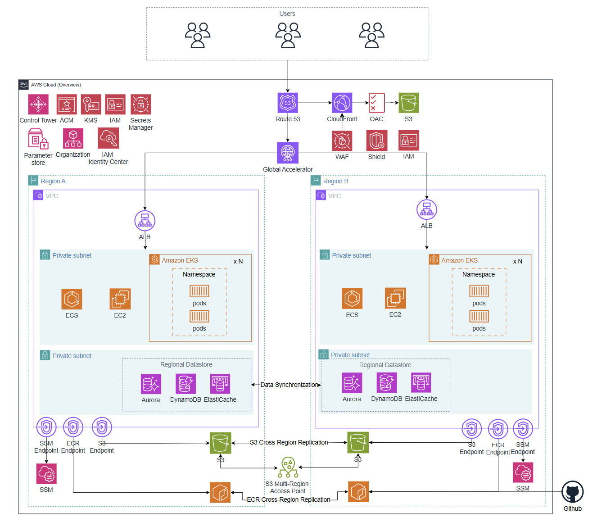
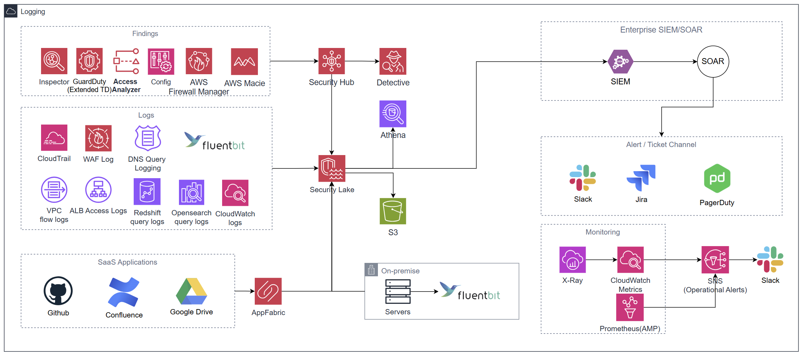
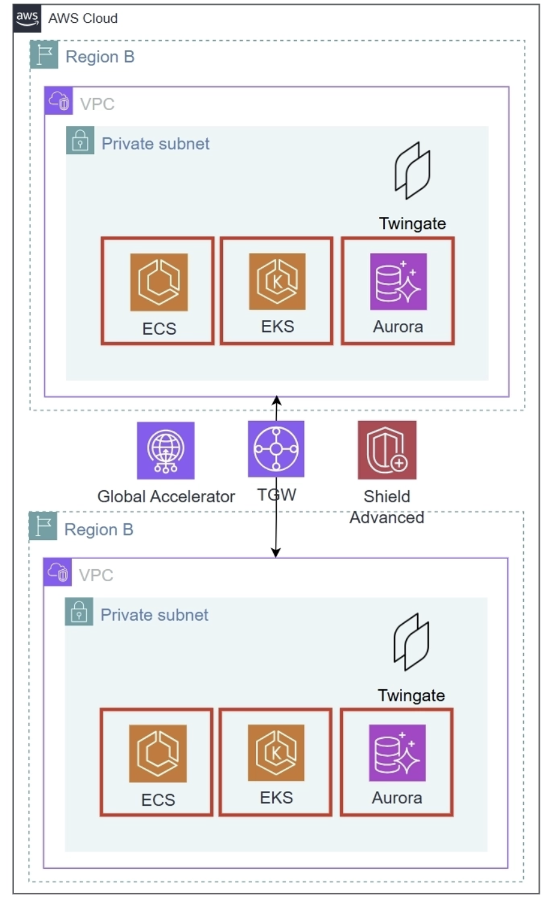
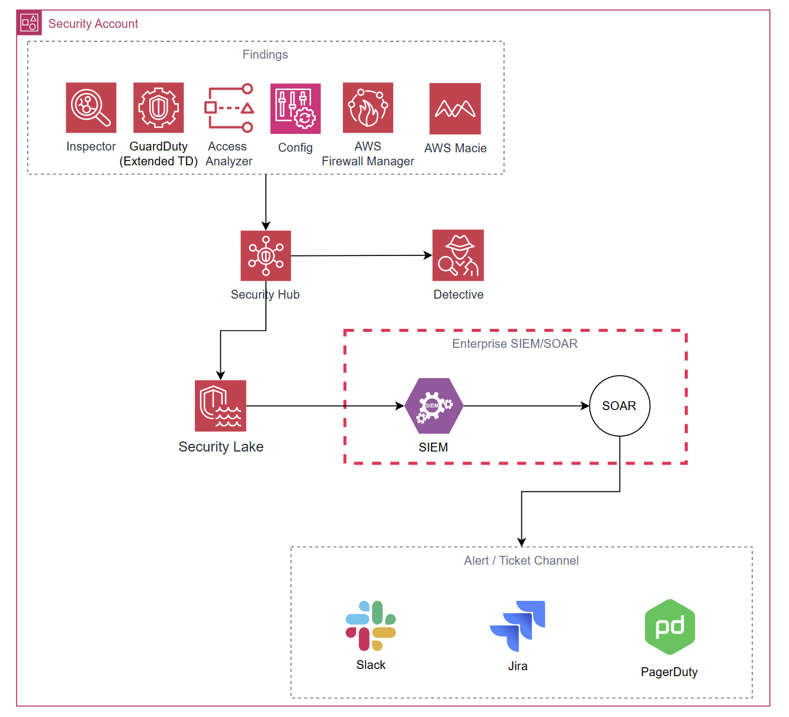
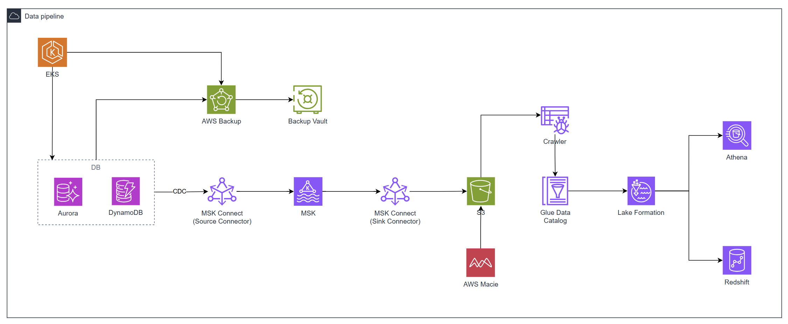
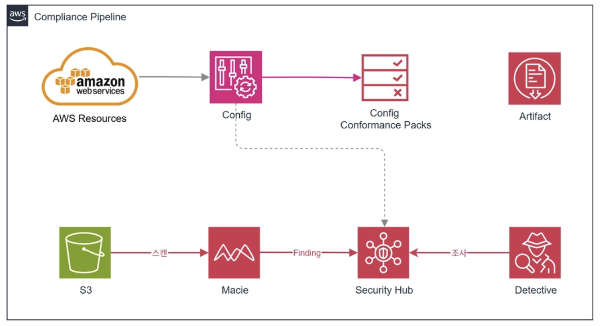
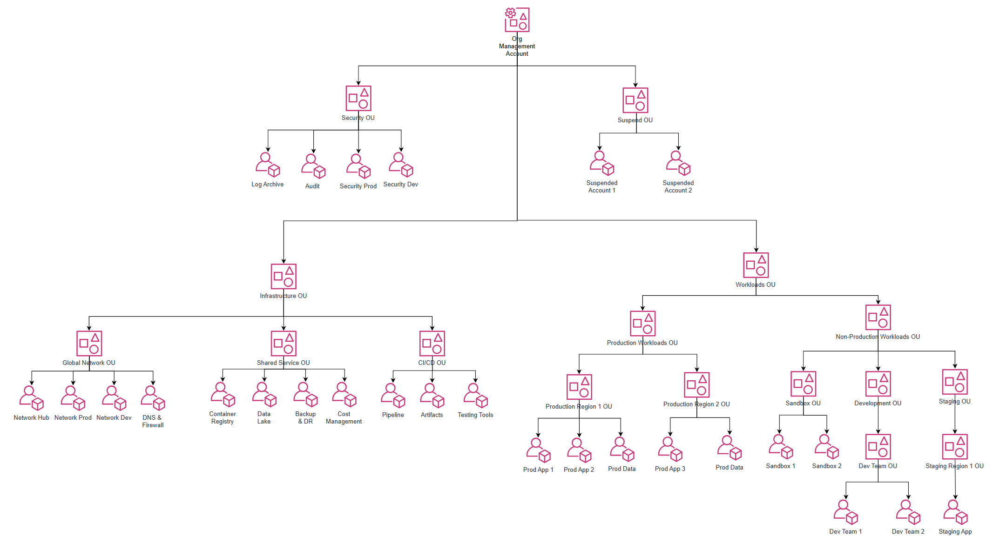
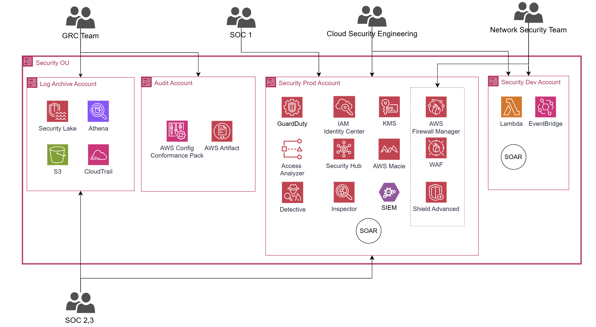
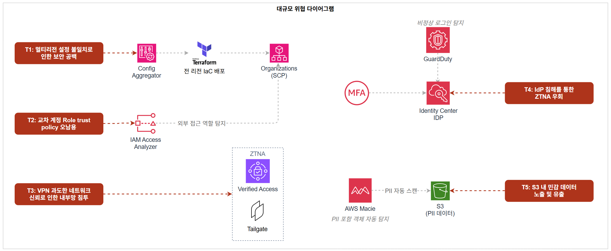

# 대규모 아키텍처 설계

## 1. 전체 아키텍처





### 1.1 아키텍처 개요 및 설계 원칙

이 아키텍처는 MAU 1,000만 규모의 서비스와 약 2,000명의 임직원(AWS 실접근 인원 약 200명 이상)이 글로벌 환경에서 운영하는 AWS 클라우드 아키텍처입니다.

중대규모 아키텍처에서 EKS 전환과 Control Tower 기반 계정 거버넌스 자동화, Security Hub + Lambda 자동 격리까지 구축했으나, 서비스가 글로벌로 확장되면서 구조적으로 다른 문제가 드러났습니다. 국내 단일 리전에서는 보안 설정의 일관성을 사람이 직접 검증할 수 있었지만, 멀티리전·멀티계정 구조에서는 **공격 포인트 자체가 글로벌로 분산**됩니다. 리전 하나의 설정 불일치가 전체 조직의 침투 진입점이 되고, VPN 기반 접근 구조에서는 탈취된 계정 하나로 내부 네트워크 전체를 수평 이동할 수 있습니다. 보안 팀 또한 단일 계정에 집중되면서 SOC 분석가가 원본 감사 로그에 접근하거나 GRC 담당자가 GuardDuty 설정을 변경할 수 있는 구조적 허점이 생겼습니다.

대규모 아키텍처는 이러한 문제를 해결하는 것을 핵심 설계 방향으로 삼았습니다.

사용하는 주요 서비스는 다음과 같습니다.

- 엣지 계층: Route 53, CloudFront, AWS Global Accelerator
- 컴퓨팅 계층: Amazon EKS (멀티리전), Amazon ECS
- 데이터 계층: Aurora (Global DB), DynamoDB, ElastiCache, MSK, Redshift, S3 Multi-Region Access Point
- 보안 서비스: WAF, Firewall Manager, Shield Advanced, ACM, IAM Identity Center, KMS, Secrets Manager, AWS Config, GuardDuty (Extended Threat Detection), Amazon Inspector, IAM Access Analyzer, Security Hub, AWS Detective, Amazon Macie, Amazon Security Lake
- 거버넌스: AWS Organizations, Control Tower, SCP, Account Factory for Terraform (AFT)
- 네트워크: Transit Gateway (멀티리전 Peering), Twingate (ZTNA)
- CI/CD: GitHub Actions (OIDC), ECR (Cross-Region Replication)
- 운영 도구: SSM, AWS Backup (Cross-Region), X-Ray, CloudWatch, AMP (Amazon Managed Prometheus)
- 로깅 및 관제: CloudTrail (Organization Trail), VPC Flow Logs, Fluent Bit, Security Lake, AppFabric, Enterprise SIEM/SOAR, AWS Detective

설계의 첫 번째 기준은 **글로벌 공격 포인트 통제**입니다. 멀티리전 환경에서는 어느 리전 하나의 보안 설정 공백이 전체 조직의 침투 진입점이 됩니다. Config Aggregator와 Terraform으로 보안 규칙을 전 리전에 일괄 배포하고, SCP로 미승인 리전에서의 리소스 생성을 원천 차단합니다.

두 번째 기준은 **VPN에서 ZTNA로 전환**입니다. VPN은 인증만 통과하면 내부 네트워크 전체를 신뢰하는 구조입니다. Twingate를 도입하여 임직원 접근을 IP:Port 단위로 최소화하고, 허가된 리소스 외에는 네트워크 경로 자체를 차단합니다.

네 번째 기준은 **전사 통합 가시성**입니다. AWS 내부 로그와 GitHub, Slack, Google Drive 등 SaaS 감사 로그를 AppFabric으로 OCSF 정규화하여 Security Lake에 통합합니다. 온프레미스 서버 로그는 Fluent Bit로 수집하여 동일한 데이터 레이크에 병합합니다. 이를 Enterprise SIEM/SOAR에 연동하여 글로벌 환경 전체를 단일 관점에서 분석합니다.

다섯 번째 기준은 **글로벌 서비스 연속성**입니다. Global Accelerator와 Aurora Global DB, S3 Multi-Region Access Point, ECR Cross-Region Replication을 조합하여 단일 리전 장애 시에도 수초 내 자동 전환이 이루어지도록 설계합니다. Shield Advanced를 조직 단위로 활성화하여 대규모 DDoS 공격에도 서비스가 유지되도록 보호합니다.

---

### 1.2 사용자 접근 흐름

**(1) 일반 사용자 접근 흐름**

사용자가 도메인에 접속하면 Route 53이 DNS 쿼리를 처리하여 CloudFront로 라우팅합니다. CloudFront는 ACM 인증서를 통해 HTTPS 통신을 보장하며, 정적 콘텐츠는 OAC를 통해 S3 Multi-Region Access Point에서 지리적으로 가장 가까운 버킷으로 자동 라우팅하여 제공합니다. S3 버킷은 퍼블릭 접근이 차단되어 CloudFront를 통해서만 접근 가능합니다.

동적 요청은 Global Accelerator를 경유하여 AWS 글로벌 백본으로 진입한 뒤, 사용자와 가장 가까운 리전의 ALB로 전달됩니다. CloudFront 및 ALB에는 Firewall Manager가 중앙 배포한 WAF WebACL이 연결되어 있어 이중 방어 구조를 형성합니다. ALB는 X-Origin-Secret 커스텀 헤더를 검증하여 CloudFront·Global Accelerator를 거치지 않은 직접 요청을 차단합니다.

ALB를 통과한 요청은 프라이빗 서브넷의 EKS Pod로 전달됩니다. EKS Pod는 IRSA를 통해 서비스별 전용 IAM Role로 Aurora, DynamoDB, S3, MSK에 접근하며, S3·DynamoDB 통신은 VPC Endpoint를 경유합니다.

**(2) 임직원 접근 흐름**

임직원은 IAM Identity Center에 MFA 인증 후 로그인하여 Persona에 맞는 Permission Set으로 각 계정에 접근합니다. 장기 Access Key 없이 임시 자격증명으로만 동작하며, 세션 만료 시 자동 차단됩니다.

내부 리소스(Aurora, EKS API, ElastiCache 등) 접근은 Twingate ZTNA를 통해 IP:Port 단위로 제어됩니다. 노트북에 설치된 Twingate 클라이언트가 IdP 그룹 소속을 기반으로 접근 가능한 리소스를 결정하며, 허가되지 않은 리소스는 네트워크 경로 자체가 존재하지 않습니다. EC2 접근은 SSM Session Manager로 처리합니다.

**(3) CI/CD 배포 흐름**

GitHub Actions에서 코드가 병합되면 OIDC 기반 IAM Role로 AWS에 인증합니다. 빌드된 이미지는 Region A ECR에 Push되며, ECR Enhanced Scanning으로 CVE를 자동 탐지합니다. 취약점 임계값 초과 시 배포가 차단됩니다. 검증된 이미지는 ECR Cross-Region Replication으로 Region B에 복제되고, 각 리전 EKS가 로컬 ECR에서 이미지를 Pull하여 배포합니다.

---

### 1.3 월 예상 비용

- 아시아 태평양(서울, ap-northeast-2) 기준
- 규모 기준: MAU 1,000만, EKS Worker Node 멀티리전(Region A·B) 합산 약 30대, 임직원 AWS 실접근 약 200명
- EKS, Aurora, DynamoDB, ElastiCache, MSK, Redshift, CloudFront, ALB, NAT Gateway, S3, AWS Backup 등 **워크로드 운영 비용은 제외**하며, 여기서는 **보안·거버넌스·네트워크 인프라 서비스** 중심으로 산정합니다.

---

### 규모 가정

비용 산정의 핵심 가정은 다음과 같습니다. EKS Worker Node는 멀티리전(Region A·B) 합산 기준 **30대**로 산정합니다. AppFabric은 사용자수 **200명**을 적용합니다. Transit Gateway Attachment는 28개 계정의 VPC를 리전별 TGW에 연결하므로 리전당 **15개 Attachment**로 산정합니다. GuardDuty VPC Flow Logs는 30노드 기준 실측 평균 4 GB/노드/월로 산정합니다. Security Lake는 Organization Trail(28개 계정) 및 VPC Flow Logs·WAF 로그·Route 53 Query Logs를 포함하여 산정합니다. Shield Advanced는 Organizations 단위 $3,000/월 단일 과금이며, 구독 포함으로 WAF 요청 비용(월 500억 건 이내) 및 Firewall Manager WAF 정책 요금이 면제됩니다. AMP는 60초 수집 인터벌 기준으로 적용합니다.

---

### 고정 비용 (월)

| **서비스** | **단위** | **단가** | **수량** | **월 비용** |
| --- | --- | --- | --- | --- |
| **AWS Shield Advanced** | 조직 단위 | $3,000.00 / 조직 | 1 (Organizations Consolidated Billing) | $3,000.00 |
| **Firewall Manager** | WAF 정책·리전 | $100.00 / 정책·리전 | 2개 정책 × 2리전 = 4 (Shield Advanced 구독 시 WAF 정책 요금 면제 → $0) | $0.00 |
| **Global Accelerator** | Accelerator 시간 | $0.025 / 시간 | 1 Accelerator × 730시간 | $18.25 |
| **Transit Gateway** | Attachment 시간 | $0.05 / 시간 / Attachment | 15 Attachment × 730시간 × 2리전 | $1,095.00 |
| **AppFabric** | 실사용자 | $3.00 / 사용자 | 200명 (볼륨 할인 적용) | $600.00 |
| **WAF** | WebACL | $5.00 / WebACL | 4개 (CloudFront Global × 2리전 + ALB × 2리전) | $20.00 |
| **WAF** | AWS 관리형 Rule Group | $1.00 / 룰그룹 | CloudFront 6개 + ALB 5개 = 11개 × 2리전 = 22개 | $22.00 |
| **KMS CMK** | 키 보관 | $1.00 / 키 | 10개 (aurora-cmk, dynamodb-cmk, redshift-cmk, s3-cmk, secrets-cmk, ebs-cmk, s3-log-cmk, msk-cmk, security-lake-cmk × 2리전) | $10.00 |
| **Secrets Manager** | 시크릿 보관 | $0.40 / secret | 5개 (Aurora 크리덴셜, X-Origin-Secret, 외부 API Key, MSK 크리덴셜, Twingate Connector 토큰) | $2.00 |
| **CloudWatch** | 경보 (표준 해상도) | $0.10 / 경보 | 30개 (Metric Filter 알람 18개 + 서비스 지표 알람 12개) | $3.00 |
| **CloudTrail** | 관리 이벤트 (첫 번째 Trail) | $0 | Organization Trail 1개 | $0 |
| **SSM Session Manager** | 세션 자체 | $0 | — | $0 |
| **IAM Identity Center** | — | $0 | — | $0 |
| **ACM** | 인증서 | $0 | — | $0 |
| **IAM Access Analyzer** | 외부 액세스 분석기 | $0 | — | $0 |
| **AWS Organizations / SCP / Control Tower** | — | $0 | Control Tower 자체 무료, 활성화 서비스 비용 별도 | $0 |

**고정 비용 소계: $4,770.25 / 월**

---

### 요청/사용량 기반 비용

| **서비스** | **단위** | **단가** | **사용량** | **월 비용** | **산출 근거** |
| --- | --- | --- | --- | --- | --- |
| **WAF** | 요청 수 | Shield Advanced 구독 포함 (월 500억 건 이내) | — | $0 | Shield Advanced 구독으로 WAF 요청 비용 면제 |
| **Transit Gateway** | 데이터 처리 | $0.02 / GB | 5,000 GB × 2리전 | $200.00 | 28개 계정 간 내부 트래픽 합산 |
| **Transit Gateway** | 리전 간 Peering 데이터 | $0.02 / GB | 1,000 GB | $20.00 | Region A ↔ B 피어링 트래픽 |
| **Global Accelerator** | DT-Premium | $0.035 / GB | 2,000 GB | $70.00 | 우세 방향(아시아 리전 → 엣지) 트래픽 기준 |
| **KMS** | API 요청 (대칭키) | $0.03 / 10,000건 | 30만 건 | $0.90 | 30노드 기준 Pod 기동·Secrets 조회·S3 Put/Get. S3 Bucket Key 적용으로 객체당 호출 최소화 |
| **Secrets Manager** | API 요청 | $0.05 / 10,000건 | 3만 건 | $0.15 | 30 Pod × 일 10회 기동 × 30일 기준, 캐시 사용 |
| **CloudTrail** | S3 데이터 이벤트 (Write 전용) | $0.10 / 100,000건 | 3만 건 | $0.03 | Read 이벤트 제외. Read 포함 시 추가 비용 발생 |
| **CloudWatch** | 로그 수집 | $0.76 / GB | 50 GB | $38.00 | CloudTrail→CW Logs 2 GB + EKS 컨테이너 로그 30노드 × 1 GB + 여유분 |
| **SNS** | 이메일·Slack 알림 | $0 | 소량 | $0 | 월 1,000건 무료 범위 이내 |
| **GuardDuty** | CloudTrail 관리 이벤트 | $4.00 / 100만 건 (첫 5억 건 티어) | 280만 건 | $11.20 | 28개 계정 × 일 약 3,300건 × 30일 합산 |
| **GuardDuty** | VPC Flow Logs | $1.00 / GB (첫 500 GB 티어) | 120 GB | $120.00 | 30노드 × 4 GB/노드/월. Runtime Monitoring 활성화 시 면제 가능 |
| **GuardDuty** | Route 53 Query Logs | $1.00 / GB (첫 500 GB 티어) | 15 GB | $15.00 | CloudFront는 Route 53 직접 쿼리 미생성. 내부 서비스 간 DNS 중심 산정 |
| **Security Hub** | 보안 체크 (CSPM) | $0.0010 / 체크 (첫 100,000건) | 28,000건 | $28.00 | 28개 계정 × 리소스 평균 1,000건 체크 (FSBP + CIS v5.0 기준) |
| **Security Hub** | Finding 인제스트 | $0.00003 / 건 (10,000건 초과분) | 45만 건 | $13.20 | 10,000건 무료 티어 초과분 440,000건 × $0.00003 |
| **Security Lake** | CloudTrail 로그 수집 | $0.75 / GB | 280 GB | $210.00 | 28개 계정 × 약 10 GB/월 |
| **Security Lake** | 기타 AWS 로그 (VPC Flow, WAF, Route 53 등) | $0.25 / GB | 1,000 GB | $250.00 | VPC Flow Logs·WAF 로그·Route 53 Query Logs 합산 |
| **Security Lake** | 데이터 정규화 (OCSF) | $0.035 / GB | 1,280 GB | $44.80 | CloudTrail 280 GB + 기타 1,000 GB 합산 |
| **Security Lake** | S3 스토리지 | $0.025 / GB | 10,000 GB | $250.00 | 누적 약 1년치 보관 기준 |
| **AWS Config** | 구성 항목 기록 | $0.003 / 건 | 28,000건 | $84.00 | 28개 계정 × 리소스 100개 × 월 평균 10회 변경 |
| **AWS Config** | Rule 평가 | $0.001 / 건 | 280,000건 | $280.00 | 30개 규칙 × 28개 계정 × 약 333 리소스 평가. Firewall Manager Config Rules 포함 |
| **Inspector** | EC2 인스턴스 스캔 | $1.258 / 인스턴스 | 30대 | $37.74 | EKS on EC2 Worker Node 멀티리전 30대 기준 |
| **Inspector** | ECR 이미지 Push 스캔 | $0.09 / Push | 400회 | $36.00 | 2리전 × 일 약 7회 배포 기준 |
| **Inspector** | 자동 재스캔 (신규 CVE) | $0.01 / 재스캔 | 1,000회 | $10.00 | 신규 CVE 발표 시 멀티리전 자동 재평가 |
| **AWS Detective** | 데이터 수집·분석 | $2.00 / GB (첫 1,000 GB 티어) | 500 GB | $1,000.00 | Security Prod 계정 중심, CloudTrail·VPC Flow·GuardDuty Finding 합산 |
| **AMP (Amazon Managed Prometheus)** | 메트릭 샘플 수집 | $0.90 / 1,000만 샘플 | 약 13.1억 샘플 | $117.90 | 30노드 × 1,000 metrics × 60초 인터벌 × 730시간 ≈ 13.1억 샘플 |
| **AMP** | 메트릭 스토리지 | $0.03 / GB | 30 GB | $0.90 | 30노드 기준 30일 보관 |
| **AWS X-Ray** | 트레이스 수집·스캔 | $5.00 / 100만 트레이스 | 1,000만 트레이스 | $50.00 | EKS Pod 멀티리전 분산 추적, 최초 100만 트레이스 무료 |
| **VPC Flow Logs** | S3 저장 | $0.025 / GB | 100 GB | $2.50 | Log Archive Account S3 기준 (멀티리전 합산) |
| **S3** | 저장 + 요청 | $0.025 / GB | 200 GB | $5.00 | Log Archive 용도 (Security Lake S3 제외) |

**요청/사용량 기반 합계: 약 $2,864 / 월**

---

### 최종 정리

| **구분** | **합계** |
| --- | --- |
| **고정 비용** | **$4,770.25 / 월** |
| **요청/사용량 기반 비용** | **$2,864 / 월** |
| **보안·거버넌스·네트워크 인프라 서비스 총합 (추정)** | **약 $7,634 / 월** |

> **중요 1**: 위 금액은 보안·거버넌스·네트워크 인프라 서비스만의 추정치입니다. EKS, Aurora (Global DB), DynamoDB, ElastiCache, MSK, Redshift, CloudFront, ALB, NAT Gateway, S3 (일반), AWS Backup 등 워크로드 운영 비용은 인스턴스 타입과 워크로드 규모에 따라 크게 달라지므로 별도 산정이 필요합니다.
> 
> 
> **중요 2**: **Shield Advanced ($3,000)** 는 Organizations 단위 단일 과금으로, WAF 요청 비용(월 500억 건 이내)과 Firewall Manager WAF 정책 요금이 구독에 포함됩니다. WAF 요청량이 매우 많은 MAU 1,000만 환경에서는 Shield Advanced 미적용 시 WAF 요청 비용이 별도로 수백 달러 이상 발생할 수 있어 실질적인 절감 효과가 있습니다.
> 
> **중요 3**: **AWS Config ($364)** 는 Firewall Manager WAF 정책이 자동으로 Config Rules를 생성하므로 계정 수·리소스 수·변경 빈도가 늘수록 빠르게 증가합니다. 핵심 보안 규칙 위주로 Rule 수를 제한하고 주기적으로 미사용 Rule을 정리하는 것을 권고합니다.
> 
> **중요 4**: **GuardDuty EKS Runtime Monitoring** 을 활성화하면 Runtime Agent가 설치된 노드의 VPC Flow Logs 분석 비용($120)이 면제됩니다. Runtime Monitoring 자체 비용(vCPU당 과금)과 비교하여 순절감 여부를 운영 초기에 검토하는 것을 권고합니다.
> 
> **중요 5**: **Enterprise SIEM/SOAR** (Splunk, Microsoft Sentinel 등 상용 제품) 라이선스 비용은 별도 계약으로 산정합니다. Security Lake를 데이터 소스로 연동하는 구조이므로 SIEM 자체 수집 비용은 절감할 수 있습니다.
> 

---

## 2. 서비스별 상세 설계

### 2.1 네트워크 접근 제어 설계 (Twingate)

{ width="300" }

#### 2.1.1 설정 방식

Twingate는 세 가지 구성 요소로 동작합니다. 첫째, 접근 대상 VPC마다 Connector를 Private Subnet에 배포합니다. Connector는 아웃바운드 연결만 맺으므로 인바운드 포트를 열지 않아도 됩니다. 둘째, Twingate 콘솔에서 접근 대상 리소스를 IP:Port 단위로 등록하고 각 리소스를 어떤 Connector가 중계할지 지정합니다. 셋째, Okta 또는 Google 등 기존 IdP와 연동하여 그룹 정보를 동기화하고 그룹별 접근 가능 리소스를 매핑합니다.

사용자는 노트북에 Twingate 클라이언트를 설치하고 IdP 계정으로 인증합니다. 이후 등록된 리소스 IP로 트래픽이 발생하면 클라이언트가 암호화 터널을 통해 Connector로 전달하고, Connector가 VPC 내부에서 리소스에 접근합니다.

EC2 접근은 SSM Session Manager로 처리하므로 Twingate Resource 등록 대상에서 제외합니다.

**Resource 등록 및 팀별 접근 분리**

| Resource | IP:Port 예시 | 접근 허용 팀 | 비고 |
| --- | --- | --- | --- |
| regionA-eks-api | 10.0.1.x:443 | 인프라팀, SRE | kubectl 엔드포인트 |
| regionA-aurora | 10.0.2.x:5432 | DBA, SRE On-call | 평상시 DBA만 |
| regionA-dynamodb-ep | 10.0.2.x:443 | DBA, 백엔드팀 | VPC Endpoint 경유 |
| regionA-elasticache | 10.0.2.x:6379 | SRE On-call | 상시 접근 금지 |
| regionA-ecs-admin | 10.0.1.x:8080 | 인프라팀, SRE | 관리 인터페이스 |
| regionB-eks-api | 10.1.1.x:443 | 인프라팀, SRE | kubectl 엔드포인트 |
| regionB-aurora | 10.1.2.x:5432 | DBA | Region B 복제본 |

#### 2.1.2 설계 이유

기존 VPN 방식은 인증 통과 시 VPC 전체 네트워크 접근이 허용되어, 계정 탈취 시 내부 리소스 수평 이동이 가능합니다. Twingate는 허가된 리소스 외에는 네트워크 경로 자체가 존재하지 않으므로 횡이동 경로를 구조적으로 차단합니다. 멀티계정 환경에서는 계정마다 Connector를 배포하여 접근 경계를 물리적으로 구분합니다. SRE On-call처럼 긴급 시 임시 접근이 필요한 경우 IdP 그룹 멤버십을 일시적으로 부여하는 방식으로 처리합니다.

#### 2.1.3 반영된 보안 요소

Connector의 아웃바운드 전용 연결 구조로 VPC에 인바운드 포트를 열지 않습니다. 리소스의 Security Group은 Connector Security Group ID만 허용하므로 사용자 IP가 리소스에 직접 노출되지 않습니다. IdP에서 계정이 비활성화되거나 그룹에서 제거되면 Twingate 접근도 즉시 차단됩니다.

---

### 2.2 Transit Gateway

#### 2.2.1 구성 요소 및 설정 방식

AWS Transit Gateway를 Region A·B 각각에 생성하고 TGW Peering으로 연결합니다. Resource Access Manager(RAM)를 통해 TGW를 전체 계정에 공유하여 각 계정의 VPC가 단일 TGW에 연결되도록 구성합니다. 프로덕션·개발·공유 서비스 VPC를 각각 별도 Attachment로 연결하고 TGW Route Table을 분리하여 계정 간 허용 트래픽 경로를 명시적으로 제어합니다. 온프레미스 연결이 필요한 경우 Direct Connect Gateway를 TGW에 연결하여 단일 경로로 처리합니다.

#### 2.2.2 설계 이유

TGW는 허브-스포크 구조로 계정이 추가되어도 Attachment 하나만 추가하면 됩니다.

#### 2.2.3 반영된 보안 요소

TGW Route Table 분리로 프로덕션-개발 간 직접 통신을 차단하고 허가된 경로만 허용합니다. VPC Flow Logs를 TGW 레벨에서 활성화하여 계정 간 트래픽을 Security Lake로 수집합니다. RAM 기반 공유로 각 계정이 독립적으로 TGW를 생성하지 못하도록 하여 승인되지 않은 네트워크 경로 생성을 방지합니다.

---

### 2.3 Shield Advanced

#### 2.3.1 구성 요소 및 설정 방식

AWS Shield Advanced를 Organizations 기반으로 전체 계정에 일괄 적용합니다. CloudFront, ALB, Route 53, Global Accelerator를 Shield Advanced 보호 그룹에 등록합니다. CloudWatch 알람을 연동하여 DDoSDetected, DDoSAttackBitsPerSecond 메트릭 기반 알람을 구성합니다. DDoS 공격으로 인한 Auto Scaling 비용 보호를 활성화합니다.

#### 2.3.2 설계 이유

MAU 1,000만 규모 서비스는 L3/L4 DDoS 공격의 주요 타깃이 됩니다. Shield Standard는 자동 완화만 제공하며 공격 가시성과 DRT 지원이 없습니다. Advanced는 실시간 공격 가시성과 AWS DDoS Response Team(DRT) 전문가 지원을 제공합니다. Global Accelerator와 함께 사용 시 AWS 엣지에서 트래픽을 흡수하여 오리진 보호 효과를 극대화합니다.

#### 2.3.3 반영된 보안 요소

L3/L4 DDoS 자동 완화로 서비스 중단을 방지합니다. Security Hub 및 CloudWatch와 연동하여 공격 탐지 이벤트를 SIEM으로 전달합니다.

---

### 2.4 WAF

#### 2.4.1 구성 요소 및 설정 방식

Managed Rules를 PreProcess/PostProcess 계층으로 분리하여 적용합니다. PreProcess에는 IP 평판·DDoS·공통 웹 공격·봇 탐지 룰셋을 배포하고, PostProcess에는 SQLi·알려진 악성 입력·관리자 보호·계정 탈취(ATP)·계정 생성 어뷰징(ACFP) 룰셋과 Rate-based Rule을 배포합니다.

```bash
외부 사용자 트래픽                    임직원 트래픽
      ↓                                    ↓
CloudFront                    Twingate / Verified Access
      ↓                                    ↓
[Public ALB]                        [Internal ALB]
      ↓                                    ↓
전체 WAF 룰 적용                  완화된 별도 Web ACL 적용
      ↓                                    ↓
서비스 앱                              Admin 앱
```

```bash
트래픽 인입
      ↓
[PreProcess - Firewall Manager 강제 배포, 보안 담당자만 수정 가능]
├── AWSManagedRulesAmazonIpReputationList
├── AWSManagedRulesAntiDDoSRuleSet
├── AWSManagedRulesCommonRuleSet
└── AWSManagedRulesBotControlRuleSet (Targeted 모드)

[Middle - 각 계정 팀 자율 추가 영역]
└── 서비스별 커스텀 Rule 허용 (PreProcess/PostProcess 변경 불가)

[PostProcess - Firewall Manager 강제 배포, 보안 담당자만 수정 가능]
├── AWSManagedRulesSQLiRuleSet
├── AWSManagedRulesKnownBadInputsRuleSet
├── AWSManagedRulesAdminProtectionRuleSet
├── AWSManagedRulesATPRuleSet
├── AWSManagedRulesACFPRuleSet
└── Rate-based Rules
      ↓
트래픽 통과 or 차단
```

#### 2.4.2 설계 이유

CloudFront에 적용하여 엣지에서 먼저 악성 요청을 차단하고, ALB에도 중복 적용하여 CloudFront 우회 접근을 방어합니다. BotControlRuleSet Targeted 모드로 크리덴셜 스터핑과 스크래핑에 대응하고, ATPRuleSet·ACFPRuleSet으로 계정 탈취 및 가짜 계정 대량 생성을 탐지합니다. 임직원 트래픽은 Internal ALB로 분리하여 Admin 엔드포인트가 외부 WAF 룰 대상에서 제외되도록 구성합니다.

#### 2.4.3 반영된 보안 요소

임직원 Admin 트래픽을 Internal ALB로 분리하여 외부 공격자의 Admin 엔드포인트 접근 경로를 원천 차단합니다.

---

### 2.5 Global Accelerator

#### 2.5.1 구성 요소 및 설정 방식

Accelerator를 생성하여 Static Anycast IP 2개를 할당하고, 엔드포인트 그룹을 Region A·B에 각각 구성합니다. 각 리전의 ALB를 엔드포인트로 등록하고 가중치 기반 트래픽 분배를 설정합니다. 30초 간격 TCP 헬스 체크를 통해 임계값 3회 실패 시 자동으로 장애를 조치합니다. Shield Advanced와 자동 통합하여 Global Accelerator 리소스를 Shield 보호 그룹에 포함합니다.

#### 2.5.2 설계 이유

AWS 글로벌 백본 네트워크를 활용하여 퍼블릭 인터넷 대신 AWS 내부 네트워크로 트래픽을 라우팅해 지연시간을 줄이고 패킷 손실을 최소화합니다. 한 리전 장애 시 수초 내 다른 리전으로 트래픽이 자동 전환됩니다. CloudFront와 달리 고정 IP를 제공하므로 방화벽 화이트리스트가 필요한 기업 고객 환경에 유리합니다.

### 2.5.3 반영된 보안 요소

Shield Advanced와 통합하여 Anycast IP 레벨에서 L3/L4 공격을 흡수합니다. 단일 리전 장애 시에도 서비스 연속성을 보장하며, AWS 백본 이용으로 퍼블릭 인터넷 구간 노출을 최소화합니다.

---

### 2.6 Multi-Region Access Point (S3)

#### 2.6.1 구성 요소 및 설정 방식

Region A·B 버킷을 하나의 글로벌 엔드포인트로 묶어 Multi-Region Access Point(MRAP)를 생성합니다. S3 Cross-Region Replication을 연동하여 두 리전 버킷 간 양방향 복제를 구성합니다. MRAP Access Policy와 IAM 정책으로 최소 권한 접근 제어를 적용합니다. 모든 버킷에 Public Access를 차단하고 SSE-KMS를 적용합니다.

#### 2.6.2 설계 이유

단일 엔드포인트로 멀티리전에 접근하며, 코드 변경 없이 지리적으로 가장 가까운 버킷으로 자동 라우팅합니다. 리전 장애 시 복제된 버킷으로 자동 장애 조치가 이루어집니다.

#### 2.6.3 반영된 보안 요소

SSE-KMS로 저장 데이터를 암호화합니다. MRAP 정책과 IAM 최소 권한으로 이중 접근 통제를 적용합니다. S3 Server Access Logging 및 CloudTrail Data Events 활성화로 모든 객체 접근을 로깅합니다.

---

### 2.7 ECR Cross-Region Replication

#### 2.7.1 구성 요소 및 설정 방식

ECR Cross-Region Replication을 설정하여 소스 리전 레지스트리에서 대상 리전으로 자동 복제하는 규칙을 구성합니다. 특정 레포지터리 prefix(예: prod/)에 한하여 복제를 허용합니다. ECR Enhanced Scanning을 활성화하여 이미지 취약점을 스캔하고, 이미지 서명 정책과 수명 주기 정책을 설정합니다.

#### 2.7.2 설계 이유

Region B EKS/ECS가 로컬 ECR에서 이미지를 Pull하도록 하여 크로스 리전 데이터 전송 비용과 지연시간을 줄입니다. Region A 장애 시 Region B가 독립적으로 동일 이미지로 서비스를 가동합니다. 취약점 스캔 및 이미지 서명으로 CI/CD 파이프라인에서 검증된 이미지만 배포되도록 공급망 보안을 강화합니다.

#### 2.7.3 반영된 보안 요소

Inspector v2 연동으로 OS 패키지 및 라이브러리 CVE를 실시간 탐지합니다. 서명된 이미지만 배포를 허용하여 공급망 공격을 방어합니다. ECR 레포지터리 정책으로 허용된 계정 및 역할만 이미지를 Pull하도록 제한합니다. CloudTrail을 통해 모든 ECR API 호출을 로깅합니다.

---

### 2.8 SIEM/SOAR



#### 2.8.1 구성 요소 및 설정 방식

Amazon Security Lake를 구성하여 GuardDuty, Security Hub, CloudTrail, VPC Flow Logs, WAF 로그, Route 53 쿼리 로그를 수집하고 OCSF 방식으로 정규화합니다. Security Lake를 소스로 하여 Enterprise SIEM에 데이터를 전송합니다. SOAR를 연동하여 SIEM에서 알림 발생 시 플레이북을 자동으로 실행합니다. SOAR 플레이북에서 Slack, Jira, PagerDuty를 연동합니다.

#### 2.8.2 설계 이유

다수의 AWS 서비스 로그를 단일 경로(Security Lake)로 집중하여 SIEM 연동 복잡도를 줄입니다. OCSF로 정규화하면 벤더 종속 없이 표준 스키마로 로그를 변환하므로 SIEM 교체 시에도 재가공이 불필요합니다. SOAR 자동화를 통해 플레이북 기반으로 1차 대응(IP 차단, 계정 비활성화 등)하고, 심각도에 따라 Slack·Jira·PagerDuty로 에스컬레이션합니다.

#### 2.8.3 반영된 보안 요소

전체 AWS 환경 로그를 단일 데이터 레이크에서 분석하여 가시성을 확보합니다. SOAR 플레이북으로 위협 탐지 후 수동 개입 없이 격리·차단 조치를 실행합니다. Jira 티켓으로 모든 보안 이벤트의 이력 및 책임 소재를 기록합니다. Security Lake 버킷에 Object Lock 및 S3 버전 관리를 적용하여 로그 위변조를 방지합니다.

---

### 2.9 AWS Detective

#### 2.9.1 구성 요소 및 설정 방식

AWS Organizations 기반으로 Detective를 활성화하여 전체 계정을 관리 계정에서 중앙 관리합니다. GuardDuty를 소스로 연동하여 Finding 발생 시 관련 엔티티(IAM Role, EC2, IP)의 행동 그래프를 자동 구성합니다. Security Hub와 연동하여 Finding에서 Detective 조사 화면으로 직접 피벗할 수 있도록 구성합니다. 데이터 보존 기간은 최대 12개월로 장기 포렌식 분석을 지원합니다. Region A·B 각각에서 Detective를 활성화하고 관리 계정에서 두 리전의 Finding을 통합 조회합니다.

#### 2.9.2 설계 이유

GuardDuty·Security Hub는 위협을 탐지하고 집계하지만, 탐지된 Finding이 실제 침해인지 오탐인지 판단하기 위한 조사 컨텍스트는 제공하지 않습니다. Detective는 VPC Flow Logs, CloudTrail, GuardDuty Finding을 상관분석하여 특정 IAM 엔티티나 인스턴스의 시계열 행동 패턴을 시각화합니다. SIEM/SOAR 자동화가 처리하지 못한 복잡한 침해 시나리오(장기간 저탐지 횡이동, 자격증명 이상 사용 등)에서 분석 시간을 단축합니다.

#### 2.9.3 반영된 보안 요소

GuardDuty Finding과 연계하여 IP·IAM Role·EC2 인스턴스 단위의 행동 그래프를 자동 생성합니다. Security Hub → Detective 피벗 연동으로 Finding 발생부터 조사까지의 흐름을 단일 콘솔 내에서 처리합니다.

---

### 2.10 데이터 파이프라인



#### 2.10.1 전체 흐름

```bash
[수집]
Aurora CDC / DynamoDB Streams → MSK Connect → MSK 토픽 → S3(Raw) 적재

[변환 및 저장]
Glue ETL: Raw → Processed → Curated 레이어 변환
Glue Data Catalog: 스키마/파티션 메타데이터 관리

[백업]
AWS Backup: Aurora·DynamoDB 스냅샷 → Backup Vault 보관

[분석]
Athena: S3 대상 서버리스 ad-hoc 쿼리
Redshift: Curated 데이터 대규모 정형 분석
```

#### 2.10.2 보안 요소

Lake Formation으로 테이블/컬럼/행 수준의 Fine-grained Access Control을 적용하고 역할별 접근 범위를 분리합니다. AWS Macie로 S3 버킷 내 PII를 자동 탐지하여 Security Hub 및 SIEM에 연동합니다. Backup Vault Lock의 WORM 정책 적용으로 백업 삭제·수정을 방지하여 랜섬웨어 공격에 대응합니다. S3·Aurora·DynamoDB는 SSE-KMS로 암호화하고, MSK에는 TLS를 강제합니다.

---

### 2.11 Artifact - 감사 대응(컴플라이언스)



#### 2.11.1 구성 요소 및 설정 방식

AWS Artifact를 통해 SOC, ISO, PCI DSS 등 서드파티 감사 보고서를 온디맨드로 다운로드합니다. Artifact Agreements에서 AWS BAA를 체결하고 Organizations 단위로 전체 계정에 일괄 반영합니다. Config Conformance Pack을 통해 CIS AWS Foundations Benchmark, NIST 기반 규칙셋을 전 계정에 배포하고, 준수 현황을 Config Aggregator에서 중앙 집계하여 감사 증적으로 활용합니다.

#### 2.11.2 설계 이유

외부 감사 시 AWS 책임 영역의 보안 통제 증거는 AWS Artifact의 감사 보고서가 유일한 공식 증빙입니다. Config Conformance Pack과 연계하면 고객 책임 영역의 준수 현황을 자동으로 수집할 수 있어 수동 증적 수집 공수를 줄이고 상시 컴플라이언스 체계를 유지할 수 있습니다.

#### 2.11.3 반영된 보안 요소

AWS 책임 영역의 공식 감사 보고서를 온디맨드로 확보합니다. Config Conformance Pack으로 CIS Benchmark·NIST 기반 규칙을 전 계정에 일관 적용하고 중앙에서 집계합니다. Security Hub 컴플라이언스 스코어와 Config 준수 현황을 결합하여 감사 패키지를 구성합니다.

---

### 2.12 OU 구조

#### 2.12.1 전체 OU 트리



**총 계정 수**: 약 27개 (Management Account 포함)

---

#### 2.12.2 이 구조를 선택한 이유

중대규모까지는 Security OU·Workloads OU 중심의 단순 계층으로 충분했습니다. 그러나 임직원 2,000명, 글로벌 서비스 운영 환경에서는 세 가지 문제가 발생합니다.

첫째, **네트워크와 애플리케이션이 같은 계정에 있으면 폭발 반경이 너무 넓습니다.** VPC·Transit Gateway를 별도 Infrastructure OU에 분리하면 애플리케이션 계정이 침해되어도 네트워크 토폴로지가 변조되지 않습니다.

둘째, **글로벌 서비스는 리전별 데이터 레지던시 요건이 다릅니다.** Production Workloads OU 아래 Region 1 OU와 Region 2 OU를 분리하면 리전별 SCP를 독립 적용할 수 있고, 해외 임직원 접근 범위도 OU 단위로 정확하게 제어할 수 있습니다.

셋째, **보안 계정 하나로 모든 역할을 담당하면 최소 권한 원칙이 무너집니다.** 중대규모의 Security Tooling 단일 계정을 Security Prod·Security Dev 2개로 분리하여 기존 Log Archive·Audit과 합쳐 총 4개 계정으로 구성하고, 보안 팀마다 접근 가능한 계정을 다르게 설계합니다.

---

### 2.13 Management Account

#### 2.13.1 역할

Management Account에 IAM Identity Center를 통해 접근 가능한 인원은 시니어 인프라 담당자 1~2명으로 제한하며, 일상 운영에서는 직접 접근하지 않고 SCPDeployRole AssumeRole 경유로만 관리합니다.

| 기능 | 서비스 | 비고 |
| --- | --- | --- |
| 멤버 계정 생성·관리 | AWS Organizations | Control Tower Account Factory 통해 자동화 |
| 통합 빌링 | AWS Billing | 전체 계정 비용 단일 청구 |
| 전체 조직 SCP 배포 | Organizations + Terraform | GitHub Actions OIDC 경유, 직접 콘솔 배포 금지 |
| IAM Identity Center 인스턴스 | IAM Identity Center | 인스턴스는 이 계정에 상주, 일상 운영은 Security Prod 위임 |
| Control Tower 활성화 | Control Tower | Landing Zone 구성·Mandatory Controls 자동 적용 |

#### 2.13.2 접근 원칙

Management Account 접근은 시니어 인프라 담당자 1~2명으로 제한하며, 일상 운영에서는 직접 접근하지 않습니다.

```bash
사람의 접근 방식
    IAM Identity Center → Management Account 직접 로그인 (일상 금지)
    IAM Identity Center → Security Prod 계정
        → SCPDeployRole AssumeRole (Cross-account) → Management Account

GitHub Actions의 접근 방식
    OIDC 토큰 → Security Prod 계정 SCPTerraformRole Assume
        → Management Account SCPDeployRole Assume
            → organizations:Policy 관련 API만 허용 → SCP 배포 실행
```

워크로드 리소스(EC2, RDS, Lambda 등)는 이 계정에 절대 배포하지 않습니다. Management Account가 침해되면 전체 조직의 SCP와 거버넌스가 무력화되기 때문입니다.

#### 2.13.3 Control Tower가 자동으로 처리하는 항목

신규 계정이 Control Tower Account Factory로 생성될 때 아래 항목이 자동 적용됩니다.

| 자동 적용 항목 | 내용 |
| --- | --- |
| GuardDuty 활성화 | Security Prod 계정을 Delegated Admin으로 자동 연결 |
| Security Hub 활성화 | 신규 계정 Finding이 Security Prod로 자동 집계 |
| CloudTrail Organization Trail | Log Archive 계정 S3로 자동 전송 |
| AWS Config 활성화 | Conformance Pack 규칙 자동 적용 |
| Foundation SCP 상속 | Root 레벨 SCP가 신규 계정에 즉시 적용 |
| IAM Identity Center 매핑 | 해당 OU에 맞는 그룹·Permission Set 자동 할당 |

---

### 2.14 Security OU 상세



#### 2.14.1 4개 계정 역할

중대규모의 Security OU는 Log Archive·Audit·Security Tooling 3개 계정으로 구성되어 있었습니다. Security Tooling 단일 계정이 GuardDuty 관리·보안 자동화를 모두 담당하면서, GRC Team이 GuardDuty 설정을 변경하거나 SOC Tier 1이 원본 감사 로그에 접근하는 구조적 허점이 존재했습니다. 대규모에서는 Security Tooling을 Security Prod·Security Dev 2개로 추가 분리하여 총 4개 계정 구조로 전환합니다.

| 계정 | 핵심 역할 | 주 담당 팀 |
| --- | --- | --- |
| **Log Archive** | 전사 CloudTrail·VPC Flow Logs·WAF Log 중앙 저장 (S3 + Security Lake). S3 Object Lock으로 삭제 불가 | CSE (ReadOnly), GRC (ReadOnly+Athena) |
| **Audit** | AWS Config Conformance Pack, AWS Artifact, 컴플라이언스 증적 관리 | GRC (Full Admin) |
| **Security Prod** | GuardDuty·Security Hub Delegated Admin, Firewall Manager 중앙 관리, IAM Identity Center 일상 운영 | CSE (Admin), SOC 전 Tier, Network Security, GRC |
| **Security Dev** | 보안 자동화 코드 (Lambda·EventBridge), SOAR 플레이북 테스트 전용 개발 환경 | CSE (Admin), SOC Tier 2·3, Network Security |

#### 2.14.2 보안 팀 계정 접근 권한 매트릭스

| 팀 | Log Archive | Audit | Security Prod | Security Dev |
| --- | --- | --- | --- | --- |
| **CSE** | ReadOnly + Athena | ReadOnly | **Admin** (MFA·4h) | **Admin** (8h) |
| **SOC Tier 1** | X | X | ReadOnly (8h) | X |
| **SOC Tier 2·3** | ReadOnly + Athena (MFA·2h) | X | Finding 상태 변경 (4h) | ReadOnly + Lambda 테스트 (4h) |
| **Network Security** | X | X | WAF·FM Full (8h) | WAF 테스트 (4h) |
| **GRC** | ReadOnly + Athena (4h) | **Full Admin** (MFA·4h) | ReadOnly (4h) | X |

---

#### 2.14.3 계정별 상세 권한 설계

### Log Archive 계정

**계정 역할**: 전사 CloudTrail, VPC Flow Logs, WAF 로그, ALB Access Log 중앙 수집. S3 + Amazon Security Lake 구성. S3 Object Lock(Compliance 모드)으로 어떤 역할도 삭제 불가.

**SCP 보호**: S3 버킷 정책 변경·객체 삭제·버킷 삭제 전체 차단. SCP와 Permission Boundary 이중 보호.

| 팀 | Permission Set | 허용 권한 | 차단 (Deny) | 세션 |
| --- | --- | --- | --- | --- |
| CSE | `CSE-LogReadOnly` | S3 GetObject·ListBucket, Athena 쿼리, Security Lake 조회 | S3 DeleteObject·DeleteBucket·버킷 정책 변경 | 4h |
| SOC Tier 1 | 접근 없음 | SIEM 대시보드를 통해서만 로그 조회 | — | — |
| SOC Tier 2·3 | `SOC-Tier23-LogReadOnly` | S3 GetObject (특정 prefix), Athena 쿼리, Security Lake 조회 | S3 삭제 전체·버킷 정책 변경 | 2h (MFA 필수) |
| Network Security | 접근 없음 | SIEM 대시보드를 통해서만 WAF 로그 확인 | — | — |
| GRC | `GRC-LogReadOnly` | S3 GetObject (전체), Athena 쿼리, CloudTrail Lake 쿼리 | S3 DeleteObject·버킷 정책 변경 | 4h |

---

### Audit 계정

**계정 역할**: AWS Config Conformance Pack, AWS Artifact, 컴플라이언스 증적 관리 전담. GRC Team의 주 작업 공간.

**SCP 보호**: Config Rules 삭제·비활성화 차단, Security Hub 비활성화 차단.

| 팀 | Permission Set | 허용 권한 | 차단 (Deny) | 세션 |
| --- | --- | --- | --- | --- |
| CSE | `CSE-AuditReadOnly` | Config 규정 준수 현황 조회, Conformance Pack 결과 조회 | Config Rules 수정·삭제 | 4h |
| SOC 전 Tier | 접근 없음 | — | — | — |
| Network Security | 접근 없음 | — | — | — |
| GRC | `GRC-AuditAdmin` | Config Conformance Pack 전체 (커스텀 Rules 포함), AWS Artifact 다운로드, Macie 리포트 조회 | 컴퓨팅 리소스(EC2·EKS·Lambda) 생성 (SCP 강제) | 4h (MFA 필수) |

---

### Security Prod 계정

**계정 역할**: GuardDuty·Security Hub·Inspector·Access Analyzer Delegated Admin, Firewall Manager 중앙 관리, IAM Identity Center 일상 운영.

**SCP 보호**: GuardDuty·Security Hub·Config 비활성화 차단, Firewall Manager 정책 삭제 차단, 워크로드 리소스(EC2·EKS·RDS) 생성 차단.

| 팀 | Permission Set | 허용 권한 | 차단 (Deny) | 세션 |
| --- | --- | --- | --- | --- |
| CSE | `CSE-SecProdAdmin` | GuardDuty Admin, Security Hub Admin, Inspector Admin, Access Analyzer Admin, IAM Identity Center 운영, KMS 키 관리, Secrets Manager `/security/*` | SCP 직접 배포 (GitHub Actions 경유만), 워크로드 리소스 생성 | 4h (MFA 필수) |
| SOC Tier 1 | `SOC-Tier1-SecProdRO` | Security Hub Findings 조회, GuardDuty Findings 조회, Detective 그래프 조회 | Finding 상태 변경·설정 변경 일체 | 8h |
| SOC Tier 2·3 | `SOC-Tier23-SecProdRW` | Security Hub Finding 상태 변경 (SUPPRESSED·RESOLVED·NOTIFIED), GuardDuty Finding 아카이브, Detective 심화 분석 | GuardDuty·Security Hub 설정 변경, IAM Identity Center 변경 | 4h |
| Network Security | `NetSec-SecProdAdmin` | Firewall Manager 정책 전체, WAF WebACL 생성·수정·삭제, Shield Advanced 관리 | IAM Identity Center 변경, GuardDuty 설정 변경, KMS 키 관리 | 8h |
| GRC | `GRC-SecProdReadOnly` | Security Hub 보안 현황 조회, 규정 준수 리포트 다운로드, Config 결과 조회 | 설정 변경 일체 | 4h |

---

### Security Dev 계정

**계정 역할**: 보안 자동화 코드(Lambda, EventBridge), SOAR 플레이북 연동 테스트, WAF 룰 테스트 전용 개발 환경. 프로덕션 데이터에 접근할 수 없습니다.

**SCP 보호**: Prod 계정 데이터 직접 접근 차단, 워크로드 애플리케이션 배포 차단.

| 팀 | Permission Set | 허용 권한 | 차단 (Deny) | 세션 |
| --- | --- | --- | --- | --- |
| CSE | `CSE-SecDevAdmin` | Lambda 전체, EventBridge 전체, CloudWatch Logs, IAM Role 생성 (보안 자동화용) | Prod 계정 데이터 직접 접근, 워크로드 리소스 생성 | 8h |
| SOC Tier 1 | 접근 없음 | — | — | — |
| SOC Tier 2·3 | `SOC-Tier23-SecDevRO` | Lambda 함수 목록 조회, 로그 조회, Lambda Invoke (테스트 실행만), SOAR 플레이북 실행 테스트 | Lambda 코드 수정·삭제, IAM Role 변경 | 4h |
| Network Security | `NetSec-SecDevRO` | WAF 룰 테스트 실행, WAF 시뮬레이션 조회 | WAF 룰 프로덕션 반영 (Security Prod 경유만 가능) | 4h |
| GRC | 접근 없음 | — | — | — |

---

#### 2.14.4 Security OU Permission Set 목록

| Permission Set | 대상 팀 | 대상 계정 | MFA | 세션 |
| --- | --- | --- | --- | --- |
| `CSE-LogReadOnly` | CSE | Log Archive | 권고 | 4h |
| `CSE-AuditReadOnly` | CSE | Audit | 권고 | 4h |
| `CSE-SecProdAdmin` | CSE | Security Prod | **필수** | 4h |
| `CSE-SecDevAdmin` | CSE | Security Dev | 권고 | 8h |
| `SOC-Tier1-SecProdRO` | SOC Tier 1 | Security Prod | 권고 | 8h |
| `SOC-Tier23-LogReadOnly` | SOC Tier 2·3 | Log Archive | **필수** | 2h |
| `SOC-Tier23-SecProdRW` | SOC Tier 2·3 | Security Prod | 권고 | 4h |
| `SOC-Tier23-SecDevRO` | SOC Tier 2·3 | Security Dev | 권고 | 4h |
| `NetSec-SecProdAdmin` | Network Security | Security Prod | **필수** | 8h |
| `NetSec-SecDevRO` | Network Security | Security Dev | 권고 | 4h |
| `GRC-LogReadOnly` | GRC | Log Archive | 권고 | 4h |
| `GRC-AuditAdmin` | GRC | Audit | **필수** | 4h |
| `GRC-SecProdReadOnly` | GRC | Security Prod | 권고 | 4h |

---

### 2.15 Infrastructure OU 상세

네트워크·공유 서비스·CI/CD를 Infrastructure OU 아래 3개 Sub-OU로 분리합니다. 이 OU의 계정들은 워크로드를 직접 호스팅하지 않으며, Workloads OU 계정이 공통으로 사용하는 인프라를 제공합니다.

---

#### 2.15.1 Global Network OU

**역할**: 전체 조직의 네트워크 토폴로지를 중앙 관리합니다. Transit Gateway를 이 OU에서 소유하여 모든 계정의 VPC 연결을 한 곳에서 제어합니다.

#### 계정별 역할

| 계정 | 역할 | 주요 리소스 | 설계 이유 |
| --- | --- | --- | --- |
| **Network Hub** | 전체 조직 TGW 소유·관리. RAM으로 전 계정 공유 | TGW (Region A·B), TGW Peering, Route Table | TGW를 워크로드 계정에 두면 해당 계정 침해 시 라우팅 테이블이 변조될 위험 |
| **Network Prod** | 프로덕션 VPC 인프라 | VPC, Subnet, NAT GW, NACL | 프로덕션 네트워크 토폴로지를 워크로드 계정과 분리 |
| **Network Dev** | 개발·스테이징 VPC 인프라 | VPC, Subnet | 개발 환경 네트워크 변경이 프로덕션에 영향을 주지 않도록 격리 |
| **DNS & Firewall** | 전사 DNS 관리, Route 53 Resolver, DNS Firewall | Route 53 Hosted Zone, Resolver, DNS Firewall Rule Group | DNS Firewall로 전 계정 C2 통신·악성 도메인 조회를 중앙에서 차단 |

#### 접근 권한 요약

| 계정 | 인프라 담당자 | CSE | Network Security |
| --- | --- | --- | --- |
| Network Hub | `NetworkAdminAccess` (8h) | ReadOnly | ReadOnly |
| Network Prod | `NetworkAdminAccess` (8h) | ReadOnly | WAF·DNS Firewall 관련 액션 |
| Network Dev | `NetworkAdminAccess` (8h) | ReadOnly | ReadOnly |
| DNS & Firewall | `NetworkAdminAccess` (8h) | ReadOnly | DNS Firewall Full (8h) |

> `NetworkAdminAccess`: VPC·TGW·Route53 관련 액션만 허용. EC2 컴퓨팅·RDS 생성 Deny.
> 

---

#### 2.15.2 Shared Services OU

**역할**: 전체 조직이 공통으로 사용하는 인프라를 중앙 관리합니다.

| 계정 | 역할 | 주요 리소스 | 설계 이유 |
| --- | --- | --- | --- |
| **Container Registry** | 전사 ECR 중앙 관리, ECR Cross-Region Replication | ECR (Region A·B), Image Signing, Enhanced Scanning | ECR을 워크로드 계정마다 분산하면 이미지 스캔 정책 불일치 발생 |
| **Data Lake** | 전사 분석 데이터 레이크 | S3 (Raw·Processed·Curated), Glue, Athena, Lake Formation | 데이터 엔지니어가 Prod DB 직접 접근 없이 분석 가능 |
| **Backup & DR** | 전사 백업 정책 중앙 관리 | AWS Backup Vault, Cross-region 복제 | Backup Vault를 워크로드 계정에 두면 해당 계정 침해 시 백업도 함께 삭제될 위험 |
| **Cost Management** | FinOps 중앙 관리 계정 | Cost Explorer, Budgets, RI·Savings Plans 구매 | RI·Savings Plans는 분산 구매 시 중복 약정 낭비 발생 |

---

#### 2.15.3 CI/CD OU

**역할**: 배포 자동화 전용 계정들입니다. GitHub Actions OIDC가 이 OU의 계정에서 Cross-account Role을 Assume하여 각 워크로드 계정에 배포합니다. 영구 컴퓨팅 리소스 배포는 SCP로 원천 차단합니다.

#### 계정별 역할

| 계정 | 역할 | 주요 리소스 | 설계 이유 |
| --- | --- | --- | --- |
| **Pipeline** | CI/CD 파이프라인 실행 계정. GitHub Actions OIDC가 이 계정 Role을 Assume | AppCICDRole, TerraformExecutionRole | 배포 Role을 한 계정에서 중앙 관리 |
| **Artifacts** | 빌드 산출물 저장 | S3 (빌드 아티팩트), CodeArtifact | 아티팩트를 중앙 저장하여 배포 추적·롤백 가능 |
| **Testing Tools** | 자동화 테스트 실행 환경 | 테스트 러너, 부하 테스트 도구 | 테스트 도구가 워크로드 계정에 있으면 테스트 실패 시 운영 리소스 영향 가능 |

#### CI/CD 배포 흐름

```bash
GitHub Actions (OIDC)
    → CI/CD OU — Pipeline 계정 (AppCICDRole Assume)
        ├── Dev Team 1 / Dev Team 2 계정 배포
        │     → 테스트 통과 시
        ├── Staging App 계정 배포
        │     → 수동 승인 게이트 (팀장 or 인프라 담당자)
        └── Prod App 1 / Prod App 2 계정 배포
              (TerraformExecutionRole로 인프라 변경)
```

#### 접근 권한 요약

| 계정 | 인프라 담당자 | CSE | 개발자 |
| --- | --- | --- | --- |
| Pipeline | `CICDAdminAccess` (8h) | ReadOnly | (GitHub Actions만 접근) |
| Artifacts | `CICDAdminAccess` (8h) | ReadOnly | ReadOnly (빌드 결과 조회) |
| Testing Tools | `CICDAdminAccess` (8h) | ReadOnly | ReadOnly |

> `CICDAdminAccess`: CI/CD 관련 액션 허용. EC2 인스턴스 직접 생성 Deny. Prod 계정 데이터 서비스 직접 호출 Deny.
> 

---

### 2.16 Workloads OU 상세

실제 서비스 워크로드가 실행되는 계정들입니다. Production과 Non-Production을 물리적으로 분리하여 개발·실험 환경의 실수가 프로덕션에 영향을 주지 않도록 합니다.

**Production 접근 원칙 (전체 공통)**

- 평상시: 모든 페르소나 ReadOnly
- 배포 시: CI/CD 파이프라인 전용 Role(`TerraformExecutionRole`, `AppCICDRole`)로만 변경 가능
- 장애·긴급 시: JIT 임시 Permission Set 할당 → 작업 완료 후 즉시 회수
- Break-glass: 인프라 담당자·CSE 한정, 모든 접근 CloudTrail 기록

---

#### 2.16.1 Production Workloads OU

#### Production Region 1 OU (국내 서비스)

| 계정 | 역할 | 주요 리소스 |
| --- | --- | --- |
| **Prod App 1** | 주요 애플리케이션 서비스 계정 | EKS (Namespace A·B), ALB, Aurora |
| **Prod App 2** | 보조 애플리케이션 서비스 계정 (트래픽 분산·서비스 격리) | EKS (Namespace C·D), ALB |
| **Prod Data** | 프로덕션 데이터 전용 계정 | Aurora (Primary), MSK, Redshift, DynamoDB |

Prod App 1·2를 분리하면 서비스별 폭발 반경이 계정 단위로 제한됩니다. Prod Data를 별도 계정으로 분리하면 데이터 엔지니어가 애플리케이션 계정에 접근하지 않고 데이터 파이프라인만 운영할 수 있습니다.

| 계정 | 인프라 담당자 | CSE | 개발자 | 데이터 엔지니어 | SRE |
| --- | --- | --- | --- | --- | --- |
| Prod App 1 | ReadOnly / JIT (긴급) | SecurityAudit ReadOnly | X | X | ReadOnly / JIT (긴급, 2h) |
| Prod App 2 | ReadOnly / JIT (긴급) | SecurityAudit ReadOnly | X | X | ReadOnly / JIT (긴급, 2h) |
| Prod Data | ReadOnly / JIT (긴급) | SecurityAudit ReadOnly | X | ReadOnly (MSK·Redshift·S3 한정) | ReadOnly / JIT (긴급, 2h) |

---

#### Production Region 2 OU (해외 서비스)

해외 임직원은 이 OU에만 접근 가능하며 Region 1 OU 계정에는 접근하지 못합니다. Region 2 OU에는 `aws:RequestedRegion` 조건 SCP가 추가 적용되어 해당 리전 외 리소스 생성이 차단됩니다.

| 계정 | 역할 | 주요 리소스 |
| --- | --- | --- |
| **Prod App 3** | 해외 리전 애플리케이션 서비스 계정 | EKS, ALB, Aurora (Global) |
| **Prod Data (Global)** | 해외 프로덕션 데이터 계정 | Aurora (Global DB Read Replica), MSK, S3 |

| 계정 | 국내 인프라 담당자 | **해외 인프라 담당자** | CSE | 국내 SRE | **해외 SRE** |
| --- | --- | --- | --- | --- | --- |
| Prod App 3 | ReadOnly | **ReadOnly / JIT (긴급)** | SecurityAudit ReadOnly | X | **ReadOnly / JIT (긴급, 2h)** |
| Prod Data (Global) | ReadOnly | **ReadOnly / JIT (긴급)** | SecurityAudit ReadOnly | X | **ReadOnly (MSK·S3 한정) / JIT** |

---

#### 2.16.2 Non-Production Workloads OU

프로덕션 리소스 접근은 SCP로 전체 차단합니다.

#### Sandbox OU

개인 또는 팀 단위 자유 실험 공간입니다. SCP로 월 지출 $100~$200 한도, t2/t3 micro·small 외 인스턴스 차단, Prod·Staging 방향 TGW 연결 차단이 적용됩니다.

| 계정 | 인프라 담당자 | 개발자 | 데이터 엔지니어 |
| --- | --- | --- | --- |
| Sandbox 1 | AdministratorAccess (8h) | AdministratorAccess (8h) | AdministratorAccess (8h) |
| Sandbox 2 | AdministratorAccess (8h) | AdministratorAccess (8h) | AdministratorAccess (8h) |

---

#### Development OU — Dev Team OU

Dev Team OU라는 중간 계층을 두어 팀 단위 SCP를 한 번에 상속합니다.

```bash
Development OU
└── Dev Team OU  ← 팀 공통 SCP 적용 계층
      ├── Dev Team 1  (백엔드 팀)
      └── Dev Team 2  (프론트엔드 + 데이터 팀)
```

| 계정 | 인프라 담당자 | 국내 개발자 | 해외 개발자 | 데이터 엔지니어 |
| --- | --- | --- | --- | --- |
| Dev Team 1 | PowerUserAccess (8h) | PowerUserAccess, IAM 제외 (8h) | PowerUserAccess, IAM 제외 (8h) | X |
| Dev Team 2 | PowerUserAccess (8h) | PowerUserAccess, IAM 제외 (8h) | PowerUserAccess, IAM 제외 (8h) | PowerUserAccess·MSK·Redshift·S3 한정 (8h) |

---

#### Staging OU — Staging Region 1 OU

프로덕션 배포 전 최종 검증 환경입니다.

```bash
Staging OU
└── Staging Region 1 OU
      └── Staging App
```

| 계정 | 인프라 담당자 | 국내 개발자 | 해외 개발자 | SRE |
| --- | --- | --- | --- | --- |
| Staging App | ReadOnly / TerraformExecutionRole (배포 시) | ReadOnly (CloudWatch Logs·EKS 로그 조회) | X (국내 Staging 접근 불가) | ReadOnly |

---

### 2.17 Suspended OU 상세

종료된 프로젝트 계정, 퇴직자 전용 계정을 이 OU로 이동합니다. AWS 계정 삭제는 즉시 복구가 불가능하고, ISMS-P 감사 대응을 위해 감사 로그를 일정 기간 보존해야 하기 때문에 즉시 삭제하지 않습니다.

| # | SCP | 내용 | 설계 이유 |
| --- | --- | --- | --- |
| 1 | 모든 API 호출 Deny | `"Action": "*"` 전체 Deny | 비활성 계정의 의도치 않은 리소스 생성·접근 차단 |
| 2 | 예외: 로그 조회 허용 | CloudTrail·S3 읽기만 허용 | ISMS-P 감사 로그 보존 및 조회 가능하도록 유지 |

---

### 2.18 페르소나별 Permission Set 설계

SCP가 계정 수준의 가드레일을 정의한다면, Permission Set은 그 위에서 각 임직원이 어떤 계정에 어떤 권한으로 접근하는지를 정의합니다.

#### 임직원 역할 분류

| 역할 그룹 | 국내 인원 | 해외 인원 | AWS 접근 여부 |
| --- | --- | --- | --- |
| 인프라 / DevOps 담당자 | 약 15명 | 약 5명 | 있음 (핵심 관리자) |
| 보안 조직 (CSE·SOC·Network Security·GRC) | 약 15명 | 약 3명 | 있음 (보안 전담) |
| 백엔드 / 프론트엔드 개발자 | 약 80명 | 약 50명 | 있음 |
| 데이터 엔지니어 | 약 10명 | 약 5명 | 있음 |
| SRE / On-call | 약 10명 | 약 5명 | 있음 |
| FinOps 담당자 | 약 3명 | — | 있음 (비용 관리 전담) |
| 감사 / 컴플라이언스 담당자 | 약 3명 | 약 2명 | 있음 (ReadOnly) |
| 경영진 | 약 10명 | — | 일부 (Billing ReadOnly) |
| 기타 (영업, 마케팅 등) | 나머지 | — | 없음 |

---

#### Persona 1 — 인프라 담당자 (국내 약 15명 / 해외 약 5명)

용도: SCP Terraform 코드 작성, CI/CD 파이프라인 구축, 인프라 배포(Terraform), 네트워크 관리, Organizations 운영

Permission Set: `InfraAdminAccess`

> **SCP 배포 구조에서 인프라 담당자의 역할**
> 
> - SCP Terraform 코드 작성 및 PR 등록
> - CSE가 PR을 검토·승인하면 GitHub Actions가 자동 배포
> - Management Account에 직접 로그인하지 않음

#### 국내 인프라 담당자 계정별 접근

| 계정 | Permission Set | Permission Boundary |
| --- | --- | --- |
| Management Account | 없음 | 직접 로그인 불가. SCPDeployRole AssumeRole로만 접근 |
| Security OU — Log Archive | ReadOnly | 로그 조회만. 삭제 절대 불가 (SCP 강제) |
| Security OU — Audit | ReadOnly | Config 규정 준수 결과 조회만 |
| Security OU — Security Prod | ReadOnly | 보안 현황 조회만. 세션 4시간 |
| Security OU — Security Dev | ReadOnly | 보안 자동화 현황 조회만 |
| Infrastructure OU — Global Network OU 전체 | `NetworkAdminAccess` (커스텀) | 세션 8시간. VPC / TGW / Route53 관련 액션만 허용. EC2 컴퓨팅 / RDS 생성 Deny |
| Infrastructure OU — Shared Services OU 전체 | `SharedServicesAdminAccess` (커스텀) | 세션 8시간. ECR / Backup / Cost Explorer 관련 액션 허용. Secrets Manager: `/infra/*` prefix만 생성·회전 허용 |
| Infrastructure OU — CI/CD OU 전체 | `CICDAdminAccess` (커스텀) | 세션 8시간. CI/CD 관련 액션 허용. Prod 데이터 직접 접근 Deny |
| Production Workloads — Region 1 OU 전체 | ReadOnly | 배포 확인·로그 조회만. 인프라 변경은 TerraformExecutionRole 통해서만 가능 |
| Production Workloads — Region 2 OU 전체 | ReadOnly | 동일. 글로벌 확장 시 적용 |
| Non-Production — Staging Region 1 OU | ReadOnly | 변경은 CI/CD 전용 Role로만 가능 |
| Non-Production — Development OU 전체 | PowerUserAccess | 세션 8시간. IAM 관리 제외 |
| Non-Production — Sandbox OU 전체 | AdministratorAccess | 세션 8시간 |

**Management Account SCPDeployRole 허용 액션 (최소 권한)**

- `organizations:CreatePolicy` · `organizations:UpdatePolicy` · `organizations:DeletePolicy`
- `organizations:AttachPolicy` · `organizations:DetachPolicy`
- AssumeRole 허용 Principal: Security Prod 계정 ARN만. 그 외 모든 액션 차단

#### 해외 인프라 담당자 계정별 접근

국내와 Permission Set 동일합니다. 접근 가능 계정 범위만 다릅니다.

| 계정 | Permission Set | 비고 |
| --- | --- | --- |
| Security OU 전체 | ReadOnly | 국내와 동일 |
| Infrastructure OU 전체 | 커스텀 (국내와 동일) | 국내와 동일 |
| Production Workloads — **Region 2 OU만** | ReadOnly | Region 1 OU 접근 불가 |
| Non-Production 전체 | 국내와 동일 | — |

---

#### Persona 2 — 보안 조직 (국내 약 15명 / 해외 약 3명)

대규모에서는 보안 조직이 4개 팀으로 세분화됩니다.

**Security OU 내 계정별 상세 접근 권한은 섹션 2.3을 참조합니다.** 이 섹션에서는 Security OU 외 계정에 대한 각 팀의 접근 범위를 정의합니다.

---

#### Persona 2a — Cloud Security Engineering (CSE)

용도: 보안 인프라 설계·운영, SCP 승인·검증, IAM Identity Center 운영, 보안 자동화 코드 배포

Permission Set: `CSE-*` (계정별 별도 설정, 섹션 2.4 참조)

| 계정 | Permission Set | Permission Boundary |
| --- | --- | --- |
| Management Account | ReadOnly | 계정 구조·SCP 조회만. IAM 변경 불가 |
| Security OU 전체 | 섹션 2.4 참조 | — |
| Infrastructure OU 전체 | ReadOnly | 네트워크·인프라 보안 현황 조회만 |
| Production Workloads — Region 1 OU 전체 | SecurityAudit (ReadOnly) | 감사 목적 조회만. 배포·데이터 변경 불가 |
| Production Workloads — Region 2 OU 전체 | SecurityAudit (ReadOnly) | 동일 |
| Non-Production Workloads 전체 | ReadOnly | 보안 설정 검토만 |
| Sandbox OU | 없음 | 감사 범위 외 |

---

#### Persona 2b — SOC (Security Operations Center)

용도: 보안 위협 탐지·분석·대응. Tier 1(1차 분류), Tier 2·3(심화 조사·인시던트 대응)으로 분리

| Tier | 계정 | Permission Set | 세션 |
| --- | --- | --- | --- |
| **SOC Tier 1** | Security Prod | `SOC-Tier1-SecProdRO` | 8h |
| **SOC Tier 2·3** | Log Archive | `SOC-Tier23-LogReadOnly` (MFA 필수) | 2h |
| **SOC Tier 2·3** | Security Prod | `SOC-Tier23-SecProdRW` | 4h |
| **SOC Tier 2·3** | Security Dev | `SOC-Tier23-SecDevRO` | 4h |
| **SOC 전 Tier** | Production Workloads 전체 | 없음 | — |

SOC는 Production 계정에 직접 접근하지 않습니다. Security Prod의 Security Hub·GuardDuty 콘솔과 SIEM 대시보드를 통해 탐지·분석 업무를 수행합니다.

---

#### Persona 2c — Network Security

용도: WAF 룰 관리, Firewall Manager 정책 배포, Shield Advanced 운영, DNS Firewall 관리

| 계정 | Permission Set | Permission Boundary |
| --- | --- | --- |
| Security Prod | `NetSec-SecProdAdmin` | WAF·Firewall Manager·Shield Advanced 전체. IAM Identity Center·GuardDuty 설정 변경 불가 |
| Security Dev | `NetSec-SecDevRO` | WAF 룰 테스트·시뮬레이션 조회만 |
| Infrastructure OU — DNS & Firewall | `NetworkAdminAccess` (커스텀) | DNS Firewall Rule Group 관리. TGW·VPC 설정 변경 불가 |
| Production Workloads 전체 | 없음 | WAF 룰 변경은 Firewall Manager 경유만 |

---

#### Persona 2d — GRC (Governance, Risk & Compliance)

용도: ISMS-P 감사 대응, Config Conformance Pack 관리, AWS Artifact 증적 수집, 컴플라이언스 리포트 작성

Permission Set: `GRC-*` (계정별 별도 설정, 섹션 2.4 참조)

| 계정 | Permission Set | Permission Boundary |
| --- | --- | --- |
| Management Account | ReadOnly | 계정 구조·SCP·Organizations 정책 조회만 |
| Security OU 전체 | 섹션 2.4 참조 | — |
| Infrastructure OU 전체 | ReadOnly | CI/CD 파이프라인 구성·Backup 정책 조회만 |
| Production Workloads — Region 1 전체 | SecurityAudit (ReadOnly) | CloudWatch Logs·RDS Audit Log 조회. 실제 데이터 직접 접근 차단 |
| Production Workloads — Region 2 전체 | SecurityAudit (ReadOnly) | 동일 |
| Non-Production Workloads 전체 | ReadOnly | 배포 이력·로그 조회만 |
| Sandbox OU | 없음 | 감사 범위 외 |

---

#### Persona 3 — 백엔드 / 프론트엔드 개발자 (국내 약 80명 / 해외 약 50명)

용도: 애플리케이션 개발, Dev 환경 직접 조작, Staging 배포 결과 확인

Permission Set: `DeveloperAccess`

#### 국내 개발자 계정별 접근

| 계정 | Permission Set | Permission Boundary |
| --- | --- | --- |
| Security OU 전체 | 없음 | 접근 불필요 |
| Infrastructure OU 전체 | 없음 | 접근 불필요 |
| Production Workloads 전체 | 없음 | 접근 차단. 배포는 CI/CD 파이프라인으로만 |
| Non-Production — Staging Region 1 OU — Staging App | ReadOnly | 배포 결과·로그 확인만. CloudWatch Logs, EKS 로그 조회 권한 |
| Non-Production — Development OU — Dev Team 1 | PowerUserAccess (IAM 제외) | 세션 8시간. Secrets Manager: `/dev/*` prefix만 읽기 허용. Prod·Staging 시크릿 차단 |
| Non-Production — Development OU — Dev Team 2 | PowerUserAccess (IAM 제외) | 동일 조건 |
| Non-Production — Sandbox OU | AdministratorAccess | 세션 8시간. SCP로 비용·서비스 범위 제한 |

#### 해외 개발자 계정별 접근

| 계정 | Permission Set | 비고 |
| --- | --- | --- |
| Production Workloads 전체 | 없음 | 접근 차단 |
| Non-Production — Staging Region 1 OU | 없음 | 국내 Staging 접근 불가 |
| Non-Production — Development OU — Dev Team 1 / 2 | PowerUserAccess (IAM 제외) | 국내 팀과 동일 계정 사용 |
| Non-Production — Sandbox OU | AdministratorAccess | 국내와 동일 |

---

#### Persona 4 — 데이터 엔지니어 (국내 약 10명 / 해외 약 5명)

용도: 데이터 파이프라인 개발·운영. MSK / Redshift / S3 / Athena 서비스 한정

Permission Set: `DataEngineerAccess`

> 데이터 파이프라인 구조: **EKS → MSK(Kafka) → Redshift**
> 

#### 국내 데이터 엔지니어 계정별 접근

| 계정 | Permission Set | Permission Boundary |
| --- | --- | --- |
| Security OU 전체 | 없음 | 접근 불필요 |
| Infrastructure OU — Shared Services OU — Data Lake | 커스텀 (S3 / Athena 한정) | S3 읽기 / Athena 쿼리만 허용 |
| Production Workloads — Region 1 — Prod Data | ReadOnly (MSK / Redshift / S3 한정) | MSK: 소비(GetRecords) 읽기만. Redshift: SELECT만. KMS 복호화: Prod 데이터 버킷 전용 키만 |
| Production Workloads — Region 2 — Prod Data (Global) | 없음 | 해외 데이터 엔지니어 전담 |
| Non-Production — Staging App | 커스텀 (MSK / Redshift / S3 / Athena) | MSK: 읽기·쓰기 허용. Redshift: SELECT·INSERT·UPDATE 허용. DDL·DELETE 차단 |
| Non-Production — Development OU — Dev Team 2 | 커스텀 (MSK / Redshift / S3 / Athena) | 세션 8시간 |
| Non-Production — Sandbox OU | AdministratorAccess | 세션 8시간. SCP 비용 한도 적용 |

#### 해외 데이터 엔지니어 계정별 접근

| 계정 | Permission Set | 비고 |
| --- | --- | --- |
| Infrastructure OU — Data Lake | 커스텀 (S3 / Athena 한정) | 국내와 동일 |
| Production Workloads — Region 1 — Prod Data | 없음 | 국내 데이터 엔지니어 전담 |
| Production Workloads — Region 2 — Prod Data (Global) | ReadOnly (MSK / Redshift / S3 한정) | Region 1 Prod Data 접근 불가 |
| Non-Production — Staging / Dev / Sandbox | 국내와 동일 | — |

---

#### Persona 5 — SRE / On-call (국내 약 10명 / 해외 약 5명)

용도: 장애 대응, 모니터링, Production 긴급 조치

Permission Set: `SREAccess`

#### 국내 SRE 계정별 접근

| 계정 | Permission Set | Permission Boundary |
| --- | --- | --- |
| Security OU — Security Prod | ReadOnly | GuardDuty 탐지 결과 조회만. 설정 변경 불가 |
| Security OU — Log Archive / Audit / Security Dev | 없음 | 접근 불필요 |
| Infrastructure OU — Global Network OU | ReadOnly | VPC Flow Logs·라우팅 테이블 조회만 |
| Infrastructure OU — Shared Services OU | ReadOnly | CI/CD 파이프라인 구성 조회만 |
| Infrastructure OU — CI/CD OU | 없음 | 접근 불필요 |
| Production Workloads — Region 1 — Prod App 1 / 2 | ReadOnly (평상시) | CloudWatch Logs·X-Ray·EKS 조회. **긴급 시 JIT**: 세션 2시간, 모든 접근 CloudTrail 기록 |
| Production Workloads — Region 1 — Prod Data | ReadOnly (평상시) | RDS Read Replica만 접속 허용. 마스터 DB 직접 접속 차단. **긴급 시 JIT**: Secrets Manager DB 접속 정보 임시 조회 |
| Production Workloads — Region 2 전체 | 없음 | 해외 SRE 전담 |
| Non-Production — Staging App | ReadOnly | CloudWatch Logs·EKS 읽기 |
| Non-Production — Development OU | ReadOnly | CloudWatch Logs 조회만 |
| Non-Production — Sandbox OU | 없음 | 접근 불필요 |

#### 해외 SRE 계정별 접근

| 계정 | Permission Set | 비고 |
| --- | --- | --- |
| Security OU — Security Prod | ReadOnly | 국내와 동일 |
| Infrastructure OU | ReadOnly | 국내와 동일 |
| Production Workloads — **Region 2만** | ReadOnly (평상시) / JIT (긴급 시) | Region 1 접근 불가 |
| Non-Production 전체 | ReadOnly | 국내와 동일 |

---

#### Persona 6 — FinOps 담당자 (국내 약 3명)

용도: 조직 전체 AWS 비용 분석·최적화, Reserved Instances / Savings Plans 구매·관리, 예산 알림 운영

Permission Set: `FinOpsAccess`

| 계정 | Permission Set | Permission Boundary |
| --- | --- | --- |
| Management Account | ReadOnly (Billing 한정) | Cost Explorer·Billing 조회만. 조직 구조 변경 불가 |
| Infrastructure OU — Shared Services OU — Cost Management | AdministratorAccess | RI / Savings Plans 구매·관리. 예산 알림 설정. Cost Anomaly Detection 운영. 세션 8시간 |
| Security OU 전체 | 없음 | 접근 불필요 |
| Production Workloads 전체 | ReadOnly (Cost Explorer 한정) | 계정별 비용 조회만 |
| Non-Production Workloads 전체 | ReadOnly (Cost Explorer 한정) | 계정별 비용 조회만 |
| Sandbox OU | ReadOnly (Cost Explorer 한정) | 개인 실험 비용 추적용 |

---

#### Persona 7 — 감사 / 컴플라이언스 담당자 (국내 약 3명 / 해외 약 2명)

용도: ISMS-P 감사 대응, 컴플라이언스 증적 확인, 전 계정 ReadOnly

Permission Set: `AuditorAccess`

| 계정 | Permission Set | Permission Boundary |
| --- | --- | --- |
| Management Account | ReadOnly | 계정 구조·SCP·Organizations 정책 조회만. IAM 변경 불가 |
| Security OU — Log Archive | ReadOnly | Athena 쿼리만 허용. CloudTrail Lake 읽기 전용. 삭제 절대 불가 |
| Security OU — Audit | ReadOnly | Config 규정 준수 결과·AWS Artifact·Config Conformance Pack 조회만 |
| Security OU — Security Prod / Dev | 없음 | 감사 범위 외. 보안 운영은 CSE·SOC·GRC 전담 |
| Infrastructure OU — Global Network OU | ReadOnly | VPC·라우팅·TGW 구성 조회만 |
| Infrastructure OU — Shared Services / CI/CD OU | ReadOnly | CI/CD 파이프라인 구성·Backup 정책 조회만 |
| Production Workloads — Region 1 전체 | ReadOnly | CloudWatch Logs·RDS Audit Log 조회. WAF 로그 Athena 쿼리 허용. 실제 데이터 직접 접근 차단 |
| Production Workloads — Region 2 전체 | ReadOnly | 동일. 글로벌 확장 시 적용 |
| Non-Production Workloads 전체 | ReadOnly | 배포 이력·로그 조회만 |
| Sandbox OU | 없음 | 감사 범위 외 |

---

#### Persona 8 — 경영진 (국내 약 10명)

용도: 전체 비용 현황 파악

Permission Set: `ExecutiveReadOnly`

| 계정 | Permission Set | Permission Boundary |
| --- | --- | --- |
| Management Account | ReadOnly (Billing 한정) | Cost Explorer·청구 현황 조회만 |
| 그 외 모든 계정 | 없음 | 접근 불필요 |

---

## 3. 위협 모델링

### 3.1 위협 다이어그램



### 3.2 방어 가능한 위협

| 위협 | 위협 설명 | 방어 방법 | 방어 방법 상세 설명 |
| --- | --- | --- | --- |
| 멀티리전 설정 불일치로 인한 보안 공백 | 특정 리전에만 보안 설정이 누락되어 해당 리전이 공격 진입점이 됨 | Config Aggregator + Terraform + SCP | Terraform으로 Config Rules를 전 리전에 일괄 배포, Config Aggregator로 전 계정 및 리전 준수 현황 중앙 집계, SCP로 미승인 리전 리소스 생성 차단 |
| 교차 계정 Role trust policy 오남용 | 다국적 멀티계정 구조에서 느슨하게 설정된 IAM Role Trust policy를 통해 타 계정, 타 리전 리소스로 권한이 확대 | IAM Access Analyzer + SCP | Access Analyzer로 외부 접근 가능한 역할 탐지, SCP로 신뢰 관계 생성 권한을 중앙에서 제한 |
| VPN 과도한 네트워크 신뢰로 인한 내부망 침투 | VPN 연결 시 인증만 통과하면 내부 네트워크 전체에 접근 권한이 부여되어, 자격증명 탈취나 감염된 디바이스를 통한 횡이동 피해가 광범위하게 확산 | Twingate (ZTNA) | VPN을 제거하고 Twingate 기반 ZTNA로 전환, 애플리케이션 단위 최소 권한 접근만 허용하여 횡이동 경로 원천 차단 |
| IdP 침해를 통한 ZTNA 우회 | IAM Identity Center 등 IdP가 침해되면 ZTNA의 신뢰 체계 전체가 무력화되어 전 리전 접근 가능 | MFA 강제 + GuardDuty | 모든 IdP 계정 MFA 필수 적용, GuardDuty로 비정상 로그인 및 자격증명 이상 사용 탐지 |
| S3 내 민감 데이터 노출 및 유출 | 개인정보, 금융정보 등 PII가 S3에 암호화되지 않은 채 저장되거나 퍼블릭 버킷에 노출되어 데이터 유출로 이어질 위험 | AWS Macie | Macie가 S3 버킷 전체를 자동 스캔하여 PII 포함 객체를 탐지 |

## 4. 한계점 및 향후 개선 방향

### 4.1 현재 아키텍처의 한계

| 한계 항목 | 내용 |
| --- | --- |
| **Twingate IdP 침해 시 전 리전 노출** | IdP가 침해되면 Twingate가 부여한 모든 리소스 접근 경로가 노출됩니다. MFA 강제·GuardDuty 탐지로 완화하고 있으나 구조적으로 차단하기 어렵습니다. |
| **Macie의 RDS·Redshift 미지원** | Macie는 S3만 자동 스캔합니다. RDS·Redshift·DynamoDB 내 민감 데이터는 애플리케이션 레벨 마스킹에 의존하며, 신규 데이터 소스 추가 시 누락 위험이 있습니다. |
| **리전 간 실시간 데이터 경계 위반 탐지 한계** | 데이터가 허가되지 않은 리전으로 복제되는 상황을 실시간으로 탐지하기 어렵습니다. Config Aggregator 기반 사후 탐지와 S3 복제 정책 제한으로 보완하고 있으나 탐지 시간 차가 존재합니다. |
| **GuardDuty Extended TD의 글로벌 상관분석 한계** | Extended Threat Detection은 단일 계정 내 공격만 탐지합니다. 멀티계정·멀티리전에 걸친 공격 시퀀스(예: Region A 자격증명 탈취 → Region B 데이터 유출)는 SIEM에서 수동 상관분석이 필요합니다. |

---

### 4.2 추가 도입 권고 항목

| 항목 | 도입 목적 | 도입 시점 기준 |
| --- | --- | --- |
| **자체 데이터 분류 파이프라인** | Macie가 지원하지 않는 RDS·Redshift 내 민감 데이터 탐지를 위해 Glue + Lambda 기반 분류 파이프라인 구축 | ISMS-P·GDPR 심층 감사 요건이 강화되는 시점 |
| **Cross-Account 공격 시퀀스 상관분석** | 멀티계정·멀티리전에 걸친 공격 시퀀스를 자동 탐지하는 커스텀 SIEM 룰셋 구축. Security Lake OCSF 데이터 활용 | SIEM 운영 성숙도가 높아지고 탐지 룰 전담 인력이 확보되는 시점 |
| **OPA(Open Policy Agent) / CloudFormation Guard** | Checkov가 보안 베스트프랙티스 위반을 잡는다면, OPA는 조직 거버넌스 정책(SCP 의도·리전 제한·Firewall Manager 우회 등)을 Terraform PR 단계에서 사전 차단. 배포 실패 후 탐지가 아닌 코드 레벨 선제 차단 | Terraform 코드 기반 인프라 변경 빈도가 높아지고 SCP 위반 사고가 발생하는 시점 |