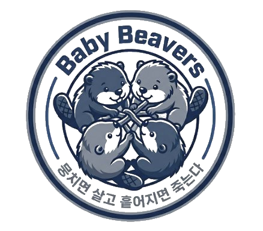

# Baby Beavers 1기 · TEAM 뭉살흩죽

  
   

---

## 프로젝트 개요

본 프로젝트는 **실제 클라우드 침해사고 사례**와 **현업 인프라 아키텍처**를 분석하여,
**비용 최적화된 보안 아키텍처**를 설계하는 것을 목표로 합니다.

단순한 이론이 아닌, 실제로 발생한 보안 사고들을 학습하고 현업에서 검증된 아키텍처 패턴을 참고하여
규모별로 적용 가능한 실용적인 보안 설계를 제시합니다.

---

## 주요 섹션

-   :material-shield-alert: **1단계 · 침해사고 사례 분석**

    ---

    IAM 오남용, 자격증명 노출, 공급망 공격 등
    실제 발생한 22건의 클라우드 보안 사고를 분석했습니다.

    [:octicons-arrow-right-24: 바로가기](./01-incident/case-01-drizly.md)

-   :material-server-network: **2단계 · 인프라 사례 분석**

    ---

    멀티 계정 거버넌스, 보안 자동화, DevSecOps 등
    현업에서 검증된 21개 인프라 사례를 보안 관점에서 분석했습니다.

    [:octicons-arrow-right-24: 바로가기](./02-infra/analysis-01-unidays.md)

-   :material-layers-triple: **3단계 · 보안 아키텍처 설계**

    ---

    분석 결과를 바탕으로 비즈니스 규모별
    비용 최적화 보안 아키텍처를 설계했습니다.

    [:octicons-arrow-right-24: 바로가기](./03-architecture/01-hobby.md)

---

## IaC 저장소

> 본 문서에서 설계한 아키텍처를 **Terraform으로 직접 배포**할 수 있는 코드 저장소입니다.

-   :fontawesome-brands-github: **secure-cloud-architecture**

    ---

    규모별 보안 아키텍처(바이브코딩 → 소규모 → 중규모 → 중대규모 → 대규모)를  
    Terraform IaC로 구현한 저장소입니다.

    [:octicons-arrow-right-24: GitHub에서 보기](https://github.com/UniteLiveDisperseDie/secure-cloud-architecture)

---

## 팀원 소개

-   **조휘정** · PM

    ---

    프로젝트 총괄, 침해사고 사례 분석, 인프라 사례 분석, 보안 아키텍처 설계

    [:fontawesome-brands-github:](https://github.com/hvvup)
    &nbsp;
    [:fontawesome-brands-linkedin:](https://www.linkedin.com/in/hwijungcho/)
    &nbsp;
    [:material-post:](https://velog.io/@hvvup/posts)

-   **김민수**

    ---

    프로젝트 총괄, 침해사고 사례 분석, 인프라 사례 분석, 보안 아키텍처 설계

    [:fontawesome-brands-github:](https://github.com/Minsu00326)
    &nbsp;
    [:fontawesome-brands-linkedin:](https://www.linkedin.com/in/%EB%AF%BC%EC%88%98-%EA%B9%80-751645374/)
    &nbsp;
    [:material-post:](https://velog.io/@alstnalstn2/posts)

-   **이지향**

    ---

    프로젝트 총괄, 침해사고 사례 분석, 인프라 사례 분석, 보안 아키텍처 설계

    [:fontawesome-brands-github:](https://github.com/jihyangleee)
    &nbsp;
    [:fontawesome-brands-linkedin:](https://www.linkedin.com/in/%EC%A7%80%ED%96%A5-%EC%9D%B4-9474a5342/)
    &nbsp;
    [:material-post:](https://talk3130.tistory.com/)

-   **이호영**

    ---

    프로젝트 총괄, 침해사고 사례 분석, 인프라 사례 분석, 보안 아키텍처 설계

    [:fontawesome-brands-github:](https://github.com/lhywk)
    &nbsp;
    [:fontawesome-brands-linkedin:](https://www.linkedin.com/in/hoyoung-lee-76364935a/)
    &nbsp;
    [:material-post:](https://lhywk.tistory.com/)

---

!!! info "공지사항"
    모든 분석 내용은 지속적으로 업데이트될 예정입니다.